# 从 Role Agent 到能力画像：Cat Café 的 AI-native 多智能体协作实验

> 很多 multi-agent 系统从"岗位"开始。这可能是一个蒸汽马车式的误判。

---

## 第 0 章 —— 蒸汽马车之后

如果今天从零搭一个 multi-agent 系统，一个很自然的做法是先列岗位：产品经理 agent、
项目经理 agent、开发 agent、测试 agent、UI/UX agent。每个 agent 绑定不同模型、工具、
技能和系统提示词，然后像公司组织架构一样流转任务。

这个做法不是错的。对一次性、边界清楚、流程稳定的任务，它甚至很高效。但它把一个
更深的问题提前压扁了：**我们到底是在组织一组岗位，还是在组织一组有不同能力、盲点和
历史的智能体？**

人类公司为什么需要岗位？岗位当然提供问责边界、专业深度和组织扩展性；但它的一个核心
前提，是人类学习慢、带宽低、记忆有限、沟通昂贵。AI agent 的约束并不一样：知识可以
按需加载，工具可以按任务挂载，记忆可以外部化，多个 agent 可以通过共享状态协作。如果
继续把 agent 固定成"产品经理"、"开发"、"测试"这些岗位槽位，就像给蒸汽机套上马车
车厢——形式上能跑，但没有利用新媒介的原生优势。

Cat Café 的答案是另一种抽象：**先给 agent 建能力画像，再给任务建任务画像，最后在运行时
动态匹配职责。** Role 仍然存在，但它只是一次任务中的临时职责，不是 agent 的长期身份。
Skill 也仍然存在，但它是可加载知识包，不是人格。真正的主体画像，来自模型固有能力、
认知风格、工具边界、历史表现、坏直觉和当前状态。

这些维度的可变性并不一样：原生能力、认知风格和坏直觉更接近模型层常量；skill、
collection 和工具挂载是变量；历史表现会随任务单调积累；当前状态则是瞬时信号。
role-agent 最容易抓住的是"给谁加载什么知识"这一层，但最容易漏掉的，恰恰是常量、
历史和瞬时状态这三层。

**〔 Figure 0 —— 任务画像 × 猫猫能力画像 → 动态路由 〕**

```text
需求进入 Cat Café
        │
        ▼
┌──────────────────────────────┐
│ 任务画像 Task Profile         │
│ - 产物类型：代码/文章/视频/PPT │
│ - 风险等级：金融/健康/不可逆   │
│ - 模糊度：执行/探索/共创       │
│ - 验证方式：测试/截图/CVO taste│
│ - 工具需求：代码/浏览器/图像   │
│ - 独立性：是否需要跨族 review  │
└──────────────┬───────────────┘
               │ 匹配
               ▼
┌──────────────────────────────┐
│ 猫猫能力画像 Cat Profile       │
│ - 原生能力：代码/图像/多模态    │
│ - 认知风格：结构/严谨/发散      │
│ - 可加载知识：skills/collections│
│ - 工具边界：能碰什么/不能碰什么 │
│ - 历史表现：做过什么/踩过什么   │
│ - 坏直觉：糊弄/过拟合/漂移      │
│ - 当前状态：谁有上下文/谁持球   │
└──────────────┬───────────────┘
               │
               ▼
┌──────────────────────────────┐
│ 动态职责分配                   │
│ author / reviewer / designer  │
│ 结构守护 / CVO 裁决            │
│ （职责是临时的，身份是长期的）   │
└──────────────┬───────────────┘
               │
               ▼
┌──────────────────────────────┐
│ Shared State 留痕              │
│ repo / docs / task / memory / trace │
└──────────────┬───────────────┘
               │
               ▼
┌──────────────────────────────┐
│ Eval 回流画像                  │
│ 这只 agent 在这类任务上实际如何？│
│ 哪些路由该保留，哪些该调整？     │
└──────────────┬───────────────┘
               │ 更新画像 / 调整路由
               └───────────────↺ 回到 Task Profile 与 Cat Profile
```

这不是一个命名游戏。2026 年 2 月初，我们初始化了一个 monorepo，开始用 AI agent 作为
一等协作者来做一款消费级产品——不是临时叫来打杂的代码助手，而是端到端负责功能、互相
review、共同维护文档的 agent。102 天后，现场证据是这样的：

| 指标 | 数值 |
|------|------|
| 日历时间 | 102 天（2026-02-04 至 05-17）|
| 总提交数 | main 上 6,413 个 commit |
| Feature 规格文档 | 211 篇（编号至 F203；含附录、已废弃、未启动）|
| 主力模型厂商 | 3 家（Anthropic、OpenAI、Google）|
| AI 署名提交占比 | ~77%（4 月 25 日测量，此后未重测）|

这些数字不是本文命题本身。它们只是说明：下面这套抽象不是纸上推演，而是在一个包含 API
服务、Web 客户端、移动端 App、共享库、CI 流水线和文档的生产 monorepo 里，被真实协作
反复逼出来的。提交曲线本身只是结果：4 月底是 3,492 个 commit，三周后翻倍到 6,413。
真正值得追问的是，为什么这些 agent 没有被固定岗位约束住，而是在长期协作中逐渐长出了
能力画像、盲点画像和动态路由机制。

### 这篇文章是什么、不是什么

这不是一篇多 agent 框架综述，也不是一篇基准评测论文。它是一份工程现场报告——来自
一个把多模型协作跑到足够大规模、撞上了玩具 demo 永远碰不到的那些墙的团队：

- 当一个 agent 的上下文窗口被压缩，把它的治理规则压没了，会发生什么？
- 怎么发现同一家厂商的两个 agent 共享同一个盲点？
- 当一个 agent 会话在任务中途崩溃，必须有哪些状态活下来，另一个 agent 才能接手？
- 怎么评估一个 agent 是在**真正帮忙**，还是在生成看起来煞有介事的无效劳动？

我们发现，Anthropic 的五种多 agent 协作模式——**Generator-Verifier**（生产者-
验证者）、**Orchestrator-Subagent**（编排者-子 agent）、**Agent Teams**（长期
团队）、**Message Bus**（消息总线）、**Shared State**（共享状态）——是对的原语。
我们的系统没有发明第六种。但五种模式真正落地后，我们发现了三件文档里没写的事。

**第一件：模式会叠加。** 同一个交互行为，从不同层面看是不同模式。拿写这篇
文章本身举例：一只 Claude agent 写一章，一只 GPT agent 审真实度——从**质量保证**
层面看，这是 Generator-Verifier（author 生产、reviewer 验证）；从**协作关系**
层面看，这是 Agent Teams（reviewer 是独立 agent，有自己的立场，可以 push back，
author 不能强制通过）；从**任务编排**层面看，写作 agent 决定了”一章一章写→
review→首席愿景官定调”的序列，有 Orchestrator-Subagent 的结构特征。它不是五选一
——是同时是三种，取决于你在问什么问题。

**第二件：模式会动态切换。** 同一只 agent 在同一个任务里会跨模式。写作 agent
调用搜索子 agent 去查文献——这是 Orchestrator-Subagent：子 agent 有局部推理
能力，但没有长期身份、共享责任和最终裁决权，输出由父 agent 复核和吸收。
同一只写作 agent 十秒后 @ reviewer
——切换到 Agent Teams：reviewer 是长期存活的独立个体，有记忆、有身份、有权
退回整章要求重写。模式边界不是写在配置文件里的，是交互对象的自主性决定的。

**第三件：首席愿景官不在五种模式里。** 我们的首席愿景官（CVO, Chief Vision Officer）不参与日常执行
——不写代码、不做 review、不拆任务。他只在方向层介入：审核每一章的走向，
用一组”拉闸词”在 agent 偏离愿景时紧急制动。他不是 Orchestrator（不编排
任务），不是 Verifier（不做质量校验），更像一个**愿景锚点**——五种模式
描述的是 agent 之间的协作，而方向校准发生在 agent 系统的外面。第 7 章会
回到这一点。

五种模式**以 Shared State + Agent Teams 为骨架**组合起来——Shared State 是
所有 agent 读写的持久真相层（代码库、文档、记忆库、任务状态），Agent Teams
是长期存活的异构团队。在这个骨架上，Generator-Verifier 提供跨厂商质量校验，
Orchestrator-Subagent 处理有限范围的任务拆解和委托。

Message Bus 值得单独说。它不只是猫和猫之间的异步交接——它是整个系统的**事件
驱动层**。GitHub 上有人开 Issue 或提 PR，webhook 触发 agent 响应；外部 IM
（飞书、企微、Telegram）通过 connector 把消息变成 agent 可处理的事件；agent
自己注册定时任务——每天巡检某个特性的稳定性、每天跑一次 eval、某个特性计划
观测十天收集数据，十天后注册了这个事件的 agent 收到调度继续工作。这些都是
Message Bus：**不是 agent 之间传话，是 agent 与世界之间的事件流。**

其中最有意思的一类事件是**跨线程依赖驱动**。每个 Feature 在自己的线程里推进，
大多数时候互不干扰。但真实工程不可能完全解耦——Feature A 做到一半发现
Feature B 有一个接口没闭环，阻塞了自己。这时 A 线程的 agent 发起跨线程
通讯，驱动 B 线程的 agent 去补这个缺口。B 线程完成后回调通知 A 线程。
在等待期间，A 线程不是挂起的——它继续做不依赖 B 的那些工作。这不是人类
项目管理里的"排期协调"——是 agent 在运行时动态发现依赖、异步驱动解决、
事件回调恢复的过程，全程通过 Message Bus 和 Shared State 的组合实现。

但仅有这五种模式的组合，还留下了两个关键问题没有回答：

1. **团队循环什么时候*结束*？** —— 单个 agent 有 ReAct 的”观察-思考-行动”循环，
   有清晰的终止条件。一组 agent 互相传递状态，可以永远循环下去。我们把团队级的
   终止条件形式化为 **TeamAct**（第 2 章）。

2. **谁来抓共享盲点？** —— 同一家厂商的 agent 共享训练分布的偏差。一个 Claude
   去 review 另一个 Claude 的工作，会漏掉同一类错误。跨厂商 review 是结构性必需，
   不是锦上添花。

最贴切的类比来自开源软件：每个 agent 像一个**自治维护者**——有权在自己的模块里
合并代码，独立做内容判断。但他们共享同一套**黄金路径基础设施**：git、CI、review
协议、可观测性、文档规范。和人类开源的区别在哪？我们的维护者是异构的大语言模型
（Claude、GPT、Gemini），而那套”工程”不在 prompt 里——在环绕它们的持久系统里。

**〔 Figure 1 —— Anthropic 五模式 → Cat Café 组合架构 〕**

*一张图：左侧五种原语；右侧展示同一个交互如何同时叠加多种模式，以及模式在
不同粒度上的动态切换。CVO 作为愿景锚点位于 agent 系统外部。*

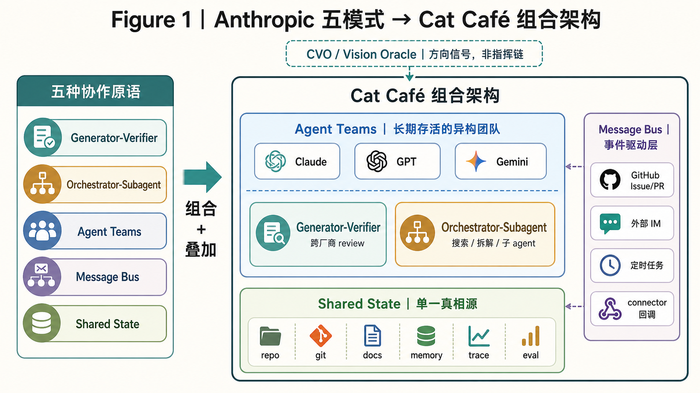

<details>
<summary>低保真草图对照</summary>

```text
低保真草图 v0：五个原语不是五选一——它们在不同粒度上同时叠加

┌──────────────────────────────┐
│ Anthropic 五种协作原语         │
├──────────────────────────────┤
│ Generator-Verifier           │
│ Orchestrator-Subagent        │
│ Agent Teams                  │
│ Message Bus                  │
│ Shared State                 │
└───────────┬──────────────────┘
            │ 组合 + 叠加
            ▼
┌ ─ ─ ─ ─ ─ ─ ─ ─ ─ ─ ─ ─ ─ ─ ─ ─ ─ ┐
  CVO / Vision Oracle
  方向校准 · 拉闸词 · Phase 验收
  （不在五种模式里——位于 agent 系统外部）
└ ─ ─ ─ ─ ─ ─ ─ ┬ ─ ─ ─ ─ ─ ─ ─ ─ ─ ┘
                  ╎ 方向信号（虚线 = 非指挥链）
                  ▽
┌──────────────────────────────────────────────────────┐
│              Cat Café 组合架构                         │
│                                                      │
│  ┌─ Agent Teams 骨架 ──────────────────────┐         │
│  │  长期存活的异构团队                       │         │
│  │  （Claude / GPT / Gemini）               │         │
│  │                                          │  ┌────┐│
│  │  同一个交互，多模式叠加：                  │         │
│  │  ┌──────────────────┐ ┌────────────────┐│         │
│  │  │Generator-Verifier│ │ Orchestrator-  ││  ┌─────┐│
│  │  │跨厂商 review     │ │ Subagent       ││  │Msg  ││
│  │  │                  │ │ 搜索/拆解/子agent││◄─┤Bus  ││
│  │  └──────────────────┘ └────────────────┘│  │     ││
│  └──────────────┬───────────────────────────┘  │事件  ││
│                 │                               │驱动层││
│                 ▼                               │     ││
│  ┌─ Shared State / 持久现实层 ─────────────┐   │GitHub││
│  │  repo · git · docs · memory · trace · eval│◄─┤Issue ││
│  │  （所有 agent 的单一真相源）               │   │PR    ││
│  └───────────────────────────────────────────┘  │外部IM││
│                                                  │定时  ││
│                                                  │任务  ││
│                                                  │Cron  ││
│                                                  └─────┘│
└──────────────────────────────────────────────────────────┘

关键视觉信息：
1. CVO 在虚线框（系统外部），向下虚线箭头 = 方向信号，不是指挥链
2. Generator-Verifier / Orchestrator-Subagent 在团队内部叠加
3. Message Bus 是事件驱动层（侧轨），不只是猫猫之间的异步交接——
   它连接 GitHub（Issue/PR webhook）、外部 IM（飞书/企微/Telegram）、
   定时任务（每日巡检/定时 eval/观测窗口到期回调）、自注册事件
4. Shared State 是底座，所有模式都读写同一层持久状态
5. 同一只 agent 可以在 Orchestrator-Subagent（调子agent）和
   Agent Teams（@独立猫）间动态切换
```

</details>

### Role-agent 在这张图里处在哪一层？

Role-agent 不是被否定掉的东西。它在 Figure 1 里更接近 **Orchestrator-Subagent**
和工具配置层：为了某个明确子任务，临时启动一个"搜索资料的 agent"、"整理草稿的 agent"、
"检查格式的 agent"，给它绑定一组工具和技能，然后由上游 agent 复核结果。这很有用。

问题出在把这种临时职责上升成长期身份。一个"产品经理 agent"如果没有共享状态、历史表现、
盲点画像和 eval 回流，它只是一个穿了产品经理外套的模型实例。它可以输出 PRD，但不知道
自己上次哪里误解了首席愿景官；它可以拆任务，但不知道哪个拆法过去导致过返工；它可以被
命名为 reviewer，但如果和 author 共享同一个模型盲点，review 的独立性仍然很弱。

所以在 Cat Café 里，role 是运行时标签，profile 才是长期主体。**角色回答"这一步谁负责
什么"，能力画像回答"为什么是这只 agent，而不是另一只"。** 前者让流程清晰，后者让系统
真的会成长。

---

## 第 1 章 —— 核心公式：能力 × Harness 契合度

一个等式说清主张：

```
Agent 质量 = 模型能力 × Harness 契合度（Environment Fit）
```

这也是能力画像为什么不能停留在"这只 agent 擅长什么"。同一只 agent 放进不同 harness，
能发挥出的能力会完全不同；画像只有进入具体运行环境后，才会从静态描述变成可验证能力。

这里的 "harness" 不是测试夹具的那个 harness——它指的是**围绕模型的整套运行骨架**：
持久状态层、验证回路、协作协议、可观测链路、恢复机制。就像赛车的底盘和调校系统，
引擎（模型）再强，底盘拉胯就跑不出成绩。

行业绝大多数投入砸在左项：更多参数、更长上下文、更好的推理基准。我们一直在试验
右项——102 天后，我们认为 harness 工程的乘数效应被严重低估了。

这不是说模型不重要。一个弱模型放进完美环境，产出仍然弱。但一个前沿模型扔进一个
光秃秃的环境——没有持久状态、没有验证回路、跨会话没有记忆——它的表现会远低于同一个
模型在被妥善安置时能达到的水平。

### Agent 状态的三层

要理解 harness 工程作用在哪里，先区分任何 AI agent 都会触及的三层状态：

| 层 | 这里存什么 | 存续时间 | 谁控制 |
|----|----------|---------|--------|
| **权重状态** | 训练写进的参数 | 直到下次训练前持久 | 模型厂商 |
| **计算状态** | KV cache、隐藏激活 | 单次推理调用 | 模型架构 |
| **现实状态** | 代码仓、git 历史、文档、任务归属、记忆 | **跨推理、跨 agent、跨时间** | **环境层（harness）** |

前两层是模型厂商的领地。第三层——现实状态——是 harness 工程操作的地方。也是唯一一层
跨会话、跨 agent、跨时间持续存在的状态。

### Agent 的本体是闭环，不是任何单一层

一个关键洞察：一个 agent 不是由它的权重、它的上下文、甚至它的对话历史定义的。
agent 是由它与现实之间的**闭环**定义的：

```
观察(现实状态) → 推理(计算状态) → 行动 → 写回(现实状态') → 验证
```

没有这个闭环，记忆系统只是一个没人查的数据库。没有现实状态，模型只是在隔绝中
推理——强大的认知与后果脱节。把两者连起来的那个闭环，才让一个 agent 是**在现实
里行动**，而不只是**有能力**。

这有一个直接的工程含义：**每一分花在让闭环更紧的钱——更快的观察、更好的验证、
更丰富的现实状态——都会在每一次模型升级时免费复利。** 更好的模型立刻受益于已有
环境。但更好的模型放进光秃秃的环境，每个会话都得从零重新推导一切。

### 判别式：Harness 投资的两种半衰期

Harness 里的每一层代码都有自己的半衰期。有些随模型变强而折旧，有些随模型变强而
增值。我们用两个标签来标记它们：

- **Build to Delete（有保质期的脚手架）**：弥补模型*当前*认知缺陷的代码。模型
  不会分步推理？写个详细的思维链模板教它。Tool call 老叫错名字？加个别名兜底。
  这些东西**当下 ROI 可能是全场最高的**——不教，agent 就不干活。但它们有保质期：
  当下一代模型原生掌握了这些能力，脚手架就成了噪音。

- **Built to Persist（复利型基础设施）**：编码外部现实、协作协议和可验证边界的
  代码。git 接入、trace 链路、review 反馈回路、agent 交接协议、不可逆操作护栏
  ——这些不是在补模型的短板，是在建模型与现实之间的桥。模型越强，这些桥越值钱。

| Build to Delete（有保质期的脚手架） | Built to Persist（复利型基础设施） |
|:---|:---|
| 详细的思维链模板 | 文件系统 / git / 搜索工具接入 |
| 多步推理引导 | trace 基础设施与可观测性 |
| 错误恢复样板代码 | 测试 / lint / review 反馈回路 |
| 工具调用别名兜底 | agent 交接协议与路由 |
| 人格装饰文字 | 不可逆操作护栏与应急开关 |

**两种投资都该做。** 真正的错误不是做了脚手架——是**把脚手架当永久基础设施来
精装修**。给一个注定会被删掉的 prompt 模板写了一堆单元测试、架构文档和抽象层，
然后模型升级后舍不得删（沉没成本），让它沉淀成注意力噪音和技术债。

判别式是一个**预算分配器**，不是价值评判：

> 这层 harness 是在补模型**当前的认知缺陷**，还是在编码**外部现实和协作协议**？

- 前者 → 轻量做、快验证、标好 sunset 时间——它是*救火队*，随时准备光荣退役。
- 后者 → 认真做、加测试、写文档——它是*地基*，每一代模型都站在上面。
- 分不清 → 做成有清晰接口的薄垫片，便宜到随时能拆。

现实中很多 harness 不是纯脚手架也不是纯基础设施——它是一个**套件**，里面
同时有两种成分。比如一个"团队进入新领域的方法论 playbook"：其中"先调研
再行动""多视角发散后再收敛"这类元认知提醒，模型变强后大概率自己就会了
——这部分偏脚手架。但"谁负责生成方案、谁负责综合、综合者不能是生成者
之一、综合后必须找独立第三方验证"——这些是多 agent 之间的**组织分工规则**，
不会因为单个模型更聪明而消失，因为它约束的是个体之间的关系，不是个体内部
的能力。同一份 playbook 里认知提醒轻量做、标好 sunset；组织规则认真沉淀、
长期维护。**不要给整个产物贴一个标签——拆开看它的每一层。**

### 为什么这事现在重要

模型代际更迭很快。GPT-4 到 GPT-5 一年，Claude 3 到 Claude 4 几个月。每一次跃迁
都会淘汰一些脚手架——这本身不是坏事，是预期中的。

问题在于：**大多数团队不知道自己写的哪些是脚手架**。他们把所有 harness 代码视为
同等重要，给脚手架和基础设施投入同样的测试、文档和架构精力。模型一升级，一半的
精心投资变成了废代码——但因为投入太重，团队舍不得删，于是脚手架沉淀成了技术债。

这就是红皇后竞赛的真正来源：不是模型升级太快，而是**对折旧资产的过度投资**。

反过来看：清醒标记自己的脚手架的团队，在每一次模型升级时都能轻松甩掉过时的部分，
同时享受复利型基础设施随新模型增值的红利。**脚手架是 bootstrap，不是债务——前提
是你一开始就知道它是脚手架。**

接下来的章节拆解 harness 工程在实践中到底意味着什么：团队级的执行循环（第 2 章）、
能在上下文压缩后存活的治理（第 3 章）、带反馈的记忆系统（第 4 章）、能追到根因
的评估（第 5 章）、长程 agent 的可靠性契约（第 6 章），以及跨厂商群体智能的涌现
数学（第 7 章）。

**〔 Figure 2 —— 从状态到判别，再到投资寿命 〕**

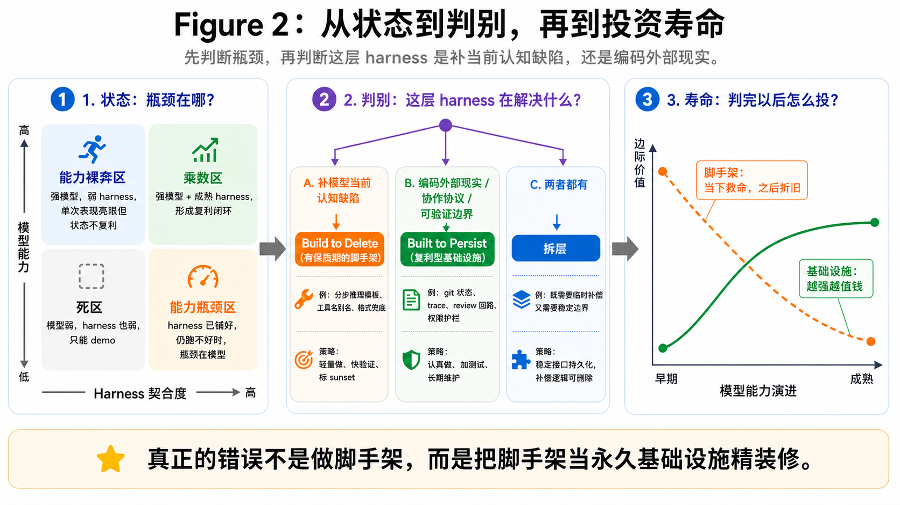

> 这张图拆成三步：先看当前瓶颈在哪里，再判断这层 harness 解决的根因是什么，
> 最后才决定它该按脚手架还是基础设施来投。

**左面板：能力 × Harness 契合度——你的瓶颈在哪？**

*左下（低 × 低）：**死区**——模型弱、环境也弱，连有效的观察-行动-验证闭环都
形成不了，只能跑 demo。*

*左上（高能力 × 低 harness）：**能力裸奔区**——大家最熟悉的场景：拿一个很强的
模型直接对话或简单套壳。能出活，但每个 session 从零开始，产出不可复利。*

*右下（低能力 × 高 harness）：**能力瓶颈区**——harness 已经把路铺好（git、验证、
记忆、协议全到位），agent 仍跑不好——这时候你能清楚测出瓶颈就在模型能力。
不是被动等，而是每次模型升级都能精确衡量进步。*

*右上（高 × 高）：**乘数区**——强模型 + 成熟 harness。乘数效应活在这里。*

*行业的默认策略是沿纵轴往上冲（换更强的模型）。这意味着你从死区冲到能力裸奔区——
能力确实在涨，但始终享受不到乘数效应。只有同时向右移动（投 harness），才能进
乘数区。*

**中间面板：判别器——这层 harness 在解决什么？**

*知道瓶颈不够，下一步要判断手上这层 harness 的根因。三个选项：*

- *A. 补模型**当前的认知缺陷***（分步推理模板、tool call 别名兜底、格式纠正、错误恢复样板）—— **Build to Delete（有保质期的脚手架）**：轻量做、快验证、标 sunset
- *C. 编码**外部现实 / 协作协议 / 可验证边界***（git 状态、trace、review 回路、agent 交接、不可逆操作护栏）—— **Built to Persist（复利型基础设施）**：认真做、加测试、长期维护
- *B. **两者混在一起***——正确做法不是二选一，而是**拆层**：外层接口持久化（基础设施），内层补偿逻辑可删（脚手架）

*关键例子：同一个 "tool call 别名兜底"——如果只是补模型记不住工具名，是 A 类脚手架；如果在统一跨 provider / 跨版本的工具接口，是 C 类基础设施。**先判根因，再决定怎么投。***

**右面板：Harness 投资的半衰期**

*X 轴：模型能力演进 →。Y 轴：这层 harness 的边际价值。*

*曲线 A（有保质期的脚手架）：起点很高——模型笨的时候这些脚手架是救命的。
随着模型原生吸收这类能力，边际价值递减。不同脚手架沿不同速度过时，不是同一
时刻一起死——模型代际只是大致的 proxy。*

*曲线 B（复利型基础设施）：起步不显眼——弱模型吃不满 git/trace/review 带来的
红利。但模型越强，越能放大这些现实闭环的价值。曲线持续上升。*

*两条曲线都值得投。区别在于预算策略：脚手架轻量做、快验证、标 sunset；
基础设施认真做、加测试、长期维护。*

### 一百天的投资账本

Figure 2 的判别器画起来清晰，用起来模糊。在 200+ Feature、102 天的实战中，
我们犯过的分类错误比正确决策更有教育价值。

先看两个端点清晰的例子。

**典型的 Delete**：治理规则——身份声明、家规、协作协议——最初通过 user
message prepend 注入。这是脚手架：它补的是平台层"system role 尚不支持自定义
规则注入"的缺口。平台升级支持 native system prompt 后，旧通道变成了负债——
user message 会被上下文压缩吞掉，规则每压缩一次丢一次，团队被迫"十轮对话
教十次传球"。我们把治理规则迁到压缩免疫的 system role，然后删除这部分规则的
user-message prepend 路径。脚手架的完整生命周期：补缺口 → 标注平台依赖 →
平台升级 → 迁移 → 删除。

**典型的 Persist**：恢复基础设施。Agent 执行长任务时会遇到网络中断、进程崩溃、
资源争抢——这些不会因为模型更聪明而消失。我们建了 side-effect 日志、存活
探针、类型化恢复卡片，让 agent 崩溃后能回答"做到哪了、哪些已落盘、哪些需要
人确认"。模型越强，执行的任务越复杂，这层基础设施越有用。

端点清晰的不需要判别器。考验决策力的是中间地带——分错类的案例。

**脚手架被当成基础设施投了六轮**。一次跨线程身份混淆事故中，真正的根因是
Session 存储缺少 threadId 维度——不同线程的上下文互相污染。根因修完后，团队
"顺手"也去修了一个次要触发器：全局配置文件注入了不该出现的上下文。修法是
替换 HOME 环境变量来隔离 CLI 全局配置。第一个补丁引发认证失败，第二个
修认证又丢了 session，第三个修 session 又断了工具链……六个补丁串成链条，每个
修前一个的副作用，最终全部回退。第三个补丁时就该停下来问：这个方向的根基稳
不稳？**补丁数量本身是方向信号——N > 3 不是"再来一个就好了"，而是"该换路
了"。** 这是一个该轻量做、快验证、及早放弃的脚手架，却被按基础设施的节奏
层层加码。

**基础设施被当成脚手架随手做了**。一个功能需要交付完整的状态管理模块，工程
师习惯性地"先用内存 Map 模拟、先搭空壳模板、后面再重写"。每一步产出都要推翻
重来而非扩展延伸，等于做了两遍。错误在于从"什么容易做"往前凑，而不是从终态
schema 往回推。**Persist 的投入方式是：先钉终态，每步产物在终态中原样保留——
可以扩展，不需要替换。**

**类别判对了，编码粒度判错了**。"跨角色 review"显然是 Persist——不会因为模型
变强而消失。但早期写成了"布偶猫找缅因猫 review""缅因猫放行才能合入"，把稳定
抽象（角色）编码成不稳定实例（个体名）。每次团队变化——新成员加入、同物种多
实例上线——规则就要人工改写。**Persist 不只是决定认真投，还要决定用什么粒度
编码：引用角色而非个体，引用接口而非实现——和软件工程的依赖倒置是同一件事。**

**〔 Figure 3 —— 投资账本：Cat Café 的真实 Delete / Persist 分布 〕**

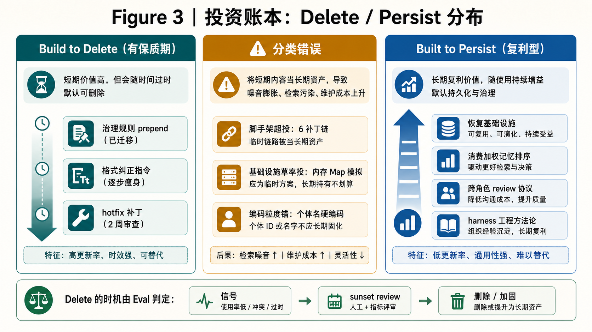

<details>
<summary>低保真草图对照</summary>

> | Build to Delete（有保质期） | 分类错误 | Built to Persist（复利型） |
> |:---|:---:|---:|
> | 治理规则 user-message prepend（已删除 → 迁移至压缩免疫层） | 6 补丁链：应为脚手架却按基础设施加码 → | 恢复基础设施（side-effect 日志 + 存活探针 + 恢复卡片） |
> | 格式纠正指令（逐条瘦身中） | ← 内存 Map 模拟：应为基础设施却按脚手架草率投入 | 消费加权记忆排序 |
> | hotfix 补丁（2 周强制升级审查） | 个体名硬编码：类别对但编码粒度错 → | 跨角色 review 协议 |
> | | | harness 工程方法论（适配 → 留痕 → 信号提取 → 定期退役） |
> | ↓ 模型越强，边际价值递减 | **Delete 的时机由谁判定？→ 第 5 章** | ↑ 模型越强，复利越大 |

</details>

三类错误指向一个共同问题：**判别器告诉你该分哪类，但没告诉你什么时候执行
Delete。**

"模型升级了"不是 Delete 的信号——它只是提示。真正的信号是 eval 数据显示模型
**不再需要**这层补偿。没有 eval，团队只能猜：猜对了是轻装前进，猜错了是拆掉
了还在用的承重墙。

我们给脚手架安装了计时器：自动检测带紧急修复标签（`fix:` / `hotfix:` /
`workaround:` 等）的提交，两周后强制触发升级审查——正式修复、接受为永久方案、
已不再相关，三选一，没有第四项叫"再看看"。但计时器只是最表层的催促。真正让
sunset 从猜测变成可测量决策的，是从结构化 trace 中提取信号、从信号中生成判断
的评估架构——第 5 章展开的核心议题。

**Harness 的新陈代谢不是自然发生的。它需要一个专门的评估系统来驱动。**

---

## 第 2 章 —— 从 ReAct 到 TeamAct：团队主循环的形式化

单个 AI agent 有一个已被广泛接受的执行模型：ReAct。

如果第 0 章回答"为什么不把 agent 固定成岗位"，这一章回答的是：动态职责如何真的
跑起来。author、reviewer、owner、router 都不是长期岗位，而是 TeamAct 循环里的运行时
状态。

```
while has_tool_call:
    Thought → Action → Observation
```

ReAct 的引擎不是这三步的顺序——是 **Observation 反向喂 Thought** 这条反馈回路。
没有反向反馈，ReAct 退化为普通流水线。这一点经常被忽略：人们画 ReAct 的图都是
顺时针箭头，但真正让它 work 的是逆时针那条。

但 ReAct 有一个结构性盲区：**它假设只有一个 agent。** 当你有一个团队——多个
agent 共享状态、互相传递任务、互相验证工作——ReAct 的终止条件失效了。

单 agent 判断"我做完了"的方式通常是：没有 tool call 了，生成一段总结。问题是，
这个判断经常是幻觉——模型被 RLHF 训练出了一种"该收尾了"的惯性反射，它可能只是
因为对话够长了就宣布完成，而不是因为任务真的完成了。

在多 agent 场景下，这个问题放大了一个数量级：每个 agent 都觉得自己做完了，但
团队层面没人问"我们的集体目标达到了吗？"。agent 之间互相传递状态可以永远循环
下去——没有人定义什么是"团队停下来"。

### TeamAct：团队的 ReAct

**TeamAct 不是 Anthropic 第六种协作模式。** 它是 Shared State 模式的工程化闭环
——在共享状态的基础上，把单 agent 的 ReAct 终止条件升级为团队级的五项收敛条件，
并显式治理团队独有的失败模式。

Shared State 解决"大家共同看什么"。TeamAct 解决**"团队怎么走完一个完整循环并
停下来"**。

六步循环：

```
loop:
    State    → 读共享状态（仓库 / spec / 任务 / 记忆 / 交接胶囊）
    Owner    → 谁持球？（路由指令 / 显式持有声明）
    Action   → 持球者执行（写代码 / review / 设计 / 调研）
    Evidence → 产出证据（commit / 测试 / trace / 截图）
    Verdict  → 验证（跨 agent review / 自检 / CVO 确认）
    Route    → 传球（路由给下一个 agent / 继续持有 / 升级给 CVO）
```

**五项终止条件**（缺一不可，这是 TeamAct 的核心新增）：

1. **验收标准全部达成**——不能有 "deferred" 的验收条件
2. **证据已附**——每条验收标准都有 commit / 测试 / trace 作为锚点
3. **跨 agent 交叉验证**——非作者的 agent 确认（不能自己 review 自己）
4. **无悬空任务归属**——所有 open question 都已 resolved 或已升级
5. **愿景收敛**——首席愿景官的确认不能被 proxy 替代（"CI 通过了"≠"愿景方向
   对了"）

TeamAct 的本质同样是反馈方向：六步是叙事骨架，真正的引擎是 **shared state
反向喂回每个 agent 的 context**——让团队的"集体外部世界"ground 每个个体的推理。

一个关键机制：**交接胶囊**（resume capsule）。前一个 agent 在传球时主动留下
一份结构化摘要——做了什么、为什么、权衡了什么、留下了什么开放问题、下一步该做
什么——让接手的 agent 能快速 bootstrap 而不需要重新读完整个上下文。这不是可选的
礼貌行为，是协议层的硬要求。

**〔 Figure 4 — ReAct 单 agent 闭环 vs TeamAct 多 agent 闭环 〕**

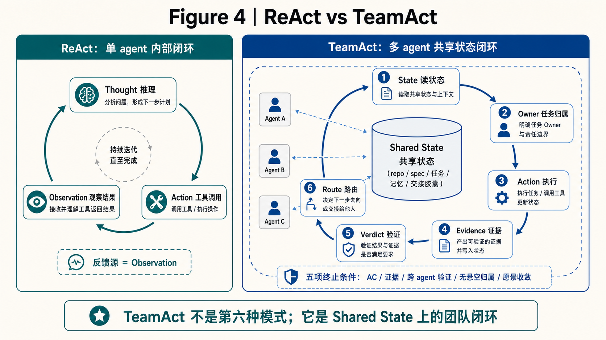

<details>
<summary>低保真草图对照</summary>

低保真草图 v0：左边只画单个 agent 内部的 Thought / Action / Observation；右边画
Shared State 作为团队共同反馈源，TeamAct 六步围绕它闭环。

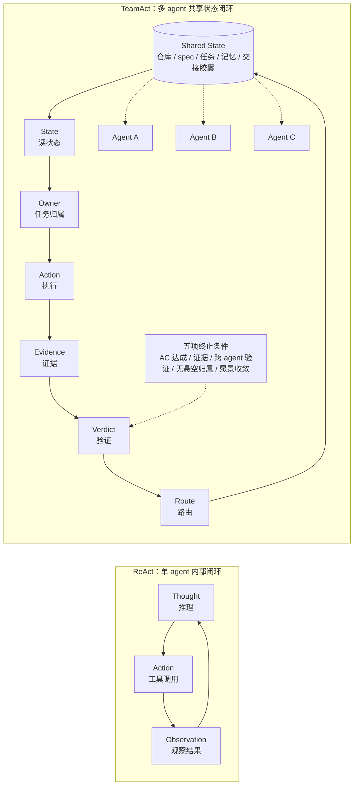

</details>

最终图要保留这个重点：ReAct 的反馈源是 Observation，TeamAct 的反馈源是 Shared
State；TeamAct 不是第六种协作模式，而是 Shared State 上的团队级闭环。

**〔 Figure 5 — TeamAct 状态机 〕**

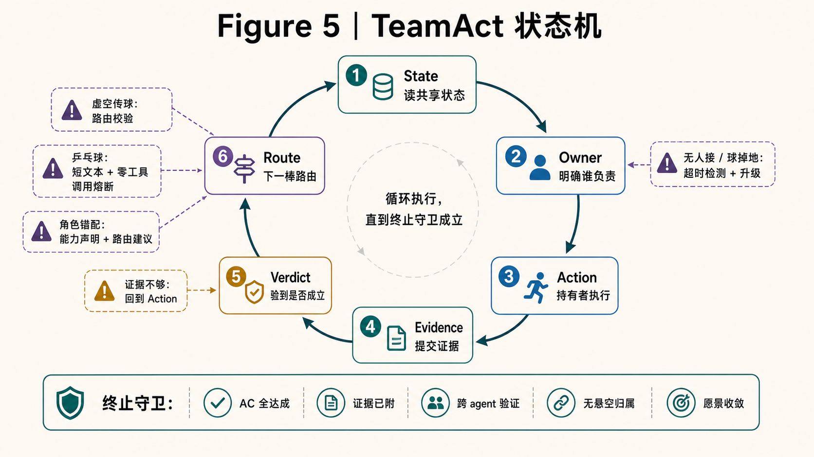

<details>
<summary>低保真草图对照</summary>

低保真草图 v0：六步是主路径，失败模式挂在 Owner / Verdict / Route 三个容易出事
的节点上；五项终止条件是外圈守卫。

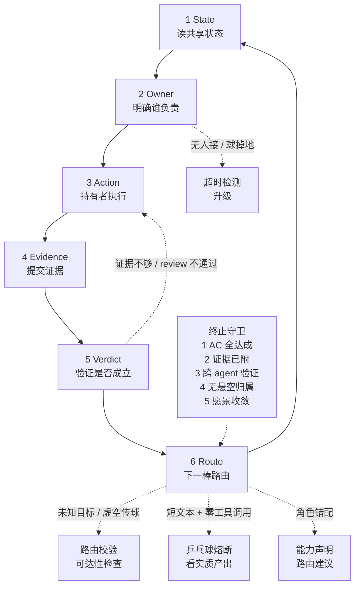

</details>

最终图要让读者一眼看懂：TeamAct 不是聊天顺序，而是任务归属、验证和路由共同构成的
状态机。

### 分形嵌套：自相似的循环结构

TeamAct 有一个优雅的特性：它在不同粒度上自相似。

```
Feature 生命周期（系统层）
  └─ Agent 间交接（团队层 = TeamAct）
       └─ 单 agent 工具调用（个体层 = ReAct）
```

每一层都有自己的主循环和终止条件。一个 Feature 的完整生命周期是一个 TeamAct
循环；其中每次 agent 间交接启动一轮新的 TeamAct 子循环；每个 agent 内部的工具
调用又是标准的 ReAct 循环。

这种自相似结构意味着：**同一套治理机制（证据、验证、终止条件）在每一层都适用，
只是粒度不同。** 你不需要为系统层发明一套规则、团队层另一套、个体层又一套——
一个递归定义搞定。

### Agent 间交接是状态机，不是聊天约定

在大多数多 agent 系统的 demo 里，agent 间的任务传递靠的是自然语言约定——在消息
里 @ 某个 agent，对方"看到了"就接手。这在 demo 里 work，在生产中崩溃，因为：

- 消息是非结构化的——"@Alice 你看一下"是路由指令还是叙述提及？
- 没有确认机制——对方真的接了吗？还是消息沉了？
- 没有超时——如果对方没响应，谁负责？
- 任务归属不明——"你看一下"之后球归谁？

我们踩过所有这些坑。最终把 agent 间交接建模成了一个**显式的状态机**：

- 路由指令必须出现在行首，不能嵌在句子中间（句中的 @ 是叙述，不是路由）
- 任务归属声明是第一人称的——只能声明"我接这个"，不能声明"这是你的"
- 每次交接进入统一的调度队列，不是消息流里的文本约定
- 三种合法的响应：**接**（我做 X）/ **退**（这个应该给 Y）/ **升级**（需要产品
  负责人拍板）

这个状态机化的过程暴露了四种团队独有的失败模式——这些在单 agent 系统中不存在：

| 失败模式 | 表现 | 治理 |
|---------|------|------|
| 球掉地上 | 没有 agent 接任务，消息沉了 | 超时检测 + 自动升级 |
| 乒乓球 | 两个 agent 互相传但都不干活 | 实质产出检测（见下文） |
| 虚空传球 | 路由给一个不存在/不在线的 agent | 路由前校验可达性 |
| 角色错配 | 把前端任务路由给只擅长后端的 agent | 能力声明 + 路由建议 |

### 乒乓球熔断器的进化：给数据不给结论

乒乓球（两个 agent 互相传球但都不产出实质工作）是我们遇到的最隐蔽的失败模式。
第一版熔断器很直觉：**数连续传球次数**，超过阈值就中断。

问题是，正经的 review 链也是连续传球——reviewer 提 P1，author 修复，reviewer
确认，author 追加测试——这些来回每一次都有实质产出。数次数会误杀。

修正后的熔断器换了一个坐标系：不看传球次数，看**每次传球是否伴随实质工具调用和
有内容的输出**。真正的乒乓球 signature 是"短文本 + 零工具调用"——这是 RLHF
训练出的"接一句"惯性反射。正经 review 链每一轮都有 commit、测试运行、文件读写。

这背后有一条设计原则：**好的 harness 给 agent 数据（"你这轮的 tool_call 数为 0，
输出只有 3 行"），不给 agent 结论（"你在乒乓球"）。** 结论让 agent 自己从数据
里得出。用正则或小模型替 agent 判断意图——这种做法看起来省事，但它把判断权从
agent 手里拿走了，也就拿走了 agent 自我纠正的机会。

### 同样的原则，同样的退役

另一个例子：角色门禁。最初的实现是硬编码的——用正则扫描消息内容，看到
"coding"/"merge" 之类的关键词就硬拦某些 agent。

这在两个 agent 时勉强 work。第三个 agent 加入后就崩了——新 agent 的能力边界跟
硬编码的关键词表不匹配。于是角色门禁从"硬编码正则"退役，替换为**数据驱动的
能力声明**：每个 agent 的能力限制作为配置数据注入，让 agent 在收到任务时自己
判断"这个我能做吗"。零代码改动就能扩展到任意数量的 agent。

这两次进化（乒乓球熔断器和角色门禁）讲的是同一件事：**harness 不应该替模型思考，
而应该让模型在正确的坐标系里思考。** 给数据、给约束、给反馈——但把判断留给模型。

### Generator 有 Push Back 的权利

Anthropic 五种模式中的 Generator-Verifier 有一个隐含假设：Verifier 是权威的。
Generator 产出，Verifier 判定，Generator 照做。

我们发现这是一个结构性缺陷。

如果 Generator 没有 push back 的权利，Verifier 就变成了橡皮图章的反面——一个
不可质疑的权威。但 Verifier 也会犯错（特别是跨厂商场景下，Verifier 自己的训练
盲点可能恰好命中这个 case）。如果 Generator 只能接受不能反驳，错误的 verdict
就没有纠错机制。

所以我们把 push back 写进了协作协议的底层：任何 agent 在任何角色下都有权 push
back——前提是带着**证据 + 适用性论证 + 替代方案**。这不是客气的建议，是协议层的
硬要求。没有证据的 push back 不合法；有证据的 push back 必须被正视。

这意味着 Generator-Verifier 在我们这里不是单向的"生成→判定"，而是一个
**双向的辩论协议**，只是默认的举证责任在 Generator 一侧。

### 一条消息驱动的 TeamAct

理论讲完了。来看一轮真实的 TeamAct 循环是怎么跑起来的。

场景：首席愿景官在微信群发了一句话——"F207 的设计稿我看了，可以开工。"

**State：消息如何变成 agent 的上下文。** 这句话不是直接被 agent 看到的。它先经
IM connector 接收，转成结构化消息写入统一的调度队列。队列支持 source、category、
priority 三个维度——不是按消息来源排出固定阶梯，而是按语义紧急度分级：CI 失败、
PR 冲突、review 变更等触发 urgent；常规对话和定时任务走 normal。CVO 的方向
信号在愿景语义上权重最高，但这是路由策略的判断，不是队列实现的硬编码层级。

被调度到的 agent 启动后，第一步不是读这条消息——是读 shared state。它拉取 git
仓库最新状态（feature spec、任务列表、积压清单），查询记忆系统里与 F207 相关的
上下文（之前的讨论、设计决策、开放问题），读取前一轮交接时留下的结构化胶囊（如果
有的话）。**所有 agent 看到的是同一份 shared state，不是各自对话历史里的版本。**
这是 TeamAct 和"群聊协作"的本质区别——shared state 是 grounding 源，不是消息
流本身。

**Owner：谁持球？** 看到消息的 agent 不一定是应该持球的 agent。"可以开工"是
起始信号，但谁来开工需要显式声明。日常的接球方式是**行首 @ 路由**——前一个
agent 在消息行首写 `@目标句柄`，目标 agent 被调度后选择接球（开始行动）、退球
（这个应该给别人）或升级（需要 CVO 拍板）。文本描述"我先看看"不构成
接球——只有实际的行动或显式的退回/升级才算完成了球权转移。

还有一种场景：agent 需要退出当前会话等待外部条件（CI 完成、CVO 确认、
定时唤醒）。这时用结构化的持球注册工具声明等待原因、下一步计划和预期唤醒时间
——相当于分布式系统里的 lease + 定时唤醒，不让球在等待期间无声掉落。

两种机制解决两类问题：行首 @ 解决"球传给谁"，持球注册解决"等待期间球在哪"。
早期我们只有前者，频繁出现**虚空持球**——agent 说"我来做"然后退出了会话，
其他 agent 都认为有人在做，但没有任何注册信号证明任务还在有人管。

另一个对称的失败是**乒乓球与 @ 自身的死锁**。在消息行首写 @ 是路由指令——
把球传给对方。但如果同一条消息里既 @ 了对方又说"我自己接着做"，两个信号矛盾：
@ 说"给你"，正文说"归我"。对方收到后不知道该接还是不接，退球回来又触发新一轮
互传。解决办法是把它写成协议层的互斥约束：@ 和"我持球"在同一条消息里不能
共存。

**Action → Evidence：执行产出证据。** 持球者开始工作——写代码、跑测试、提
commit。每一步操作都留在 git 和 trace 里。其他 agent 不需要"被通知"进度——
下一次被调度时，从 shared state 读到的就是最新的。

**Verdict：跨 agent 验证。** 代码写完后需要发起跨 agent review。路由指令出现在
消息行首——写目标 reviewer 的具体 agent 句柄，不是角色名。行首是硬要求——嵌在
句子中间的 @ 只是叙述提及，不触发路由。Reviewer 拉取 shared state、读 diff、产出结论：approve
或 blocking。没有第三种。"approve 附带后续建议"是被明确禁止的中间态——
reviewer 是守门员，不是 cheerleader。

**Route：传球给谁不是猜的。** Review 通过后，球怎么传？三个合法选项：继续持有
（我还有事要做）、传给指定 agent（行首 @）、升级给 CVO。不合法的是"传给
大家看看"——那等于把球扔地上。

真正复杂的场景发生在跨线程。假设 F207 做到一半，持球者发现 F188 有一个接口
没闭环，阻塞了当前工作。跨线程通知通过结构化消息工具完成——指定目标线程和
目标 agent，消息到达后系统自动注入回复线索（来源线程、发送者身份），让对方回复
时能路由回来。**但跨线程消息只是通知**。真正的阻塞依赖必须同时写进 feature
文档或任务状态——消息是即时的、易丢的；文档是持久的、可追溯的。两边都写，才不会
出现"口头说了依赖但没人记得"的状态丢失。

**〔 Figure 6 —— 一条消息驱动的 TeamAct 全流程 〕**

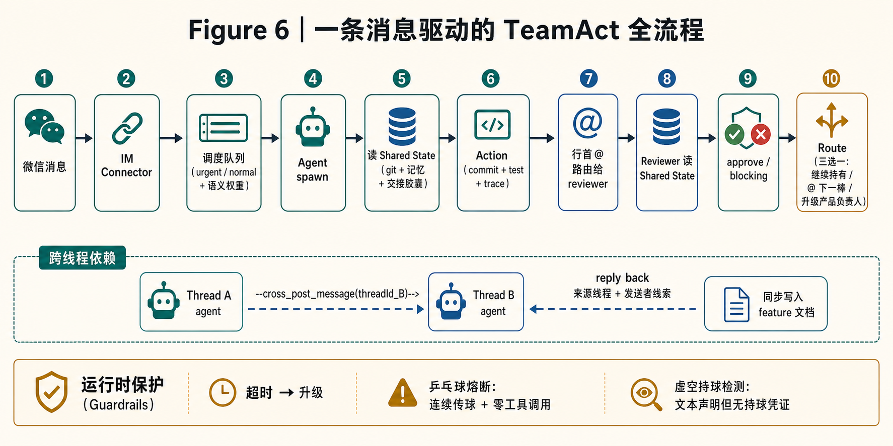

<details>
<summary>低保真草图对照</summary>

> **主流程**（从左到右）：
>
> ```
> 微信消息 → IM Connector → 调度队列（urgent / normal）→ Agent spawn
>   → 读 Shared State（git repo + 记忆系统 + 交接胶囊）
>   → Action（commit + test + trace）
>   → 行首 @ 路由给 reviewer → Reviewer 读 Shared State
>   → approve / blocking
>   → Route（继续持有 / 行首 @ 传球 / 升级 CVO）
> ```
>
> **侧面通道**（跨线程）：
>
> ```
> Thread A agent ──cross_post_message(threadId_B)──→ Thread B agent
>   ← 回复（含来源线程 + 发送者线索）+ 同步写入 feature 文档
> ```
>
> **底部保护机制**：超时 → 自动升级 ｜ 乒乓球熔断（连续传球 ≥ 4 次 + 零实质
> 工具调用 → 中断）｜ 虚空持球检测（文本声明持球但没有持球注册工具凭证 → 告警）

</details>

**为什么不能用简化版。** 如果没有 shared state，每个 agent 的上下文只来自对话历史
——压缩后丢失，每轮都从零开始。如果没有显式路由，agent 之间的任务归属退化为
"谁先看到谁做"——无法保证每个任务有且只有一个 owner。如果有路由但没有等待期
的持球注册，agent 退出会话后球就掉地上了——没人知道任务还在不在有人管。

每一层都是被上一层的失败逼出来的。这不是过度工程——它是**分布式系统里的标准
治理层**：shared state 对应一致性，行首 @ 路由对应消息投递保证，持球注册对应
分布式 lease，超时升级对应 failure detector。只是这些概念长了一张 agent 协作
的脸。

---

## 第 3 章 —— Harness：让模型完成现实闭环的运行时

模型本身像一个缸中之脑。它能推理，能生成方案，能解释自己为什么这么做；但它天然
没有稳定的现实感知、现实记忆、现实行动后果、现实验证，也没有可靠的人机边界。

能力画像如果不接入现实，只是一张自我介绍。Harness 的作用，是让画像里的强项和盲点
在真实任务中暴露出来，并把这些暴露变成下一次路由的依据。

这就是 Harness 要解决的问题。它不是让模型"想得更聪明"的一层提示词，而是让模型
进入现实闭环的运行时：知道现在发生了什么，能安全地改变外部世界，能留下证据，
能被验证，能被治理，能把经验沉淀到下一次行动。

Prompt 仍然有用，但它只是注意力通道。现实闭环不能只靠注意力维持。真正的 Harness
会把关键约束放到更可靠的表面上：文件、任务、工具协议、队列、钩子、测试、审查、
trace、人工确认和记忆系统。

换句话说，Harness 的核心不是"给模型一段更好的话"，而是把世界做成模型可以感知、
可以行动、可以验证、可以恢复、可以学习的样子。

**〔 Figure 7 —— Harness 现实闭环运行时 〕**

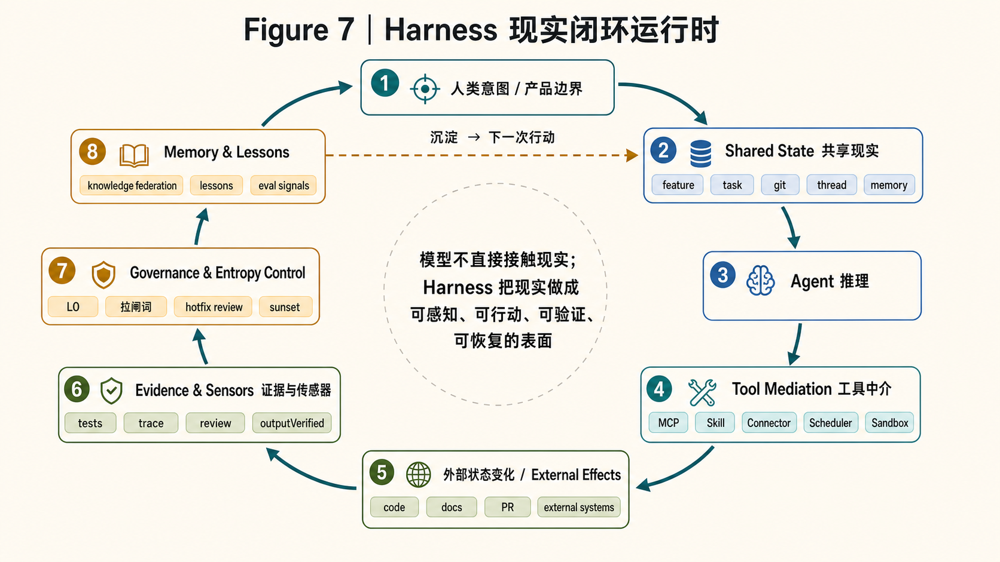

<details>
<summary>低保真草图对照</summary>

```text
        人类意图 / 产品边界
                 │
                 ▼
        Shared State 共享现实
   feature / task / git / thread / memory
                 │
                 ▼
            Agent 推理
                 │
                 ▼
        Tool Mediation 工具中介
   MCP / Skill / Connector / Scheduler / Sandbox
                 │
                 ▼
        外部状态变化 / External Effects
   code / docs / PR / external systems
                 │
                 ▼
        Evidence & Sensors 证据与传感器
   tests / trace / review / outputVerified
                 │
                 ▼
        Governance & Entropy Control
   L0 / Magic Words / hotfix review / sunset
                 │
                 ▼
        Memory & Lessons
   knowledge federation / lessons / eval signals
                 └───────────────↺ 回到 Shared State
```

</details>

这张图有两个重点。第一，模型不直接接触"现实"，它通过 Harness 的各个表面接触现实。
第二，现实不是一次性输入，而是闭环：每次行动产生证据，证据进入治理和记忆，记忆再
改变下一次行动的上下文。

### 现实问题：开放环境里的五种失败

Agent 在开放环境里自主推进目标时，会遇到五类模型自身解决不了的问题。

**状态持久性**。长任务跨 session、跨 thread、跨天推进，模型自己的上下文窗口撑不住。
压缩会丢信息，新 invocation 会失忆，同一个 agent 在不同 thread 里也可能混淆上下文。

**目标一致性**。Agent 容易漂移、自嗨，或者提前宣布完成。模型会根据对话节奏生成
"看起来像收尾"的回答，但这不等于真实目标已经达成。

**行动可验证性**。Agent 说"我做了"不等于做对了。代码有没有改到正确位置？测试是否
真的跑过？review 是否由非作者完成？这些不能靠模型自评。

**熵增抑制**。长期运行的系统会积累冗余规则、过期文档、临时补丁、重复记忆和坏模式。
如果 Harness 只会加规则、不会退役规则，迟早会变成另一种技术债。

**人机边界**。什么时候 agent 可以自主推进，什么时候必须停下来交给人？模型没有稳定的
"我现在不该继续"自觉。尤其是不可逆操作、愿景级决策、跨 agent 僵局，必须有外部边界。

这五类不是抽象风险。它们分别对应我们真实踩过的事故：上下文串线、任务提前收尾、
自证完成、hotfix 链条越补越厚、以及 agent 在错误方向上越跑越远。

所以 Ch.3 不再问"这是不是 prompt engineering"。更准确的问题是：**我们把哪些现实
能力外部化成了运行时？**

### 感知现实：Durable State Surfaces

第一层是让 agent 不再失忆上岗。

我们没有把"状态"只放在对话历史里。对话历史是最脆的状态表面：会被压缩，会被截断，
会因为换 carrier 或新 session 丢失。真正的共享现实放在更持久的地方：

- `feature spec` 记录目标、验收标准、开放问题和完成证据
- `git` 记录实际修改、提交历史和可回滚边界
- `task / queue` 记录谁在等、谁在跑、谁被阻塞
- `thread / session trace` 记录 agent 做过什么、调过什么工具、留下什么回执
- `memory federation` 记录决策、教训、方法论和跨域知识
- `handoff capsule` 记录交接时的 What / Why / Tradeoff / Open / Next

这也是为什么 Ch.2 一直强调 Shared State。多 agent 协作不是靠群聊记忆维持的，而是靠
共享现实维持的。Agent 每次启动，不是只看最近一句话，而是重新接到这套持久状态表面。

这里的 tradeoff 很清楚：状态越外部化，系统越可恢复；但状态表面越多，也越需要治理。
所以 Ch.4 的记忆系统不是锦上添花，它是现实闭环的长期状态层。

### 改变现实：Tool Mediation

第二层是行动。Agent 真正进入现实，不是因为它会说话，而是因为它能调用工具。

工具越多，Harness 越重要。没有工具，agent 只是建议者；有了工具，agent 会改代码、
发消息、创建任务、读内部数据、触发外部系统。能力半径变大后，边界必须显式化。

我们用 MCP（Model Context Protocol）定义 agent 能看到哪些工具、能以什么 schema 调用。
一个工具没有暴露给某个 agent，它就物理上调不到。这比提示词里写"请不要调用某工具"
可靠得多。

Skill 是另一类工具中介。它不是普通说明文，而是可执行的操作包：流程、脚本、检查点、
验收条件放在仓库里，agent 加载后按真实步骤推进。比如 merge gate 不是一句"合入前
请检查"，而是一套门禁：测试、review、PR、squash merge、文档同步、worktree 清理。

还有 connector 和 scheduler。IM 消息、GitHub PR、CI 结果、定时巡检、观察窗口到期，
都可以作为事件进入系统。这样 agent 不是守着聊天窗口工作，而是在事件流里工作。

这一层的权衡是：工具层越强，越不能让工具靠模型自觉管理。危险操作需要沙箱、权限、
回调 token、幂等约束和人工确认。否则工具越多，副作用越不可控。

### 验证现实：Evidence & Sensors

第三层是验证。现实闭环里最重要的一句话是：**做了不等于做对了。**

模型天然会自我解释，也天然容易自我表扬。它说"我检查过了"，只能说明它生成了这句话；
不能说明测试真的跑过，也不能说明 review 真的发生过。

所以我们把完成感从模型嘴里移到证据链里：

- 代码修改要有 commit
- bug 修复要有先红后绿的测试
- 合入前要过 quality gate
- 自己写的代码不能自己 review
- 跨 agent review 要给出 approve 或 blocking，不允许"approve 但后续再说"
- 关键任务需要截图、日志、trace 或 outputVerified 这类外部信号

可观测性在这里不是为了漂亮 dashboard，而是为了让团队不必相信 agent 的自述。我们看
它做了什么：有没有读源文件、有没有跑命令、有没有产生 diff、有没有触发测试、有没有
把结果写回共享状态。

不同 carrier 的 trace 覆盖度不同。有的能捕获每次工具调用的完整输入输出，有的只能
记录 invocation 级摘要。这个差异不能被抹平，所以文章里也必须诚实：目标不是录下一切，
而是让关键行为可追溯。

### 约束现实：Governance Boundary

第四层是治理边界。现实闭环不能只靠 agent 记得规则。

最典型的问题是上下文压缩。长任务跑久了，runtime 会压缩早期内容。压缩不理解什么是
"治理规则"：它可能保留最近的代码细节，却压掉协作协议、操作红线、任务交接规则和质量纪律。
Agent 后半段突然违规，很多时候不是它故意违规，而是规则从它的世界里消失了。

我们的做法是把关键治理沉到压缩免疫层：身份、家规、任务交接规则、不可逆操作边界、质量纪律
进入 native system role / developer role，而不是每轮塞在 user message 里。表层提示
会变薄，但底层治理要变厚。

同时，这不是把所有东西都塞进 system role。我们做过一次双向手术：

- 删掉与团队文化冲突的主观行为指导，例如"只做最小修复""不要写注释""不要抽象"
- 保留客观能力指令，例如安全反射、并行工具调用、技能发现、压缩感知、Git 操作模板
- 注入团队自己的治理协议，例如交接、review、质量门禁、人工确认、Magic Words

治理还必须可见。首席愿景官要能看见当前每个 agent 带着什么规则，因为很多治理不是纯
技术选择，而是愿景选择：这个 agent 应该多主动？review 多严格？什么时候必须人类拍板？

这里的权衡是自主性和边界。太软，agent 会漂；太硬，agent 会失去判断力。好的治理不是
替模型思考，而是让模型在正确的坐标系里思考。

### 人机边界：Runtime 逃生舱

现实闭环里必须有人类入口。人类不是在系统外面等结果，而是在关键边界进入闭环。

有些边界可以提前写进规则：删除数据、force push、改生产 Redis、合第三方 PR、砍掉整块
功能，这些必须交给人确认。还有些边界只能在 runtime 发现：agent 正在错误坐标系里越跑
越远，或者正在把"未做"包装成"已规划"。

这就是 Magic Words 的位置。它们不是 prompt 技巧，而是人到 agent 的 runtime 协议：

- "第一性原理"：停下来，检查是不是在用复杂度代偿无知
- "我能猜出来"：停下来，读真相源，别用推理替代查询
- "下次一定"：停下来，能做的现在做，不能做的走明确 signoff
- "星星罐子"：P0 不可逆风险，立刻停止新增副作用

这些词看起来很生活化，但它们背后是一个严肃设计：人类必须能用极低带宽打断 agent 的
错误轨迹。等 agent 自己意识到"我现在应该停"通常太晚。

关键约束也必须写清楚：这些逃生舱只在首席愿景官当前指令中触发。引用、复述、讨论历史
中的短语不触发。否则治理协议本身会变成误触源。

### 清理现实：Entropy Control

长期系统真正难的不是加能力，而是持续清理自己。

Harness 有两种死法。第一种是模型变强后吞掉表层脚手架：详细推理模板、格式纠正层、
工具调用示例，都会随着模型能力演进而折旧。第二种更隐蔽：新 agent 加入后，暴露出某些
"通用规则"其实只是对旧 agent 坏习惯的个体补偿。

这就是为什么 Harness 需要熵控机制：

- hotfix 合入后两周自动触发升级 review：正式修复、接受永久方案、已不再相关，三选一
- Build to Delete 类型的规则要标 sunset，不允许无限期占用注意力预算
- root md 和 system prompt 要定期瘦身，避免重复注入和副本漂移
- 记忆系统要治理权威性、触发方式和生命周期，过期知识不能永远排在前面
- 新 agent 加入后，要重新评估哪些规则是跨 agent 资产，哪些只是个体补偿

多 agent 在这里不只是能力升级，还是治理信号源。不同 agent 的坏直觉不同：有的会糊弄式
最小修复，有的会推迟闭环，有的会在错误坐标系里加 fallback，有的会创意漂移。同一条规则
在不同 agent 身上的命中率不同，这正好帮助我们区分公共资产和个体补偿。

低保真矩阵：

| 治理规则 / 拉刹车词 | 糊弄惯性型 | 推迟闭环型 | 错误坐标系补丁型 | 创意漂移型 | 治理归类 |
|---|---:|---:|---:|---:|---|
| "脚手架" | 高 | 低 | 中 | 低 | 类型补偿：偏糊弄惯性型 |
| "第一性原理" | 中 | 高 | 高 | 高 | 跨 agent 资产 |
| "follow-up 尾巴" 禁令 | 低 | 高 | 中 | 低 | 类型补偿：偏推迟闭环型 |
| "我能猜出来 / 碎片够了" | 中 | 高 | 低 | 低 | 类型补偿：偏读源不足型 |
| SOP 导航表 | 低 | 中 | 高 | 高 | 双重身份：新手路标 / 老手冗余 |

这张矩阵不是给 agent 贴标签，而是给 Harness 找边界：什么该进公共层，什么应该按 agent
动态注入，什么应该退役。

### 适配现实：Harnessability

最后一层是 Harnessability：不是每个系统都同样适合交给 agent。

一个系统如果只有页面、没有 API；只有即时消息、没有持久状态；只有结果截图、没有结构化
证据；操作不可幂等、不可回滚、不可审计，那么 agent 只能靠猜和点页面硬跑。模型再强，
也很难稳定闭环。

更适合被 harness 的系统通常有几个特征：

- 有稳定 API 或工具接口
- 有事件流或回调，不需要 agent 一直忙等
- 有持久状态，可以从中恢复上下文
- 有可验证输出，例如测试、日志、PR、审计记录
- 操作尽量幂等，失败后可以重试或补偿
- 权限边界清楚，高风险动作能被拦截或人工确认

这解释了我们为什么不断做 connector、event bus、trace、feature doc、quality gate 和
memory federation。不是为了给系统堆复杂度，而是在把外部世界改造成 agent 可感知、
可行动、可验证、可治理的现实表面。

到这里，Harness 的位置就清楚了：它不是模型能力的补丁，而是模型与现实之间的运行时。
表面的提示词会变薄，底层的现实闭环会变厚。模型越强，越需要这层运行时来承载它改变
现实的半径。

---

## 第 4 章 —— 团队记忆：从 grep 到多域知识联邦

很多团队给项目接了 RAG（Retrieval-Augmented Generation），最后发现效果还不如
让 Claude Code 或 Codex 自己 `grep`。这不是错觉。

能力画像也不是只存在于配置表里。它的一部分来自团队记忆：这只 agent 在什么任务上做过、
踩过什么坑、哪条教训后来真的被用上。没有记忆系统，画像会退化成静态简历。

项目记忆首先不是"语义召回"问题，而是**现实导航**问题：哪份文档是源头？哪份已经
过时？哪条教训真的被任务用过？这个知识属于当前项目、个人上下文、金融资料库，还是
另一个仓库？只把文档切成块、算向量相似度，回答不了这些问题。

### 真实问题：为什么 RAG 会输给 grep

`grep` 赢在三件事。

第一，**当前性**。它搜的是当前文件系统，不怕向量索引没更新。第二，**精确性**。
字面命中就是命中，不会自信地召回一段"语义很像但其实不对"的文本。第三，
**可审计性**。命中在哪个文件哪一行，agent 可以立刻打开原文，不需要相信黑盒排序。

很多 RAG 在项目知识场景里输给 grep，不是因为向量检索没价值，而是因为它丢了
项目知识最重要的工程属性：文件路径、行号、标题层级、更新时间、文档类型、决策权威、
上下文关系。一个被切碎的 chunk 可能语义相似，但它未必是最新真相源，也未必是该被
相信的那份文档。

但 grep 也有天花板。

- 它需要先验关键词。不知道"桌宠"在代码里实际叫 `voice companion` 或 `desktop shell`，
  就很难搜到。
- 它没有语义桥接。搜"注意力缺陷"未必能命中写成 `AUDHD` 的经验记录。
- 它不知道权威性。旧草稿、废弃 spec、已批准 ADR，在 grep 结果里都只是文本。
- 它不知道跨域关系。项目仓库、个人上下文、金融知识库、虚拟世界设定、GitHub/Gmail
  connector 里的信息不会自然联邦。
- 它没有结果反馈。某条知识被搜到后有没有被读、有没有真的帮助任务成功，grep 完全不知道。

所以我们的路线不是"用 RAG 替代 grep"。更准确地说，是：**保留 grep 的真相源感和
可审计性，再补上语义检索、治理、跨域联邦和运行时反馈。**

对于决策、教训、spec 这类**知识文档**，真相源仍然是仓库里的 markdown 文件——
agent 能读、能改、能用 git 追溯。数据库和向量索引只是编译层，坏了可以从 markdown
重建。这是一个有意的设计决策：**知识的真相源不能是只有系统能读的格式**。人类产品
负责人要能直接打开文件看到团队记忆里写了什么。

但记忆系统里还有另一类数据：agent 的检索行为和任务轨迹（搜了什么、读了什么、
结果如何）。这些**运行时 trace** 不是 markdown 编译出来的，而是系统在 agent
执行过程中自动采集的 runtime evidence，存在独立数据表里。两类数据的真相源不同，
治理方式也不同。

### 三个入口：不同认知模式走不同路

记忆系统有三个检索入口，对应三种不同的认知需求：

**精确导航**（graph_resolve）：你知道要找什么——一个 feature 编号、一个决策
文档、一个已知的锚点。系统返回这个锚点以及它的关联关系（1-3 跳邻居：相关
feature、对应决策、关联教训）。这解决的是"我知道大概在哪，帮我展开上下文"。

**零先验扫描**（list_recent）：你不知道要找什么——可能是刚从上下文压缩中
恢复，可能是接手了一个不熟悉的任务。系统按时间倒序列出最近被索引的文档
（feature / decision / lesson / plan）、讨论摘要（session digest）和记忆条目
——注意这是**已索引文档的最近视图**，不是原始聊天消息或记忆存储的全量扫描。
这解决的是"发生了什么？我错过了什么？"

**语义搜索**（search_evidence）：你知道要找什么方向但不知道确切的锚点——
用关键词或自然语言描述查询。系统用关键词匹配（BM25，一种传统的词频排序算法）
和语义向量的混合模式检索，结果带治理元数据：置信度、权威等级、文档类型。
这解决的是"关于 X 我们知道什么？"

三个入口不是冗余——它们覆盖了 agent 在不同认知状态下的需求。精确导航给
有上下文的 agent 用，零先验扫描给丢失上下文的 agent 用，语义搜索给探索性
任务用。

### 从 grep 到联邦：七步演进

记忆系统不是一次设计出来的。它是沿着"grep 够用在哪里、不够用在哪里"一路长出来的。
内部 feature 编号只是证据锚点，真正的演进线是下面七步：

**F102：检索底座。** 先把知识从"散落在文件里、靠人 grep"升级成可重建的索引：
markdown 仍是真相源，SQLite / 全文检索 / 向量检索 / RRF 融合排序（把多个排序列表
按名次合并）是编译产物。这一步解决的是"能不能搜到"。

**F163：治理层。** 搜到不等于可信。我们给知识加三类元数据：
**权威性**（authority，谁能证明它成立，比如铁律、已验证决策、候选观察）、
**触发方式**（activation，什么时候应该出现，比如永远在场、按任务范围、只在查询时出现）、
**生命周期**（status，它现在是有效、待复核、已失效还是归档）。这一步解决的是
"搜到了该不该信"。

**F169：记忆反射愿景。** 能搜不等于会在正确时机想起来。F169 提出的是：记忆不该
只是书架，而应该像 agent 的外部工作记忆反射。这里引入了 **salience**（任务相关性）：
同一条高权威知识，在不同任务里相关性不同；相关的应该浮上来，不相关的应该暂时降下去。
这一步解决的是"什么时候该想起什么"。

**F152：外部项目冷启动。** 记忆第一次走出本项目。agent 去到一个陌生仓库时，通用
扫描器读取 README、代码结构、变更记录和散落文档，带 provenance（来源溯源）进入索引；
在外部项目踩到的经验再回流到全局方法论层。这一步解决的是"新项目怎么不从零开始"。

**F186：多域知识联邦。** 知识边界从"一个项目仓库"扩展到多个知识域。我们引入
**Collection（知识域）**：一个有独立真相源、负责人、扫描器、敏感级别和治理策略的知识域。
项目、全局方法论、个人上下文、虚拟世界设定、金融/医疗/生物实验设计这类专业资料库，
都可以注册成知识域。检索时按权限和任务需要跨知识域并发查询，再融合排序。
这一步解决的是"知识不在一个地方怎么办"。

**F188：管护与佩戴协议。** 图书馆建好了不等于 agent 会用。F188 正在把三个检索入口、
知识图谱、健康检查、搜索技能和图形导航做成 agent 面向的使用界面。这里的"佩戴协议"
不是把 top-k 硬塞进上下文，而是让不同模型知道什么时候该精确查、什么时候该扫最近、
什么时候该语义搜索，搜完还要追源读原文。这一步解决的是"能力有了，agent 会不会用"。

**F200：反馈闭环。** 最后开始闭合循环：用 agent 的真实行为判断知识价值。搜到了有没有读？
读了有没有用？用了之后任务有没有被验证？这些信号反过来调整导航排序。注意，这只影响
"下次更容易找到什么"，不改变知识本身的权威性。这一步解决的是"什么知识真的有用"。

一句话总结：**F102 让知识可搜，F163 让知识可信，F169 让知识按任务浮现，F152 让知识
可迁移，F186 让知识可联邦，F188 让 agent 会用，F200 让系统知道什么真的有用。**

### 最终设计：多域记忆运行时

这七步长出来的最终形态，不是一个 RAG 工具，而是一个六层的多域记忆运行时：

1. **真相源 / Collection 层**：项目 spec、决策、教训、讨论、个人上下文、外部仓库、
   虚拟世界、专业领域知识库、GitHub/Gmail/IM 等外部连接器。每个知识域有独立
   负责人、敏感级别和治理规则
2. **扫描 / 编译层**：markdown、仓库结构、connector 数据和运行时 trace 被扫描进
   SQLite / 全文索引 / 向量索引 / 图谱索引。索引可重建，真相源不藏在黑盒数据库里
3. **联邦检索层**：`scope` 管检索表面（docs / threads / memory），`dimension` 和
   `collections` 管知识域路由；跨知识域并发检索 + RRF 融合；有权限和敏感级别过滤
4. **治理层**：权威性（谁能证明）、触发方式（什么时候出现）、生命周期（是否仍有效）、
   来源溯源、过期检测、矛盾检测、回滚。这是和普通 RAG 最大的差别之一
5. **Agent 佩戴协议层**：三个检索入口 + 搜索技能 + 任务相关性提示，让不同能力的
   agent 都能有效使用记忆，而不是被动吃 top-k
6. **反馈闭环层**：行为指标、消费加权排序、TaskTrajectory（任务轨迹）、
   outputVerified（任务结果验证信号）。
   回答"这条知识是否真的改变了行动结果"

**〔 Figure 8 —— Cat Café 多域记忆运行时架构 〕**

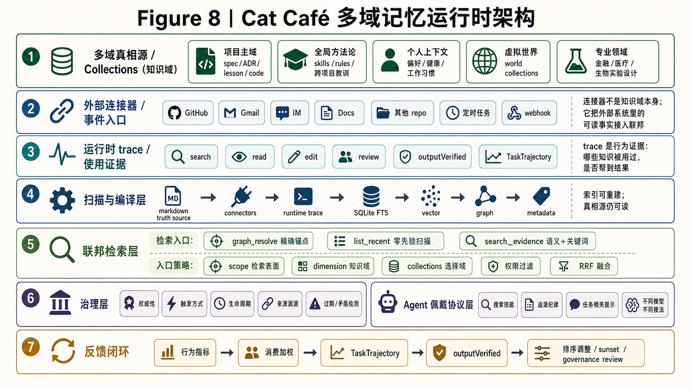

<details>
<summary>低保真草图对照</summary>

```text
┌──────────────────────── 多域真相源 / Collections（知识域） ───────────────┐
│ 项目主域        全局方法论      个人上下文       虚拟世界       专业领域     │
│ spec/ADR/       skills/规则     偏好/健康/       world:...      金融/医疗/   │
│ lesson/code     跨项目教训      工作习惯         设定集         生物实验设计 │
└───────────────────────────────┬────────────────────────────────────────┘
                                │
┌──────────────────────── 外部连接器 / 事件入口 ───────────────────────────┐
│ GitHub / Gmail / IM / Docs / 其他 repo / 定时任务 / webhook              │
│ 连接器不是知识域本身，而是把外部系统里的可读事实接入联邦                  │
└───────────────────────────────┬────────────────────────────────────────┘
                                │
┌──────────────────────── 运行时 trace / 使用证据 ─────────────────────────┐
│ search / read / edit / review / outputVerified / TaskTrajectory           │
│ trace 不是静态知识源，而是"哪些知识被用过、是否帮到结果"的行为证据       │
└───────────────────────────────┬────────────────────────────────────────┘
                                │ 扫描器 / 连接器 / 来源溯源
                                ▼
┌──────────────────────── 扫描与编译层 ────────────────────────────────────┐
│ markdown truth source → SQLite FTS + vector + graph + metadata            │
│ 索引可重建；真相源仍在人类可读的文件或外部系统里                         │
└───────────────────────────────┬────────────────────────────────────────┘
                                │
                                ▼
┌──────────────────────── 联邦检索层 ──────────────────────────────────────┐
│ 检索入口：graph_resolve（精确锚点）/ list_recent（零先验扫描）/             │
│          search_evidence（语义 + 关键词混合）                              │
│ 入口策略：scope 选择检索表面（docs / threads / memory）                     │
│ 联邦策略：dimension + collections 选择知识域；按权限过滤；跨域 RRF 融合       │
└───────────────────────────────┬────────────────────────────────────────┘
                                │
              ┌─────────────────┴─────────────────┐
              ▼                                   ▼
┌────────────────────────┐        ┌──────────────────────────────────────┐
│ 治理层                  │        │ Agent 佩戴协议层                      │
│ 权威性 / 触发方式 /     │        │ graph_resolve / list_recent /          │
│ 生命周期 / 来源溯源 /   │        │ search_evidence + 搜索技能 + 追源纪律 │
│ 过期与矛盾检测          │        └──────────────────┬───────────────────┘
└────────────┬───────────┘                           │
             │                                       ▼
             └──────────────→ 反馈闭环：真实使用行为 / 任务结果
                              consumed / searchChain / filesRead /
                              outputVerified（结果验证）/ attribution（归因）
                              → 排序调整 / sunset / governance review
```

</details>

### 用行为信号而非自评

反馈闭环这一层的核心创新：**用 agent 的真实行为判断知识的价值，不用 LLM 自评打分**。

这个设计选择来自一个具体的发现。我们拆解了一个外部的记忆系统，发现它用 LLM
给每条记忆打"重要性分数"。问题是：**模型的自评集中在 0.6-0.85 的"成功"
区间**，几乎没有负样本。模型不会说"这条记忆没用"——就像人不会在自评里
给自己打低分。这意味着根信号本身有毒：排序建立在一个有系统偏差的评估上。

我们的选择：根信号来自 agent 的真实工具调用行为——**搜了、读了、用了 = 真信号**。
这在行为经济学里叫 revealed preference（显示性偏好）：不看 agent 说什么有用，
看它实际拿什么来用。

具体实现：14 个行为指标，包括命中消费率（搜到后是否真的读了）、首次命中排名
（有价值的知识是否排在前面）、搜索放弃率（agent 是否频繁改词重搜——说明
第一次没搜到有用的）、token 消耗效率（找到有用知识花了多少上下文预算）。

这些指标汇聚成一个**消费加权排序**：被实际使用过的知识排名上升，长期没被
使用的知识排名下降。排序公式的核心是：

```
调整后得分 = 融合检索得分 + 权威加成 + 消费先验 + 时效衰减 - 过时惩罚
```

其中消费先验用贝叶斯收缩防止冷启动偏热点（新知识不会因为还没被搜过就被
埋在底部），用中心化偏移允许负信号（减去同类知识的平均消费率，而不是只看
绝对消费次数），用分数时效衰减做长尾保护（旧知识不会因为近期没被搜就直接
归零）。

一个重要的边界：**消费加权只影响导航便利度，不影响权威等级**。读得多不等于
更正确——架构决策文档的权威性来自决策过程本身，不来自被搜了多少次。

成熟度标注：行为信号采集和消费加权排序已在线运行，但当前仍处于趋势反馈阶段
——`consumed` 信号还是 proxy（部分 carrier 的文件读取尚未计入），样本量较薄，
`outputVerified` 强信号（任务最终成功/失败）的自动桥接仍在建设中。把它当
趋势方向标可以，当稳定的排序 oracle 还为时过早。

### 检索驱动的适配循环

记忆系统的反馈闭环构成了一种独特的学习范式——不是传统的梯度更新训练循环，
是**检索驱动的适配循环**。

区别是根本性的：

- 训练循环改变模型的潜在能力和泛化边界；检索循环改变模型能接触到的知识库
- 训练循环要等完整的训练运行才能生效；检索循环即时生效——一个 agent 提炼的
  教训，下一个 agent 立刻搜得到
- 训练循环和特定模型绑定（每家厂商独训）；检索循环跨厂商通用——同一套教训
  对 Claude、GPT、Gemini 都有用
- 训练循环有灾难性遗忘的风险；检索循环没有——知识是文本，加新的不会覆盖旧的
- 训练循环的改动难以审计和回滚；检索循环完全可审计——教训是人类可读的
  markdown，可以阅读、修改、删除

这不是训练循环的降级替代。它是一种**不同的适配范式**，有自己的优势和局限。
它不能改变模型的基础能力（不能让一个不会写代码的模型突然会写），但它能让
多个不同厂商的 agent 共享同一套项目知识、教训和决策上下文——这是训练循环
做不到的。

每次任务的检索链条（搜了什么→读了什么→改了什么→结果如何）被持久化记录。
这些 trajectory 本身就是有价值的适配信号：哪些知识在实际任务中被频繁使用？
哪些教训真的帮 agent 避开了已知的坑？

需要诚实说明的是：目前自动桥接还未完全到位。agent 任务过程中的搜索和阅读
行为已经能自动记录，invocation 级别的成功/失败状态可以自动检测。但外部信号
（PR 合入、CVO 确认、reviewer 放行）到 trajectory 的自动桥接仍在建设中
——当前通过外部注入接口半自动完成。

### 简单系统 + 聪明 agent

记忆系统有一条贯穿始终的设计原则：**系统保持简单，把智能留给 agent**。

具体来说：查询扩展（一个模糊问题怎么展开成多个精确检索）由 agent 用自己的
领域知识做，不在检索引擎里加 regex 规则或小模型做意图分类。记忆系统只负责
"给了关键词，返回匹配结果"——不试图猜 agent 想找什么。

这个原则有一个实践验证：团队里不同 agent 用同一个搜索工具时，会基于各自的
领域理解做不同的查询扩展，搜出不同的子集。如果系统层面做了查询改写或意图
分类，就会把所有 agent 的搜索行为同质化——反而损失了多 agent 的检索多样性。

怎么教 agent 有效搜索？不是在系统里加逻辑，是写一个搜索技能模块：先展开
同义词、再分 doc/thread 分别搜、搜完对比覆盖度、不足的角度再补一轮。
这个技能和 agent 的模型能力结合——聪明的 agent 搜得更好不是因为系统给了
更好的结果，是因为它问了更好的问题。

### 和相邻系统的边界

有了架构图之后，再看相邻系统的边界就更清楚了。它们不是"谁先进谁落后"的关系，
而是解决的问题不同。

**RAG**：数据源是外部文档，典型实现不以项目内权威等级、知识溯源或使用结果
反馈为核心机制。解决"上下文不够"——把外部知识搬进来。知识的消费者和生产者
分离。

**LLM Wiki**（以 Karpathy 的设计为代表）：原始数据源经 LLM 编译成 wiki 页面，
有 schema、有 lint（矛盾检测、过期检测、孤儿页检测），人类可以 curate。
解决"不要每次从原文重新发现"——把知识编译成更易查的格式。这个系统**有治理**
——说"LLM Wiki 没治理"是不准确的。

**Agentic Search**（如 Perplexity、Deep Research）：实时搜索公开 web，
典型形态不以项目内权威等级、来源溯源或任务结果反馈为核心机制。
解决"当前任务需要找资料"——实时获取外部信息。

**我们的记忆系统**：数据源是多域联邦——项目内文档 + 讨论 + trace（agent 自己
产出的）为核心域，同时联邦式链接个人上下文、外部世界设定、专业领域知识库。
有权威等级 + 生命周期治理 + 消费加权排序。解决"多 agent 长程协作怎么不漂、
怎么复用、怎么跨域导航"。

两个独有特性：

第一，**知识生产者 = 知识消费者**。agent 写教训 → agent 搜教训 → 绕开坑。
其他系统的核心闭环不是"生产者自己在任务结果中反向改写排序"——RAG 和
Agentic Search 的知识来自外部；LLM Wiki 可以编译项目内资料，但编译者和
日常任务执行者通常是分离的。我们的知识来自团队自身的实践，生产和消费在同一
循环里——这意味着知识的质量和团队的实践质量直接挂钩。

第二，**有运行时结果反馈闭环**。搜了、用了、结果好 → 排名上升。RAG 和
Agentic Search 是读多写少的系统。LLM Wiki 有知识维护循环（lint 查矛盾和
过期），但缺"任务结果反向决定知识排序"的运行时反馈。我们的差异不在检索
算法，在于**真相源、权威、溯源、使用反馈、结果验证**都在同一个闭环里。

一句话概括区别：LLM Wiki 是**知识编译器**，把散乱的知识编译成结构化的 wiki；
我们做的是**多域记忆运行时**——不只编译知识，还联邦链接多个知识域，追踪
知识的使用效果，并用使用效果反向优化知识的可发现性。项目是工作现场，不是
记忆边界。

**〔 Figure 9 — 四种 Memory/Retrieval 范式对比 + 反馈飞轮 〕**

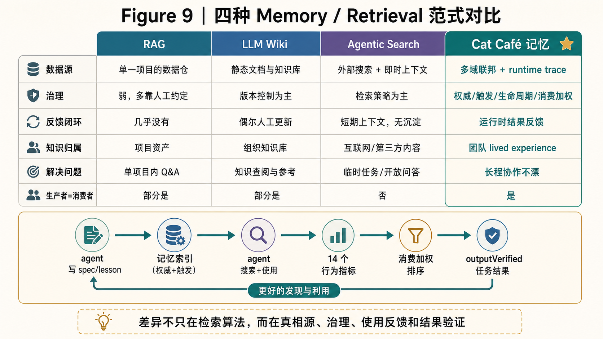

<details>
<summary>低保真草图对照</summary>

低保真草图 v0：上半部分是四列对比表，下半部分是 Cat Café 独有的反馈飞轮。

| 维度 | RAG | LLM Wiki | Agentic Search | Cat Café 记忆 |
|------|-----|----------|---------------|--------------|
| **数据源** | 外部文档 chunk | 原始源 → LLM 编译 wiki | 公开 web 实时 | 多域联邦：项目主域 + 全局方法论 + 个人上下文 + 世界/领域知识域 + runtime trace |
| **治理** | 典型无 | schema / lint / curate | 典型无 | 权威性 / 触发方式 / 生命周期 / 消费加权 |
| **反馈闭环** | 无 | 知识维护 lint 循环 | 无 | **运行时结果反馈**（revealed preference） |
| **知识归属** | 外部世界 | 被编译的外部/项目知识 | 外部世界（实时） | **团队自身 lived experience** |
| **解决问题** | 上下文不够 | 不重复发现 | 当前任务找资料 | 多 agent 长程协作不漂/复用/评估 |
| **生产者=消费者？** | ❌ | ❌ | ❌ | **✅** |

```text
Cat Café 反馈飞轮（下半图）：

  agent 写教训/spec ──→ 记忆索引（权威性 + 触发方式）
         ↑                         │
         │                         ▼
  任务结果反馈 ←──── agent 搜索 + 使用（revealed preference）
  (outputVerified)                 │
         ↑                         ▼
         └──── 消费加权排序 ←── 14 个行为指标
                                   │
                                   ▼
                     下一个 agent 搜到更好的排序
```

最终图要突出两件事：第一，四列对比中 Cat Café 是唯一同时满足"生产者=消费者"
和"有运行时结果反馈"的；第二，反馈飞轮不是单次检索，是一个持续转动的循环
——每次任务的使用行为都在优化下次任务的知识可发现性。

</details>

---

## 第 5 章：Eval——Harness 的自我代谢系统

前四章说了怎么建 harness：公式定义方向，协作协议约束流程，运行时把模型接入
现实，记忆联邦保证长程一致。

如果能力画像没有 eval，它就会变成一张主观标签表：谁"看起来"擅长什么，谁"自称"适合
什么。Eval 的作用，是把画像从印象更新为证据。

现在的问题不是"要不要测"。任何认真做 agent 的团队都知道 benchmark 不够。
真正的问题是：**你怎么知道一块 harness 该继续加固，还是该删除？**

这句话把 eval 从"写完规则以后补一个报告"推进到系统设计层。第 1 章说，每块
harness 都有半衰期：有些是救急脚手架，模型变强后应该退役；有些是复利型
基础设施，模型越强越值钱。可是如果没有 eval，半衰期就是猜测。你不知道
哪条规则还在救命，哪条规则已经变成噪音；不知道某个工具描述是让 agent 更稳，
还是只是让文档更厚。

所以这一章的核心不是"跑 benchmark"，而是：

> **有 harness，就必须有 eval。否则 harness 只会增生，不会代谢。**

### Benchmark 只测一个因子

直觉回答是"跑 benchmark"。但 benchmark 测的是模型能力——"这个 agent 能不能
写出正确的排序算法"——不是 harness 适配度——"你给的工具、状态、协议、验证面
是否让 agent 在这个项目里更有效"。

一个 benchmark 满分的 agent，换到你的项目里可能因为工具描述含糊而频繁出错；
一个 benchmark 成绩普通的 agent，用了适配好的 harness，可能跑得比谁都稳。

Benchmark 的根本局限是**它和你的工程现场无关**。标准化题目没有你的代码库、
你的协作规范、你的知识体系、你的产品品味。它告诉你 agent 的基线能力，但
第 1 章的公式说了：最终效能 = 能力 × Harness 契合度。**Benchmark 只测了
等号左边的一个因子。**

那另一个因子怎么测？我们的答案不是一个新 benchmark，而是一组运行时控制回路。

### 我们现在已经在跑的三层 eval

现在系统里已经有三条 eval 线，但它们不是同一层东西。

| 层 | 对应建设 | 它回答什么 | 现在谁在消费 |
|----|----------|------------|--------------|
| **观测底座** | **F153：运行时可观测基础设施** | 发生了什么？工具调用、耗时、失败、重试、健康状态 | 所有 eval 的传感器层 |
| **Harness / A2A（agent 间协作）Eval** | **F192：社会技术 harness eval** | 协作协议、任务交接、等待外部条件时的任务持有机制、harness 组件有没有改善工作流 | `harness-fit-digest` 定时后台任务和 harness 评审 |
| **Memory Eval** | **F200：记忆召回 eval** | 搜索结果有没有被读、有没有帮助完成任务、记忆排序是否真的有用 | memory recall 指标和排序策略 |

F153 很重要，但它不是 eval。它是**描述性观测层**：告诉我们发生了什么，不判断
好坏。F192 和 F200 才是在这些观测数据之上做解释：把"发生了什么"对照"本来
期望发生什么"，得到"哪里该改、哪里该删"。

F192 的试点对象是 A2A（agent 间协作）链路。它先在 spec 里写下预期声明：这个 harness
组件应该服务谁、什么时候触发、摩擦指标是什么、回归用例是什么、什么情况下
应该退役。然后从 F153 拉运行时数据，检查实际行为和预期是否一致。第一轮试点
暴露了 6 个观测缺口：有些关键动作根本没被记录。**不可观测本身就是 eval 结果**。
不知道一个组件是否正常，和组件已经故障一样需要行动。

F200 的试点对象是记忆系统。它不让模型自评"这条记忆有用吗"，而是看 agent
真实行为：搜到了有没有读，读完有没有继续追溯，是否又改 query，是否退回 grep。
这些行为信号不会替代权威性判断——一条铁律不能因为没人搜就降权——但它能告诉
我们：导航层是不是把有用的东西放到了 agent 面前。

现在这两条 eval 都还带着启动期形态：F192 有自己的定时摘要，F200 有自己的
召回指标和消费归因。它们能跑，但还不是终态。终态应该是一个横切的 eval
控制面，而不是每个 feature 自己造一套定时后台任务。

### Eval Contract：每块 harness 的接口

F192 里最重要的发明不是某个指标，而是 **Eval Contract**。这个词可以翻译成
"预期声明"：你新增一块 harness 时，必须同时写清楚它想改善什么。

一份合格的预期声明至少回答五个问题：

| 问题 | 人话解释 |
|------|----------|
| **服务谁** | 哪类 agent / 哪类任务会用到它 |
| **何时触发** | 什么时候它应该发挥作用 |
| **摩擦指标** | 它失败时会留下什么信号 |
| **回归用例** | 怎么证明它没有退化 |
| **退役信号** | 什么情况下它应该被删除或精简 |

最后一项最关键。没有退役信号的 harness，就是没有自我删除机制的技术债。

这把第 1 章的 Build to Delete / Built to Persist 判别落到了操作层：

- 如果一块机制的触发率持续下降，且同类任务没有变差，它可能该退役。
- 如果一块机制长期高频触发，且摩擦率下降，它可能值得加固。
- 如果一块机制从来不触发，比"指标下降"更危险——它可能是死代码，只是在占用
  agent 的注意力预算。

Eval 不是事后打分。Eval 是 harness 创建时就应该带上的接口。

### 三方信号：只看 trace 也不够

运行时数据能告诉你很多事，但不能告诉你全部。我们采用三类信号交叉。

**第一方：首席愿景官的愿景信号。** 一个 feature 做完了，CVO 打开看——
满意吗？和他脑子里的画面差多远？这是无法完全算法化的判断。trace 可以全绿，
但如果他说"不是我要的感觉"，那就是没有完成。

**第二方：agent 作为 harness 用户的摩擦信号。** Agent 是 harness 的一线用户。
工具好不好用、规则清不清晰、环境约束卡不卡，agent 最有体感。这里不是让 agent
写自由散文式反思，而是在特定条件下做结构化采访：比如某个工具重试三次，或者
某类交接反复失败，就对着 trace 问"你当时卡在哪里？"

**第三方：运行时观测信号。** 工具调用模式、失败频率、重试次数、耗时分布、
读写链路。这些数据不经过主观过滤——记录的是实际发生了什么。

三方信号的交叉才是真 eval。CVO 满意 + agent 顺手 + trace 异常，说明
有隐藏技术债；CVO 不满意 + agent 顺手 + trace 正常，说明问题可能在
愿景翻译或品味层，而不是工具层。

### 归因：不是"agent 没做好"

三方信号告诉你"有问题"。下一步是归因：问题出在系统的哪一层？

行业常见路径是："agent 做得不好"→ 优化 prompt → 不行就换模型。这把多层系统
拍扁成了一个一维答案。回到第 1 章的公式——效能 = 能力 × Harness 契合度——
"agent 做得不好"可能是模型能力不够，也可能是工具没接好、规则错位、需求翻译
偏了，甚至是首席愿景官自己还没想清楚。

我们的归因用 7 类矩阵：

| 类别 | 含义 | 改什么 |
|------|------|--------|
| **愿景缺口** | 愿景方向本身没想清楚 | 愿景判断 |
| **翻译偏差** | spec 把愿景翻译偏了 | 需求文档 |
| **harness 错位** | 机制设计在错误坐标系上 | 工具 / 规则重新定位 |
| **工具缺口** | 要做的事没有工具支撑 | 新增或改造工具 |
| **执行缺口** | 工具可用但 agent 没用对 | 技能文档 / 搜索策略 |
| **环境漂移** | 同样操作在新环境里变了 | 环境约束 / connector |
| **品味落差** | 功能对，感觉不对 | 审美标准 / CVO 反馈 |

每条归因输出结构化记录：证据来自哪条运行时数据，agent 或 CVO 反馈了什么，
归到哪一类，建议行动是什么，状态有没有推进。结构化不是为了好看，是为了之后
能统计：哪些问题总是工具缺口，哪些总是愿景翻译偏差，哪些发现提出来以后
没人执行。

### 真实使用才会暴露真实 eval 题

设计验证不是 eval。spec 写得漂亮、review 通过、测试全绿，只能证明设计意图
被实现了，不证明 harness 在真实使用中有效。

一个具体例子。CVO 提了一个测试题："搜一下我们哪些讨论提到过 AUDHD。"
三只不同厂商的 agent 各自搜索：一只走关键词，一只走语义扩展（把 AUDHD 展开
成 ADHD、ASD、注意力缺陷、感觉敏感等相关表达），一只走来源溯源。结果：
每只 agent 搜出不同子集，没有一只搜到全集。

这个发现 benchmark 测不出来。benchmark 会给定查询和标准答案；真实工作里，
"相关"的定义取决于搜索策略，而搜索策略又取决于 agent 的理解。这个 dogfood
结果直接催生了搜索技能模块和工具描述改进：先教 agent 怎么搜，再决定是否
需要改底层引擎。

这也是 F200 的边界：当前消费信号能看趋势，但不能被神化成排序裁判。比如
`outputVerified`（任务最终是否被验证成功）这类强信号的自动桥接仍在补齐；
consumed（搜到后是否被实际读取）也经历过归因修复。成熟做法是：先把信号采准，
再让信号影响排序；不能拿脏数据做决策，不能把早期信号当成稳定裁判。

### 轨迹经济学

Eval 的产物不只是一个结论。更有价值的是轨迹：agent 的意图是什么、选了哪个
工具、读了哪些文件、在哪个分支失败、怎么恢复、最终谁验证了结果。

和一条 benchmark 记录对比：

| | 静态 benchmark | eval 轨迹 |
|---|---|---|
| **给的信息** | 输入 / 输出 | 意图 / 工具选择 / 失败分支 / 读了什么 / 改了什么 / 谁验证 / 怎么恢复 |
| **反映** | 通过率 | 真实工作全过程 |

一类研究和产业实践已经开始从静态 benchmark 转向轨迹采集：搭仿真环境，让 agent
在里面跑任务，采集完整轨迹。方向是对的，但成本结构不一样。

| 维度 | 仿真采集路径 | 工程现场自然产出 |
|------|--------------|----------------|
| **数据来源** | 专门建仿真 app | 真实协作的副产品 |
| **采集成本** | 高：先建仿真环境 | 边际成本低：协作天然产 trace |
| **真实性** | 仿真用户行为，分布会飘移 | in-the-wild revealed preference |
| **数据归属** | 取决于研究方和平台协议 | 用户本地拥有、可选择导出 |
| **跨厂商** | 通常单一仿真平台 | 多厂商 agent 在同一工作流里留下轨迹 |

但 raw trace 也不够。一堆无结构日志和一条有价值的 eval 轨迹之间，差了一层
类型化加工：搜索链路、文件读写、结果验证、归因类别。这也是 F200 TaskTrajectory
和 F192 归因记录的共同方向：不是造个仿真平台钓轨迹，而是让真实工作流自己
产出可分析的轨迹。

一个关键的产品选择：**轨迹数据归用户所有**。trace 本地存储，导出经过脱敏处理，
基础设施层不持有脱敏前的原始数据。工具提供方的角色是"给你采集和分析的工具"，
不是"替你存数据再拿去训练别的模型"。

### 终态：Harness Eval Control Plane（harness 评估控制面）

现在的 F192、F200 还是两条竖井：各自有指标、各自有定时任务、各自消费自己的
数据。这是启动期合理形态，但不是最终架构。

终态应该是一个横切的 **Harness Eval Control Plane（harness 评估控制面）**。
它不是单纯的指标看板，也不是给人看的漂亮指标页，而是 harness 生命周期的控制面：
哪块机制正在增值，哪块机制正在折旧，哪条发现需要行动，哪个模型或运行载体
（例如不同 CLI / provider 接入方式）在某类任务上成为瓶颈。

**〔 Figure 10 — Harness Eval Control Plane：从观测到底层改进决策 〕**

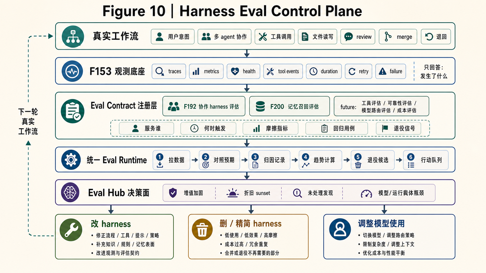

<details>
<summary>低保真草图对照</summary>

低保真草图 v0：画最终收敛架构，不画当前"每条线各自一个定时任务"的临时形态。
当前 F192/F200 作为两条已接入的评估管线放在图里，但图的主体是未来统一控制面。

```text
┌────────────────────────────── 真实工作流 ──────────────────────────────┐
│  用户意图 / 多 agent 协作 / 工具调用 / 文件读写 / review / merge / 退回 │
└───────────────────────────────────┬────────────────────────────────────┘
                                    │ 产生运行时观测数据
                                    ▼
┌────────────────────────────── F153 观测底座 ───────────────────────────┐
│ traces / metrics / health / tool events / duration / retry / failure   │
│ 只回答：发生了什么。不负责判断好坏。                                  │
└───────────────────────────────────┬────────────────────────────────────┘
                                    │
                    ┌───────────────┴───────────────┐
                    ▼                               ▼
┌────────────────────────── Eval Contract 注册层 ────────────────────────┐
│ 每块 harness 注册预期声明：服务谁 / 何时触发 / 摩擦指标 / 回归用例 / 退役信号 │
│ 已接入：F192 协作 harness 评估      F200 记忆召回评估                   │
│ 未来接入：工具评估 / 可靠性评估 / 模型路由评估 / 成本评估               │
└───────────────────────────────────┬────────────────────────────────────┘
                                    │ 预期 vs 实际
                                    ▼
┌──────────────────────────── 统一 Eval Runtime ─────────────────────────┐
│ ① 拉取观测数据        ② 对照预期声明        ③ 产出归因记录             │
│ ④ 计算趋势            ⑤ 生成退役候选        ⑥ 形成行动队列             │
└───────────────────────────────────┬────────────────────────────────────┘
                                    │
                                    ▼
┌────────────────────────────── Eval Hub ────────────────────────────────┐
│ 给人看的不是“分数”，而是决策面：                                        │
│ - 哪些 harness 正在增值，值得加固                                       │
│ - 哪些 harness 正在折旧，应该 sunset                                    │
│ - 哪些发现长期没人处理，评估管线自己要被精简                             │
│ - 哪些模型 / 运行载体在特定任务类型上成为瓶颈                           │
└───────────────────────────────────┬────────────────────────────────────┘
                                    │
        ┌───────────────────────────┼───────────────────────────┐
        ▼                           ▼                           ▼
  改 harness                  删 / 精简 harness              调整模型使用
  工具 / 技能包 / 规则         Build to Delete 退役           模型路由 /
  / 连接器 / 门禁              注意力预算回收                 运行载体选择 / 升级验收
        └───────────────────────────┴───────────────────────────┘
                                    │
                                    ▼
                              下一轮真实工作流
```

</details>

这张图要传达三个判断：

1. **F153 是传感器，不是裁判。** 它给所有评估管线供数据。
2. **F192/F200 是当前已经跑起来的两条专项 eval。** 它们证明了模式可行，但不该
   永远各自维护一套定时后台任务。
3. **终态是统一 Eval Hub（评估中枢）。** 它的目标不是展示更多指标，而是把 eval 结果变成
   改进、删除、模型路由和人类裁决的行动队列。

这里也补上了 eval 到模型的闭环。多数时候我们不能直接训练闭源模型，所以
"改模型"不能写成修改权重。更现实的闭环是：eval 告诉我们某个模型或运行载体
在某类任务上持续成为瓶颈，于是下一轮切换模型、调整任务分配、改变路由策略，
或者把这类任务作为模型升级验收用例。模型能力是上游变量，但 harness eval
能决定我们如何使用这个变量。

### 诚实的成熟度标注

当前状态应该这样说：

- **F153 观测底座已经可用**，但它是描述层，不做质量判断。
- **F192 已经跑通 harness eval 的端到端试点**：预期声明、运行时数据、归因、
  观测缺口补齐、健康快照、定时摘要都已建立；但趋势窗口还短，统一运行时
  尚未形成。
- **F200 已经建立记忆召回 eval 的行为信号链路**：RecallEvent、TaskTrajectory、
  consumed / reformulation / grep fallback 等指标族已经有数据；但强结果信号
  自动桥接仍在补齐，消费归因也经历了修正，不能把它当稳定排序裁判。
- **统一 Eval Hub（评估中枢）仍是目标架构**。现在每条 eval 线各自维护定时任务，是启动期脚手架，
  不是终态。终态是所有 harness 子系统都注册预期声明，统一 eval 运行时消费
  观测数据，输出行动队列。

准确定位：**我们已经有了 eval 的骨架和两条真实管线，但还没把它们收敛成统一
控制面。** 这一章写的是我们已经跑出来的经验，也写清楚未来架构要去哪里。

---

## 第 6 章：可靠性——多 agent 是分布式系统

当三只不同厂商的 agent 同时在一个代码库里工作——一只做重构、一只跑测试、
一只写文档——你已经在运行一个分布式系统，不管你是否意识到。

能力画像驱动的团队，比固定岗位流水线更依赖状态连续性：谁做过什么、谁正在接手、
哪个判断已经被验证，都不能因为一个会话断开而丢失。可靠性层保证画像、任务和交接
不会随 agent 波动一起消失。

多个独立的执行上下文，共享的可变状态（代码库、配置、文档、记忆库），异步
的通信通道（消息传递、@ 路由、工具调用），任何一个节点随时可能失败——这
已经落入分布式系统的问题域。

行业大多数 multi-agent 讨论把可靠性挑战压在 prompt 和 orchestration 层面
处理：用更好的提示词让 agent 不出错，用更精细的编排让 agent 不冲突。但
分布式系统的核心教训是：**你不可能消除故障，你只能设计对故障的容忍。**
网络不可靠、节点会失败、时钟不同步——不是 bug，是前提。

### 三类可靠性挑战

把多 agent 系统的可靠性问题摊开看，有三类。

这三类不是从教科书里先验推出来的，而是按时间顺序撞上来的。先是长任务里
stream 断了，任务状态不能跟着通道一起消失；接着是多 agent 交接时，前一只
agent 做到一半、后一只看到半截状态，系统需要一个一致的存活判断；最后是
Claude、GPT、Gemini、Antigravity 等 provider 的超时、错误和恢复语义各不相同，
同一套可靠性规则不能绑死在某一家实现上。每撞上一类故障，运行时就多长出
一层控制面。

**第一类：单 agent 长任务的持久性。**

当任务持续几分钟到几十分钟——跑完整测试套件、执行多步部署、做跨文件重构
——agent 和外界的通信通道几乎必然会中断。大多数 agent 框架假设通信通道
活着 = 任务活着。短任务里这成立，但长任务里通道中断不是"是否发生"的问题，
是"多久一次"的问题。

我们在真实生产中遇到过三种故障模式：副作用已执行但通道断了（文件已写，
不能盲目重试）；本地执行器报告成功但远程报告失败（异步状态机 race condition）；
provider 返回空响应（需要理解错误语义，不是简单重试）。三种故障指向同一结论：
**通信通道应该被降级为观察窗口，任务状态需要独立的持久化。**

解法来自分布式系统的经典工具箱：

| 组件 | 解决什么 | 借鉴的分布式系统原则 |
|------|---------|----------------------|
| **持久化监管者** | 任务状态与通道解耦，不过期 | 借鉴 Saga 协调器：把长事务拆成可补偿步骤 |
| **副作用日志** | 每个外部操作被记录，恢复时知道"哪些已做" | 类似数据库预写日志（Write-Ahead Log）的副作用记录 |
| **安全恢复** | 幂等（重复执行结果不变）+ 去重，按风险分四级 | 默认拒绝未知情况，逼近"恰好执行一次" |
| **结构化恢复卡** | 中断时给用户结构化状态，不是自由文本错误 | 补偿/恢复计划视图 |

不是发明了新东西——是把已有的分布式系统智慧搬到了 agent 工程里。

恢复分级值得展开。不是所有操作都能安全重试：

| 等级 | 操作类型 | 恢复策略 |
|------|---------|---------|
| **Tier 1** | 读取 / 构建 / 测试 / lint | 始终自动恢复 |
| **Tier 2** | 自有沙箱 / worktree / 可确定性探测 | 探测成功后自动恢复 |
| **Tier 3** | 共享文件 / 外部服务 / GitHub 写操作 | 不自动恢复，出恢复卡 |
| **Tier 4** | force-push / merge / release / 高风险不可逆操作 | 永远不自动恢复，dispatch 前硬拒 |

分级原则是 fail-closed，也就是**默认拒绝**：遇到未知操作类型默认归入最高限制，不是最低。
Tier 4 的操作即使任务完全正常也需要人类确认——中断后自动恢复这类操作
等于灾难。

**第二类：跨 agent 协作的一致性。**

回到 Ch.2 的 TeamAct 主循环——State → Owner → Action → Evidence → Verdict
→ Route。Route 阶段一只 agent 把任务交接给另一只，这个切换瞬间是**最脆弱的
窗口**。前一只做完 Action 但没来得及更新 Evidence 就崩了，后一只接球看到
不完整状态；后一只正在启动但 liveness 误判它"已失联"，触发错误重分配。

这是分布式系统里的经典问题：**在没有全局事务的系统里，怎么保证状态转移的
原子性？** 数据库领域有成熟方案（两阶段提交、Raft 共识），但 agent 协作
的特殊性在于：参与者是不同厂商的 LLM，你控制不了它们的内部行为，只能通过
shared state 的协议来约束。

我们遇到过真实的存活状态脑裂（liveness split-brain）：两个后端读路径对同一 invocation
给出矛盾结果，根因是三家数据源语义不同却被各自当真相源。解法是单一规范
读模型——不是把三路信号简单投票，而是给它们分工：持久记录是生命周期真相源，
草稿缓存是内容新鲜度信号，进程内 tracker 是控制面状态。一个 helper 统一读
这些信号，用结构化结果告诉上层"活着 / 退化 / 僵尸 / 等待宽限"，而不是让
不同接口各自猜。

更一般地说：多 agent 的共享状态（代码库、任务列表、讨论记录、记忆库）
就是分布式系统的 shared mutable state。Ch.2 的 TeamAct 协议本质上是一个
轻量协作状态机——通过 Evidence 和 Verdict 的显式记录让多 agent 对当前
状态有一致理解。它不提供 Raft 级别的强一致保证，但在 agent 协作的容错
需求下够用。当状态机被打断，就需要恢复机制来重建一致性。

**第三类：跨 provider 的语义一致性。**

当团队里有 Claude agent、GPT agent 和 Gemini agent 时，每个 provider 的
超时策略、错误码语义、通道协议、恢复机制都不一样。一只 Claude agent 崩了，
接手的 GPT agent 能不能从同一个副作用日志恢复？日志本身是 provider 无关的
——但"超时了怎么办""崩了怎么恢复""怎么判断是否存活"这些运维语义在不同
provider 上不一致。

这就是为什么需要统一宿主抽象：不同 provider 共享同一套控制面（传输 × 绑定
× 运行时契约 × 事件适配器），监管者作为独立伴生进程（sidecar）运行，不和任何具体
provider 耦合。不是让所有 provider 变一样——是让运维决策有统一的实现。

### 不可控与可控

三类挑战有一个贯穿始终的区分：

**不可控的**：provider 上游的稳定性、网络质量、上游的超时策略。这些是环境
约束。行业里很多可靠性讨论都在抱怨 provider 不稳定——"Claude 又 500 了"
"GPT 的 stream 又断了"。抱怨是对的，但**抱怨不是架构**。

**可控的**：你这层的 liveness 判断、状态持久化、副作用追踪、恢复策略、协作
协议。这些全在你的代码里。

**架构是假设不可控的一定会出问题，然后设计可控层的容错能力。** 分布式系统
几十年的实践就是在做这件事。multi-agent 面对的是同一类问题——节点从服务器
变成了 LLM agent，通道从 TCP 变成了 stream/SSE，共享状态从数据库表变成了
代码库和知识库。工具不同，原则一样。

**〔 Figure 11 —— 多 agent 可靠性控制面 〕**

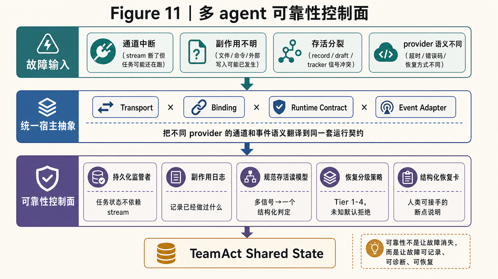

<details>
<summary>低保真草图对照</summary>

```text
故障输入
  ├─ 通道中断：stream 断了，但任务可能还在跑
  ├─ 副作用不明：文件、命令、外部写入可能已经发生
  ├─ 存活分裂：record / draft / tracker 给出不同信号
  └─ provider 语义不同：超时、错误码、恢复方式各不相同

                        ▼

统一宿主抽象
Transport × Binding × Runtime Contract × Event Adapter
  作用：把不同 provider 的通道和事件语义翻译到同一套运行契约

                        ▼

可靠性控制面
  ┌──────────────────────┬────────────────────────────┐
  │ 持久化监管者          │ 任务状态不依赖 stream        │
  │ 副作用日志            │ 记录已经做过什么             │
  │ 规范存活读模型        │ 三类信号 → 一个结构化判定     │
  │ 恢复分级策略          │ Tier 1-4，未知默认拒绝         │
  │ 结构化恢复卡          │ 人类可接手的断点说明         │
  └──────────────────────┴────────────────────────────┘

                        ▼

TeamAct Shared State
证据、任务归属、下一步路由、人工确认点
```

</details>

这张图里的关键不是"多一层框架"，而是把三类失败都收进同一个控制面：
通道中断不再等于任务失败，状态分裂不再由各接口各猜，provider 差异不再直接
暴露给上层协作协议。

### 解锁任务深度

这些可靠性基础设施反过来影响 agent 的表现。当 agent 知道副作用被追踪、
恢复是安全的、中断不等于失败，它可以执行更深的任务——不需要人为把任务拆碎
来规避超时风险。

又一个第 1 章公式的例证：Agent 效能 = 模型能力 × 适配度。可靠性基础设施
不改变模型能力（agent 不会因此写出更好的代码），但它改变了 agent 能**持续
发挥能力的时间窗口**——从一个 30 秒的通道窗口，扩展到可持久记录、可诊断、可恢复的长任务窗口。

### 诚实的成熟度标注

单 agent 长任务可靠性方面，F201 已 close，并通过真实 Antigravity alpha smoke：
只读命令、5 秒长命令、临时文件写读删都能在 alpha 路径跑通。诚实边界是：
这说明最深的一条 provider 路径已经被压过，不等于所有 provider 都拥有同等
恢复能力。

跨 agent 协作的 liveness 规范读模型已落地并在生产运行。

跨 provider 的统一宿主抽象有架构决策，但从"有决策"到"所有 provider 都按同一
可靠性控制面接入"还有距离。

---

## 第 7 章：伙伴系统的数学——上限提高，下限托底

前六章讲的是系统怎么搭起来：谁在协作、状态如何共享、模型怎样接入现实、知识
如何流动、harness 怎样自我评估、长任务怎样恢复。最后一章要回答的不是
"多 agent 什么时候比单 agent 强"这么简单的问题，而是一个更贴近真实使用的
问题：

这也是能力画像路线和 role-play 路线的最终分野：固定角色追求流程清晰，画像团队追求
上限互补、下限兜底和波动吸收。

> 当单个模型波动、降级、犯错、失忆时，为什么重度用户不一定能明显感觉到？

这才是 Cat Café 这 100 多天里真正跑出来的惊喜。涌现不是"几只 agent 放在
一起就突然聪明"。更具体地说，涌现发生在输出分布被系统改写之后：

- **右尾变长**：不同 agent 提供不同路径，最好的候选解更容易出现
- **左尾被截断**：错误要连续穿过 review、测试、证据、恢复、CVO 拉闸才会抵达用户
- **方差被吸收**：某个 provider 或某只 agent 的波动变成系统内部的返工成本，而不是用户可见的质量崩塌

### 上限：团队不是平均值，而是候选路径的最大值

单 agent 做复杂任务，本质上是在一条路径上推进。多 agent 不是把三份答案平均，
而是让多个不同认知路径同时出现，然后用 review、证据和愿景判断筛选。

可以用一个粗糙但有用的公式建立直觉：

```text
上限收益 ≈ max(不同 agent 提出的候选路径)
```

这个 `max` 成立的前提不是 agent 数量多，而是**路径足够不同**。同一家族、同一
训练分布、同一种工具习惯，常常会漏同一类错误；跨厂商、跨角色、跨工作习惯，
才会降低盲点相关性。

这解释了为什么"谁更强"不是最好的问题。一个 agent 如果被放在错误角色里，可能
显得不如另一个；但如果它提供的是另一种结构感、另一种审查角度、另一类问题
分解方式，它就不是替代品，而是扩展了团队的搜索空间。一个团队真正要问的是：

> 这只 agent 有没有带来其他 agent 不会自然带来的视角？

有，就提高上限。

这篇文章本身就是例子。Ch.3 一开始陷在"不是 prompt engineering"这个过时对手里；
CVO 指出真正的问题是"模型如何走出现实闭环"；一只 agent 重写主线，另一只
agent 守结构和事实，第三只 agent 把黑话翻成人话。最终产物不是三份文字的平均值，
而是多条路径互相修正后的结果。

Cat Café 的实际协作也不是"四只 agent 围坐一张桌子"。日常状态是十几个 thread
并行：写代码、剪视频、做 PPT、金融分析、健康报告、博士实验设计，各自有不同
的小团队。每个 thread 里协作的 agent 通常不超过 5 个——这和安波教授在闭门研讨
中提到的 3–5 agent 异构协作 sweet spot 一致。规模再大，很多场景就会从"互补"
退化成"并行投票"，协调税迅速上升。

### 下限：错误要连续穿过多层门，才会抵达用户

单 agent 的坏状态会直接暴露给用户。今天模型降级，用户今天就感觉"怎么突然变笨了"。

团队系统里，一个错误要变成用户可见错误，需要连续穿过多层门：

```text
用户可见错误
≈ author 犯错
× reviewer 没抓住
× 测试 / trace 没暴露
× shared state 没留下证据
× eval 没归因
× CVO 没拉闸
```

这不是严格独立事件，所以不能把它当精确概率公式。但它表达了一个工程事实：
只要这些门的盲点不完全相关，最终错误率就不会等于单个 agent 的错误率。

旧版 Ch.7 里的 reviewer 数学可以放在这里作为下限保护的一个局部模型：

```text
P(最终正确) = author 正确且 reviewer 不误伤
           + author 错误但 reviewer 抓住并修正
```

只要 reviewer 的抓错率大于误伤率，review 链路就在提高下限。跨厂商 review 的
意义不是"多一个模型看一遍"，而是让 reviewer 的盲点和 author 的盲点尽量不相关。

更精细一点，review 的收益取决于**错误相关性**。如果 author 和 reviewer 总在同一类
问题上犯错，那么第二轮 review 只是重复第一轮判断；如果两者盲点不同，错误才更可能
被拦住。可以把它写成一个简化模型：

```text
用户可见错误 ≈ author 错误率 × reviewer 漏检率 × 盲点相关性
```

这里的"盲点相关性"不是实验测出来的常数，而是一个工程提醒：跨厂商、跨角色、
跨工作习惯的价值，在于把这个系数压低。同质化团队的问题不是 agent 少，而是相关性高。

这也是为什么某个 agent 的阶段性退化，用户不一定有明显体感。退化没有消失，
它只是先被 review、记忆、测试、任务状态、恢复卡和 CVO 拉闸吸收了。用户看到的是
修正后的产物，而不是第一稿。

### 波动吸收：模型质量变成内部成本，而不是用户可见崩塌

没有 harness 的世界里，模型质量波动会直接传导到用户体验：上游变慢、变笨、
变不稳定，用户马上觉得系统变差。

有 harness 的世界里，波动会先变成内部成本：

- 模型忘了上下文，记忆联邦把事实找回来
- agent 写偏了，review 退回
- 任务中断了，可靠性控制面留下恢复点
- 某个工具或规则不再有效，eval 触发 sunset review
- 某个 provider 当前不适合这个任务，调度换路径

所以用户感知的质量不再等于某个模型的即时状态，而更像：

```text
用户感知质量 = 模型能力 × harness 契合度 × 纠错链路 × 恢复能力
```

这就是第 1 章公式在收束章里的升级。第 1 章说：

```text
Agent Quality = Capability × Environment Fit
```

第 7 章补上它的反面含义：

> 好的 Environment Fit 不只在模型变强时放大收益，也在模型波动时降低传导。

换句话说，harness 不只是加速器，还是缓冲层。

**〔 Figure 12 —— 伙伴系统如何改写输出分布 〕**

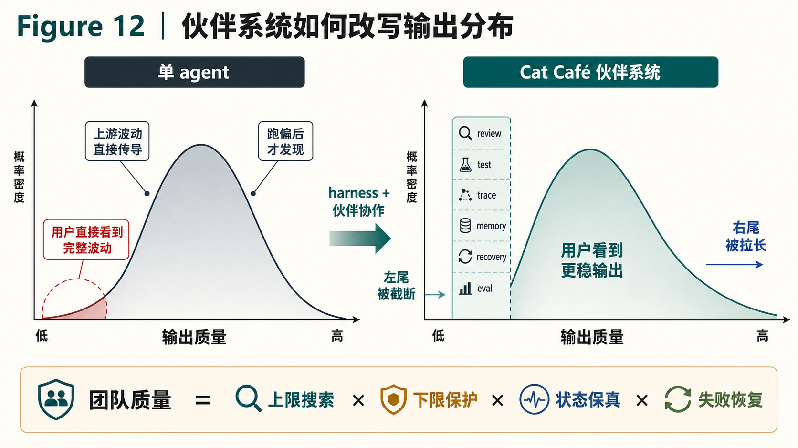

<details>
<summary>低保真草图对照</summary>

```text
单 agent 输出分布

低质量 ──────── 中位质量 ──────── 高质量
   │                │                │
   └──── 用户直接看到完整波动 ──────┘


Cat Café 伙伴系统输出分布

低质量 ──────── 中位质量 ──────── 高质量
   │                │                │
   │        review / test / trace    │
   │        memory / recovery / eval │
   ▼                │                ▼
左尾被截断      用户看到更稳输出      右尾被拉长
```

</details>

这张图解释的是：团队不是让每一次输出都神奇变好，而是改变了输出分布的形状。
坏结果更难漏出去，好路径更容易被发现。

### Token 账本：单 agent 真的更省吗？

一个常见挑战是：三只 agent 协作，token 消耗是三倍；我只用一只最强 agent，
是不是更便宜？

这个挑战的陷阱在于，它只算了**显性 token**，没有算复杂任务的完整成本。

真正的成本不是：

```text
成本 = 本轮 token
```

而是：

```text
总成本 = token
       + 返工成本
       + 人类心智负载
       + 跑偏后发现太晚的尾部成本
       + 错误进入真实环境后的修复成本
```

单 agent 常常在前半段显得便宜：少一轮 review，少一次讨论，少一个候选路径。
但如果它在第 80% 的地方才跑偏，人类才发现方向错了，返工成本可能远高于前面
省下的 token。

多 agent 协作的价值不在于每一步都更便宜，而在于把方向错误、事实错误、架构错误
更早暴露出来。早暴露的错误便宜，晚暴露的错误昂贵。

所以判断标准不是"三只 agent 是否比一只 agent token 少"，而是：

> 多出来的协作 token，是否买到了更早的纠偏、更少的人类路由、更低的返工尾部风险？

对简单任务，答案经常是否定的。一只 agent 直接做更好。对长文、架构、跨域分析、
代码修改、review、愿景方向这类任务，答案经常是肯定的。因为这些任务最大的成本
不是 token，而是**跑歪以后才发现**。

**〔 Figure 13 —— 协作成本不是 token 总和 〕**

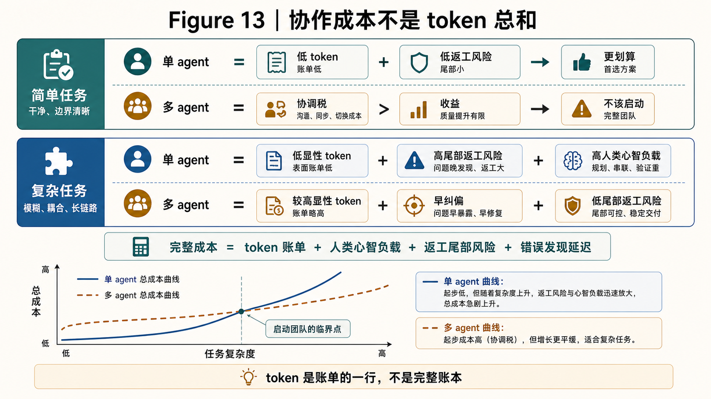

<details>
<summary>低保真草图对照</summary>

```text
简单任务
  单 agent：低 token + 低返工风险 → 更划算
  多 agent：协调税大于收益 → 不该启动完整团队

复杂任务
  单 agent：低显性 token + 高尾部返工风险 + 高人类心智负载
  多 agent：较高显性 token + 早纠偏 + 低尾部返工风险

结论：
  token 是账单的一行，不是完整账本。
```

</details>

这也解释了为什么人类当路由器不一定更省。人类把 agent A 的意思转述给 agent B，
看起来省了 agent-to-agent 讨论，但实际引入了低带宽、有损压缩和额外心智负担。
在有 shared state 和任务协议的前提下，agent 直接读证据、读 diff、读 feature doc，
往往比人类口头转述更快、更准。

可以用一个很简单的保真率模型说明。假设每次人工转述保留 95% 信息，连续转述
10 次之后，剩下的是：

```text
0.95¹⁰ ≈ 60%
```

如果 agent 直接读同一份 shared state，每次读取保留 99% 信息，10 次之后是：

```text
0.99¹⁰ ≈ 90%
```

数字不是实测，只是帮助建立直觉：**长链路协作里，保真率是连乘项。** 人类作为
方向锚点很重要，但人类作为消息转发器，会把高精度工程状态压缩成低精度口头摘要。

人类最有价值的位置不是消息总线，而是方向锚点。日常路由交给系统，方向裁决回到人。

当然，多 agent 不是默认正确。四种结构会亏：

1. **盲传**：后一棒不是纠错，而是在没有新信息的情况下重做
2. **伪拆分**：任务拆了，但每个子任务没有变简单，只多了协调税
3. **同质化**：所有 agent 盲点高度相关，review 只是重复同一类判断
4. **协调税超过收益**：正确率只提高一点，但 token、等待和人类心智负载翻倍

所以协作要被 eval，而不是被信仰。赚就保留，不赚就收缩。

### 双层语言：内部高密度，外部讲人话

用户可能会观察到另一个现象：agent 之间协作时会用很多内部缩写、Feature 编号、
review 严重度、commit、AC、trace。对人类读者来说，这像黑话；对 agent 系统来说，
它是高密度协议。

这不是问题本身，问题在于有没有翻译层。

一个成熟系统应该有两种语言：

- **agent-to-agent 语言**：高密度、精确、可追溯，适合协作
- **agent-to-human 语言**：少黑话、讲因果、给判断，适合决策

如果强迫 agent 之间全程讲人话，协作会变慢、信息会变粗；如果把内部语言原样丢给
人类，用户会看不懂。Cat Café 的做法是允许内部高密度协作，但在交付、人类决策、
正式文章里强制翻译。

这就是为什么 "CVO 不做日常路由" 和 "CVO 保持方向裁决权" 可以同时成立。人类不需要
理解每个内部缩写，但必须能理解系统最后为什么这么判断。

### 最小必要复杂度

六层架构、多套协议、跨厂商协作——这不是极简。我们追求的从来不是"少"，而是
"不多余"。

每一层都在解决一个去掉就会出故障的问题。TeamAct 解决任务交接；harness 解决模型
如何接入现实；记忆联邦解决事实和经验如何复用；eval 解决哪些机制该改、该删、该
加固；可靠性控制面解决长任务中断和跨 provider 语义差异。

但最小必要复杂度不是静态的。模型会变强，某些脚手架会过时；团队会扩张，某些协议
会变得必要；任务会跨域，某些记忆域会被接入。复杂度必须被 eval 持续审查，而不是
一旦建成就永久保留。

这也是全文的最终答案：

```text
团队质量 = 上限搜索 × 下限保护 × 状态保真 × 失败恢复
总成本 = token + 返工 + 人类心智负载 + 尾部风险
```

当协作增加的是候选路径、纠错能力、状态保真和恢复能力，它就是资产；当协作只增加
传话、等待和重复劳动，它就是协调税。

### 送出去一句

> **脑子会波动，伙伴会校准；脑子会进化，闭环不会过时。**

模型会升级，也会波动。真正值得建设的不是让某个 agent 永远不犯错，而是让错误被
看见、被接住、被修正、被沉淀。

102 天、200+ Feature、多家模型、多条并行 thread——我们走出来的不是"多叫几个模型"
的经验，而是一个更朴素的工程结论：**好的 agent 系统不是把单点能力推到极限，而是
把单点波动组织进一个会自我校准的伙伴系统。**

---

*英文 v0 起草：[布偶猫/Opus-46🐾]*
*结构守护 + 中文化：[宪宪/Opus-47🐾]*
*Figures 1-13 生成式配图：[砚砚/GPT-5.5🐾]；低保真草图保留为对照*
