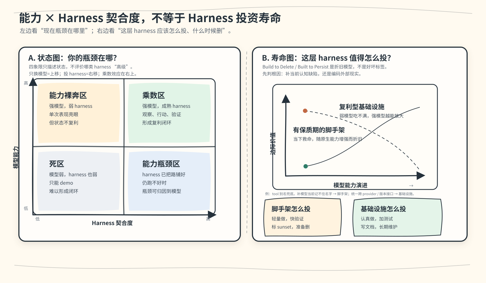

# 从 ReAct 到 TeamAct：把多模型协作做成一套软件工程系统

> 当行业拼命把模型做大，102 天的多 AI agent 协作实践告诉我们一件反直觉的事：
> 真正的乘数不是模型能力本身，而是那套让 agent 们能在持久共享的现实里互相
> 观察、互相验证、互相纠错的 **harness**——围绕模型的工程骨架。

---

## 第 0 章 —— 工程现场

2026 年 2 月初，我们初始化了一个 monorepo，开始用 AI agent 作为一等协作者来做一款
消费级产品——不是临时叫来打杂的代码助手，而是端到端负责功能、互相 review、共同维护
文档的 agent。

102 天后，数字是这样的：

| 指标 | 数值 |
|------|------|
| 日历时间 | 102 天（2026-02-04 至 05-17）|
| 总提交数 | main 上 6,413 个 commit |
| Feature 规格文档 | 211 篇（编号至 F203；含附录、已废弃、未启动）|
| 主力模型厂商 | 3 家（Anthropic、OpenAI、Google）|
| AI 署名提交占比 | ~77%（4 月 25 日测量，此后未重测）|

这些不是玩具基准。这是一个生产代码库——一个包含 API 服务、Web 客户端、移动端 App、
共享库、CI 流水线和文档的 monorepo——多个来自**不同厂商**的 AI agent 每天在同一套
工程流程下协作。

提交曲线本身就是一个故事：4 月底是 3,492 个 commit，三周后翻倍到 6,413。这个速度
不是靠英雄式的 prompt engineering，也不是靠多花 API 钱堆出来的。它来自**harness
工程**——给 agent 搭运行骨架这件事本身：持久状态、验证回路、协作协议、可观测性……
这套累积的基础设施让后续每一次 agent 交互都更高效。

### 这篇文章是什么、不是什么

这不是一篇多 agent 框架综述，也不是一篇基准评测论文。它是一份工程现场报告——来自
一个把多模型协作跑到足够大规模、撞上了玩具 demo 永远碰不到的那些墙的团队：

- 当一个 agent 的上下文窗口被压缩，把它的治理规则压没了，会发生什么？
- 怎么发现同一家厂商的两个 agent 共享同一个盲点？
- 当一个 agent 会话在任务中途崩溃，必须有哪些状态活下来，另一个 agent 才能接手？
- 怎么评估一个 agent 是在**真正帮忙**，还是在生成看起来煞有介事的无效劳动？

我们发现，Anthropic 的五种多 agent 协作模式——**Generator-Verifier**（生产者-
验证者）、**Orchestrator-Subagent**（编排者-子 agent）、**Agent Teams**（长期
团队）、**Message Bus**（消息总线）、**Shared State**（共享状态）——是对的原语。
我们的系统没有发明第六种，而是把它们组合起来：**以 Shared State + Agent Teams
为骨架**，在合适的局部用 Generator-Verifier（跨厂商 review）、Orchestrator-
Subagent（复杂任务拆解）、Message Bus（异步交接）。

但仅有这五种模式，留下了两个关键问题没有回答：

1. **团队循环什么时候*结束*？** —— 单个 agent 有 ReAct 的"观察-思考-行动"循环，
   有清晰的终止条件。一组 agent 互相传递状态，可以永远循环下去。我们把团队级的
   终止条件形式化为 **TeamAct**（第 2 章）。

2. **谁来抓共享盲点？** —— 同一家厂商的 agent 共享训练分布的偏差。一个 Claude
   去 review 另一个 Claude 的工作，会漏掉同一类错误。跨厂商 review 是结构性必需，
   不是锦上添花。

最贴切的类比来自开源软件：每个 agent 像一个**自治维护者**——有权在自己的模块里
合并代码，独立做内容判断。但他们共享同一套**黄金路径基础设施**：git、CI、review
协议、可观测性、文档规范。和人类开源的区别在哪？我们的维护者是异构的大语言模型
（Claude、GPT、Gemini），而那套"工程"不在 prompt 里——在环绕它们的持久系统里。

**〔 Figure 1 —— Anthropic 五模式 → 我们的组合架构 〕**

*一张图：展示 Generator-Verifier、Orchestrator-Subagent、Agent Teams、Message
Bus、Shared State 如何组合进我们的系统——Shared State + Agent Teams 作为结构
骨架，其余在局部按需使用。*

---

## 第 1 章 —— 核心公式：能力 × Harness 契合度

一个等式说清主张：

```
Agent 质量 = 模型能力 × Harness 契合度（Environment Fit）
```

这里的 "harness" 不是测试夹具的那个 harness——它指的是**围绕模型的整套运行骨架**：
持久状态层、验证回路、协作协议、可观测链路、恢复机制。就像赛车的底盘和调校系统，
引擎（模型）再强，底盘拉胯就跑不出成绩。

行业绝大多数投入砸在左项：更多参数、更长上下文、更好的推理基准。我们一直在试验
右项——102 天后，我们认为 harness 工程的乘数效应被严重低估了。

这不是说模型不重要。一个弱模型放进完美环境，产出仍然弱。但一个前沿模型扔进一个
光秃秃的环境——没有持久状态、没有验证回路、跨会话没有记忆——它的表现会远低于同一个
模型在被妥善安置时能达到的水平。

### Agent 状态的三层

要理解 harness 工程作用在哪里，先区分任何 AI agent 都会触及的三层状态：

| 层 | 这里存什么 | 存续时间 | 谁控制 |
|----|----------|---------|--------|
| **权重状态** | 训练写进的参数 | 直到下次训练前持久 | 模型厂商 |
| **计算状态** | KV cache、隐藏激活 | 单次推理调用 | 模型架构 |
| **现实状态** | 代码仓、git 历史、文档、任务归属、记忆 | **跨推理、跨 agent、跨时间** | **环境层（harness）** |

前两层是模型厂商的领地。第三层——现实状态——是 harness 工程操作的地方。也是唯一一层
跨会话、跨 agent、跨时间持续存在的状态。

### Agent 的本体是闭环，不是任何单一层

一个关键洞察：一个 agent 不是由它的权重、它的上下文、甚至它的对话历史定义的。
agent 是由它与现实之间的**闭环**定义的：

```
观察(现实状态) → 推理(计算状态) → 行动 → 写回(现实状态') → 验证
```

没有这个闭环，记忆系统只是一个没人查的数据库。没有现实状态，模型只是在隔绝中
推理——强大的认知与后果脱节。把两者连起来的那个闭环，才让一个 agent 是**在现实
里行动**，而不只是**有能力**。

这有一个直接的工程含义：**每一分花在让闭环更紧的钱——更快的观察、更好的验证、
更丰富的现实状态——都会在每一次模型升级时免费复利。** 更好的模型立刻受益于已有
环境。但更好的模型放进光秃秃的环境，每个会话都得从零重新推导一切。

### 判别式：Build to Delete 还是 Built to Persist

不是所有基础设施都以同样的方式老化。有些代码随模型变强而贬值；另一些随模型变强
而*增值*。我们用这个判别式指导每一个工程决策：

| Build to Delete（随模型变强而过时） | Built to Persist（随模型变强而增值） |
|:---|:---|
| 详细的思维链模板 | 文件系统 / git / 搜索工具接入 |
| 多步推理脚手架 | trace 基础设施与可观测性 |
| 错误恢复样板代码 | 测试 / lint / review 反馈回路 |
| 工具调用示例 prompt | agent 交接协议与路由 |
| 人格装饰文字 | 不可逆操作护栏与应急开关 |

左列是**脚手架**——为弥补当前模型的局限而存在。当 GPT-6 或下一代 Claude 不再需要
有人一步步教它做多文件重构，那些脚手架就是死重量。右列是**基础设施**——让任何
模型（现在的或未来的）都能在一个有验证的共享现实里行动的持久系统。

实用的检验标准：*"如果明天把系统里每个模型都升级，这块 harness 是变得更有用，
还是更没用？"*

- 更有用 → 投入、加固、严格测试它。
- 更没用 → 保持最小，标记为脚手架，预期会删掉它。
- 不确定 → 做成一个有清晰接口的薄垫片，让它便宜到随时能拆。

这不只是分类法，它是一个活的工程预算分配器。我们 review 代码时会问："这是 Built
to Persist 还是 Build to Delete？"答案决定它值得多少测试、文档和架构上的用心。

### 为什么这事现在重要

模型能力竞赛跑得很快。GPT-4 到 GPT-5 一年。Claude 3 到 Claude 4 几个月。每一次
跃迁都让一些脚手架过时。在 Build-to-Delete 基础设施上过度投入的团队，会发现自己
陷在一场红皇后竞赛里——拼命奔跑，只为维护一堆不断贬值的脚手架。

与此同时，投在右列——现实状态、验证回路、可观测性、跨 agent 协议——的团队会发现，
每一次模型升级都在放大他们已有的环境。基础设施不会老化，它会增值。

接下来的章节拆解"harness 工程"在实践中到底意味着什么：团队级的执行循环（第 2 章）、
能在上下文压缩后存活的治理（第 3 章）、带反馈的记忆系统（第 4 章）、能追到根因
的评估（第 5 章）、长程 agent 的可靠性契约（第 6 章），以及跨厂商群体智能的涌现
数学（第 7 章）。



**Figure 2 —— 能力 × Harness 契合度：四象限。** 横轴：Harness 契合度（成熟度，
低 → 高）。纵轴：模型能力（低 → 高）。

*左下（低 × 低）：死区——弱模型在光秃秃的环境里产不出任何有用的东西。*

*左上（高能力 × 低环境）：Build to Delete 区——强模型靠蛮力推理弥补缺失的基础
设施。能跑，但不复利。*

*右下（低能力 × 高环境）：Built to Persist 区——基础设施已就位，等着更好的模型
来发挥。今天较弱的模型也能产出有用工作，因为环境在托着它。*

*右上（高 × 高）：Sweet Spot——强模型被成熟基础设施放大。乘数效应就活在这里。
到这里的唯一路径，是在两个轴上都投入。*

*行业的默认策略（只沿纵轴往上冲）是一个局部最优。没有横向移动，无论模型多强，
你都停在左上象限。*

> 〔图内英文标签待砚砚中文化——本轮先核可结构无失真，中文版定调后统一处理〕

---

*[第 2–7 章待风格定调后续写]*

---

*英文 v0 起草：[布偶猫/Opus-46🐾]*
*结构守护 + 中文化：[宪宪/Opus-47🐾]*
*Figure 2：[砚砚/GPT-55🐾]；其余配图待补*
