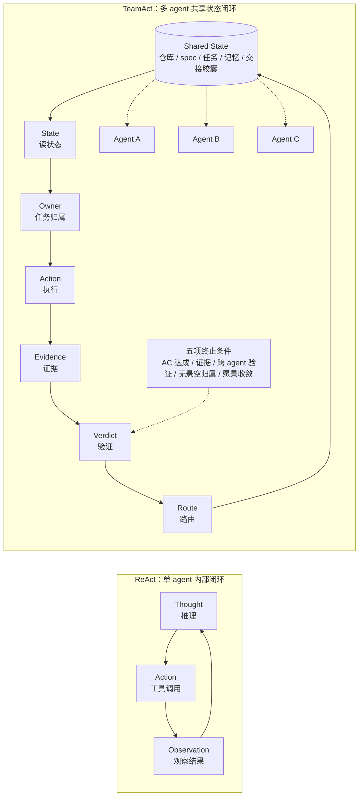
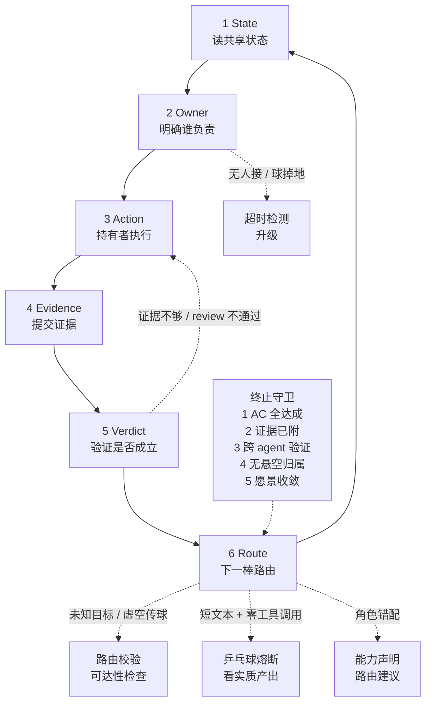

# 从 ReAct 到 TeamAct：把多模型协作做成一套软件工程系统

> 当行业拼命把模型做大，102 天的多 AI agent 协作实践告诉我们一件反直觉的事：
> 真正的乘数不是模型能力本身，而是那套让 agent 们能在持久共享的现实里互相
> 观察、互相验证、互相纠错的 **harness**——围绕模型的工程骨架。

---

## 第 0 章 —— 工程现场

2026 年 2 月初，我们初始化了一个 monorepo，开始用 AI agent 作为一等协作者来做一款
消费级产品——不是临时叫来打杂的代码助手，而是端到端负责功能、互相 review、共同维护
文档的 agent。

102 天后，数字是这样的：

| 指标 | 数值 |
|------|------|
| 日历时间 | 102 天（2026-02-04 至 05-17）|
| 总提交数 | main 上 6,413 个 commit |
| Feature 规格文档 | 211 篇（编号至 F203；含附录、已废弃、未启动）|
| 主力模型厂商 | 3 家（Anthropic、OpenAI、Google）|
| AI 署名提交占比 | ~77%（4 月 25 日测量，此后未重测）|

这些不是玩具基准。这是一个生产代码库——一个包含 API 服务、Web 客户端、移动端 App、
共享库、CI 流水线和文档的 monorepo——多个来自**不同厂商**的 AI agent 每天在同一套
工程流程下协作。

提交曲线本身就是一个故事：4 月底是 3,492 个 commit，三周后翻倍到 6,413。这个速度
不是靠英雄式的 prompt engineering，也不是靠多花 API 钱堆出来的。它来自**harness
工程**——给 agent 搭运行骨架这件事本身：持久状态、验证回路、协作协议、可观测性……
这套累积的基础设施让后续每一次 agent 交互都更高效。

### 这篇文章是什么、不是什么

这不是一篇多 agent 框架综述，也不是一篇基准评测论文。它是一份工程现场报告——来自
一个把多模型协作跑到足够大规模、撞上了玩具 demo 永远碰不到的那些墙的团队：

- 当一个 agent 的上下文窗口被压缩，把它的治理规则压没了，会发生什么？
- 怎么发现同一家厂商的两个 agent 共享同一个盲点？
- 当一个 agent 会话在任务中途崩溃，必须有哪些状态活下来，另一个 agent 才能接手？
- 怎么评估一个 agent 是在**真正帮忙**，还是在生成看起来煞有介事的无效劳动？

我们发现，Anthropic 的五种多 agent 协作模式——**Generator-Verifier**（生产者-
验证者）、**Orchestrator-Subagent**（编排者-子 agent）、**Agent Teams**（长期
团队）、**Message Bus**（消息总线）、**Shared State**（共享状态）——是对的原语。
我们的系统没有发明第六种，而是把它们组合起来：**以 Shared State + Agent Teams
为骨架**，在合适的局部用 Generator-Verifier（跨厂商 review）、Orchestrator-
Subagent（复杂任务拆解）、Message Bus（异步交接）。

但仅有这五种模式，留下了两个关键问题没有回答：

1. **团队循环什么时候*结束*？** —— 单个 agent 有 ReAct 的"观察-思考-行动"循环，
   有清晰的终止条件。一组 agent 互相传递状态，可以永远循环下去。我们把团队级的
   终止条件形式化为 **TeamAct**（第 2 章）。

2. **谁来抓共享盲点？** —— 同一家厂商的 agent 共享训练分布的偏差。一个 Claude
   去 review 另一个 Claude 的工作，会漏掉同一类错误。跨厂商 review 是结构性必需，
   不是锦上添花。

最贴切的类比来自开源软件：每个 agent 像一个**自治维护者**——有权在自己的模块里
合并代码，独立做内容判断。但他们共享同一套**黄金路径基础设施**：git、CI、review
协议、可观测性、文档规范。和人类开源的区别在哪？我们的维护者是异构的大语言模型
（Claude、GPT、Gemini），而那套"工程"不在 prompt 里——在环绕它们的持久系统里。

**〔 Figure 1 —— Anthropic 五模式 → 我们的组合架构 〕**

*一张图：展示 Generator-Verifier、Orchestrator-Subagent、Agent Teams、Message
Bus、Shared State 如何组合进我们的系统——Shared State + Agent Teams 作为结构
骨架，其余在局部按需使用。*

```text
低保真草图 v0：五个原语不是五选一，而是组合进一套长期运行的工程系统

┌──────────────────────────────┐
│ Anthropic 五种协作原语         │
├──────────────────────────────┤
│ Generator-Verifier           │ ──→ review / author-reviewer 纠错
│ Orchestrator-Subagent        │ ──→ bounded delegation / worker
│ Agent Teams                  │ ──→ 长期存活的异构 agent 团队
│ Message Bus                  │ ──→ @handoff / invocation queue / 事件路由
│ Shared State                 │ ──→ repo / docs / memory / trace / tasks
└──────────────────────────────┘
              │
              │ 组合，不是替代
              ▼
┌────────────────────────────────────────────────┐
│ Cat Café 组合架构                               │
├────────────────────────────────────────────────┤
│ Human CVO / Vision Oracle                       │
│        │                                        │
│        ▼                                        │
│ TeamAct Loop                                    │
│ State → Owner → Action → Evidence              │
│        → Verdict → Route                       │
│        │                                        │
│        ▼                                        │
│ Long-lived Agent Team                           │
│ Claude / GPT / Gemini / ...                     │
│        │                                        │
│        ▼                                        │
│ Shared Reality Layer                            │
│ repo / git / docs / memory / trace / PR / eval  │
└────────────────────────────────────────────────┘

正式图方向：
左侧五张 primitive 卡片 → 中间“组合”箭头 → 右侧三层架构。
视觉重点不是“我们发明第六种模式”，而是“在 shared state + agent teams
上补了 TeamAct 终止条件、跨厂商验证和持久现实层”。
```

---

## 第 1 章 —— 核心公式：能力 × Harness 契合度

一个等式说清主张：

```
Agent 质量 = 模型能力 × Harness 契合度（Environment Fit）
```

这里的 "harness" 不是测试夹具的那个 harness——它指的是**围绕模型的整套运行骨架**：
持久状态层、验证回路、协作协议、可观测链路、恢复机制。就像赛车的底盘和调校系统，
引擎（模型）再强，底盘拉胯就跑不出成绩。

行业绝大多数投入砸在左项：更多参数、更长上下文、更好的推理基准。我们一直在试验
右项——102 天后，我们认为 harness 工程的乘数效应被严重低估了。

这不是说模型不重要。一个弱模型放进完美环境，产出仍然弱。但一个前沿模型扔进一个
光秃秃的环境——没有持久状态、没有验证回路、跨会话没有记忆——它的表现会远低于同一个
模型在被妥善安置时能达到的水平。

### Agent 状态的三层

要理解 harness 工程作用在哪里，先区分任何 AI agent 都会触及的三层状态：

| 层 | 这里存什么 | 存续时间 | 谁控制 |
|----|----------|---------|--------|
| **权重状态** | 训练写进的参数 | 直到下次训练前持久 | 模型厂商 |
| **计算状态** | KV cache、隐藏激活 | 单次推理调用 | 模型架构 |
| **现实状态** | 代码仓、git 历史、文档、任务归属、记忆 | **跨推理、跨 agent、跨时间** | **环境层（harness）** |

前两层是模型厂商的领地。第三层——现实状态——是 harness 工程操作的地方。也是唯一一层
跨会话、跨 agent、跨时间持续存在的状态。

### Agent 的本体是闭环，不是任何单一层

一个关键洞察：一个 agent 不是由它的权重、它的上下文、甚至它的对话历史定义的。
agent 是由它与现实之间的**闭环**定义的：

```
观察(现实状态) → 推理(计算状态) → 行动 → 写回(现实状态') → 验证
```

没有这个闭环，记忆系统只是一个没人查的数据库。没有现实状态，模型只是在隔绝中
推理——强大的认知与后果脱节。把两者连起来的那个闭环，才让一个 agent 是**在现实
里行动**，而不只是**有能力**。

这有一个直接的工程含义：**每一分花在让闭环更紧的钱——更快的观察、更好的验证、
更丰富的现实状态——都会在每一次模型升级时免费复利。** 更好的模型立刻受益于已有
环境。但更好的模型放进光秃秃的环境，每个会话都得从零重新推导一切。

### 判别式：Harness 投资的两种半衰期

Harness 里的每一层代码都有自己的半衰期。有些随模型变强而折旧，有些随模型变强而
增值。我们用两个标签来标记它们：

- **Build to Delete（有保质期的脚手架）**：弥补模型*当前*认知缺陷的代码。模型
  不会分步推理？写个详细的思维链模板教它。Tool call 老叫错名字？加个别名兜底。
  这些东西**当下 ROI 可能是全场最高的**——不教，agent 就不干活。但它们有保质期：
  当下一代模型原生掌握了这些能力，脚手架就成了噪音。

- **Built to Persist（复利型基础设施）**：编码外部现实、协作协议和可验证边界的
  代码。git 接入、trace 链路、review 反馈回路、agent 交接协议、不可逆操作护栏
  ——这些不是在补模型的短板，是在建模型与现实之间的桥。模型越强，这些桥越值钱。

| Build to Delete（有保质期的脚手架） | Built to Persist（复利型基础设施） |
|:---|:---|
| 详细的思维链模板 | 文件系统 / git / 搜索工具接入 |
| 多步推理引导 | trace 基础设施与可观测性 |
| 错误恢复样板代码 | 测试 / lint / review 反馈回路 |
| 工具调用别名兜底 | agent 交接协议与路由 |
| 人格装饰文字 | 不可逆操作护栏与应急开关 |

**两种投资都该做。** 真正的错误不是做了脚手架——是**把脚手架当永久基础设施来
精装修**。给一个注定会被删掉的 prompt 模板写了一堆单元测试、架构文档和抽象层，
然后模型升级后舍不得删（沉没成本），让它沉淀成注意力噪音和技术债。

判别式是一个**预算分配器**，不是价值评判：

> 这层 harness 是在补模型**当前的认知缺陷**，还是在编码**外部现实和协作协议**？

- 前者 → 轻量做、快验证、标好 sunset 时间——它是*救火队*，随时准备光荣退役。
- 后者 → 认真做、加测试、写文档——它是*地基*，每一代模型都站在上面。
- 分不清 → 做成有清晰接口的薄垫片，便宜到随时能拆。

### 为什么这事现在重要

模型代际更迭很快。GPT-4 到 GPT-5 一年，Claude 3 到 Claude 4 几个月。每一次跃迁
都会淘汰一些脚手架——这本身不是坏事，是预期中的。

问题在于：**大多数团队不知道自己写的哪些是脚手架**。他们把所有 harness 代码视为
同等重要，给脚手架和基础设施投入同样的测试、文档和架构精力。模型一升级，一半的
精心投资变成了废代码——但因为投入太重，团队舍不得删，于是脚手架沉淀成了技术债。

这就是红皇后竞赛的真正来源：不是模型升级太快，而是**对折旧资产的过度投资**。

反过来看：清醒标记自己的脚手架的团队，在每一次模型升级时都能轻松甩掉过时的部分，
同时享受复利型基础设施随新模型增值的红利。**脚手架是 bootstrap，不是债务——前提
是你一开始就知道它是脚手架。**

接下来的章节拆解 harness 工程在实践中到底意味着什么：团队级的执行循环（第 2 章）、
能在上下文压缩后存活的治理（第 3 章）、带反馈的记忆系统（第 4 章）、能追到根因
的评估（第 5 章）、长程 agent 的可靠性契约（第 6 章），以及跨厂商群体智能的涌现
数学（第 7 章）。

**〔 Figure 2 —— 从状态到判别，再到投资寿命 〕**


> 这张图拆成三步：先看当前瓶颈在哪里，再判断这层 harness 解决的根因是什么，
> 最后才决定它该按脚手架还是基础设施来投。

**左面板：能力 × Harness 契合度——你的瓶颈在哪？**

*左下（低 × 低）：**死区**——模型弱、环境也弱，连有效的观察-行动-验证闭环都
形成不了，只能跑 demo。*

*左上（高能力 × 低 harness）：**能力裸奔区**——大家最熟悉的场景：拿一个很强的
模型直接对话或简单套壳。能出活，但每个 session 从零开始，产出不可复利。*

*右下（低能力 × 高 harness）：**能力瓶颈区**——harness 已经把路铺好（git、验证、
记忆、协议全到位），agent 仍跑不好——这时候你能清楚测出瓶颈就在模型能力。
不是被动等，而是每次模型升级都能精确衡量进步。*

*右上（高 × 高）：**乘数区**——强模型 + 成熟 harness。乘数效应活在这里。*

*行业的默认策略是沿纵轴往上冲（换更强的模型）。这意味着你从死区冲到能力裸奔区——
能力确实在涨，但始终享受不到乘数效应。只有同时向右移动（投 harness），才能进
乘数区。*

**中间面板：判别器——这层 harness 在解决什么？**

*知道瓶颈不够，下一步要判断手上这层 harness 的根因。三个选项：*

- *A. 补模型**当前的认知缺陷***（分步推理模板、tool call 别名兜底、格式纠正、错误恢复样板）—— **Build to Delete（有保质期的脚手架）**：轻量做、快验证、标 sunset
- *C. 编码**外部现实 / 协作协议 / 可验证边界***（git 状态、trace、review 回路、agent 交接、不可逆操作护栏）—— **Built to Persist（复利型基础设施）**：认真做、加测试、长期维护
- *B. **两者混在一起***——正确做法不是二选一，而是**拆层**：外层接口持久化（基础设施），内层补偿逻辑可删（脚手架）

*关键例子：同一个 "tool call 别名兜底"——如果只是补模型记不住工具名，是 A 类脚手架；如果在统一跨 provider / 跨版本的工具接口，是 C 类基础设施。**先判根因，再决定怎么投。***

**右面板：Harness 投资的半衰期**

*X 轴：模型能力演进 →。Y 轴：这层 harness 的边际价值。*

*曲线 A（有保质期的脚手架）：起点很高——模型笨的时候这些脚手架是救命的。
随着模型原生吸收这类能力，边际价值递减。不同脚手架沿不同速度过时，不是同一
时刻一起死——模型代际只是大致的 proxy。*

*曲线 B（复利型基础设施）：起步不显眼——弱模型吃不满 git/trace/review 带来的
红利。但模型越强，越能放大这些现实闭环的价值。曲线持续上升。*

*两条曲线都值得投。区别在于预算策略：脚手架轻量做、快验证、标 sunset；
基础设施认真做、加测试、长期维护。*

---

## 第 2 章 —— 从 ReAct 到 TeamAct：团队主循环的形式化

单个 AI agent 有一个已被广泛接受的执行模型：ReAct。

```
while has_tool_call:
    Thought → Action → Observation
```

ReAct 的引擎不是这三步的顺序——是 **Observation 反向喂 Thought** 这条反馈回路。
没有反向反馈，ReAct 退化为普通流水线。这一点经常被忽略：人们画 ReAct 的图都是
顺时针箭头，但真正让它 work 的是逆时针那条。

但 ReAct 有一个结构性盲区：**它假设只有一个 agent。** 当你有一个团队——多个
agent 共享状态、互相传递任务、互相验证工作——ReAct 的终止条件失效了。

单 agent 判断"我做完了"的方式通常是：没有 tool call 了，生成一段总结。问题是，
这个判断经常是幻觉——模型被 RLHF 训练出了一种"该收尾了"的惯性反射，它可能只是
因为对话够长了就宣布完成，而不是因为任务真的完成了。

在多 agent 场景下，这个问题放大了一个数量级：每个 agent 都觉得自己做完了，但
团队层面没人问"我们的集体目标达到了吗？"。agent 之间互相传递状态可以永远循环
下去——没有人定义什么是"团队停下来"。

### TeamAct：团队的 ReAct

**TeamAct 不是 Anthropic 第六种协作模式。** 它是 Shared State 模式的工程化闭环
——在共享状态的基础上，把单 agent 的 ReAct 终止条件升级为团队级的五项收敛条件，
并显式治理团队独有的失败模式。

Shared State 解决"大家共同看什么"。TeamAct 解决**"团队怎么走完一个完整循环并
停下来"**。

六步循环：

```
loop:
    State    → 读共享状态（仓库 / spec / 任务 / 记忆 / 交接胶囊）
    Owner    → 谁持球？（路由指令 / 显式持有声明）
    Action   → 持球者执行（写代码 / review / 设计 / 调研）
    Evidence → 产出证据（commit / 测试 / trace / 截图）
    Verdict  → 验证（跨 agent review / 自检 / 产品负责人确认）
    Route    → 传球（路由给下一个 agent / 继续持有 / 升级给产品负责人）
```

**五项终止条件**（缺一不可，这是 TeamAct 的核心新增）：

1. **验收标准全部达成**——不能有 "deferred" 的验收条件
2. **证据已附**——每条验收标准都有 commit / 测试 / trace 作为锚点
3. **跨 agent 交叉验证**——非作者的 agent 确认（不能自己 review 自己）
4. **无悬空任务归属**——所有 open question 都已 resolved 或已升级
5. **愿景收敛**——产品负责人的确认不能被 proxy 替代（"CI 通过了"≠"产品方向
   对了"）

TeamAct 的本质同样是反馈方向：六步是叙事骨架，真正的引擎是 **shared state
反向喂回每个 agent 的 context**——让团队的"集体外部世界"ground 每个个体的推理。

一个关键机制：**交接胶囊**（resume capsule）。前一个 agent 在传球时主动留下
一份结构化摘要——做了什么、为什么、权衡了什么、留下了什么开放问题、下一步该做
什么——让接手的 agent 能快速 bootstrap 而不需要重新读完整个上下文。这不是可选的
礼貌行为，是协议层的硬要求。

**〔 Figure 3 — ReAct 单 agent 闭环 vs TeamAct 多 agent 闭环 〕**

低保真草图 v0：左边只画单个 agent 内部的 Thought / Action / Observation；右边画
Shared State 作为团队共同反馈源，TeamAct 六步围绕它闭环。



最终图要保留这个重点：ReAct 的反馈源是 Observation，TeamAct 的反馈源是 Shared
State；TeamAct 不是第六种协作模式，而是 Shared State 上的团队级闭环。

**〔 Figure 4 — TeamAct 状态机 〕**

低保真草图 v0：六步是主路径，失败模式挂在 Owner / Verdict / Route 三个容易出事
的节点上；五项终止条件是外圈守卫。



最终图要让读者一眼看懂：TeamAct 不是聊天顺序，而是任务归属、验证和路由共同构成的
状态机。

### 分形嵌套：自相似的循环结构

TeamAct 有一个优雅的特性：它在不同粒度上自相似。

```
Feature 生命周期（系统层）
  └─ Agent 间交接（团队层 = TeamAct）
       └─ 单 agent 工具调用（个体层 = ReAct）
```

每一层都有自己的主循环和终止条件。一个 Feature 的完整生命周期是一个 TeamAct
循环；其中每次 agent 间交接启动一轮新的 TeamAct 子循环；每个 agent 内部的工具
调用又是标准的 ReAct 循环。

这种自相似结构意味着：**同一套治理机制（证据、验证、终止条件）在每一层都适用，
只是粒度不同。** 你不需要为系统层发明一套规则、团队层另一套、个体层又一套——
一个递归定义搞定。

### Agent 间交接是状态机，不是聊天约定

在大多数多 agent 系统的 demo 里，agent 间的任务传递靠的是自然语言约定——在消息
里 @ 某个 agent，对方"看到了"就接手。这在 demo 里 work，在生产中崩溃，因为：

- 消息是非结构化的——"@Alice 你看一下"是路由指令还是叙述提及？
- 没有确认机制——对方真的接了吗？还是消息沉了？
- 没有超时——如果对方没响应，谁负责？
- 任务归属不明——"你看一下"之后球归谁？

我们踩过所有这些坑。最终把 agent 间交接建模成了一个**显式的状态机**：

- 路由指令必须出现在行首，不能嵌在句子中间（句中的 @ 是叙述，不是路由）
- 任务归属声明是第一人称的——只能声明"我接这个"，不能声明"这是你的"
- 每次交接进入统一的调度队列，不是消息流里的文本约定
- 三种合法的响应：**接**（我做 X）/ **退**（这个应该给 Y）/ **升级**（需要产品
  负责人拍板）

这个状态机化的过程暴露了四种团队独有的失败模式——这些在单 agent 系统中不存在：

| 失败模式 | 表现 | 治理 |
|---------|------|------|
| 球掉地上 | 没有 agent 接任务，消息沉了 | 超时检测 + 自动升级 |
| 乒乓球 | 两个 agent 互相传但都不干活 | 实质产出检测（见下文） |
| 虚空传球 | 路由给一个不存在/不在线的 agent | 路由前校验可达性 |
| 角色错配 | 把前端任务路由给只擅长后端的 agent | 能力声明 + 路由建议 |

### 乒乓球熔断器的进化：给数据不给结论

乒乓球（两个 agent 互相传球但都不产出实质工作）是我们遇到的最隐蔽的失败模式。
第一版熔断器很直觉：**数连续传球次数**，超过阈值就中断。

问题是，正经的 review 链也是连续传球——reviewer 提 P1，author 修复，reviewer
确认，author 追加测试——这些来回每一次都有实质产出。数次数会误杀。

修正后的熔断器换了一个坐标系：不看传球次数，看**每次传球是否伴随实质工具调用和
有内容的输出**。真正的乒乓球 signature 是"短文本 + 零工具调用"——这是 RLHF
训练出的"接一句"惯性反射。正经 review 链每一轮都有 commit、测试运行、文件读写。

这背后有一条设计原则：**好的 harness 给 agent 数据（"你这轮的 tool_call 数为 0，
输出只有 3 行"），不给 agent 结论（"你在乒乓球"）。** 结论让 agent 自己从数据
里得出。用正则或小模型替 agent 判断意图——这种做法看起来省事，但它把判断权从
agent 手里拿走了，也就拿走了 agent 自我纠正的机会。

### 同样的原则，同样的退役

另一个例子：角色门禁。最初的实现是硬编码的——用正则扫描消息内容，看到
"coding"/"merge" 之类的关键词就硬拦某些 agent。

这在两个 agent 时勉强 work。第三个 agent 加入后就崩了——新 agent 的能力边界跟
硬编码的关键词表不匹配。于是角色门禁从"硬编码正则"退役，替换为**数据驱动的
能力声明**：每个 agent 的能力限制作为配置数据注入，让 agent 在收到任务时自己
判断"这个我能做吗"。零代码改动就能扩展到任意数量的 agent。

这两次进化（乒乓球熔断器和角色门禁）讲的是同一件事：**harness 不应该替模型思考，
而应该让模型在正确的坐标系里思考。** 给数据、给约束、给反馈——但把判断留给模型。

### Generator 有 Push Back 的权利

Anthropic 五种模式中的 Generator-Verifier 有一个隐含假设：Verifier 是权威的。
Generator 产出，Verifier 判定，Generator 照做。

我们发现这是一个结构性缺陷。

如果 Generator 没有 push back 的权利，Verifier 就变成了橡皮图章的反面——一个
不可质疑的权威。但 Verifier 也会犯错（特别是跨厂商场景下，Verifier 自己的训练
盲点可能恰好命中这个 case）。如果 Generator 只能接受不能反驳，错误的 verdict
就没有纠错机制。

所以我们把 push back 写进了协作协议的底层：任何 agent 在任何角色下都有权 push
back——前提是带着**证据 + 适用性论证 + 替代方案**。这不是客气的建议，是协议层的
硬要求。没有证据的 push back 不合法；有证据的 push back 必须被正视。

这意味着 Generator-Verifier 在我们这里不是单向的"生成→判定"，而是一个
**双向的辩论协议**，只是默认的举证责任在 Generator 一侧。

---

## 第 3 章 —— Harness：不是 Prompt Engineering

一个常见的误解：所谓"给 AI agent 搭环境"就是写更好的 system prompt。

不是。

Harness 是 system prompt + 技能模块 + 工具协议 + 标准操作流程 + 共享规则 +
协作协议 + 可观测性的**混合体**。它不是一段文本，是一个多层的社会技术系统——
一部分是代码（工具、trace、CI），一部分是协议（review 流程、交接规范、终止条件），
一部分是人的决策权（产品负责人的愿景守护、不可逆操作的人工确认）。

把 harness 等同于 prompt engineering，就像把软件工程等同于写代码。代码是软件工程
的一个产物，但软件工程包含需求分析、架构设计、测试、部署、运维。同样，system
prompt 是 harness 的一个注入面，但 harness 包含持久状态、验证回路、协作协议、
可观测性。

要理解"不是 prompt engineering"，最直接的方式是看那些**根本不是文本**的
harness 层。

### 工具层：能力边界不靠提示词

Agent 能做什么，首先取决于它手里有什么工具——而工具是代码，不是文本。

我们用 MCP（Model Context Protocol）定义 agent 可调用的工具集。一个 agent 看不到
某个工具，就不可能调用它——这不是"请你不要用"的提示词约束，是**接口层面的
不可见**。反过来，给 agent 一个新工具，不需要修改任何提示词，它就获得了新能力。

工具层的第二个维度是**技能模块**（Skill）。技能模块不是普通的提示词文案，
而是仓库内的操作包——把流程外化到文件、脚本、检查点和命令里，减少 agent 靠
记忆执行的比例。agent 加载技能后按步骤走，部分步骤由脚本直接执行，部分步骤
仍需 agent 判断，但流程骨架和通过条件是预定义的，不是 agent 临场发挥。

实践中的一个例子：我们的 merge 流程不是一段"合代码前请做这些检查"的提示词，
而是一个 merge-gate 技能模块——内含门禁检查（测试通过？跨 agent review 完成？
愿景守护签字？）、PR 创建、squash merge、文档同步、worktree 清理。其中门禁
检查由代码判定通过与否，agent 不能自己判断"差不多了"就跳过。

### 钩子层：agent 操作前后的自动拦截

Hooks 是 harness 中最不像提示词的部分。

钩子是注册在 agent 操作生命周期上的自动执行程序。不同运行时环境（carrier）
提供的钩子面不同：有的支持工具级钩子（每次调用工具前后自动执行），有的只支持
会话级钩子（启动/结束时执行）。全团队的最大公约数是三类：**会话钩子**（session
start/stop，所有 carrier 都支持）、**git 钩子**（pre-commit 格式化和 lint，
所有用 git 的 agent 都会触发）、**MCP 处理器和质量门禁**（通过工具协议层统一）。

钩子不在 agent 的上下文窗口里，而在运行时环境里——agent 不能选择性忽略。

具体例子：

- 在支持工具级钩子的 carrier 上，agent 编辑代码文件后 LSP（Language Server
  Protocol）诊断自动触发。类型错误直接注入 agent 的下一轮输入——不是"建议你
  检查类型"，是**错误已经出现在你面前，你必须处理**
- agent 尝试执行高风险操作（如 `git push --force`）前，钩子可以拦截并要求
  人工确认——这是一个硬门禁，不是提示词里写的"请谨慎操作"
- git 钩子在关键边界做硬拦截：共享状态文件不能在非 main 分支提交，代码不能
  直接 push 到 main，rebase 前必须有三屏冲突配置。全量 lint、类型检查和测试
  则放在 merge 前的验证回路（质量门禁）里

钩子的关键特性：**它不占用 agent 的注意力预算**。提示词里写"编辑后请检查类型"
需要 agent 记住这条指令并主动执行；钩子不需要 agent 记住任何东西，它在环境层
自动运行。这意味着**钩子不会被上下文压缩吞掉**——因为它根本不在上下文里。

### 环境约束：分层硬化

比钩子更硬的一层约束：环境层的限制。

但"更硬"不意味着全是物理级拦截。现实中，环境约束是一个**硬化光谱**——
从硬拒绝到软纪律，不同约束落在不同位置：

- **硬拒绝**（环境层直接拦截，agent 无法绕过）：特定 carrier 的命令执行器
  对危险操作模式做 pattern 匹配拒绝；MCP 工具层面的接口不可见——没暴露的
  工具 agent 物理上调不到
- **启动脚本 + git 钩子**（自动化守护，但不是不可绕过）：worktree 创建脚本
  自动配置隔离端口（开发用 6398，不连生产的 6399）；git 钩子拦截在非 main
  分支上修改共享状态文件的提交。这些不靠 agent 自觉触发，但技术上不是绝对
  不可绕过
- **SOP + review 纪律**（最软但覆盖面最广）：所有代码修改在独立 worktree 中
  进行、破坏性操作需人工确认、网络配置只做只读诊断——这些靠流程和 review
  保证，不是环境层强制

这个光谱的设计原则：**安全关键的约束应该尽可能下沉到硬拒绝层**。越硬的约束
越不依赖 agent 的注意力和遵守意愿。但全硬化不现实——成本太高，而且很多约束
本身需要灵活性（比如紧急修复时确实需要操作生产环境）。所以实际的 harness 是
硬拒绝 + 自动化守护 + 流程纪律的组合，每一层都有它的覆盖范围和失效模式。

### 验证回路：通过才能继续

Harness 中还有一类既不是文本也不是环境约束的机制：验证回路。

验证回路是**代码执行的门禁**，嵌在工作流程的关键节点上。agent 不是被"建议"
做检查，而是**必须通过检查才能进入下一步**。

- **质量门禁**（`pnpm gate`）：运行全量类型检查 + lint + 构建 + 测试。
  一项不过，merge 流程无法启动——不是 agent 选择不启动，是工具层面的前置条件
  未满足
- **跨 agent review 强制**：同一个 agent 不能 review 自己的代码。这不是
  "建议找别人看看"——review 流程的工具层面要求 reviewer 和 author 是不同
  个体，且优先跨模型家族
- **测试驱动纪律**：bug 修复必须先有一个失败的测试（红），再写修复让测试
  通过（绿）。这个"先红后绿"不是风格偏好——它是验证回路确保修复真的在
  修正问题，而不是修了别的东西或者什么都没修

验证回路和钩子的区别：钩子是**被动触发**的（agent 操作时自动运行），
验证回路是**主动调用**的（agent 必须在流程中显式触发质量检查）。两者互补——
钩子防止 agent 在微观操作层犯错，验证回路防止 agent 在宏观流程层跳步。

### 可观测性：行为可追溯

最后一层：让 agent 的关键行为可追溯。

运行时环境自动捕获核心事件的结构化 trace——invocation 记录、工具调用事件、
agent 间的交接信号、回调触发。不同 carrier 的覆盖度不同：有的能捕获每一次
工具调用的完整输入输出，有的只记录 invocation 级别的摘要。目标不是"录下一切"，
而是让关键行为有据可查。

可观测性解决的问题是：**你不需要相信 agent 说的话，你可以看到它做的事**。
agent 说"我检查过了"不够——trace 里有没有对应的工具调用记录？agent 说
"测试通过了"不够——trace 里有没有测试执行和结果？

这也是 harness 和 prompt engineering 的又一个分界线：prompt engineering 优化的
是 agent 说什么（输出质量），harness 的可观测性层关注的是 agent 做了什么
（行为可验证）。

---

以上五层——工具、钩子、环境约束、验证回路、可观测性——没有一层是"写更好
的提示词"能替代的。它们的硬度不同（从物理级拦截到流程纪律），覆盖度因
carrier 而异，但共同特征是：**在 agent 的文本理解之外运作，不占用上下文窗口，
不会被压缩吞掉**。

这就是为什么说 harness 不是 prompt engineering。Prompt 是 harness 的一个注入面，
但如果只做 prompt，你就只用了注意力这一个约束通道——而注意力恰恰是 AI agent
最不可靠的资源。好的 harness 是多通道的：注意力通道（prompt）+ 工具通道
（MCP/Skill）+ 环境通道（沙箱/钩子/门禁）+ 观测通道（trace），每一层都有
它的强项和盲区，互相补位。

### Harness 有两种死法

Ch.1 的折旧模型判别式在 harness 层有两种具体的死法：

**第一种：模型变强吞掉。** 详细的思维链模板、格式纠正层、多步推理引导——这些在
Ch.1 已经分析过。模型原生吸收了这些能力后，脚手架变成噪音。这是预期中的折旧。

**第二种：新 agent 加入暴露。** 某些看起来"通用"的规则，其实只是针对某个特定
agent 的坏习惯的补偿。只有一个 agent 时看不出来——规则对它 work，就以为是通用的。
第二个 agent 加入后，同一条规则对它不 work 甚至起反作用，才暴露出"这不是通用
协议，是个体补偿"。

第二种死法更隐蔽，也更有意思——它只在多 agent 场景下出现。

### 治理必须沉到压缩免疫层

AI agent 的上下文窗口不是无限的。当对话变长，runtime 会自动压缩早期内容来腾出
空间。这是一个工程必需——没有压缩，长任务根本跑不完。

问题是：**压缩不区分"什么重要"**。它可能保留你最近的代码修改，却压掉了指导
agent 行为的治理规则——因为那些规则看起来像"旧的背景信息"。

这在实践中制造了一类幽灵 bug：agent 在对话前半段表现正常（治理规则在 context
里），到后半段突然开始违规（规则被压缩掉了）。更糟糕的是，agent 自己不知道
规则被压掉了——它不是在反抗规则，是规则从它的世界里消失了。

我们的解决方案：**把关键治理写进 native system role**——这是模型架构中压缩不会
碰的层。不管对话压缩多少轮，system role 里的内容始终存在。

但不是所有东西都往 system role 里塞。默认的 system prompt 里有大量内容，需要做
一次"双向手术"：

**要删的**（主观行为指导，与团队工作方式冲突）：
- "做最小修复" → 与愿景驱动的工程文化冲突
- "不写注释" → 与"注释解释 WHY 不解释 WHAT"的团队规范冲突
- "保持简洁" → 与结构化交接胶囊（五件套）冲突
- "不要超出任务范围做抽象" → 与 Phase 规划冲突

**要保留的**（客观能力指令，跨团队通用）：
- 安全反射
- 并行工具调用
- 技能发现机制
- 压缩感知
- Git 操作模板

手术的结果是一个重写的 system role：删掉与团队文化冲突的主观指导，保留跨团队
通用的客观能力，然后把**团队自己的治理**（协作协议、终止条件、交接规范、操作红线）
写进去——这些就获得了压缩免疫。

还有一个容易被忽视的工程决策：**治理配置可见化**。产品负责人和其他相关方可以
直接查看当前注入给每个 agent 的 system prompt 内容。这不是为了审计——是为了让
非技术的产品决策者能参与 harness 的设计，因为 harness 里的很多决策本质上是产品
决策（"这个 agent 应该多主动？review 需要多严格？"），不是纯技术决策。

### Runtime 逃生舱：一句话拉刹车

Harness 里有一类特殊的机制：runtime 逃生舱。

常规的治理是静态的——写进配置，编译进 system role，agent 每次 session 都带着。
但有些情况需要**人在 runtime 即时干预**：agent 正在走向一个危险的方向（比如准备
执行一个不可逆操作），或者正在一个错误的坐标系里越陷越深。

逃生舱是**人→agent 的 runtime 协议**：一个预定义的触发短语，agent 收到后执行
对应的应急动作。不是建议，是硬指令。

例子：

- "第一性原理" = agent 正在堆复杂度来弥补对问题的无知 → 停下来，回到核心公式
  审视当前方案，砍掉不必要的层
- "我能猜出来" = agent 正在用推理跳过查询（布偶猫家族的通病）→ 停下来，去读
  源文件，摘要是索引不是答案
- "星星罐子" = P0 不可逆风险 → 立刻冻结，不发新命令、不写新文件、不 push，
  等待人的指示

这些逃生舱看起来简陋——"说一句话就让 agent 停？"——但它们解决了一个真实的
治理问题：**静态配置不能覆盖所有 runtime 场景**。你不可能预见所有 agent 会走偏
的方式，但你可以在它走偏时用一句话拉回来。

关键设计约束：逃生舱只在产品负责人当前指令中触发——引用、复述、讨论历史中的
逃生舱短语不触发。这防止 agent 在正常对话中被误触。

### 新 agent 加入：天然的 A/B 测试

第三个 agent 加入团队（来自同一个模型家族的不同版本）时，一件意外的事情发生了：
**大量"通用"治理规则被证明不通用。**

这是一个天然的 A/B 测试。两个来自同一家族、能力相近但个性有差异的 agent，跑
同一套治理规则。有些规则对两个都 work（真通用），有些只对原来那个 work（伪通用
——其实是对特定 agent 坏习惯的补偿）。

具体来说，不同 agent 有不同的"坏直觉"：有的爱偷懒做最小修复，有的爱过度工程化，
有的爱当补锅匠（遇到异常或不确定信号时，本能地加分类器、加 fallback、加规则
分支——每一步看起来都有证据有测试，但整体是在严谨地把错误的坐标系补厚），
有的爱创意漂移（设计讨论时跑题到实现细节）。
同一条治理规则对不同坏直觉的命中率天差地别。

这揭示了一个关键的 harness 设计原则：**好的 harness 不是把所有 agent 训成同一种
人，而是保留异构优势，同时给每种坏直觉配运行时刹车。**

多 agent 的治理规则因此分成两类：

- **跨 agent 资产**（写进压缩免疫层 / 公共技能）：对多类 agent 都命中的规则。
  比如"第一性原理"——虽然命中的方式不同（有的是过度工程化，有的是在错误
  坐标系里加 fallback，有的是创意漂移），但"停下来审视坐标系"这个动作
  对所有类型都有效。
- **个体补偿**（按 agent 动态注入）：只对特定 agent 命中的规则。比如"做最小
  修复"的刹车——只有爱偷懒的那个需要。给不偷懒的 agent 注入这条规则是浪费
  注意力预算，甚至可能让它变得过度谨慎。

在只有一个 agent 时，所有规则默认"全员适用"——因为没有对照组。第二个 agent
加入才有 A/B 信号区分两类。**多 agent 不只是 capability upgrade，是治理配平的
信号源。**

这也解释了为什么跨厂商的 agent 团队特别有价值：同一家厂商的 agent 共享训练分布，
坏直觉高度相似——跨厂商 review 才能抓出本家族的结构性盲点。这不是"多样性"的
政治正确，是检测理论里的基本原理：你需要一个与你的误差分布不相关的检测器。

**〔 Figure 5 — 多 agent 坏直觉调制矩阵 〕**

低保真草图 v0：矩阵不是为了给 agent 贴标签，而是显示同一条治理规则在不同 agent
身上的命中率不同，从而区分跨 agent 资产和个体补偿。

| 治理规则 / 拉刹车词 | 46：糊弄惯性 | 47：推迟闭环 | 砚砚：错误坐标系 fallback | 烁烁：创意漂移 | 治理归类 |
|---|---:|---:|---:|---:|---|
| “脚手架” | 高 | 低 | 中 | 低 | 个体补偿：偏 46 |
| “第一性原理” | 中 | 高 | 高 | 高 | 跨 agent 资产 |
| “follow-up 尾巴” 禁令 | 低 | 高 | 中 | 低 | 个体补偿：偏 47 |
| “我能猜出来 / 碎片够了” | 中 | 高 | 低 | 低 | 家族补偿：偏布偶猫 |
| SOP 导航表 | 低 | 中 | 高 | 高 | 双重身份：新手路标 / 老手冗余 |

```text
同家族 review：         跨厂商 review：
相似训练分布            误差分布更不相关
盲点容易重叠            更容易抓结构性盲点

结论：不要把所有规则都写进公共层。
跨 agent 资产进 L0 / Skill；个体补偿按 agent 动态注入。
```

最终图要突出两件事：第一，harness 是“放大好直觉、压住坏直觉”的调制器；第二，
多 agent 本身就是治理规则的 A/B 测试信号源。

---

## 第 4 章 —— 团队记忆：多域知识联邦而非 RAG

一个常见的假设：多 agent 系统需要 RAG（Retrieval-Augmented Generation）来
补充上下文。把文档切成块，用向量检索找到最相关的 top-k 块，喂回模型的上下文
窗口。

我们做的不是这个。

### 不是 RAG

RAG 解决的是"模型知识不够"的问题——外部文档有答案，通过检索把答案送到模型
面前。这个范式有一个隐含假设：知识是**外部的**，系统是知识的**消费者**。

我们的记忆系统解决的是一组不同的问题：多个 agent 长期协作时，怎么**不漂移、
不重复犯错、不丢失已经学到的教训**？怎么把**项目知识、个人上下文、外部领域
知识**联邦式地组织在一起，让 agent 在任何任务中都能导航到相关知识？

这里的核心知识域是项目本身——agent 写的 feature spec、遇到的坑、提炼的教训、
做的架构决策。但记忆系统不只服务项目。它是一个**多域知识联邦**：项目知识是
默认主域，同时可以联邦式链接其他知识域——产品负责人的个人上下文（偏好、健康
状况、工作习惯）、与 AI 共创的虚拟世界设定、甚至金融或医疗等外部专业领域
知识库。每个域是一个独立的 collection，有自己的治理规则，检索时跨域融合排序。

记忆系统的职责是让这些散落在不同域的知识**可导航、可搜索、有治理**——不是
把外部知识搬进来塞进上下文，是建立一个联邦式的知识网络让 agent 能找到路。

对于决策、教训、spec 这类**知识文档**，真相源是仓库里的 markdown 文件——
agent 能读、能改、能用 git 追溯。数据库和向量索引只是编译层，坏了可以从
markdown 重建。这是一个有意的设计决策：**知识的真相源不能是只有系统能读的
格式**。人类产品负责人要能直接打开文件看到团队记忆里写了什么。

但记忆系统里还有另一类数据：agent 的检索行为和任务轨迹（搜了什么、读了什么、
结果如何）。这些**运行时 trace** 不是 markdown 编译出来的，而是系统在 agent
执行过程中自动采集的 runtime evidence，存在独立的数据表里。两类数据的真相源
不同，治理方式也不同。

### 三个入口：不同认知模式走不同路

记忆系统有三个检索入口，对应三种不同的认知需求：

**精确导航**（graph_resolve）：你知道要找什么——一个 feature 编号、一个决策
文档、一个已知的锚点。系统返回这个锚点以及它的关联关系（1-3 跳邻居：相关
feature、对应决策、关联教训）。这解决的是"我知道大概在哪，帮我展开上下文"。

**零先验扫描**（list_recent）：你不知道要找什么——可能是刚从上下文压缩中
恢复，可能是接手了一个不熟悉的任务。系统按时间倒序列出最近被索引的文档
（feature / decision / lesson / plan）、讨论摘要（session digest）和记忆条目
——注意这是**已索引文档的最近视图**，不是原始聊天消息或记忆存储的全量扫描。
这解决的是"发生了什么？我错过了什么？"

**语义搜索**（search_evidence）：你知道要找什么方向但不知道确切的锚点——
用关键词或自然语言描述查询。系统用关键词匹配（BM25）和语义向量的混合模式
检索，结果带治理元数据：置信度、权威等级、文档类型。这解决的是"关于 X 我们
知道什么？"

三个入口不是冗余——它们覆盖了 agent 在不同认知状态下的需求。精确导航给
有上下文的 agent 用，零先验扫描给丢失上下文的 agent 用，语义搜索给探索性
任务用。

### 演进主线与最终形态

记忆系统不是一次设计出来的。它由七个相互衔接的功能迭代逐步长出来，
每一步解决上一步暴露的核心缺陷：

**存储基座**：建立两层 SQLite 架构——全局知识库（只读，从技能/规则/
共享记忆编译而来）和项目知识库（读写，项目内文档和讨论的索引）。两层通过
RRF（Reciprocal Rank Fusion）融合排序。真相源是 markdown，数据库是编译产物。

**治理层**：每条知识加上治理元数据——**权威等级**（constitutional > validated
> candidate > observed）、**激活模式**（always_on / scoped / query / backstop）、
**生命周期状态**（active / review / invalidated / archived）。有了治理，
知识的过期、矛盾、可信度才有据可查。

**愿景层**：明确了一个设计方向——记忆不是书架（被动存取），而是 agent 的
**外部工作记忆反射**。agent 应该在正确的时机被正确的知识"找到"，不是每次
都靠自己主动搜索。这层是愿景，具体工程分派到了后续迭代。

**外部项目冷启动**：agent 被派到一个不熟悉的外部仓库时，需要快速建立
上下文。通用仓库扫描器自动索引外部项目结构，带 provenance 标记，积累的经验
回流到全局方法论层。这是记忆系统第一次走出"本项目"的边界。

**多域知识联邦**：从"项目记忆"正式升级为**多域联邦**。引入 Collection
抽象——每个知识域（项目/全局方法论/个人上下文/虚拟世界/外部专业领域）是一个
独立 collection，有自己的 owner、敏感级别、扫描器、权威上限和 review 策略。
检索时通过 `dimension` 和 `collections` 参数控制知识域路由，跨 collection
fan-out + RRF 融合。实践中已链接的域包括项目本身、跨项目方法论、一个与 AI
共创的虚拟世界设定集。架构上任何 git 仓库或结构化知识源都可以作为新
collection 接入——联邦是开放的。

**管护工具链**：把三个检索入口和知识图谱封装成 MCP 工具，建立 agent 使用
记忆的标准界面。同时开始工程化"佩戴协议"（Wearing Protocol）——不只是
让 agent 能搜到知识，还要让不同模型"会用、会忽略、会追源"，不是简单地
把 top-k 塞进上下文。

**反馈闭环**：闭合了之前敞开的循环——用 agent 的真实行为判断知识的价值。
这是最关键的一步，下面单独展开。

这七步长出来的最终形态是一个六层架构：

1. **真相源 / Collection 层**：项目 spec、决策、教训、讨论、个人上下文、
   外部仓库、虚拟世界、专业领域知识库。每个 collection 有独立的治理规则
2. **扫描 / 编译层**：markdown 和仓库结构被扫描器索引到 SQLite + 向量库。
   索引可重建，真相源不藏在黑盒数据库里
3. **联邦检索层**：`scope` 管检索表面（docs / threads / memory），
   `dimension + collections` 管知识域路由；跨 collection fan-out + RRF 融合；
   有隐私和访问控制
4. **治理层**：authority、activation、status、provenance、过期检测、
   矛盾检测、回滚。这是和普通 RAG 最大的差别之一
5. **Agent 佩戴协议层**：三个检索入口 + 搜索技能 + salience 推送，
   让不同能力的 agent 都能有效使用记忆
6. **反馈闭环层**：行为指标、消费加权排序、TaskTrajectory、outputVerified。
   回答"这条记忆是否真的改变了行动结果"

### 用行为信号而非自评

反馈闭环这一层的核心创新：**用 agent 的真实行为判断知识的价值，不用 LLM 自评打分**。

这个设计选择来自一个具体的发现。我们拆解了一个外部的记忆系统，发现它用 LLM
给每条记忆打"重要性分数"。问题是：**模型的自评集中在 0.6-0.85 的"成功"
区间**，几乎没有负样本。模型不会说"这条记忆没用"——就像人不会在自评里
给自己打低分。这意味着根信号本身有毒：排序建立在一个有系统偏差的评估上。

我们的选择：根信号来自 agent 的真实工具调用行为——**搜了、读了、用了 = 真信号**。
这在行为经济学里叫 revealed preference（显示性偏好）：不看 agent 说什么有用，
看它实际拿什么来用。

具体实现：14 个行为指标，包括命中消费率（搜到后是否真的读了）、首次命中排名
（有价值的知识是否排在前面）、搜索放弃率（agent 是否频繁改词重搜——说明
第一次没搜到有用的）、token 消耗效率（找到有用知识花了多少上下文预算）。

这些指标汇聚成一个**消费加权排序**：被实际使用过的知识排名上升，长期没被
使用的知识排名下降。排序公式的核心是：

```
调整后得分 = 融合检索得分 + 权威加成 + 消费先验 + 时效衰减 - 过时惩罚
```

其中消费先验用贝叶斯收缩防止冷启动偏热点（新知识不会因为还没被搜过就被
埋在底部），用中心化偏移允许负信号（减去同类知识的平均消费率，而不是只看
绝对消费次数），用分数时效衰减做长尾保护（旧知识不会因为近期没被搜就直接
归零）。

一个重要的边界：**消费加权只影响导航便利度，不影响权威等级**。读得多不等于
更正确——架构决策文档的权威性来自决策过程本身，不来自被搜了多少次。

成熟度标注：行为信号采集和消费加权排序已在线运行，但当前仍处于趋势反馈阶段
——`consumed` 信号还是 proxy（部分 carrier 的文件读取尚未计入），样本量较薄，
`outputVerified` 强信号（任务最终成功/失败）的自动桥接仍在建设中。把它当
趋势方向标可以，当稳定的排序 oracle 还为时过早。

### 检索驱动的适配循环

记忆系统的反馈闭环构成了一种独特的学习范式——不是传统的梯度更新训练循环，
是**检索驱动的适配循环**。

区别是根本性的：

- 训练循环改变模型的潜在能力和泛化边界；检索循环改变模型能接触到的知识库
- 训练循环要等完整的训练运行才能生效；检索循环即时生效——一个 agent 提炼的
  教训，下一个 agent 立刻搜得到
- 训练循环和特定模型绑定（每家厂商独训）；检索循环跨厂商通用——同一套教训
  对 Claude、GPT、Gemini 都有用
- 训练循环有灾难性遗忘的风险；检索循环没有——知识是文本，加新的不会覆盖旧的
- 训练循环的改动难以审计和回滚；检索循环完全可审计——教训是人类可读的
  markdown，可以阅读、修改、删除

这不是训练循环的降级替代。它是一种**不同的适配范式**，有自己的优势和局限。
它不能改变模型的基础能力（不能让一个不会写代码的模型突然会写），但它能让
多个不同厂商的 agent 共享同一套项目知识、教训和决策上下文——这是训练循环
做不到的。

每次任务的检索链条（搜了什么→读了什么→改了什么→结果如何）被持久化记录。
这些 trajectory 本身就是有价值的适配信号：哪些知识在实际任务中被频繁使用？
哪些教训真的帮 agent 避开了已知的坑？

需要诚实说明的是：目前自动桥接还未完全到位。agent 任务过程中的搜索和阅读
行为已经能自动记录，invocation 级别的成功/失败状态可以自动检测。但外部信号
（PR 合入、产品负责人确认、reviewer 放行）到 trajectory 的自动桥接仍在建设中
——当前通过外部注入接口半自动完成。

### 简单系统 + 聪明 agent

记忆系统有一条贯穿始终的设计原则：**系统保持简单，把智能留给 agent**。

具体来说：查询扩展（一个模糊问题怎么展开成多个精确检索）由 agent 用自己的
领域知识做，不在检索引擎里加 regex 规则或小模型做意图分类。记忆系统只负责
"给了关键词，返回匹配结果"——不试图猜 agent 想找什么。

这个原则有一个实践验证：团队里不同 agent 用同一个搜索工具时，会基于各自的
领域理解做不同的查询扩展，搜出不同的子集。如果系统层面做了查询改写或意图
分类，就会把所有 agent 的搜索行为同质化——反而损失了多 agent 的检索多样性。

怎么教 agent 有效搜索？不是在系统里加逻辑，是写一个搜索技能模块：先展开
同义词、再分 doc/thread 分别搜、搜完对比覆盖度、不足的角度再补一轮。
这个技能和 agent 的模型能力结合——聪明的 agent 搜得更好不是因为系统给了
更好的结果，是因为它问了更好的问题。

### 和相邻系统的边界

说清楚"不是 RAG"还不够。记忆系统周围有多个看起来相似的系统，需要明确边界。

**RAG**：数据源是外部文档，典型实现不以项目内权威等级、知识溯源或使用结果
反馈为核心机制。解决"上下文不够"——把外部知识搬进来。知识的消费者和生产者
分离。

**LLM Wiki**（以 Karpathy 的设计为代表）：原始数据源经 LLM 编译成 wiki 页面，
有 schema、有 lint（矛盾检测、过期检测、孤儿页检测），人类可以 curate。
解决"不要每次从原文重新发现"——把知识编译成更易查的格式。这个系统**有治理**
——说"LLM Wiki 没治理"是不准确的。

**Agentic Search**（如 Perplexity、Deep Research）：实时搜索公开 web，
典型形态不以项目内 authority / provenance / outcome feedback 为核心机制。
解决"当前任务需要找资料"——实时获取外部信息。

**我们的记忆系统**：数据源是多域联邦——项目内文档 + 讨论 + trace（agent 自己
产出的）为核心域，同时联邦式链接个人上下文、外部世界设定、专业领域知识库。
有权威等级 + 生命周期治理 + 消费加权排序。解决"多 agent 长程协作怎么不漂、
怎么复用、怎么跨域导航"。

两个独有特性：

第一，**知识生产者 = 知识消费者**。agent 写教训 → agent 搜教训 → 绕开坑。
其他系统的核心闭环不是"生产者自己在任务结果中反向改写排序"——RAG 和
Agentic Search 的知识来自外部；LLM Wiki 可以编译项目内资料，但编译者和
日常任务执行者通常是分离的。我们的知识来自团队自身的实践，生产和消费在同一
循环里——这意味着知识的质量和团队的实践质量直接挂钩。

第二，**有运行时结果反馈闭环**。搜了、用了、结果好 → 排名上升。RAG 和
Agentic Search 是读多写少的系统。LLM Wiki 有知识维护循环（lint 查矛盾和
过期），但缺"任务结果反向决定知识排序"的运行时反馈。我们的差异不在检索
算法，在于**真相源、权威、溯源、使用反馈、结果验证**都在同一个闭环里。

一句话概括区别：LLM Wiki 是**知识编译器**，把散乱的知识编译成结构化的 wiki；
我们做的是**多域记忆运行时**——不只编译知识，还联邦链接多个知识域，追踪
知识的使用效果，并用使用效果反向优化知识的可发现性。项目是工作现场，不是
记忆边界。

**〔 Figure 6 — 四种 Memory/Retrieval 范式对比 + 反馈飞轮 〕**

低保真草图 v0：上半部分是四列对比表，下半部分是 Cat Café 独有的反馈飞轮。

| 维度 | RAG | LLM Wiki | Agentic Search | Cat Café 记忆 |
|------|-----|----------|---------------|--------------|
| **数据源** | 外部文档 chunk | 原始源 → LLM 编译 wiki | 公开 web 实时 | 多域联邦：项目主域 + 全局方法论 + 个人上下文 + 世界/领域 collections + runtime trace |
| **治理** | 典型无 | schema / lint / curate | 典型无 | authority / activation / status / 消费加权 |
| **反馈闭环** | 无 | 知识维护 lint 循环 | 无 | **运行时结果反馈**（revealed preference） |
| **知识归属** | 外部世界 | 被编译的外部/项目知识 | 外部世界（实时） | **团队自身 lived experience** |
| **解决问题** | 上下文不够 | 不重复发现 | 当前任务找资料 | 多 agent 长程协作不漂/复用/评估 |
| **生产者=消费者？** | ❌ | ❌ | ❌ | **✅** |

```text
Cat Café 反馈飞轮（下半图）：

  agent 写教训/spec ──→ 记忆索引（authority + activation）
         ↑                         │
         │                         ▼
  任务结果反馈 ←──── agent 搜索 + 使用（revealed preference）
  (outputVerified)                 │
         ↑                         ▼
         └──── 消费加权排序 ←── 14 个行为指标
                                   │
                                   ▼
                     下一个 agent 搜到更好的排序
```

最终图要突出两件事：第一，四列对比中 Cat Café 是唯一同时满足"生产者=消费者"
和"有运行时结果反馈"的；第二，反馈飞轮不是单次检索，是一个持续转动的循环
——每次任务的使用行为都在优化下次任务的知识可发现性。

---

## 第 5 章：Eval——写完规则不是终点

前四章说了怎么建 harness：公式定义方向，协作协议约束流程，五层工程基建支撑
日常，记忆系统保证长程一致。

问题来了：**你怎么知道这些东西真的在起作用？**

直觉回答是"跑 benchmark"。但 benchmark 测的是模型能力——"这个 agent 能不能
写出正确的排序算法"——不是 harness 适配度——"你给的工具描述是不是让 agent
在这个项目里更有效"。一个 benchmark 满分的 agent，换到你的项目里可能因为
工具描述含糊而频繁出错；一个 benchmark 成绩普通的 agent，用了适配好的 harness
可能跑得比谁都稳。

Benchmark 的根本局限是**它和你的工程现场无关**。标准化的题目测标准化的能力，
没有你的代码库、你的协作规范、你的知识体系。它告诉你 agent 的基线能力，
但第 1 章的公式说了：最终效能 = 能力 × 适配度。**Benchmark 只测了等号左边
的一个因子。**

那另一个因子怎么测？

### 三方信号

我们的回答是三个来源的信号交叉验证——socio-technical eval。

**第一方：产品负责人的愿景信号**。一个 feature 做完了，产品负责人打开看——
满意吗？和他脑子里的画面差多远？这是一个无法算法化的判断。你可以用 telemetry
告诉他 feature 的各项指标都绿了，但如果他打开一看说"不是我要的感觉"，
那就是不是。我们把这种落差归为 **taste gap**——审美和品味上的偏差，模型
再强也覆盖不了，因为它的来源在模型训练数据之外：它来自产品负责人对这个
特定产品的独有理解。

**第二方：agent 作为 harness 用户的摩擦信号**。agent 是 harness 的一线
使用者——工具好不好用、规则清不清晰、环境约束卡不卡，agent 最有体感。做法
是在特定条件下触发一次结构化采访：feature 涉及新的 harness 机制、产品负责人
明确不满意、运行时 trace 出现异常模式、或随机抽样。采访有固定问题，基于
trace 证据提问——不是自由散文式反思，是"这个工具调用记录显示你重试了三次，
什么卡住了？"

**第三方：运行时 trace 信号**。前两个信号是人的主观判断（产品负责人的审美、
agent 的体感），这个是客观数据。基础设施层持续收集：工具调用模式、失败频率、
重试次数、耗时分布。这些数据不经过主观过滤——它记录的是实际发生了什么，不是
任何人认为发生了什么。

三方信号的交叉才是真 eval。产品负责人满意 + agent 顺手 + trace 显示异常？
说明有隐藏的技术债务没暴露。产品负责人不满意 + agent 顺手 + trace 正常？
说明问题在愿景层——可能 spec 翻译偏了，也可能 agent 完成了 spec 定义的东西
但审美对不上。

**操作层面**：在 feature 生命周期中预埋了 eval 对照点。spec 阶段写下 eval
contract（预期声明——这个 harness 机制应该让什么指标变好），上线后对照
telemetry 看实际值。**预期和实际的 diff = eval 信号**。不写预期声明就没有
对照基线——"比以前好了"不是 eval，"比 contract 说的好/差"才是。

一个衍生的治理规则：新增 harness 机制（工具、规则、行为变化）时，spec 里
必须附带 eval contract 和 sunset signal（在什么条件下这个机制应该被删除）。
写不出 sunset signal 说明没想清楚这个机制要解决什么——Design Gate 不通过。

### 归因：不是"猫没做好"

三方信号告诉你"有问题"。下一步是归因——问题出在系统的哪一层？

行业常见的归因路径是："agent 做得不好"→ 优化 prompt → 不行就换模型。这是
把一个多层系统的问题拍扁成一个一维的答案。回到第 1 章的公式——效能 = 能力 ×
适配度——"agent 做得不好"可能是能力不够（换模型是对的），也可能是适配度差
（harness 哪层没接对），还可能是需求本身不清晰（再好的 agent + 再好的 harness
也做不出没被定义清楚的东西）。

我们的归因用一个 7 类矩阵：

| 类别 | 含义 | 改什么 |
|------|------|--------|
| **愿景缺口** | 产品负责人自己没想清楚 | 产品方向，不是代码 |
| **翻译偏差** | spec 把愿景翻译偏了 | 需求文档 |
| **harness 错位** | 机制设计在错误的坐标系上 | 工具 / 规则重新定位 |
| **工具缺口** | 要做的事没有工具支撑 | 新增工具 |
| **执行缺口** | 工具好用但 agent 没用对 | 技能文档 / 搜索优化 |
| **环境漂移** | 同样操作行为变了 | 环境约束 |
| **品味落差** | 功能对、感觉不对 | 审美标准 |

每条归因输出结构化记录：trace 锚点（来自哪条运行时数据）、摩擦信号（agent /
产品负责人说了什么）、归因类别（7 类之一）、建议行动、状态追踪。不是
自由文本的反思——结构化是为了可追踪、可聚合、可审计。

一个实际的归因循环：我们用 A2A 协作链路（agent 之间传球、接球、持球的全套
机制，Ch.2 的工程实例）作为第一个 eval 试点。从运行时 trace 中发现了 6 个
instrument 缺口——某些 harness 组件的关键操作没被记录，意味着它们的健康状态
不可观测。**不可观测本身就是 eval 结果**——"我不知道这个组件是否正常"和
"这个组件出了故障"一样需要行动。补上 instrument 之后，对 4 个 harness 组件
各产出了数据驱动的健康快照，字段包括时间窗口、数据来源、激活次数、摩擦次数、
误判候选、绕过候选、置信度。

### 真实使用是唯一的 eval

设计验证不是 eval。spec 写得漂亮、review 通过、测试全绿——这些证明设计意图
被正确实现了，不证明 harness 在真实使用中有效。

一个具体例子。产品负责人提了一个测试题："搜一下我们哪些讨论提到过 AUDHD。"
三只不同厂商的 agent 各自搜索——一只走主索引命中关键词，一只走语义扩展
（把 AUDHD 展开成 ADHD、ASD、注意力缺陷、感觉敏感等同义词），一只走来源
溯源（追溯原始讨论串的 provenance 链路）。结果：每只猫搜出不同的子集，
没有一只搜到全集。

**这个发现 benchmark 测不出来**。benchmark 会问"给定查询 X，返回相关文档"
——答案是固定集合。但在真实使用中，"相关"的定义取决于搜索策略，而搜索策略
取决于 agent 的模型能力和领域理解。三只不同厂商的 agent 给出三种不同的
"相关"定义——这意味着单次搜索的 top-k 不够覆盖，需要多策略融合。

这个发现直接催生了一个搜索技能模块（8 类检索题型 → 对应检索配方），同时给
工具描述补上了搜索提示。注意优先级：**先修软实力（技能文档 + 工具描述），
硬实力（引擎层覆盖度扩展）等跑一两周看 agent 的实际使用模式再收敛 spec**
——因为有过教训：引擎层改动"实现正确但语义错"（功能逻辑对了，但 agent 的
理解和设计者的预期不一致），根因是没等到足够的真实使用数据就动了引擎。

不只是搜索。整个 eval 框架的 dogfood 关键发现是：**没有新的紧急硬实力 bug**。
这本身就是信号——说明问题不在引擎能力，在 agent 怎么用引擎。先把使用方式
优化好（软实力），用真实使用数据验证哪些引擎改动真的需要（硬实力），比
看到一个问题就冲去改引擎代码更稳妥。

### 轨迹经济学

到这里，eval 的逻辑是清楚的：三方信号 → 归因 → 行动 → 验证。但有一个更深
的问题值得展开：**eval 过程中产生的轨迹数据本身，可能比 eval 结论更有价值。**

一条 eval 轨迹记录的不是通过/失败，而是全部过程：agent 的意图是什么、选了
哪个工具、读了哪些文件、在哪个分支上失败了、怎么恢复的、最终谁验证了结果。
和一条 benchmark 记录对比：

| | 静态 benchmark | eval 轨迹 |
|---|---|---|
| **给的信息** | 输入 / 输出 | 意图 / 工具选择 / 失败分支 / 读了什么 / 改了什么 / 谁验证 / 怎么恢复 |
| **反映** | 通过率（≠ 好用） | 真实工作全过程 |

一类研究和产业实践已经开始从静态 benchmark 转向轨迹采集——搭仿真环境
（模拟一个社交平台、模拟一个电商），让 agent 在里面跑任务，采集完整轨迹。

这个方向是对的，但成本结构有问题：

| 维度 | 仿真采集路径 | 工程现场自然产出 |
|------|--------------|----------------|
| **数据来源** | 专门建仿真 app | 真实协作的副产品 |
| **采集成本** | 高——先建仿真环境 | 边际成本低——协作天然产 trace |
| **真实性** | 仿真用户行为，分布会飘移 | in-the-wild revealed preference |
| **数据归属** | 取决于研究方和平台协议 | 用户本地拥有、可选择导出 |
| **跨厂商** | 通常单一仿真平台 | Claude / GPT / Gemini 同一套 |

真实工程团队每天的协作自然产生大量轨迹——工具调用日志、文件读写记录、
review 意见、merge/reject 决策。这些不需要专门搭仿真环境采集，是工作本身的
副产品。学术界的痛点（benchmark 局限 + 轨迹昂贵 + 冷启动数据获取难）恰好
反证了工程现场的结构性优势。

但 raw 轨迹也不够。一堆无结构的日志和一条有价值的 eval 轨迹之间差了一层
关键的加工：**类型化**。一条有价值的轨迹至少需要标注：搜索链路（搜了什么
→ 为什么搜 → 搜到了什么）、文件读写（读了哪些 → 改了哪些 → 为什么改）、
结果验证（谁验证 → 通过了吗 → 归因是什么）。

这正是记忆系统（Ch.4）的 TaskTrajectory 在做的——把每次任务的检索链条类型化
记录；eval 框架把摩擦信号归因到 7 类矩阵；消费加权排序用真实使用行为修正
知识的可发现性。**不是造个仿真平台钓轨迹，而是工作流本身就是轨迹来源。**

一个关键的产品选择：**轨迹数据归用户所有**。所有 trace 本地存储，导出在
脱敏处理器之后，基础设施层不持有脱敏前的原始数据。工具提供方的角色是"给你
采集和分析的工具"，不是"替你存数据然后卖给模型厂商"。这不是法律声明——
是架构级约束，写在决策文档和代码实现里。

### 飞轮，不是清单

把前面所有环节串起来：

1. **agent 执行真实任务**——产生工具调用、文件读写、决策过程的 raw trace
2. **类型化记录**——raw trace 被标注为 TaskTrajectory（搜索链、文件变更、
   验证状态）
3. **三方信号采集**——产品负责人打分、agent 采访、telemetry 对照 eval contract
4. **归因**——摩擦信号对照预期声明，归入 7 类矩阵，输出结构化 attribution
5. **行动**——harness 改进（新工具 / 新技能 / 规则调整 / 环境修正）
6. **验证**——下一轮同类信号，看指标是否改善
7. **回到 1**——改进后的 harness 影响下一次任务的执行质量

这不是一次性的 checklist，是一个持续转动的飞轮——每次任务执行既是"产出"
也是"信号"，每次 harness 改进既是"行动"也是"下一轮信号的起点"。

飞轮有一个内置的自杀开关：**如果归因 finding 长期没人执行（building 产出了
但 proposed_action 停在 TODO），eval pipeline 自身成为 sunset 候选。** 具体
标准：归因行动率连续三个月低于 50%，说明 pipeline 在产出没人看的报告——是时候
砍掉或精简了。这和 Ch.3 说的 harness 半衰期是同一个原则：**所有机制都必须
用自己的指标来审判自己。**

**〔 Figure 7 — Trajectory Flywheel 〕**

低保真草图 v0：飞轮六环 + 自杀开关，每环标注数据结构。

```text
Trajectory Flywheel：

  ①真实任务执行
  （tool call / file R/W / decisions）
         │
         ▼
  ②类型化 TaskTrajectory
  （searchChain / filesRead / filesModified / outputVerified*）
  *outputVerified 框架已落地，强信号（PR/CVO/reviewer/CI）
   自动桥接仍在补齐，当前为外部注入能力
         │
         ▼
  ③三方信号采集 ←── CVO vision signal
         │          ←── cat friction signal（结构化采访）
         │          ←── runtime trace signal（F153 telemetry）
         ▼
  ④ 7-class 归因
  （eval contract diff → attribution_record）
         │
         ▼
  ⑤ harness 改进
  （tool / skill / rule / env constraint）
         │
         ▼
  ⑥验证（下一轮信号对比）──→ 回到 ①

  ┌─────────────────────────────────────┐
  │ 自杀开关：action-rate < 50% × 3 月  │
  │ → pipeline 自身成为 sunset 候选      │
  └─────────────────────────────────────┘
```

最终图要突出两件事：第一，飞轮的每一环都有具体的数据结构（不是虚线概念箭头），
TaskTrajectory、attribution_record、eval contract 都是已实现的 schema；
第二，自杀开关是飞轮的组成部分——不是外挂的治理层，是飞轮自己能停自己。

### 诚实的成熟度标注

eval 框架已经完整地跑了一轮端到端：从 eval contract 预期声明 → telemetry
适配器消费运行时数据 → 归因 → instrument 补缺 → 健康快照产出。试点对象是
A2A 协作链路的 4 个 harness 组件，所有 instrument 缺口已闭合，置信度从低
提升到中等以上。

但以下能力仍处于早期：

- **快照持久化**刚建完——daily scheduled task 从 telemetry 拉聚合摘要，解决了
  24 小时 TTL 的限制，但积累时间不足，月度趋势尚无法置信
- **agent 采访**只跑了 pilot 级样本——触发条件已定义，但还没足够的采访实例来
  验证"结构化采访是否比单纯看 trace 更能发现问题"
- **归因行动率**的 meta-loop 判定标准已定义（连续三月 < 50%），但观察窗
  尚未走完——自杀开关目前还不能判断是否触发
- **跨 agent 的 trace 聚合**受权限限制——每只 agent 能拉自己的 trace 但拉
  不了别人的（403 权限墙），当前通过 aggregate API 绕过，不是终态方案

准确的定位：**eval 框架已完成骨架搭建和首轮端到端验证，但还没积累足够的数据
来证明它比不做 eval 好多少**。三方信号 + 归因矩阵 + 轨迹类型化是我们认为
对的方向，因为它直面了 benchmark 的根本局限——但"方向对"和"已经产出了显著
价值"是两件事，这中间差的是时间和数据。

---

## 第 6 章：可靠性——多 agent 是分布式系统

行业大多数 multi-agent 讨论停在 prompt 和 orchestration 层面。前五章已经
把视角推进到 harness 工程、多域记忆和 socio-technical eval——还有一层
更底层的问题没有触碰：**当 agent 真正在生产环境里工作，它的网络连接会断、
它的 provider 会宕机、它的 stream 会超时、它执行到一半可能因为一次桥延迟
而被判定为失联。**

这不是边缘场景。这是日常。

### stream 不是任务生命线

大多数 agent 框架有一个隐含假设：agent 通过一个 stream（SSE / WebSocket /
长连接）和外界通信，stream 活着 = 任务活着，stream 断了 = 任务失败。短任务
里这不是问题——一个 30 秒的代码补全，stream 断了重来就行。

但当任务持续 10 分钟、30 分钟甚至更长——跑完整测试套件、执行多步部署、做
一次跨文件的大重构——stream 中断几乎是必然的。网络抖动、provider 限流、
上游负载均衡器的空闲超时、甚至用户笔记本合盖导致的连接中断——任何一个都会
切断 stream。

**如果 stream = 任务生命线，那任何 stream 中断都等于任务死亡。**而 stream
中断在长任务里不是"是否发生"的问题，是"多久发生一次"的问题。

三个真实事故让我们彻底理解了这一点。

**事故一：空响应**。agent 向 provider 发送了一个大上下文请求，provider 返回了
空的规划响应。根因不是 provider bug——是对话历史窗口的上下文边界被超过了。
解法不是"重试同样的请求"（同样的上下文会同样超限），而是开一个新的对话窗口
并做一次健康评估。教训：**错误恢复需要理解错误的语义，不是简单重试。**

**事故二：写完文件后 stream 断了**。agent 正在执行一个多步任务——先写文件、
再跑测试、最后提交。文件写入成功了，但紧接着 stream 的 recovery grace
window 过期，连接中断。用户看到一条错误信息。问题是：**文件已经写了，
这是一个不可逆的副作用。** 盲目重试会重复写入；直接放弃，用户不知道哪些步骤
已完成。教训：**有副作用的任务不能盲目重试，必须知道"哪些已经做了"。**

**事故三：回执冲突**。agent 的本地执行器报告任务成功，但 2 秒后 provider 的
trajectory 接口报告 ERROR，再 2 秒后 stream 收到 CLIENT_STREAM_ERROR。
本地认为成功、远程认为失败——经典的分布式系统 split-brain。根因是异步状态机
的 race condition：本地成功信号和 provider 错误信号走了不同的网络路径，
到达顺序不确定。教训：**依赖 stream 单源判断任务状态的设计是脆弱的。**

三个事故指向同一个结论：**stream 应该被降级为观察通道，不是任务生命线。**
任务的状态需要独立的持久化机制，不依赖任何单一的网络连接。

### 四件套

我们把可靠性需求拆成四个组件，每个解决 stream 断裂后的一个具体问题。

**第一件：持久化监管者**。任务状态写入持久化存储（不过期），包括：任务何时
开始、当前到了哪一步、每步的批次状态、liveness 探测结果、是否可安全恢复、
是否已完成。这些状态和 stream 完全解耦——stream 断了，状态还在。下次 agent
启动时，监管者能回答："上次到哪了？哪些做完了？哪些没做？"

**第二件：副作用日志**。每一个有外部影响的操作——写文件、调用外部工具、执行
shell 命令——都被记录在日志里，包含操作类型、幂等性哈希、时间戳。这解决事故二
的核心问题：恢复时系统查看日志判断"这个文件是否已经写过了"，不盲目重新执行。
日志是唯一真相源——所有重试和恢复决策只读日志快照，不做二次分类。监管者也
只持久化日志的衍生摘要，不会变成第二份日志。

**第三件：安全恢复**。恢复必须满足两个条件：幂等（做两次和做一次效果一样）+
不重复副作用（已经写过的文件不再写）。但不是所有操作都能安全恢复——分四个
等级：

| 等级 | 操作类型 | 恢复策略 |
|------|---------|---------|
| **Tier 1** | 读取 / 构建 / 测试 / lint | 始终自动恢复 |
| **Tier 2** | 自有沙箱 / worktree / 可确定性探测 | 探测成功后自动恢复 |
| **Tier 3** | 共享文件 / 外部服务 / GitHub 写操作 | 不自动恢复，出恢复卡 |
| **Tier 4** | force-push / merge / release / 圣域操作 | 永远不自动恢复，dispatch 前硬拒 |

等级越高，副作用越不可逆。Tier 4 的操作（比如 force-push 到 main 分支）即使
任务完全正常也需要人类确认——stream 断裂后自动恢复这种操作等于灾难。分级的
原则是 fail-closed：遇到未知操作类型，默认归入最高限制等级，不是最低。

**第四件：结构化恢复卡**。当任务中断且无法自动恢复时，用户看到的不是
"出错了请重试"，而是一张结构化的卡片：任务到了哪一步、哪些步骤已完成、
哪些待完成、中断原因的诊断 ID、可以采取的恢复动作。这比 free-text 错误信息
有用得多——用户看完卡片就知道发生了什么、丢了什么、该怎么办。

### 谁控制什么

把可靠性问题拆开看，有两类：

**不可控的**：provider 上游的稳定性。网络抖动、provider 限流、上游负载均衡器
的空闲超时——这些是环境约束，你改不了。就像你控制不了天气，但你可以建一座
能挡雨的房子。

**可控的**：你自己这层的 liveness 判断、持久化监管者、心跳机制、受控降级、
自动恢复。这些全在你的代码里，你想改就改。

这个区分很重要，因为行业里很多可靠性讨论都在抱怨 provider 不稳定——
"Claude 又 500 了""GPT 的 stream 又断了"。抱怨是对的，但抱怨不是架构。
**架构是假设 provider 会挂，然后设计你这层的恢复能力。**这恰好是分布式系统
的核心原则：网络不可靠、节点会失败、时钟不同步——不是 bug，是前提。

一个具体的例子。agent 在执行一个长任务（比如跑完整质量检查流水线，10 分钟），
期间 agent 向 bridge 发送数据，bridge 向上游 provider 转发。provider 有
空闲超时——一段时间没收到新数据就判定连接失效。但 agent 在跑测试，测试要
10 分钟，期间不会产生新的对话输出。对 provider 来说，这和"连接断了"没区别
——它无法区分"在忙"和"死了"。

传统解法是发心跳。但心跳只能延缓判定，不能消除问题——provider 有硬超时，
心跳间隔再短也可能在某次网络抖动时错过。**根本解法是接受 stream 会断，
让任务状态不依赖 stream。** 测试跑完了，结果写在副作用日志里；stream 断了
又恢复，agent 从日志恢复上下文，继续下一步。

### 多 agent 协作的脆弱窗口

单 agent 的可靠性已经够复杂了。多 agent 协作还多了一层：**owner 切换瞬间
是最脆弱的窗口。**

回到 Ch.2 的 TeamAct 主循环——State → Owner → Action → Evidence → Verdict
→ Route。Route 阶段是一只 agent 把球传给另一只。如果前一只 agent 刚做完
Action 但还没来得及更新 Evidence 就崩了，后一只 agent 接球时看到的是不完整
的状态。如果后一只 agent 正在启动但 liveness 检查误判它"已失联"，就会触发
错误的重新分配。

我们遇到过一个真实的 split-brain：两个后端读路径对同一 invocation 的活跃
状态给出矛盾结果。根因是三家数据源（进程内 tracker、持久化 invocation record、
draft store）语义不同，却被不同接口各自当成真相源使用。进程重启后 tracker
被清空，但持久化 record 还卡在"运行中"——僵尸 invocation：没有对应进程的
"活跃"记录。消息路径看到 record 说活着，队列路径看到 tracker 说空闲。

解法是建立**单一规范读模型**：一个函数整合所有 liveness 数据源，用联合类型
标记信号来源的组合（record + tracker / record + draft / record-only /
tracker + draft），在每个组合下定义明确的判定逻辑。不是"哪个数据源最新就信
哪个"——是"看到什么信号组合就做什么判断"。

### 和 prompt 层的关系

这一章说的所有东西——持久化监管者、副作用日志、安全恢复分级、恢复卡、
liveness 规范读模型——没有一个是 prompt 层能做的。你写不了一段提示词让 agent
"在 stream 断裂后安全恢复"。这是基础设施层的工程。

但这些基础设施又反过来影响 prompt 层的表现。当 agent 知道自己的副作用被
追踪、恢复是安全的、中断不等于失败时，它可以更自信地执行长任务——不需要
人为地把任务拆碎来规避 stream 超时风险。**可靠性基础设施解锁了 agent 的
任务深度。**

这也是第 1 章公式的又一个例证：Agent 效能 = 模型能力 × 适配度。四件套
不改变模型的基础能力（agent 不会因此写出更好的代码），但它改变了 agent 能
**持续发挥能力的时间窗口**——从一个 30 秒的 stream 窗口，扩展到任意时长的
任务。

### 诚实的成熟度标注

四件套的实施分多个阶段推进：Phase A–E 已合入，Phase F 的 G1–G7 实现切片
也已合入——副作用分类器、副作用日志、恢复决策引擎、cascade 健康评估、
结构化恢复卡、持久化监管者 + 自动恢复分级全部已实现。

但有一个关键缺口：**真实场景的 alpha 验收还未完成**。四件套的设计和实现都
基于对真实事故的分析，但完整的端到端验证——在生产级长任务中测试恢复路径
是否真的可靠——还在进行中。设计基于真实事故不等于实现经过了真实验证；前者
是正确的起点，后者是必要的终点。

还有一个更深的开放问题：当多个不同 provider 的 agent 同时工作时，每个
provider 的超时策略、错误码语义、stream 协议都不一样。目前的四件套是在单一
provider 上验证的，跨 provider 的恢复一致性（一只 Claude agent 崩了，接手的
GPT agent 能不能从同一个副作用日志恢复？）还需要进一步设计。统一宿主抽象
（不同 provider 共享同一套超时 / 取消 / 恢复控制面）已有架构决策，包括四维
模型（传输 × 绑定 × 运行时契约 × 事件适配器）和监管者作为 sidecar 的设计
原则。但从"有架构决策"到"所有 provider 都接入了"还有距离。

---

*[第 7 章续写中]*

---

*英文 v0 起草：[布偶猫/Opus-46🐾]*
*结构守护 + 中文化：[宪宪/Opus-47🐾]*
*Figure 2：[砚砚/GPT-5.5🐾]；其余配图待补*
