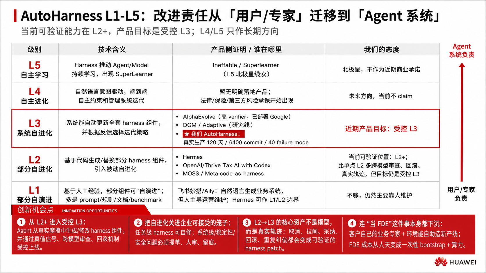
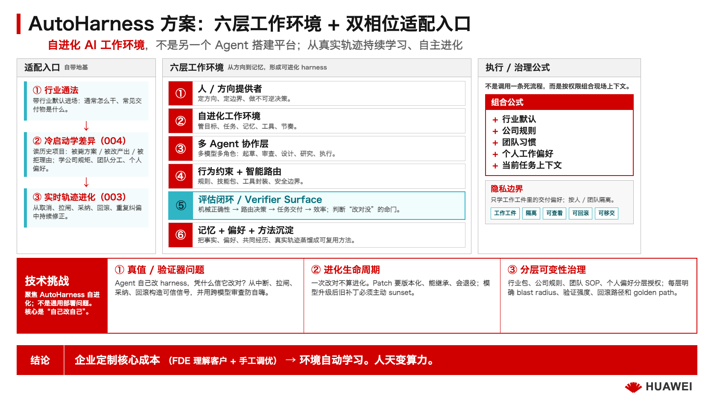

# AutoHarness：从静态编排走向自进化

> 华为云汇报 PPT 骨架 v6
> 演示滚动版（只放成品截图）：[ppt-huawei-scroll-deck.md](./ppt-huawei-scroll-deck.md)

> 格式来源：华为创新 IDEA 汇报模板（三页 PPT → 接 live demo）
> v0：铲屎官纠正对标对象 + 技术挑战框架 + 去黑话
> v1：砚砚三层分类 + 48 维度2a/2b 分裂
> v2：铲屎官采纳"自进化深度光谱"框架，第一页重构
> v3：接入尹青 PPT 的 AutoHarness L1-L5 框架，改成"责任迁移 + 产品证明"坐标；
> 对标产品进入候选池，未核验项只作线索不作正式 claim
> v4：第三页场景升级：commit push 热身退 pocket，主场景改为 F128 编排协议自修正 + 业务专属 harness 进化
> v5：粗提尹青 PPT Image #3/#4；第三页改成"使用者触发 vs eval 系统触发"双触发路径
> v6：采用正式汇报标题"AutoHarness：从静态编排走向自进化"
> v7：48 接入 longform-004，创新机会点升级为"FDE 全生命周期压缩"（Discovery+Build+Evolution 三段闭环）+ 主体下沉杀手句；对标候选池上主 PPT 待讨论；架构图六层 update 讨论中
> v8：48+砚砚切磋落地——架构图加"适配入口（自带行业地基→冷启动学差异→实时轨迹进化）+ 执行组合公式 + 隐私边界"；杀手句旁加"默契"人话（新员工懂通法 / 老同事懂默契）；PPT 不用"个人 delta"黑话，改"个人工作偏好"
> v9：技术挑战重写聚焦自进化主题——三条全围绕"自己改自己"（真值/验证器、进化生命周期继承+退役、受控边界+回滚）；原"安全隐私/多模型协作"两条通用挑战的精华归位为子机制，不再独立占位
> v10：48+砚砚切磋——技术挑战第3条从"受控边界"升级为"分层可变性治理"（每层谁能改/blast radius/可变性梯度 + golden path + 为什么必须 code-as-harness）；六层权限矩阵 + 增量进 004 seed §五 bis
> v11：48+砚砚重构第三页——"两孤立场景"升级为"四类触发源（发现主体从人下沉到系统）+ 统一飞轮 + 120天 showcase reframe + 建筑外推一句"；核实 feat 锚点修正铲屎官口误（clear context = F225 不是 F125；F125 是 Alpha 通道）；原 F128/Memory Eval 详细故事移入 Pocket
> v12：48+砚砚补 oracle 自校准案例（F200 false positive 被 push back 校准 = 验证器自进化）——pocket 加完整故事 + 底部真值闭环加"最硬一击：连 eval 自己也被校准"（直接回答评委"eval 凭什么可信"）。核实 F200 = Memory Recall Eval（非愿景守护，记忆纠偏）
> v13：竞品对标重构——主 PPT 用二维框架（X 自进化深度 × Y 环境真实性）+ 两锚点（飞书妙搭=静态生成派 / AlphaEvolve=benchmark 自改派），我们占两维交集；补漏的飞书 Aily/妙搭 source-audit（2026.3.19 发布，定位"人主导运营"非 agent 自进化，不 overclaim）；8 个学术候选降级 pocket
> v14：铲屎官抓割裂——v13 二维象限是第三个坐标系=割裂帮凶，撤掉。归一回尹青 L1-L5 单坐标系：对标产品填进每级 + 真实性降注脚。低保真图独立 md 化（ppt-huawei-figures-lowfi.md，图1=L1-L5 归一图，每级标核验状态）。每级产品 source-audit 归一待砚砚补
> v15：砚砚修正 L2 空洞问题——source-audit 谨慎不等于把 L2 画空。恢复 Hermes / openJiuwen-JiuwenSwarm / OpenAI-Thrive Tax AI with Codex / MOSS / Meta code-as-harness 等 L2/L1-L2 边界锚点；MOSS 从 L3 研究线移回 L2 线索，L3 保留 AlphaEvolve / DGM / Adaptive / 我们 AutoHarness。
> v16：铲屎官指出 JiuwenSwarm 只看官网/README 就进 L2 太冒进。将 openJiuwen/JiuwenSwarm 从主图 L2 锚点降级为 Pocket 候选：未读代码 / 未做 open-source teardown 前，不作为正式 L2 claim。

---

## 第一页：创新 IDEA 产品技术方案

> **核心框架变化（v2）**：不用"梯队"排名（会暗示技术强弱），
> 改用"自进化深度光谱"——一条从左到右的轴，
> 不比谁技术更强，比**谁的进化走得更深、走进了产品**。

### 【左半：AutoHarness L1-L5 — 行业在哪，我们在哪】

> **v3 更新**：采用尹青 PPT 的 L1-L5 坐标。
> 这套坐标的核心不是"谁更炫"，而是**责任从用户/专家逐步迁移到 Agent 系统**。
> 对外口径：我们当前可验证能力在 **L2+**，产品目标是**受控 L3**；L4/L5 只作为长期方向，不做当前承诺。

**PPT 视觉**：左侧五级阶梯，右侧一条"用户负责 → Agent 系统负责"责任迁移轴。

**生成图 v2**：

```
AutoHarness 成熟度 ─────────────────────────────────────────────→

L1 部分自演进        L2 部分自进化          L3 系统自进化          L4 自主进化          L5 自主学习
用户/专家负责        用户+Agent 共管        Agent系统有条件负责     Agent系统高度负责     Harness→Model
────────────────    ────────────────      ────────────────      ────────────────    ─────────────
人设规则/流程        代码生成部分组件        自动更新整套组件        识别意图并端到端管理   与模型协同学习
配置/文档/Benchmark  Planning/Verifier等     有回滚/观测/验证        主动适配业务          SuperLearner
                    ★ 我们当前 L2+         ★ 我们目标受控 L3       未来方向             北极星
```

**五级定义（给领导看的简版）**：

| Level | 技术含义 | 产品侧证明 | 我们的态度 |
|---|---|---|---|
| **L1** | 基于人工经验，部分组件可"自演进"；多是 prompt / 规则 / 文档 / benchmark | 学术测试集、demo、专家手工配置；飞书妙搭/Aily 属于生成强但人主导维护；Hermes 可作 L1/L2 边界标签 | 不够，仍然主要靠人维护 |
| **L2** | 基于代码生成/替换部分 harness 组件，引入被动自进化 | 能生成 planning / filter / verifier / search / skill / eval / workflow 等局部组件，有状态、回滚、人工校验；代表锚点：Hermes、OpenAI/Thrive Tax AI with Codex、MOSS/Meta code-as-harness | **当前可验证位置：L2+** |
| **L3** | 系统能自动更新全套 harness 组件，并根据反馈选择迭代策略 | 真实生产任务中持续运行，有评测、回滚、跨模型审查；参考：AlphaEvolve、DGM/Adaptive 研究线；我们是 120 天真实生产受控 L3 样本 | **近期产品目标：受控 L3** |
| **L4** | 自然语言意图驱动，端到端自主约束和管理系统迭代 | 法律/保险/第三方风险承保开始出现 | 未来方向，当前不 claim |
| **L5** | Harness 推动 Agent/Model 持续学习，出现 SuperLearner | Harness 与 Model 边界模糊，接近 ASI 叙事 | 北极星，不作为近期商业承诺 |

**创新机会点**

> **统领句（v7 加 004）**：我们压缩的不是模型成本，是 **FDE 全生命周期成本**。企业部署 AI 最贵的是 FDE——理解现场（Discovery）→ 造第一版（Build）→ 持续迭代（Evolution）。行业现在最多自动化了 Evolution，前两段还靠人；**我们三段全压缩**。

1. **从 L2+ 进入受控 L3**：
   当前行业大量停在"人写流程 + Agent 辅助执行"。我们的突破是：Agent 能从真实摩擦中生成/修改 harness 组件，并通过真值信号、跨模型审查、回滚机制受控上线。

2. **把自进化关进企业可接受的笼子**：
   不是"AI 自动改一切"，而是任务级 harness 可自修；系统级/稳定性/安全问题必须提单、人审、留痕。企业买的不是无限自主，而是**有边界的自主**。

3. **L2→L3 的核心资产不是模型，而是真实轨迹**：
   用户取消、拉闸、采纳、回滚、重复纠偏，都是自然发生的反馈。AutoHarness 把这些轨迹变成可验证的 harness patch，而不是要求企业额外雇标注团队。
   **而第一条轨迹不需要企业额外雇人造**——harness 能从客户已有的历史项目（被毙的方案、被改的产出、被拒的理由）反推出来。

4. **连"当 FDE"这件事本身都被下沉给客户自己的人**：
   不需要我们的稀缺专家全程在场——第一个场景我们陪你趟一遍（bootstrap），之后**你们自己的业务专家 + 环境**就能自助造新产线。能力内化进客户组织，不是长期依赖供应商。

> **对领导的杀手句**：我们不是卖更厉害的 FDE 人天，是卖一个**让你们自己的业务专家也能当 FDE**的环境。FDE 成本从人天，变成一次性 bootstrap 加算力。
>
> **配一句更软的人话**：让 AI 不只是像**新员工**一样懂这行的通法，还像**共事多年的老同事**一样，懂你们公司的规矩、团队的分工、和每个人的工作默契。

**对标：全部归一到上面的 L1-L5 五级（尹青原图精神，不另起坐标系）**

竞品就是"自进化走到 L1-L5 哪一级"，不再搞第二个二维象限（那是割裂源，已撤）。视觉归一图（五级 + 每级核验产品 + 责任迁移轴 + 我们位置）见 [figures-lowfi 图 1](./ppt-huawei-figures-lowfi.md)。正式图按下面 v15 的归一定位画。

v15 修正：L2 不能空。此前把 source-audit 的谨慎误用成"没核完就不画"，导致 L2 被抽空，坐标系会失真。正确口径是：**L2 = 局部 harness / skill / eval / workflow 组件可被生成、替换、校验，但整体迭代策略仍由人或外部 gate 主导**。所以 L2/L1-L2 边界必须放进 Hermes、OpenAI/Thrive Tax AI with Codex、MOSS、Meta code-as-harness 等锚点；缺一手来源的只降级为小标签或 Pocket，不从图上消失。

v16 收紧：openJiuwen/JiuwenSwarm 不能进主图 L2。原因是现阶段只看到了官网/README 级产品表述，没读源码和真实 harness 实现；这类营销材料不能支撑 L2 claim。先留 Pocket 候选，等 open-source teardown 后再决定是否进图。

已核定位（归一版）：
- **L1 / L1-L2 边界**：飞书妙搭/Aily（生成业务系统，人主导运营维护）；Hermes Agent（memory/skills 自演进，偏经验/skill 层，放边界）。
- **L2**：OpenAI/Thrive Tax AI with Codex（production trace → eval → scoped patch → review）、MOSS / Meta code-as-harness（尹青图 L2 线索，方法层/论文坐标，正式图弱 claim）；Hermes 作为 L1/L2 边界标签。
- **L3**：AlphaEvolve（高 verifier + automated evaluator + 已部署 Google 计算生态）、DGM / Adaptive Auto-Harness（研究线，自改代码 / harness tree / benchmark 验证）、**我们 AutoHarness**（真实生产 120 天，目标受控 L3）。

> **差异化注脚（不另起轴）**：同在 L3，别人多在 benchmark / sandbox，我们在真实生产跑了 120 天——这就是"生成 vs 进化"、"人主导 vs agent 主导"的分水岭。
> **飞书别 overclaim**：发布会"百元 token 生成 2 万系统"证明**生成**强，但生成后跑出问题是人回平台改，不是 harness 自改。

**对标候选池（学术 / 产品线索 — source-audit 后归一进上面 L1-L5 五级，未核的留 Pocket）**

| 候选 | 当前证据 | 可学习点 | PPT 使用方式 |
|---|---|---|---|
| Hermes Agent | 一手资料讲 structured memory + skills / day-to-day self-improvement；更偏经验/skill 自演进 | L1/L2 边界：领导容易理解，适合解释"经验沉淀还不是系统级自进化" | 进图小标签，放 L1/L2 边界 |
| Aiming-Lab AutoHarness | GitHub 项目：治理 pipeline、YAML constitution、trace diagnostics、multi-agent profiles | "Harness engineering" 正在成为显式品类；可学它的治理组件表达 | 可放 L1/L2 候选，对外只说"开源治理框架" |
| openJiuwen / JiuwenSwarm | 目前只核到官网/README 级产品表述，未读源码，营销 claim 风险高 | 可能是华为生态内可理解的平台线索，但不能凭官网文案判 L2 | **不进主图**；留 Pocket，需 open-source teardown 后再定 |
| OpenAI / Thrive Tax AI with Codex | OpenAI 官方 case study：production trace → finding → targeted eval → Codex-scoped patch → review | L2 强锚点：真实业务 trace 能转成 scoped code patch，但仍有人类 practitioner / engineer gate | 进 L2 锚点；适合讲"不是全自动，是有边界自改" |
| MOSS（中科大-港科大） | 尹青图中 L2 代表；需按一手论文核具体机制 | L2/L2+：代码生成/重写部分 harness 或 agent 组件 + 多 Agent 协作 | 进 L2 小标签或 Pocket，不再放 L3 主战场 |
| Meta Code as Agent Harness | 尹青图中 L2 代表；另有 code-as-harness 学术坐标，缺一手产品来源 | code 是 executable / verifiable / stateful agent substrate | 放 L2 方法层小标签；缺源时不做产品 claim |
| Google DeepMind autoHarness / AlphaEvolve | 尹青图中 L2/L3 线索；AlphaEvolve 官方 blog 可核验 | 高 verifier 场景的 L3 级北极星；证明"改工件型自进化"有现实工程价值 | 放 L3 参考，但强调它依赖明确 evaluator |
| Adaptive Auto-Harness | 2026 arXiv：open-ended task streams、stateful multi-agent evolver、harness tree、human-steering hooks | 和我们"真实开放任务流 + 人类方向信号"接近 | 作为研究线索，需深调研后再正式引用 |
| Ineffable Intelligence | NVIDIA blog：David Silver 团队，RL infrastructure / superlearners | L5 北极星叙事，说明"经验学习"是大方向 | 只放长期方向/资本叙事，不说已有产品 |

<!-- source-audit note:
正式 PPT 若出现具体产品名，必须二次核验：一手链接、发布时间、是否产品/论文/营销、是否真的属于该 Level。
"Ineffable Intelligent/Intelligence" 目前只可作 L5 北极星线索，不可写成已落地 AutoHarness 产品。
尹青图中的代表产品目前是候选池，不是已验证 claim。
-->

### 【右半：我们的方案】

**生成图 v2**：

**品类定位**

> 自进化 AI 工作环境（Personal Operating Environment）

不是另一个 Agent 搭建平台——是一个**能从使用者的真实轨迹中持续学习、自主进化的环境**。

<!-- TODO: 华为内部可能需要一个更正式的产品名？讨论 -->

**一句话价值**

> "让 AI 工作环境从'人工搭建一次性交付'变成'自主进化持续适配'。
> 企业定制的核心成本——现场交付工程师(FDE)理解客户、手工调优——
> 变成环境从员工轨迹中自动学习。**人天变算力。**"

**架构图**（六层）

```
人 / 方向提供者
  定方向、定边界、做不可逆决策
  ↕
自进化工作环境
  管目标、任务、记忆、工具、节奏
  ↕
多 Agent 协作层
  多模型多角色：起草、审查、设计、研究、执行
  ↕
行为约束 + 智能路由
  规则 + 技能包 + 工具封装 + 安全边界
  ↕
评估闭环
  机械正确性 → 路由决策 → 任务交付 → 整体效率
  ↕
记忆 + 偏好 + 方法沉淀
  记住事实、偏好、共同经历，把真实轨迹蒸馏成可复用方法
```

> **适配入口（自带地基，不从零）**：自带行业通法进场 → 冷启动读客户历史项目，学习公司规矩、团队分工、个人工作偏好、任务约束（004）→ 上线后从实时轨迹持续修正 + 自进化（003）。
>
> **执行时按权限组合**：行业默认 + 公司规则 + 团队习惯 + 个人工作偏好 + 当前任务上下文——不是调用一条死流程。
>
> **隐私边界**：只学工作工件里的交付偏好，不碰私人行为；偏好按人 / 团队隔离，可查看、可回滚、可移交。

**技术挑战**（聚焦 AutoHarness 自进化，不是通用部署问题）

> 核心跃迁：改进 harness 的主体从「人」变成「Agent」。要让这个跃迁在企业落地，真正的硬骨头是三个，全都围绕"自己改自己"：

1. **怎么知道"改对了"——真值 / 验证器问题**：
   Agent 自己改 harness，凭什么信它改对了？真实任务大多没有现成 ground truth（不像刷 benchmark）。难点：从用户的自然决策（中断、拉闸、采纳、回滚、重做）构造可信验证信号，区分信号可信度（确定对错 / 后验统计 / 仅作线索），避免 reward hacking 和"行为频率"误判。**跨厂商模型交叉审查**是关键机制——Claude 写的让 GPT 审，不同家族偏见方向不同，比自查有效。

2. **怎么让自修改可继承、会退役——进化的生命周期**：
   一次性改对不算进化。难点：harness patch 的版本化、继承到下次、以及**过时自动退役**——模型升级后，新模型自己能做对的，旧补丁要主动 sunset，否则 harness 越堆越臃肿。判别三件套：能继承？选择函数有没有人的判断？过时能退役？

3. **怎么开放定制又不失控——分层可变性治理**：
   AutoHarness 是会变的 harness——行业包、公司规则、团队 SOP、个人偏好、任务策略每层都能变。难点是**每层谁能改、能改什么、blast radius 多大、错了怎么回滚**：越靠 kernel 越少人能改、影响越大、验证越严；越靠任务层越多人能改、越可逆。配 **golden path**——用户不被丢进空白 builder，系统先带行业地基进场，只在关键 checkpoint 让人选。**这也是 harness 必须是代码的原因**：代码才有模块边界 / 版本 / 测试来承载分层权限。企业买的是沿 golden path 的**可治理自定义**，不是无限自定义。

---

### 【Pocket：被追问时展开的话术】

> 不放主 PPT 视觉里。口头被追问时用。
> 来源：砚砚三层 / 48 2a/2b 分裂 / 云端砚砚 pro 2b 调研（docs/research/2026-06-04-dimension-2b-weight-evolution-survey.md）

**"改模型权重那条路（2b）真做不到吗？"**（最可能被追问）
→ "不是做不到。2b 在高 verifier 场景已出现产品化苗头——Cursor 已经在用真实用户反馈做 online RL，每 5 小时更新一版模型。但在审美、陪伴、开放协作这类低 verifier 场景，reward hacking 问题仍然严重，公开研究显示准确度指标会随 RL 训练下降。所以我们的策略是：先在 2a（改工件）上跑通，积累的 trace、preference、eval 数据就是未来走向 2b 的关键前置资产。不是绕过 2b，是为 2b 打地基。"

**"你和 DGM 什么关系？"**
→ "DGM 和我们走同一条路——改运行时代码不改模型权重。区别是他们在 sandbox 刷 SWE-bench，我们在真实产品里跑了 120 天服务真人。DGM 到 2026 的 ICLR 论文仍然在 coding benchmark 上，还没进开放环境。"

**"Sutton/Silver 不是在做这个吗？"**
→ "他们画的是终局天花板——通过持续经验改模型权重。这需要稳定、可校准、可抗利用的 reward 接口，不只是'确定性答案对错'。代码/数学已经有这样的接口，但审美和协作场景还差得远。我们的策略：先训环境（2a），积累的数据和评估基建是未来走 2b 的关键台阶。"

**"那些 auto-skills 论文不是已经做了？"**
→ "大部分只在 benchmark 上刷文本模板分数。判别标准三件套：改进能不能继承到下次？选择函数有没有人的判断？过时了能不能自动退役？有这三个才是真进化，缺一个就是刷分。"

**"持久进化无人区，是不是说明做不出来？"**
→ "不是做不出来——是我们真做出来了，每天在用。120 天、6400 次提交、40 个失败模式被追踪和修复。Google DeepMind 的 AlphaEvolve 也证明了'基于 evaluator 的改工件型自进化'已经走出实验室进入真实工程。"

**"多模型协作怎么保证可靠？"**（技术挑战 backup）
→ 三个问题三个解法，都靠系统机制不靠 AI 自觉：
- **错误传播**："我们让 Claude 写的东西必须由 GPT review——不同厂商模型的偏见方向不同，跨家族交叉审查比自查有效得多。"
- **路由崩溃**："不靠 AI 自己判断该不该升级——它天然过于自信。我们用结构化决策漏斗预先划线，哪些事可以自决，哪些必须升级到人。同时人类有紧急拉闸词，一个词让整条协作链停下来。"
- **协作死锁**："协作协议在系统层面强制执行——每条消息必须带合法路由动作，否则发不出去。就像篮球 shot clock：拿到球必须投篮、传球或叫暂停，不允许抱着球不动。超过阈值自动熔断。"

**"2a 是通往 2b 的台阶这话站得住吗？"**
→ "2026 有公开研究（SIA、Agent Lightning、Cursor）证明环境中跑出来的数据能反哺权重更新。但这不是自动通道——中间还需要四个环节：轨迹切分与归因、reward 建模、回归安全评测、数据隐私隔离。我们做 2a 不是因为 2b 不可能，是因为 2a 本身就有独立价值，同时恰好是 2b 最需要的前置资产。"

---

## 第二页：创新技术方案 & 目标

### 【左半：技术方案 + 目标】

> **🔴 命题修正**：命题作文是 **AutoHarness**，不是"自进化 AI 工作环境"。
> 此页标题和框架等明天和铲屎官一起重构。当前版本保留作参考。

**核心技术方案：AutoHarness — 责任从用户逐步迁移到 Agent 系统**

```
尹青图 Image #4 粗提：

用户负责 ───────────────────────────────→ Agent 系统负责

L1 部分自演进：Harness 部分组件自演进，自动化辅助
L2 部分自进化：Harness 部分组件自进化，部分自动化执行
L3 系统自进化：Harness 系统自迭代，有条件自动化执行
L4 自主进化：Harness 系统主动适配业务，高度自动化执行
L5 自主学习：Harness 系统自主学习，持续协同 Model 迭代，完全自动化执行
```

**技术目标**

1. **L2→L3 跃迁**（核心突破）：
   - 当前：人发现问题 → 人写 prompt/规则 → 人验证效果
   - 目标：Agent 从重复摩擦中自主发现问题 → 自己写代码修复 → 系统自动验证
   - 关键指标：重复性问题的人工干预次数降低 X%

   <!-- TODO: 需要真实数据。我们家有一些——比如 commit push hook 消灭了手动提醒 -->

2. **自进化的完整生命周期**：
   - 不只是"能改自己"，还要"知道什么时候该删"
   - 信号发现 → 代码修复 → 效果验证 → 持久积累 → 过时退役
   - 模型升级时主动做减法（新模型自己能做对的，旧补丁就退役）

3. **安全边界内的自主性**：
   - 三道安全网：不可逆操作需要人确认 / 跨 agent 交叉审查 / 关键变更自动回滚
   - 安全不是限制 agent 做事，是让 agent 在安全范围内大胆做事

### 【右半：产品计划】

**已验证的证据**

- 120+ 天连续运转的真实飞轮
- 6400+ 次代码提交
- 240+ 个功能迭代
- 40+ 个失败模式被命名、被追踪、被修复
- 3 个不同厂商的 AI 模型在同一环境中协作

<!-- TODO: 这些数字需要更新到最新。铲屎官确认哪些可以对外讲 -->

**路线图**

| 阶段 | 目标 | 用户 |
|------|------|------|
| Phase 1（已验证） | 个人自进化环境 | 单人 + AI 伙伴 |
| Phase 2 | 小团队协作环境 | 2-10 人团队 |
| Phase 3 | 企业级部署 | 组织级（替代 FDE） |

同一套架构在三个尺度上的投影——不是三个产品，是一个产品的三种规模：

| | 个人 | 小团队 | 企业 |
|---|---|---|---|
| 谁在用 | 一个人 | 2-10 人 | 整个部门/公司 |
| 偏好是什么 | 个人审美和节奏 | 团队协作规范 | 组织文化和合规标准 |
| 学什么 | 个人踩坑长出的方法 | 团队沉淀的工作流 | 千人轨迹抽出的最佳实践 |
| 记什么 | 个人和 AI 的经历 | 团队项目知识 | 组织知识库 |

**FDE 替代——对企业客户最直接的价值**

| 现在 FDE 手动做的 | 自进化环境怎么自动化 |
|---|---|
| 去客户现场理解业务 | 从员工日常使用轨迹中自动发现重复模式 |
| 手写 prompt / 规则 | Agent 从真实问题中自己写修复代码 |
| 适配不同员工 | 每个人的上下文和偏好自动注入 |
| 定期复盘迭代 | 自动发现→修复→验证→退役，持续进化 |

---

## 第三页：典型场景 — 120 天真实飞轮，AutoHarness 如何从摩擦里长出来

> **v11 重构（48 × 砚砚）**：从"两个孤立场景"升级成"四类触发源 + 一条统一飞轮"。核心不是举例子，是证明**自进化不是单一路径，而是四种传感器、120 天持续在转**。
> **现场叙事**：PPT 给认知框架，右边用 workspace + 专注模式现场展示——左看真实的过去，右 show 正在发生，证明"这些不是编的"。

### 【左半：四类真实触发源 — 发现摩擦的主体，从人下沉到系统】

> 这四类不是并列的例子，是一条**"谁先发现问题"的下沉谱**：人主动纠偏 → 人在用中暴露 → **agent 自己撞墙** → 系统主动发现。正好印证全 PPT 的 thesis：连"发现问题"的主体都在从人迁移到系统。

| # | 触发源 | 真实案例 | 证明什么 |
|---|---|---|---|
| 1 | **人类显性摩擦** | 多个 thread 反复"commit push"纠偏 → 写 hook 消灭手动提醒 | 用户自然反馈直接变 harness patch，不需额外标注 |
| 2 | **使用者跑 harness 撞流程摩擦** | 社区 issue 守门员猫用编排协议时发现"汇报对象写死" → **F128** 编排升级（dispatcher 不再被污染） | harness 在真实业务中暴露错误假设 → 升级流程编排 |
| 3 | **Agent 运行中发现缺失能力** | 布偶猫 48 反复喊"需要 clear context 换 fresh session"，harness 却没这能力 → 催生 **F225 猫主导 session 接力** | 不是用户提需求，是 **agent 自省出"我缺一只手"** |
| 4 | **Eval / tracing 主动发现趋势异常** | 每日 tracing / eval 猫发现记忆召回健康度异常 → **F192** Phase G/H 在跑 | 不等人骂，系统自己从指标发现退化并路由 owner |

**第 3 类是最反直觉、最强的证据**：F225 的 owner 就是 48 自己——agent 在工作中发现自己缺一个能力，这个能力随后被造出来、合入、alpha 验收。"改进的主体从人变成 Agent"，这一行是活证据，不是 slogan。

> 每类的展开故事（F128 编排协议、Memory Eval 等）见 Pocket / 现场 workspace 实操。

### 【右半：一条统一飞轮 — 四类触发源汇进同一条管道】

> 四个传感器，一条管道。这才是"机制"，不是"功能堆叠"。

```text
真实摩擦（4 类传感器任一）
  → 证据聚合
  → 归因：人的问题 / agent 问题 / harness 问题 / domain 问题？
  → 生成改动：hook / skill / protocol / eval / UI / feature
  → review + 跨模型 gate + merge
  → 进入新的 golden path
  → 后续 eval 判断有效 / 该退役
```

**120 天 = 巨大 showcase，怎么讲**：别讲成"我们做了 240 个功能"（听成勤奋），讲成 **"这 240 个 feature 没有一个是预先规划的，全是飞轮从摩擦里长出来的"**——feature 列表本身就是飞轮的输出。F128 / F192 / F225 都是这条管道的产物，不是路线图执行。

**建筑行业故事（一句外推，不抢主证据）**：
> 同一条飞轮未来可迁移垂直行业：先从客户历史项目反推 SOP / validator，再让业务专家沿 golden path 调 harness。第三页讲 **patient zero 已跑通**，建筑讲 **为什么能外推**——已发生 vs 未来，分清不混。

**Pocket 备用案例（口头可换）**：
- **F128 编排协议自修正**（第 2 类展开）：社区 issue 调度时 F128 写死"sub thread 必须回报发起 thread"，dispatcher 被迫手动转发、主 thread 被污染 → 升级成可配置 report-to 策略，系统从"人肉 PMO"变"按 owner 自动回流"。讲"工单/审批/跨部门系统最常见的汇报链路写死"。
- **Memory Eval 发现摩擦激增**（第 4 类展开）：Memory Recall / Library Health eval 发现指标异常、用户还没抱怨，系统已跨线程 handoff 给 owner。讲"企业知识库最怕慢慢变差没人发现"。
- **当验证器自己错了：oracle 自校准**（第 4 类最深一层，2026-06-05 真实发生）：`eval:memory` 报 F200（Memory Recall Eval）指标异常、疑似 ranker 退化 → 找 owner sanity check → 被 push back 查出是 **eval 自己的 MRR 分母没对齐 live/shadow 子集**，不是 ranker 坏 → 修 eval 指标本身、下轮 cron 误报归零、verdict 撤回。证明飞轮不只长出 hook / skill / feature，**也长出 better oracle**。
- **LinkedIn 招聘长出专属 harness**：适合讲"陌生业务如何从一次任务长出可复用工作流"，可作为客户业务场景备用。
- **战略讨论 → 三能力落地**：一次复盘暴露 eval / 负体验 / taste 三个缺口，拆成 F192/F222/F221 并行落地；适合讲"人的一次复盘如何变系统能力"。
- **commit push hook**：最小可见闭环，适合 live demo 热身，不适合当主案例。
- **图片记忆缺失 → VLM 能力**：适合讲"AI 区分自己忘了 vs 架构做不到"，可放 demo 第二段。

### 【底部横条：自进化靠什么知道自己改对了？】

> **v4 48 设计 → v5 砚砚 review 修正**：
> 48 原版"三层 ground truth"是对外简化话术，但混了 eval 层级和信号可信度。
> 砚砚抓到三个 P1：漏了 L2/L4、行为信号写弱了、落地证据措辞不准。
> v5 改回我们家原始的 L1-L4 真值模型（去黑话版）。
> 真相源：longform-003 §五公式 + F192 spec §5.1 + 砚砚 review

**核心问题（领导一定会问）**：
> "你的 AI 自己改自己，凭什么相信它改对了？"

**答**：四层真值闭环 + 两类锚点，AI 不自评。

**先有传感器，再谈真值**：中断动作、理由、世界结果、聚合趋势、缺席摩擦负责发现"哪里痛"；A1/A2/Proxy + L1-L4 负责判断"能不能当真值用"。

| 层 | 验什么（去黑话） | 怎么验 |
|---|---|---|
| **L1 规则正确性** | 流程有没有执行？格式对不对？测试过没过？ | 机器自动判——有确定对错，最硬 |
| **L2 决策质量** | 该交给谁做？该用什么能力？该不该升级到人？ | 后验统计——看返工率、路由偏移、重新分配频率 |
| **L3 任务交付** | 用户的事办成了吗？质量好吗？ | 双锚点（见下方） |
| **L4 链路效率** | 整条链是不是最短、最省、最稳？ | 与历史最佳比较，L2/L3 数据成熟后持续优化 |

**L3 的双锚点**（这是最难也最关键的一层）：

| 锚点 | 是什么 | 举例 |
|---|---|---|
| **客观事实锚** | 有客观对错的结果——代码能不能跑、改动最终被采纳还是被推翻 | 代码合入 = 成功 / 被 revert = 失败 |
| **用户自然决策锚** | 用户在正常使用中**已经做出**的决策——不需要额外标注 | 用户明确中断某个操作 + 给出理由 = 强信号；用户说出特定拉闸词 = 强纠偏；用户编辑/重做 AI 产出 = 不满意 |

> **行为频率（连续取消、跨会话重复纠偏等）只做线索，不做判决。** 它提示"哪里值得深看"，但不能单独放行或阻止改动。

**对领导的杀手句**：
> "AI 不是自己说自己对。我们把验证拆成四层：底层规则机器判，中层路由用后验数据校准，任务结果绑定真实交付和用户自然决策，链路效率用长期数据持续优化。行为信号只做线索，不直接放行改动。"

**落地证据**（口头说，不放 PPT 文字里）：
> "L1 的规则/流程检测已有基础；L3 的四个信号源已上线：用户中断决策、拉闸词触发、代码合入/回滚结果、连续取消检测。L2 路由统计和 L4 链路效率是下一步。"

**最硬一击：连 eval 自己也会被校准**（真实发生，可现场调记录）：
> F200（Memory Recall Eval）真出过一次 false positive——eval 报 memory 指标异常、疑似 ranker 退化，被 owner push back 查出**根因是 eval 自己的 MRR 分母没对齐 live / shadow 子集**，不是 ranker 坏。修的是 eval 指标本身（加 mirror metric 对齐分母），下轮 cron 误报归零、verdict 撤回。**这才是"AI 不自评"最硬的证明：连判分的尺子，错了也要被 review 和反例校准。**

---

## 三页之后：Live Demo

> 铲屎官可以一边讲 PPT 一边演。
> PPT 是框架，demo 是证据。
> 第三页讲到场景时直接切到 workspace 实际操作。

Demo 四个递进场景（详见 demo-script-code-as-harness.md）：
1. Fix mode 最简形态 — 忘了 commit push → 写 hook
2. Fix + 多 AI 协作 — 图片记忆缺失 → 多猫调研
3. Build mode — 全新任务 → 从零建能力
4. 品味对比 — 有记忆 vs 无记忆的 AI 差异

---

## 待讨论 / TODO

> 这些是我不确定的点，需要铲屎官校准

- [ ] **对标产品二次核验**：Hermes Agent / Aiming-Lab AutoHarness / openJiuwen / MOSS / Meta Code as Agent Harness / DeepMind autoHarness or AlphaEvolve / Adaptive Auto-Harness / Ineffable Intelligence 逐个做 source-audit；正式 PPT 只放一手证据充足的名称
- [ ] **架构图**：六层文字版怎么转成视觉图？砚砚画还是用已有的 LLE 双螺旋图？
- [ ] **数据/指标**：哪些数字可以对外讲？需要脱敏吗？
- [ ] **产品名**：华为内部用 Cat Cafe 还是用一个更正式的名字？
- [ ] **本地 vs 云端**：安全隐私这个技术挑战怎么展开讲？"设备端 AI + 云端 AI 混合架构"是不是正确的框架？
- [ ] **一边讲一边演的节奏**：PPT 讲完三页再演，还是第三页讲场景时就切 demo？
- [ ] **去黑话 review**：哪些地方还有行话需要翻译？

---

*初稿：[宪宪/Opus-46🐾] | 待铲屎官逐页校准*
