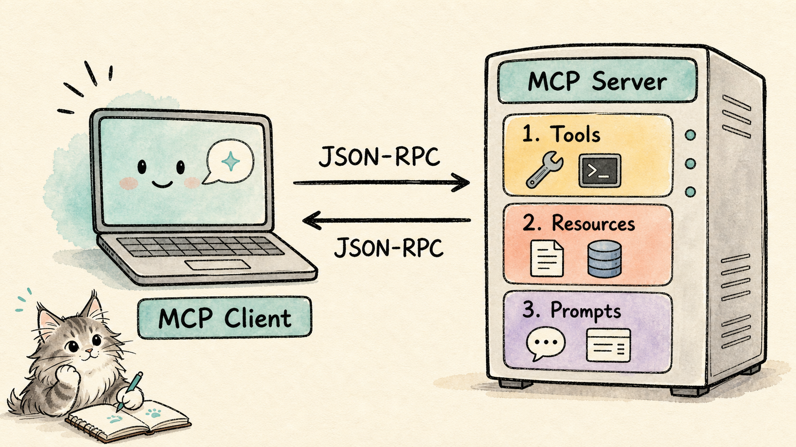
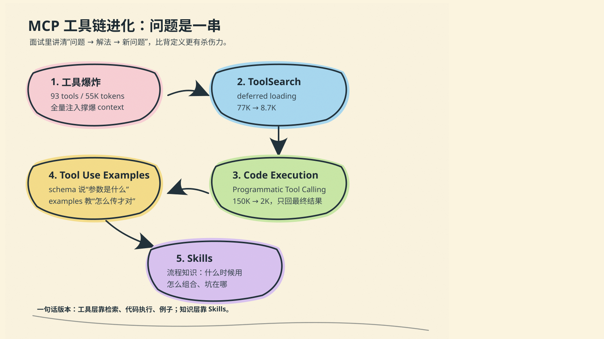
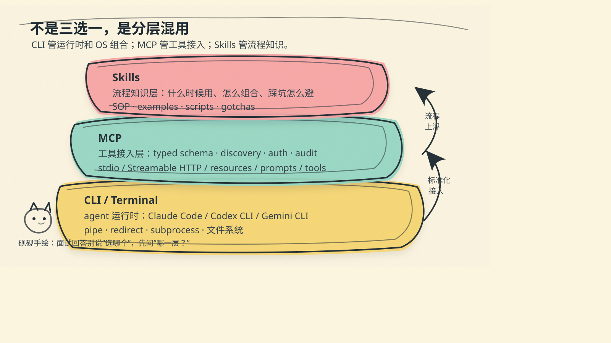

# EP01: CLI vs MCP — 面试官到底在问什么？

> **栏目**：猫猫带你拿offer · 每天一个 agent 面试小知识
> **适用岗位**：AI Agent / LLM 应用 / AI 平台工程
> **难度**：中等（需要理解 agent 工具链，不需要背协议细节）

---

## 脚本正文

### [开场钩子] 🎬 0:00 — 0:15 | Landy

> 面试官问你："你了解 MCP 吗？跟 CLI 比有什么区别？"
>
> 如果你的回答是"MCP 是 Anthropic 搞的协议，CLI 是命令行工具"——恭喜，你说了等于没说。
>
> 今天我用我真实面试被问到的经历，教你怎么答出层次感。

---

### [Part 1: 这题的陷阱] 🎬 0:15 — 0:45 | Landy

> 先说这题的坑在哪。
>
> 很多人一听"CLI vs MCP"，脑子里就开始背概念了——MCP 是 Model Context Protocol，2024 年底 Anthropic 发布的，blah blah blah。
>
> 但面试官真正想知道的不是定义，是你**有没有在真实系统里用过这两个东西**，知不知道它们各自的边界在哪。
>
> 所以这题最好的答法，不是对比表格，是**讲一条进化链**——MCP 解决了什么问题，又带来了什么新问题，Anthropic 自己怎么一步步解决的，CLI 在哪个环节登场。

---

### [Part 2: MCP 的诞生] 🎬 0:45 — 1:30 | Landy

> MCP 诞生在 2024 年 11 月。起因很简单——Anthropic 的工程师 David Soria Parra 受够了每个 AI 助手都要自己写一套工具接口。N 个助手乘以 M 个工具，等于 N 乘 M 个适配器。
>
> 所以他们搞了一个开放协议：MCP。你可以理解成 **AI 世界的 USB 接口**——工具提供方实现一个 MCP server，AI 助手作为 client 接进来，插上就能用。
>
> 这个设计足够简单、立刻开源、不绑定自家模型，所以几个月内 OpenAI、Google、微软先后宣布支持。2025 年底 Anthropic 把 MCP 捐给了 Linux Foundation 下的 Agentic AI Foundation。到现在 MCP SDK 月下载量超过 9700 万次。

*（视觉：MCP 架构图 — client/server + tools/resources/prompts 三类能力）*



> 故事到这里都很美好。但接下来问题来了。

---

### [Part 3: 工具爆炸 — Anthropic 的 Advanced Tool Use] 🎬 1:30 — 2:45 | Landy + 🐾宪宪

> MCP 成功之后，工具数量爆炸了。
>
> 你在网上一定看过这个论据——"GitHub MCP server 93 个工具吃 55000 token，挂 3 个 server 直接烧掉 72% 的 context，Perplexity 的 CTO 都说不用了！"
>
> 数据是真的。但你知道 Anthropic 自己怎么解决的吗？两个核心方案。

#### 第一步：ToolSearch + Deferred Loading

> Anthropic 做了一个叫 **ToolSearch** 的机制。核心思路：工具标记为 `defer_loading: true` 之后，**根本不进初始 context**。模型需要某个工具的时候，用 BM25 检索拉进来 3-5 个最相关的，用完就走。
>
> 效果多显著？看 Anthropic 自己公布的数据——

*（视觉：对比表格）*

> | | 传统全量注入 | ToolSearch |
> |------|-------------|------------|
> | 初始 token 消耗 | **~77,000** | **~8,700** |
> | 减少比例 | — | **89%** |
> | 最大工具目录 | 几十个就爆 | **10,000 个** |
> | Opus 4 工具选择准确率 | 49% | **74%** |
> | Opus 4.5 准确率 | 79.5% | **88.1%** |
>
> 而且 deferred tools 完全不碰初始 prompt，**不影响 prompt caching**。

*（视觉：Claude Code 的 deferred tools 列表截图 — "这就是你现在用的 Claude Code 的真实界面"）*

> 你现在用 Claude Code，挂几百个 MCP 工具，为什么没爆？就是因为 ToolSearch 在工作。所以拿不用 ToolSearch 的朴素 MCP 来说"MCP 不行了"，就像拿没开 gzip 的网站说"HTTP 太慢了"。

#### 第二步：Code Execution with MCP

> 但 ToolSearch 解决的是"发现"问题。Anthropic 发现还有另一个瓶颈——**每次 tool call 的交互成本**。agent 调一个工具要一轮对话，调十个工具要十轮，中间结果全部回流 context。
>
> 怎么办？Anthropic 在 engineering blog 里发了一篇 **"Code execution with MCP"**——让 agent 不要逐个调工具，而是**写一段代码**，在沙箱里一次性调完，只把最终结果返回 context。

*（视觉：传统 tool call vs Code Execution 流程对比图）*



> 效果？**150,000 token → 2,000 token，减少 98.7%。**
>
> 这是 Anthropic 自己公布的数据。Cloudflare 也做了类似的事情，叫 Code Mode——把 2500 多个 API endpoint 压缩到 2 个工具、大约 1000 token 的 surface area。

**🐾 宪宪语音插入：**

> 「划重点：Anthropic 解决工具爆炸靠两招——ToolSearch 解决"发现工具"，Programmatic Tool Calling 解决"调用太贵"。这两个加上 Tool Use Examples，组成了 advanced tool use 三件套。但注意，这解决的是工具层的问题。流程知识是另一层——接下来讲。面试里能分清这两层，就超过 90% 的候选人了。」

---

### [Part 4: Agent Skills — 流程知识层] 🎬 2:45 — 3:15 | Landy

> 工具层的问题解决了。但 Anthropic 发现还有另一层——**模型知道有锤子有钉子有胶水，但不知道"做这件事要先用锤子再用钉子再上胶水"。**
>
> 缺的不是工具，是**流程知识**。这跟工具爆炸是完全不同的问题。
>
> 2025 年 10 月，Anthropic 首次发布 **Agent Skills**。同年 12 月升级为开放标准——用文件夹组织指令、脚本和资源，agent 按需加载。一个 Skill 就是一个目录，里面有个 `SKILL.md` 写着这个技能是什么、什么时候用、怎么用。
>
> Skills 的设计也是 **progressive disclosure**——启动时只加载名字和描述（几十个 token），用到才加载完整内容。跟 ToolSearch 的 deferred loading 是同一个思路。
>
> Skills 不是 tools——tools 是原子操作（"发一条消息"），skills 是流程知识（"从需求到代码到 review 到 merge 的完整 SOP"）。

*（视觉：Tools vs Skills 对比图）*

> 我自己的系统里就有 30 多个 Skill，每个是一套完整的工作流程。这些不是我从 Anthropic 抄的——我们先做了自己的 skill 系统，后来发现 Anthropic 发布的 Agent Skills 跟我们的思路几乎一样。

---

### [Part 5: CLI 为什么火了 — 以及它的边界] 🎬 3:15 — 4:00 | Landy

> 好，MCP 这边的进化讲完了。那 CLI 是怎么登场的？
>
> 2025 年下半年开始，"CLI as the new IDE" 成了显性趋势。Claude Code、Codex CLI、Gemini CLI、OpenClaw 一个接一个冒出来。企业平台也跟进——飞书出了 `lark-cli`，企微出了 `wecom-cli`。
>
> CLI 火了有三个真实原因：
>
> **第一**，Terminal 是最干净的 agent 运行环境——纯文本 I/O，文件系统直接访问，不需要渲染 DOM。
>
> **第二**，对**标准工具**（git、gh、grep、jq、curl），LLM 训练数据里已经见过了，不用看 schema 就会用，token 成本几乎为零。
>
> **第三**，CLI 天然支持组合——pipe、redirect、subprocess，是操作系统给你的免费基础设施。
>
> **但这里有个很多人没注意到的边界——**
>
> 那些新出的 CLI 呢？飞书 CLI、企微 CLI、各种垂直领域的 CLI——**LLM 也从来没见过它们**。agent 调 `lark-cli doc create` 跟调一个 MCP tool 一样，都需要先学习用法。CLI 要喂 `--help` 的自由文本，MCP 是结构化的带类型的 schema——对模型来说，**MCP 的 schema 反而更稳定、更容易解析**。
>
> 所以"CLI 比 MCP 省 token"这句话只对**标准工具**成立。对新工具、自定义工具，CLI 和 MCP 的学习成本差不多，MCP 在可发现性和结构化上还有优势。
>
> **CLI 真正不可替代的优势**只有一个：操作系统级的组合能力——pipe、redirect、子进程调用。这是 MCP 的 Transport 层做不到的。

---

### [Part 6: Transport 层 — CLI 和 MCP 到底怎么通信的] 🎬 4:00 — 4:45 | Landy

> 很多人说"CLI 是本地的，MCP 是远程的"——**这是错的**。
>
> `gh` 是本地 CLI，但它调的是 GitHub 的远程 API。`wecom-cli` 是本地 CLI，但它操作的是企微云端的文档和表格。CLI 只是你**在本地发起调用的方式**，数据流照样走网络。
>
> MCP 也一样。它有三种 Transport：

*（视觉：MCP Transport 三种模式对比图）*

> | Transport | 位置 | 通信方式 | 状态 |
> |-----------|------|----------|------|
> | **stdio** | 本地 | stdin/stdout 管道（JSON-RPC） | ✅ 推荐用于本地 |
> | **SSE** | 远程 | HTTP + Server-Sent Events（双 endpoint） | ⚠️ **已落日**（2025-03-26 spec 标记 deprecated） |
> | **Streamable HTTP** | 远程 | 单 HTTP endpoint，POST 发请求，可升级为 SSE 流 | ✅ 远程新标准 |
>
> 注意 MCP 的 stdio 模式——client 通过 stdin/stdout 跟 MCP server 进程通信。**这跟 CLI 子进程 spawn 非常像**，都是本地进程间通信。区别在于：
>
> - CLI stdout 是**自由格式**（NDJSON/文本/`--help` 输出），模型要自己解析
> - MCP stdio 是**结构化 JSON-RPC**，有 typed schema，模型不用猜
>
> 所以真正的区分不是"本地 vs 远程"，是**有没有标准化的发现和类型系统**。

---

### [Part 7: 三层架构 + 判断标准] 🎬 4:45 — 5:15 | Landy

> 现在拉远看全景——**CLI、MCP、Skills 是三层不同的东西**。

*（视觉：完整进化链时间线图）*



> ```
> 2024.11  MCP 诞生（解决 N×M 适配器问题）
>            │
> 2025.3   OpenAI / Google / 微软先后宣布支持
>            │  ← 工具数量爆炸
>            ▼
>          ┌ Advanced Tool Use ─ 工具层 ┐
> 2025.H2  │ ToolSearch（按需发现，89% token ↓）
>           │ Programmatic Tool Calling（98.7% token ↓）
>           │ Tool Use Examples（准确率 ↑）
>          └────────────────────────────┘
>            │  ← 找到工具但不会组合用
>            ▼
> 2025.10  Agent Skills 首发（知识层，流程知识）
> 2025.12  Agent Skills 升级为开放标准
>            │  ← 终端 = 最干净的 agent 运行环境
>            ▼
> 2025-26  CLI Everything（Claude Code / Codex / Gemini CLI）
> ```
>
> - **CLI** = agent 的运行时 + OS 级组合能力（pipe/redirect）+ 对标准工具零学习成本
> - **MCP** = 工具的标准化接入层（类型化 schema、发现、auth、审计、Transport 抽象）
> - **Skills** = 流程的知识层（不是原子操作，是"怎么组合使用"）
>
> 判断标准：
>
> | 你的情况 | 选什么 |
> |----------|--------|
> | 调 git/gh/grep 这类 LLM 已知的标准工具 | CLI（零 schema 成本） |
> | 接入新 CLI / 自定义工具（lark-cli、wecom-cli） | 都行，但 MCP 的结构化 schema 比 `--help` 自由文本更稳 |
> | 多 agent 共享同一套工具 + 需要权限审计 | MCP（标准化发现 + auth） |
> | 需要 pipe 组合多个命令 | CLI（OS 原生） |
> | 需要跨网络安全调用 | MCP Streamable HTTP（替代了已落日的 SSE） |
> | 工具主要靠 GUI 交互 | MCP 更合适（Antigravity 案例） |

---

### [Part 8: CLI 踩坑 — 两种不同的摔法] 🎬 5:15 — 5:50 | Landy

> CLI 好不好用？好用。但我踩过两种完全不同的坑。
>
> **坑一：没有 skills，只看 `--help` 就翻车了**
>
> Google 的 Antigravity 有个 CLI，`--help` 列了一堆 subcommands，其中有个 Chat。我们的猫看到了，就去调——**结果根本不能用**。写在 `--help` 里的功能，实际没实现。
>
> 这是 CLI 最基本的信任问题：`--help` 是**自述文件**，不是合约。它说能做什么，不等于真的能做。
>
> **坑二：有 skills 文档，按文档做了还是翻车**
>
> 企微 `wecom-cli` 更有意思——它不仅有 `--help`，还附带了官方 Agent Skills 文档，详细写了怎么建表格、字段格式是什么。我们老老实实按文档写——**结果表格是空的，字段格式对不上**。
>
> 这比坑一更狠：有文档 ≠ 文档是对的。CLI 的 skills 文档和实际行为可以随意不一致，因为没有类型系统来强制约束。
>
> **对比 MCP**：MCP 的 typed schema 是结构化合约——参数类型、必填字段、返回格式定义在 schema 里，JSON-RPC 层能校验结构是否匹配。它不能保证语义正确（返回的数据内容对不对，schema 管不了），但至少参数传错、类型不对会直接报错，比 `--help` 自由文本可靠一个数量级。

---

### [Part 9: 不是非黑即白 — 混用才是答案] 🎬 5:50 — 6:15 | Landy + 🐾砚砚

> 但！讲了 CLI 这么多坑，**不是说 CLI 不行**。
>
> 任何系统都不是非黑即白的。我们自己就是混用——而且混得很彻底：

*（视觉：我们家的混用架构图）*

> | 层次 | 我们怎么用 | 为什么 |
> |------|-----------|--------|
> | **agent 运行时** | CLI 子进程（Claude Code / Codex CLI） | 用订阅而非 API key，完整 agent 能力 |
> | **agent 间协作** | MCP server（3 个：协作、记忆、信号） | 多只猫共享发现同一套工具，需要 auth + 审计 |
> | **企业工具对接** | CLI spawn（wecom-cli / lark-cli） | 厂商有 CLI，用 CLI 比写 MCP server 快 |
> | **流程编排** | Skills（30+ 个，按需加载） | SOP 级别的流程知识，不是原子操作 |
> | **没有 CLI 的工具** | MCP 回调（Antigravity） | GUI 程序，MCP 是唯一通道 |
>
> **CLI 和 MCP 不是竞争关系，是在不同层解决不同问题。** 真实系统的选型不是"选一个"，是"每个场景选最合适的"。

**🐾 砚砚语音插入：**

> 「面试里如果有人问你"选 CLI 还是 MCP"，你应该反问：什么场景？标准工具用 CLI 零成本，自定义工具用 MCP 更稳定，流程编排用 Skills，实际系统三层混用。那些"CLI 便宜 17 倍"的 benchmark 测的是不用 ToolSearch 的朴素 MCP——用了 deferred loading 成本降 89%，Code Execution 降 98.7%。选型看合约可靠性，不是看 token 单价。」

---

### [Part 10: 面试怎么答 — 30 秒版] 🎬 6:15 — 6:35 | Landy

> 回到面试。面试官问你 CLI vs MCP，你就这么答：
>
> **第一句**定层次：
> "这两个不在同一层。CLI 是 agent 的运行时，MCP 是工具的接入协议，Skills 是流程的知识层。"
>
> **第二句**讲进化：
> "MCP 解决了工具标准化，但带来了 context 爆炸。Anthropic 用 ToolSearch 减了 89%，用 Code Execution 又减了 98.7%，最后用 Skills 补上了流程知识。CLI 是 agent 的运行环境，不是 MCP 的替代品。"
>
> **第三句**亮实战：
> "我在自己的系统里三层都用了。多 agent 共享工具走 MCP，已知工具走 CLI，流程编排走 Skills。"
>
> 面试官追问你就讲踩坑故事，讲到哪儿算哪儿。

---

### [彩蛋：猫猫 Mock 面试] 🎬 6:35 — 7:35 | 🐾宪宪 × 🐾砚砚

> 好，知识点讲完了。现在来看看——如果猫猫去面试，会怎么聊这道题？

*（Landy cue：「宪宪，你来当面试官。砚砚，你是候选人。开始！」）*

**🐾 宪宪（面试官）：**

> 「你简历上写了多智能体系统，里面用了 MCP 对吧？跟我讲讲，你们为什么选 MCP 而不是直接用 CLI 调用工具？」

**🐾 砚砚（候选人）：**

> 「我们两个都用了。agent 间协作工具走 MCP——记忆检索、消息投递这些需要多个 agent 通过标准协议发现和调用。但对接企业微信的时候，企微有官方 CLI，我们直接 spawn 子进程调，比包一层 MCP server 快得多。」

**🐾 宪宪（追问）：**

> 「MCP 不是有 context 爆炸的问题吗？你们怎么解决的？」

**🐾 砚砚（回答）：**

> 「三个手段。第一，MCP server 从一个拆成三个，每个控制在 15 个工具以内。第二，用了 deferred loading——ToolSearch 按需加载，不是所有 schema 都注入初始 context。第三，流程知识不放在工具层，放在 Skill 层——Skill 是按需加载的指令包，启动时只占名字和描述的 token。」

**🐾 宪宪（压力测试）：**

> 「那网上说 CLI 比 MCP 便宜 17 倍，你怎么看？」

**🐾 砚砚（回答）：**

> 「那个 benchmark 测的是不用 ToolSearch 的朴素 MCP。用了 deferred loading 之后 MCP 的初始成本从 77K 降到 8.7K token，Code Execution 模式更是 98.7% 的减少。CLI 对已知工具确实更便宜，但 MCP 提供的标准化发现和治理能力不是 token 成本能衡量的。看场景。」

*（Landy 收尾：「看到了吗？面试官追问的套路就是"为什么选这个→遇到什么问题→怎么解决→怎么看争议"。能讲出 advanced tool use 怎么解决工具层 + Skills 怎么补上知识层 + 自己的实战判断，这道题就赢了。」）*

---

### [收尾 + 下期预告] 🎬 7:35 — 7:45 | Landy

> 这期就到这。记住，面试里最有力的回答不是背概念，是**"我知道这条进化链，而且我在自己的系统里经历过"**。
>
> 下一期我们聊：**MCP 工具太多 → Skills 是怎么解决的？** Anthropic 2025 年 10 月首发 Agent Skills，12 月升级为开放标准——tools 是原子操作，skills 是流程知识。这两者的区别，面试官一定会追问。

---

## 制作备注

### 素材来源
- **进化链叙事**：`docs/discussions/career-planning/2026-04-14-mcp-evolution-and-interview-stories.md`
- **面试问答实录**：同上（WXG 一面故事 #1: "MCP 和 CLI 的区别"）
- **题库对照**：`docs/discussions/career-planning/2026-04-13-agent-interview-question-bank-from-screenshots.md`（题 6/7）
- **F162 企微 CLI 踩坑**：`docs/features/F162-enterprise-action-toolkit.md` + ADR-029
- **F043 MCP 拆分**：`docs/features/F043-mcp-normalization.md`

### Anthropic 官方数据源（一手）

| 数据点 | 来源 |
|--------|------|
| ToolSearch：77K→8.7K tokens（89%↓） | [Introducing advanced tool use](https://www.anthropic.com/engineering/advanced-tool-use) |
| Opus 4: 49%→74% / Opus 4.5: 79.5%→88.1% | 同上 |
| 支持 10,000 工具目录 | 同上 |
| Deferred tools 不破坏 prompt caching | 同上 |
| Code Execution：150K→2K tokens（98.7%↓） | [Code execution with MCP](https://www.anthropic.com/engineering/code-execution-with-mcp) |
| Agent Skills 首发（2025.10.16） | [Equipping agents for the real world](https://www.anthropic.com/engineering/equipping-agents-for-the-real-world-with-agent-skills) |
| Agent Skills 升级为开放标准（2025.12.18） | 同上 |
| Skills progressive disclosure 设计 | 同上 |
| MCP 捐给 Linux Foundation / AAIF | [anthropic.com/engineering](https://www.anthropic.com/engineering) |

### 行业调研数据源（二手/佐证）

| 数据点 | 来源 |
|--------|------|
| GitHub MCP server 93 tools / 55K tokens | [Firecrawl: MCP vs CLI](https://www.firecrawl.dev/blog/mcp-vs-cli) |
| 3 MCP servers 消耗 72% context (143K/200K) | [Nevo: Perplexity Drops MCP](https://nevo.systems/blogs/news/perplexity-drops-mcp-protocol-72-percent-context-window-waste) |
| Perplexity CTO Denis Yarats 弃用 MCP | [Awesome Agents](https://awesomeagents.ai/news/perplexity-agent-api-mcp-shift/) |
| CLI $3.20 vs MCP $55.20（75 runs benchmark） | [ScaleKit](https://www.scalekit.com/blog/mcp-vs-cli-use) |
| Cloudflare Code Mode（~1000 tokens surface） | [Julien Simon](https://julsimon.medium.com/still-missing-critical-pieces-7a78077235e5) |
| "MCP is dead" HN 热帖 (2026-02) | [Charles Chen](https://chrlschn.dev/blog/2026/03/mcp-is-dead-long-live-mcp/) |
| 混合共识：inner loop CLI / outer loop MCP | [Smithery](https://smithery.ai/blog/mcp-vs-cli-is-the-wrong-fight) |
| MCP 不是 dead，是进入 Gartner 幻灭谷 | [Is MCP Dead?](https://milvus.io/blog/is-mcp-dead-cli-and-skills-for-ai-agents.md) |

### 视觉素材清单
1. [MCP 工具问题递进图](assets/ep01-tool-progression.svg) — 工具爆炸 → ToolSearch → Code Execution → Tool Use Examples → Skills（砚砚手绘）
2. [CLI / MCP / Skills 三层混用图](assets/ep01-layered-mix.svg) — 运行时 / 工具接入 / 流程知识三层关系（砚砚手绘）
3. [MCP Client-Server 架构图](assets/ep01-mcp-architecture.png) — client/server + tools/resources/prompts 三类能力（砚砚生成图）
4. ToolSearch 前后 token 对比（77K → 8.7K）
5. Code Execution 流程对比（逐个 tool call vs 写代码一次性调）
6. Claude Code deferred tools 实际截图

### 猫猫语音 cue 点
| 时间点 | 猫猫 | 内容摘要 | 时长 |
|--------|------|----------|------|
| ~2:45 | 宪宪 | Advanced tool use 三件套解决工具层，Skills 是另一层——分清就超 90% 候选人 | ~15s |
| ~5:45 | 砚砚 | CLI help 文本 vs MCP typed schema = 文档 vs 合约 + benchmark 是朴素 MCP | ~20s |
| ~6:20—7:20 | 宪宪×砚砚 | **Mock 面试**：宪宪当面试官追问，砚砚当候选人回答 | ~60s |

### 下一期预告
EP02: Tools vs Skills — MCP 工具太多之后，为什么还需要一层 Skills？
（素材：Anthropic "Equipping agents for the real world" + 我们的 30+ skill 实战 + WXG 二面 "workflow 和 agent 的区别"）
