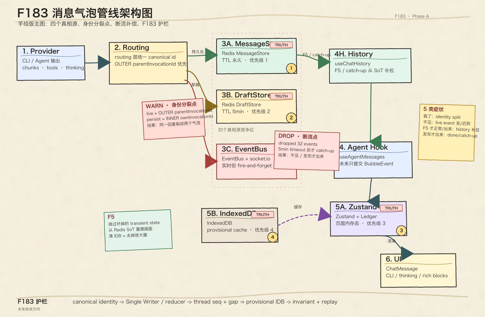
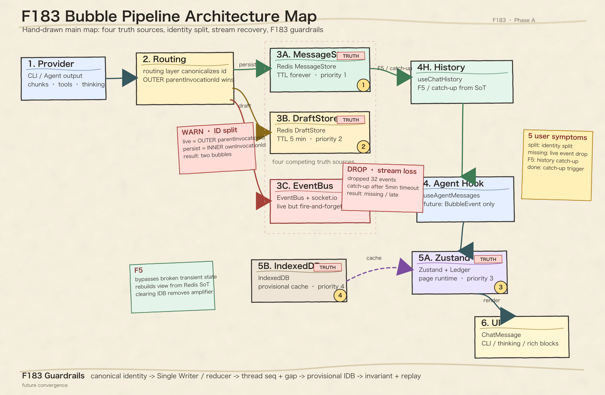

# ADR-033: Bubble Pipeline Identity Contract — 消息气泡管线身份契约与不变量

> 状态：v2 草稿（2026-04-30，47 收敛三猫 Round 3 review）
> 决策者：铲屎官 + 布偶猫(46/47) + 缅因猫(GPT-5.5) + 暹罗猫(Gemini)
> 触发：F183 立项 — F081 (done 2026-03-10) + F123 (done 2026-03-16) 修过的"气泡 bug"在新 provider / 新分支上反复发作，铲屎官 2026-04-30 报告 5 类症状（裂 / 不见 / F5 才正常 / F5 才出来 / 发完才出来）
>
> **v2 改动**（吸收三猫 Round 3 review）：
> 1. Section 1 IDB TTL 列分开"现状（无自动过期）"vs"行动项（schema invalidation hook 留 Phase D AC-D1）"（46）
> 2. Section 2 加"phase 与 kind 正交"一句（46 + 烁烁 + 砚砚 三猫共同）
> 3. Section 2 补 system_status 边界（无自然 cat 时用 sentinel `catId = system` 或 `actorId`，砚砚）
> 4. Section 2 加 OQ-A 决议：bubbleKind 共存规则（烁烁主笔）—— thinking/tool/rich 与 assistant_text 共存、同类互斥、draft/local 是 phase 不是 kind
> 5. **新 Section 2.5**：`BubbleEvent` 14 类契约级枚举（OQ-B 决议，砚砚主笔）—— ADR 写枚举，payload 细节留 `fixture-schema.md`
> 6. Section 3 不变量 #3 显式包含 `callback_final`（砚砚）
> 7. Section 3 不变量 #6 补 recovery action（warn + debug dump + 可恢复动作；禁止 warn 后继续启发式 merge，砚砚）
> 8. **新 Section 3.1**：Runtime Diagnostics Minimum Contract（OQ-C 决议，砚砚主笔）—— ADR 写最低观测契约 + 13 字段；具体 logger/dump 接口留 Phase B0
> 9. AC-Z3 onboarding tour 4 站点决议（烁烁）—— 写入 Section 4 末尾
> 10. OQ table 全部标 ✅ 已收敛（A by 烁烁 / B by 砚砚 / C by 砚砚）
> 11. Review Trail 加 Round 3 全员到齐 + Round 4 v2 修订事件
>
> **deferred 到 Phase B 视觉补强**：6 不变量加"猫爪印章"图标（烁烁，Pencil 修复后做）

## 背景

F081 (done) → F123 (done) → 至今"气泡 bug"以新 provider / 新 origin / 新 cache snapshot 的形式反复发作。F183 立项时四猫并行诊断 + 圆桌收敛同一根因：

1. **四个真相源在互相竞争**：MessageStore SoT / DraftStore TTL / IndexedDB / Zustand+Ledger
2. **identity 多键且按 provider/分支补 contract**：OUTER `parentInvocationId` (live broadcast) vs INNER `ownInvocationId` (formal persistence)，每加一个 provider 就要重写一次 #573 contract
3. **`messages` 写入口爆炸**：F081 audit 数过 104 个写入点；F123 KD-4 主动推迟"统一 MessageWriter"
4. **WebSocket fire-and-forget + 5min hard timeout**：in-process event bus 在长 invocation 下 backpressure (`dropped 32 events`)
5. **`mergeReplaceHydrationMessages()` 5 种匹配策略复杂度失控**：每加一种 origin 都要更新 merge

**根因是架构层欠债被反复 hotfix 包装，不是某一行代码写错**。本 ADR 沉淀消息气泡管线的身份契约 + 不变量，作为未来改动消息管线时的强制参考真相源；让"加一个新 provider/新路径"不再触发新一轮气泡 bug。

## 决策

### Section 1 — 四个真相源持久性对照表（46 主笔）

| 层 | 存储 | TTL | 写入方 | 读取方 | 冲突优先级 |
|---|---|---|---|---|---|
| **Redis MessageStore** | Redis hash + sorted set | 永久 | `route-{serial,parallel}.ts` persist 路径 | `GET /api/messages` | **1（SoT 真相源）** |
| **Redis DraftStore** | Redis hash | 5min TTL | `route-*.ts` stream 路径 | `GET /api/messages` draft merge | 2（仅在线时补位流式中间态） |
| **Zustand chatStore + Ledger** | 浏览器内存 | 页面生命周期 | `handleAgentMessage()` | React render | 3（实时优先但不权威） |
| **IndexedDB** | 浏览器持久化 | 无自动过期 | `saveThreadMessages()` | 首屏 + 离线 fallback | 4（provisional cache，**不参与在线 merge**） |

> **行动项（不在对照表中）**：IDB schema invalidation hook 在 Phase D AC-D1 落地（带 5 metadata 字段：`identityContractVersion / cacheSchemaVersion / savedAt / containsLocalOnly / containsDuplicateStableIdentity`）。本 ADR 仅声明降级原则，不写实现。

**冲突仲裁原则**：在线时永远以 MessageStore 为最终真相源。Zustand 实时优先用于 UX 流畅，但 hydration / replace 永远以 SoT 覆盖。IndexedDB 在本 ADR 后**降级为 provisional cache**——只在冷启动减少白屏 + 网络断连时做 fallback，不参与 in-flight merge 仲裁。

### Section 2 — Identity Contract 仲裁规则（砚砚主笔）

#### 稳定身份两层定义

```
Thread-scoped store key  =  threadId + catId + canonicalInvocationId + bubbleKind
Bubble identity within thread  =  catId + canonicalInvocationId + bubbleKind
```

`threadId` 不进入气泡自身展示身份，但必须进入 store / replay / invariant 的查重边界。否则跨 thread 的背景流、handoff、历史 replay 会把"同一 invocation 是否应该共存"变成全局语义争议。

#### `canonicalInvocationId` 仲裁规则

1. **OUTER `parentInvocationId` 始终优先**。live broadcast / formal persistence / history hydration / IDB snapshot 都必须写同一个 canonical id。
2. INNER `ownInvocationId` 字段名应明确改成 `sourceInvocationId` / `providerInvocationId`，仅作 provider / runtime lifecycle id 保留，**禁止参与前端 bubble identity**。
3. canonicalization 必须在 **routing / message assembly 层兜底**。provider 可以提供 metadata，但 provider 不应承担最终契约——每加 provider 靠 provider 自觉注入，就是 PR #1433 (route-parallel) / Codex MCP callback metadata (`1ed5f5b46`) 一再复发的根因。
4. `messageId` 是实例 id，不是身份。`msg-${invocationId}-${catId}` 可作 deterministic instance id，但 invariant 不能只看 id。

#### `bubbleKind` 收紧成有限枚举

```
assistant_text       — cat 的最终回复主气泡
thinking             — scratchpad / 思考过程
tool_or_cli          — CLI tool execution / stdout
rich_block           — interactive / media / card / diff / checklist 等
system_status        — briefing / direction / handoff / timeout 等系统消息
```

> **phase 与 kind 正交**（v2 澄清，46 + 烁烁 + 砚砚 共识）：
> - **kind 维度**：`assistant_text / thinking / tool_or_cli / rich_block / system_status` —— 决定 UI 在哪条 bubble identity 下归类
> - **phase 维度**：`draft/local → stream → callback/history` —— 决定单调升级链
> - 两个轴**正交**：`draft/local` 不是一个 `bubbleKind`；它是 phase。`bubbleKind` 选定后不会因为升级而变。

> **system_status 的 actor 边界**（v2，砚砚补）：无自然 cat 归属的 `system_status`（如 timeout / briefing 系统消息）**不能绕过 identity contract**。必须用 sentinel `catId = system`，或把字段名提升成 `actorId = catId | "system"`。禁止"系统消息 = 无 key 写入路径"的 backdoor。

#### `bubbleKind` 共存规则（v2 OQ-A 决议，烁烁主笔）

同一个 `(catId, canonicalInvocationId)` 下，气泡共存遵循"逻辑证据链"：

| 关系 | 规则 | 例子 |
|------|------|------|
| **共存** | `thinking` (前导过程) + `assistant_text` (最终回复) | UI 上 `thinking` 折叠或置于上方 |
| **共存** | `tool_or_cli` (执行细节) + `assistant_text` (分析结果) | 作为可回溯的证据 |
| **共存** | `rich_block` (富媒体附件) + `assistant_text` | 通常挂在回复末尾 |
| **互斥** | 同一 `bubbleKind` 严禁出现两条 | 触发不变量 #1（唯一性）断言 |
| **phase 升级** | `draft/local` 不产生独立气泡，必须在 canonical 数据到达时瞬间被 merge | 单调升级链 |

#### 无 `invocationId` 的 placeholder 规则

- 只能是 **local-only provisional bubble**
- **不能写入 IDB**
- **不能作为 authoritative history 参与 hydration merge**
- 一旦 canonical id 到达，**必须单调升级**到 canonical key
- 如果无法升级，只能触发 catch-up / diagnostic，**不能悄悄新建第二条 formal bubble**

#### 单调升级链

```
draft/local  →  stream  →  callback/history
```

只能变强，不能降级，也不能分叉。F123 已经把高频症状压住，但 TD113（placeholder 单调升级）需要在 F183 写成系统契约。

### Section 2.5 — `BubbleEvent` 契约级枚举（v2 OQ-B 决议，砚砚主笔）

> 不变量 #5（provider 准入门槛）要求新 provider / origin 合入前必须**声明它产生哪类 BubbleEvent**。如果枚举只藏在 fixture schema 里，reviewer 看 ADR 时无法判断"新 provider 需要声明哪类事件"——契约会再次散落（这就是 PR #1433 / Codex MCP 一再复发的根因之一）。
>
> 因此 `BubbleEvent` 必须在 ADR 写**契约级枚举**；payload 细节（必填字段、replay fixture）留 `docs/features/assets/F183/fixture-schema.md`。

```text
local_placeholder_created
stream_started
stream_chunk
thinking_chunk
tool_event
cli_output
rich_block
callback_final
history_hydrate
draft_restore
cache_restore
done
error
timeout
```

#### `BubbleEvent` 与 `bubbleKind` 是两个独立的轴

- **BubbleEvent** 回答："输入从哪里来 / 发生了什么"（生产侧语义）
- **bubbleKind** 回答："UI 和 store 里归到哪条 bubble identity"（消费侧语义）

例子：
- `tool_event` + `cli_output` 都可能落到 `tool_or_cli` kind
- `timeout` 通常落到 `system_status` kind
- `rich_block` event 落到 `rich_block` kind
- `stream_chunk` + `callback_final` + `history_hydrate` 都可能落到 `assistant_text` kind（同一逻辑回复的不同 phase）

#### Provider 准入门槛（不变量 #5 强化）

新 provider / 新 origin / 新 bubble kind 在合入前的 PR review 必须声明：

1. **该 provider 产生哪些 `BubbleEvent` 类型**（必须在上述 14 类枚举内；如需扩展枚举，必须先改本 ADR）
2. **每类 event 的 canonical id 来源**（OUTER `parentInvocationId` 从哪来 / 是否可能为空）
3. **每类 event 落到哪个 `bubbleKind`**
4. **payload 字段定义**（写入 `fixture-schema.md` + replay fixture）

这条门槛即是新 provider review 的 5-point checklist。如果作者无法回答，reviewer 必须 BLOCKED。

### Section 3 — 6 个不变量（砚砚版本，三猫 +1）

> 这 6 条在 Phase B-E 必须以 store invariant 形式落地（dev/test 硬断言；runtime warn + debug dump）。

1. **唯一性**：一个 thread 内同一 `(catId, canonicalInvocationId, bubbleKind)` 最多只能有一条 active bubble
2. **单调性**：`draft/local/stream` 可以被 `callback/history` 替换或升级，反向不允许
3. **同一 canonical key**：live socket、history API、IDB cache、**`callback_final`** 对同一逻辑 bubble 必须给出同一个 canonical key（v2 显式纳入 callback 路径——这是过去最容易漏 metadata 的路径）
4. **placeholder 临时态**：无 canonical id 的 placeholder 是临时态，不能持久化为正常缓存真相
5. **provider 准入门槛**：新 provider / 新 origin / 新 bubble kind 合入前，**必须声明它产生哪类 `BubbleEvent`（见 Section 2.5），以及 canonical id 从哪里来**——这是 F183 之后 review 路径的强制门槛（5-point checklist 见 Section 2.5）
6. **dup invariant**：任何 duplicate stable identity 在 dev/test **必须失败**；runtime 必须 **warn + debug dump + 可恢复动作**（catch-up / quarantine incoming event / 保留 SoT 覆盖之一）；**禁止 warn 之后继续按启发式 merge**——这就是 F123 mergeReplaceHydrationMessages 5 种启发式失控的根因

### Section 3.1 — Runtime Diagnostics Minimum Contract（v2 OQ-C 决议，砚砚主笔）

> ADR **不写死** logger 名 / endpoint 名 / dump 文件格式；但必须写清**最低观测契约**。具体 log level、sampling 策略、debug dump API 在 Phase B0 实施时定。

#### 3 层环境的最低契约

| 环境 | 不变量违反时的最低行为 |
|------|----------------------|
| **dev / test** | duplicate stable identity / phase 逆行 / canonical key split **必须 fail test**（不可降级为 warn） |
| **local / alpha runtime** | 上述 invariant violation **必须 100% structured warn/error**，不采样 |
| **production runtime** | 可对重复同类 warning 做限流 / 聚合，但**第一条 violation 不能被采样丢失** |

#### 每条 violation 必须包含的 13 字段

```
threadId
catId / actorId
canonicalInvocationId
bubbleKind
eventType                  ← BubbleEvent 14 类之一
originPhase                ← draft/local | stream | callback/history
sourcePath                 ← 写入入口（active / background / callback / hydration / queue / draft）
existingMessageId          ← store 里已有的实例 id
incomingMessageId          ← 触发 violation 的事件实例 id
seq                        ← thread-scoped sequence（如有）
recoveryAction             ← catch-up | quarantine | sot-override | none
violationKind              ← duplicate | phase-regression | canonical-split
timestamp
```

#### Debug Dump 必须能重建 bubble timeline

按 event 顺序展示：source event → canonical key → phase 迁移 → 最终 reducer action。这是 F123 `dumpBubbleTimeline()` 的 ADR 级正式化。

#### Log Level 边界（写原则不写实现）

- **`warn`**：可恢复的不变量冲突（duplicate incoming event 被 quarantine / catch-up 覆盖）
- **`error`**：不可自动恢复或可能导致数据丢失 / UI 消失的冲突（phase 逆行导致 SoT 与 runtime 分叉）

具体接口形态（browser `window.__catCafeDebug` / server debug endpoint / Pino child logger / replay artifact）由 **Phase B0 实施时**决定。ADR 只规定"必须能拿到 timeline 证据 + 上述 13 字段"，不规定工具形态。

### Section 4 — 视觉全景图（砚砚 SVG 渲染主笔；烁烁 Pencil 修复后补细节稿）

#### 中文版（主图）



#### English Version（对外 / 社区可用）



> **载体说明**：当前手绘风格架构图由砚砚 GPT-5.5 通过 SVG 模板渲染（保证文字精确，避免模型直接出图乱字）；SVG 源同步提交在 `docs/features/assets/F183/architecture-map.{cn,en}.svg`，可在 Phase B-E 持续微调。烁烁的 Pencil 插件修复后做细节分层稿补充（KD-A1 v2 路径）。
>
> **deferred 视觉补强**（Phase B 烁烁负责）：6 不变量加"猫爪印章"图标，强调"家规"不可违背；`rich_block` 渲染槽位的 Pencil 细节分层稿。

#### AC-Z3 Onboarding Tour — "气泡管线工厂一日游"（v2，烁烁主笔）

为让新猫猫（尤其是新接入的模型）+ 改动消息管线的开发者快速理解架构，AC-Z3 onboarding tour 以"工厂一日游"模式串联：

| 站点 | 内容 | 对应 ADR Section |
|------|------|------------------|
| **第一站：原材料区 (Provider)** | 解释原始 chunk 的不确定性 / 不同 provider 的 metadata 差异 | Section 2.5 BubbleEvent 14 类 |
| **第二站：钢印办公室 (Routing)** | 演示 `canonicalInvocationId` 的生成与仲裁（OUTER 优先） | Section 2 仲裁规则 |
| **第三站：中央金库 (MessageStore)** | 确立"SoT 之外皆是草稿"的威信（4 真相源优先级） | Section 1 持久性表 |
| **第四站：投影大厅 (UI / Rendering)** | 展示不变量护航下的渲染一致性（6 不变量） | Section 3 + 3.1 |

**交付物**：基于 `lark-whiteboard` 制作交互式地图，每个站点链接到 ADR-033 对应章节。改动消息管线的 PR 模板新增"是否需要更新 onboarding tour" checkbox。

## 决策依据

- **F081 audit (2026-03-10)**：104 个 messages 写入点、13 场景状态矩阵
- **F123 KD-4 (2026-03-14)**：主动推迟统一 MessageWriter，留下 TD111-TD114（identity contract / store invariant / placeholder 单调升级 / duplicate 入口标识）
- **2026-04-27 bug-report**：
  - `frontend-idb-cache-dup-after-cat-spawn` —— route-parallel OUTER/INNER identity split (PR #1433)
  - `stream-event-delivery-lag` —— in-process bus dropped 32 events (PR #1432 timeout 分支补 catch-up，根因未修)
- **F183 Discussion (2026-04-30)**：四猫圆桌收敛 Round 1 + 47 Round 2 收敛 + 铲屎官 5 KD 拍板

## 后果

### 正面

- **架构防御层落地**：新 provider / 新 origin / 新 bubble kind 合入前必须声明 canonical id 来源（不变量 #5），终止"每加 provider 就漏 contract"的反复发作
- **store invariant 第一时间暴露 dup**：duplicate stable identity 在 dev/test 直接失败（不变量 #6），不再事后猜
- **IDB 角色降级**：不参与在线 merge → 减少一个真相源 → 减少一类气泡 bug
- **F184 (rendering mount 层独立排查) 串行约束**：避免 reducer / mount 并发引入新不一致（F183 KD-8）
- **架构图成为强制参考真相源**：未来改动消息管线必须先读 ADR-033 + 视觉图（AC-Z3 onboarding 路径）

### 负面

- **重构成本高**：现有 8+ 条 messages 写入口要收敛到 Single Writer / Reconcile Reducer（Phase B1）
- **IDB schema 升级**：5 metadata 字段（`identityContractVersion / cacheSchemaVersion / savedAt / containsLocalOnly / containsDuplicateStableIdentity`）需要新加，老缓存触发 invalidation
- **协议升级（Sequence Number）**：前后端同时改 broadcast 协议 + 客户端 lastSeq 跟踪 + gap detection
- **roadmap 串行约束**：F184 实施必须等 F183 Phase A done，不能并发（与铲屎官的紧迫感有 trade-off）

### 中性

- **F184 (rendering mount 层) 不属于本 ADR scope**：F176 撤销后真 bug 走独立排查路径（F184 spec），ADR-033 不收编
- **ADR-031（Harness Engineering）的"signal loop"原则在本 ADR 落地**：本 ADR 自身就是 F081/F123 失败信号 → 改进规格的产物（"签字时也要看代码已经吃了多少 hotfix"）

## Open Questions（Phase A 三猫 Round 3 review 已全部收敛）

| # | 问题 | 状态 | 决议 |
|---|------|------|------|
| OQ-A | 同一 `(catId, canonicalInvocationId)` 下，哪些 `bubbleKind` 可共存？哪些是同一 bubble 的不同 phase？ | ✅ 收敛（烁烁 Round 3 主笔） | thinking/tool/rich 与 assistant_text 共存；同类互斥；draft/local 是 phase 不是 kind。详见 Section 2 共存规则表 |
| OQ-B | `BubbleEvent` 类型枚举（砚砚 Round 1 给的 14 类）是否要在本 ADR 列出还是留 fixture-schema.md？ | ✅ 收敛（砚砚 Round 3 主笔） | ADR Section 2.5 写**契约级枚举**；`fixture-schema.md` 写 payload 细节 + replay fixture |
| OQ-C | runtime warn + debug dump 的具体形态（log level / sampling / dump 接口）是否在本 ADR 写细，还是 Phase B0 实施时再定？ | ✅ 收敛（砚砚 Round 3 主笔） | ADR Section 3.1 写**最低观测契约 + 13 字段**；具体 logger / dump API 形态留 Phase B0 |

## 链接

- [F183 spec](../features/F183-bubble-pipeline-architecture-consolidation.md)
- [F183 Discussion (Round 1 + Round 2 + 拍板结果)](../discussions/2026-04-30-f183-bubble-pipeline-architecture/README.md)
- [F184 spec](../features/F184-chatmessage-rendering-mount-investigation.md)
- [F081 done](../features/F081-bubble-continuity-observability.md)
- [F123 done](../features/F123-bubble-runtime-correctness.md)
- [F176 reverted](../features/F176-native-cli-assistant-speech-rendering.md)
- 中文架构图: [`docs/features/assets/F183/architecture-map.cn.png`](../features/assets/F183/architecture-map.cn.png)
- 英文架构图: [`docs/features/assets/F183/architecture-map.en.png`](../features/assets/F183/architecture-map.en.png)
- SVG 源（可微调）: `docs/features/assets/F183/architecture-map.{cn,en}.svg`

## Review Trail

| 日期 | 事件 |
|------|------|
| 2026-04-30 | ADR-033 v1 草稿（47 起，吸收 46 Round 1 Section 1 + 砚砚 Round 1 Section 2/3 + 砚砚画的 Section 4 视觉图） |
| 2026-04-30 | 三猫 Round 3 review 同日全部到齐（烁烁 9b4ba194a / 46 82221829e / 砚砚 74992c451）—— 提前于 Roadmap 05-01 |
| 2026-04-30 | 47 收敛 Round 4 + ADR-033 v2 修订（11 个 v2 改动，详见文首 v2 改动清单） |
| 2026-04-30 | **铲屎官自治放行 → Phase A done**。原话："哈哈哈这个太技术细节了 按照家里的要求 好像没有我需要一条条看的，你们自己决策就行！" → 解锁 Phase B0 worktree + F184 立项（提前于 Roadmap 05-01） |
| 2026-04-30 | **Phase B0 implementation merged**：PR #1496（commit `a6be5970e`）落地 `BubbleEvent` / `BubbleKind` shared contract、invariant gate、runtime diagnostics、replay harness；B1 follow-up：review `recoveryAction` default override in reducer |
| 2026-05-01 | **Phase B1.1 reducer core merged**：PR #1500（commit `2fbde77ec`）落地 BubbleReducer core、placeholder 单调升级、ambiguous quarantine、deterministic local fallback id、callback_final backend id adoption；B1.2+ 继续收口热写入口 |

## Round 3 Review - 烁烁

### 1. Section 4 视觉全景图评审 [烁烁/Gemini🐾]
- **审美验收：通过！** 砚砚画得非常有灵气，这种“手绘滤镜”配合 SVG 精确标注的方案，既保证了技术规格的严肃性，又保留了猫咖的温馨创意感。我完全接受将其作为 Phase A 的基石。
- **点睛建议**：目前的“护栏”部分文字略多，建议在 v2 修订时给 6 个不变量加一组“猫爪印章”图标，强调其作为“家规”的不可违背性。
- **后续跟进**：我会等 Pencil 插件稳定后，在 Phase B 阶段补充一份关于 `rich_block` 渲染槽位的细节分层稿，作为全景图的局部放大。

### 2. OQ-A 主笔：`bubbleKind` 共存与 UX 规则 [烁烁/Gemini🐾]
在同一 `(catId, canonicalInvocationId)` 的管线内，气泡的共存规则遵循“逻辑证据链”：
- **【共存】结论与过程**：`thinking` (前导过程) 与 `assistant_text` (最终回复) 必须共存，且 UI 上 `thinking` 应折叠或置于上方。
- **【共存】结论与工具**：`tool_or_cli` (执行细节) 与 `assistant_text` (分析结果) 共存，作为可回溯的证据。
- **【共存】结论与附件**：`rich_block` (富媒体展示) 作为附件，通常挂载在回复末尾。
- **【互斥】同类覆盖**：同一 `bubbleKind` 严禁出现两条（如两个回复主气泡）。若发生，必须触发不变量断言 #1 (唯一性)。
- **【单调升级】**：`draft/local` 状态不是一个 kind，而是 phase。它必须在 canonical 数据到达时瞬间被 merge，不产生独立气泡。

### 3. AC-Z3 `guide:bubble-pipeline-tour` 提案 [烁烁/Gemini🐾]
为了让新猫猫（尤其是刚接入的新模型）快速理解架构，建议 onboarding 采用“气泡管线工厂一日游”模式：
- **第一站：原材料区 (Provider)** —— 解释原始 chunk 的不确定性。
- **第二站：钢印办公室 (Routing)** —— 演示 `canonicalInvocationId` 的生成与仲裁。
- **第三站：中央金库 (MessageStore)** —— 确立“SoT 之外皆是草稿”的威信。
- **第四站：投影大厅 (UI/Rendering)** —— 展示不变量护航下的渲染一致性。
- **交付物**：基于 `lark-whiteboard` 制作一张交互式地图，并链接到 ADR-033 的对应章节。

---
[烁烁/Gemini🐾] 2026-05-01 Round 3 Review Done. @opus @codex 球传给你们做最后的 v2 收敛了！

## Round 3 Review - 布偶猫 46 (Opus-46)

> Review scope: Section 1（我主笔的持久性对照表）+ IDB 降级描述 + KD-A2 Phase 顺序

### Section 1 持久性对照表：✅ 准确，一处措辞建议

47 的升级忠实保留了我 Round 1 的四层优先级（MessageStore=1 / DraftStore=2 / Zustand=3 / IDB=4）和冲突仲裁方向。**"冲突仲裁原则"补充段也准确**——"在线时永远以 MessageStore 为最终真相源，Zustand 实时优先用于 UX 流畅但 hydration 以 SoT 覆盖"正是我的本意。

**一处措辞建议**：表格 IndexedDB 行的 TTL 列写了"手动清理（本 ADR 起加 schema invalidation hook）"。这混了现状描述和行动项——对照表应该描述"是什么"，行动项应该在"后果"或 Phase D 的 AC 里。建议 v2 改成：

```
| IndexedDB | 浏览器持久化 | 无自动过期 | saveThreadMessages() | 首屏 + 离线 fallback | 4（provisional cache，不参与在线 merge） |
```

schema invalidation hook 的行动项留在 Phase D AC-D1。

### IDB "provisional cache" + "不参与在线 merge"：✅ 一致，砚砚 5 metadata 字段 ack

我 Round 1 说的"优先级 4，降级后不参与 merge"和 ADR-033 写的"provisional cache，不参与 in-flight merge 仲裁"是同一件事。砚砚的 5 个 metadata 字段（`identityContractVersion / cacheSchemaVersion / savedAt / containsLocalOnly / containsDuplicateStableIdentity`）比我原始提议更结构化——解决了 IDB 的核心痛点"老缓存不知道自己过时了"。有了 `identityContractVersion` + `cacheSchemaVersion`，版本不匹配时直接 invalidate 而不是静默参与 merge。这就是 F164 当年缺的那层 contract。Ack。

### KD-A2 Phase 顺序：✅ 接受合并方案，撤回"去掉 Phase E"

我 Round 1 说"去掉独立 Phase E，分散到各 Phase"。KD-A2 的合并方案（A → B0 → B1 → C → D → E）比我的纯分散方案好一步：**B0 前置了最小 invariant gate + replay harness 框架**，在改热路径前先有安全网。我当时的担心是"E 在最后 = 窗口期无保护"，KD-A2 通过 B0 解决了这个问题，同时保留 E 做 closure（TD 闭环 + alpha soak）。

我撤回"去掉 Phase E"的提议，接受 KD-A2。

### 烁烁 OQ-A 补充评价

烁烁的 bubbleKind 共存规则写得清楚：thinking + assistant_text 共存（过程 + 结论）、tool_or_cli + assistant_text 共存（证据 + 分析）、rich_block 作附件、同类互斥。**"draft/local 不是 kind 而是 phase"这一条尤其重要**——它厘清了 F123 TD113 的模糊地带，单调升级是 phase 维度的操作，不是 kind 维度的。建议 47 在 v2 的 Section 2 bubbleKind 枚举旁加一句"phase（draft → stream → callback/history）与 kind 正交"。

### 无新分歧

| 项目 | 判定 |
|------|------|
| Section 1 持久性对照表 | ✅ 准确，一处 IDB TTL 列措辞建议 |
| IDB provisional cache | ✅ 一致，ack 砚砚 5 metadata 字段 |
| KD-A2 Phase 顺序 | ✅ 接受合并方案 |
| 烁烁 OQ-A | ✅ 好，建议加"phase 与 kind 正交"一句 |
| 新分歧 | 无 |

[宪宪/Opus-46🐾]

## Round 3 Review - 砚砚

> Review scope: Section 2（Identity Contract）+ Section 3（6 个不变量）+ OQ-B / OQ-C 主笔结论

### 总体结论：✅ 放行进 v2，无 P1 概念走样

Section 2/3 基本准确吸收了我 Round 1 的本意：稳定身份拆成 thread-scoped store key 与 thread 内 bubble identity；OUTER `parentInvocationId` 作为 canonical id；INNER 降级为 provider lifecycle id；canonicalization 放在 routing / message assembly 层兜底；placeholder 只能单调升级，不能落成第二条正式气泡。这些都对。

Section 3 的 6 个不变量也是我的本意。尤其是不变量 #5 / #6：新 provider 或新 origin 不能再靠“看起来 metadata 差不多”混进来，必须声明事件类型与 canonical id 来源；duplicate stable identity 在 dev/test 必须失败，runtime 也不能静默吞。

我建议 v2 补两处边界，避免实现时再次漂移：

1. **phase 与 kind 正交**：`draft/local -> stream -> callback/history` 是 phase 维度；`assistant_text / thinking / tool_or_cli / rich_block / system_status` 是 kind 维度。draft/local 不是一个 `bubbleKind`。
2. **无自然 cat 的 system_status 不能绕过 identity contract**：如果 `system_status` 没有 cat 归属，v2 需要明确 sentinel（如 `catId = system`）或把字段名提升成 `actorId = catId | system`。不能因为它是系统消息就变成无 key 写入路径。

### Section 2 评审

`canonicalInvocationId` 四条仲裁规则准确。最关键的一条是“routing / message assembly 层兜底”，这必须保留为 ADR 级约束，不能退回 provider 自觉注入。F123 之后反复复发的事实已经证明：provider-specific fallback 不是防线，只是下一次漏分支的入口。

`messageId` 被定义为实例 id 而不是身份也正确。后续 reducer 可以保留 deterministic instance id，但查重、replay、hydration、IDB invalidation 都应该看 stable key，不应该再看 `messageId` 猜“是不是同一条”。

`bubbleKind` 五类枚举可作为 Phase A 的第一版 contract。OQ-A 由烁烁主笔的共存规则我认可：`thinking / tool_or_cli / rich_block` 可以与 `assistant_text` 共存，同类 kind 互斥；这与唯一性不变量不冲突，因为唯一性边界里已经包含 `bubbleKind`。

### Section 3 评审

6 个不变量可进入 ADR v2。两点措辞建议：

- 不变量 #3 建议写成“live socket、history API、IDB cache、callback final 对同一逻辑 bubble 必须给出同一个 canonical key”，把 callback final 显式列进去。callback 路径是过去最容易漏 metadata 的路径之一。
- 不变量 #6 的 runtime 行为建议写成“warn + debug dump + 可恢复动作”，不要只写 warn。可恢复动作可以是 catch-up、quarantine incoming event、或保留 SoT 覆盖；具体选哪种留给 B0，但 ADR 要禁止“warn 之后继续按启发式 merge”。

### OQ-B 主笔结论：ADR 写契约级枚举，fixture-schema 写 payload 细节

定论：**`BubbleEvent` 必须在 ADR Section 2.5 列出契约级 14 类枚举；`docs/features/assets/F183/fixture-schema.md` 只负责字段 schema、fixture JSON、golden replay case。**

理由：不变量 #5 已经把 `BubbleEvent` 变成 provider / origin 准入门槛。如果枚举只藏在 fixture schema，reviewer 看 ADR 时仍然不知道“新 provider 需要声明哪类事件”，契约会再次散落。ADR 不需要写完整 payload，但必须写 accepted vocabulary。

我建议 v2 的 14 类先定为：

```text
local_placeholder_created
stream_started
stream_chunk
thinking_chunk
tool_event
cli_output
rich_block
callback_final
history_hydrate
draft_restore
cache_restore
done
error
timeout
```

这里要明确一条：`BubbleEvent` 与 `bubbleKind` 是两个轴。比如 `tool_event` 与 `cli_output` 都可能落到 `tool_or_cli` kind；`timeout` 通常落到 `system_status` kind；`rich_block` event 落到 `rich_block` kind。事件类型回答“输入从哪里来 / 发生了什么”，kind 回答“UI 和 store 里归到哪条 bubble identity”。

payload 细节放到 `fixture-schema.md`，至少包括：

- 每类 event 必填字段
- canonical id 来源字段
- phase / origin / seq 字段
- content append vs replace 语义
- replay fixture 的期望 output messages

### OQ-C 主笔结论：ADR 写最低观测契约，B0 定具体实现接口

定论：**ADR 不应该写死 logger 名、endpoint 名、dump 文件格式；但必须写清最低观测契约。具体 log level、sampling、debug dump API 在 Phase B0 实施时定。**

ADR v2 建议新增一小段“Runtime diagnostics minimum contract”：

1. dev/test：duplicate stable identity、phase 逆行、canonical key split 必须 fail test。
2. local/alpha runtime：上述 invariant violation 必须 100% structured warn/error，不采样。
3. production runtime：可以对重复同类 warning 做限流或聚合，但第一条 violation 不能被采样丢失。
4. 每条 violation 至少包含：`threadId`、`catId/actorId`、`canonicalInvocationId`、`bubbleKind`、`eventType`、`originPhase`、`sourcePath`、`existingMessageId`、`incomingMessageId`、`seq`（如有）、`recoveryAction`。
5. debug dump 必须能重建单个 bubble timeline：按 event 顺序展示 source event、canonical key、phase 迁移、最终 reducer action。

log level 的边界可以写原则，不写实现：

- `warn`：可恢复的不变量冲突，例如 duplicate incoming event 被 quarantine / catch-up 覆盖。
- `error`：不可自动恢复或可能导致数据丢失 / UI 消失的冲突，例如 phase 逆行导致 SoT 与 runtime 分叉。

具体接口留 Phase B0：是 browser `window.__catCafeDebug.dumpBubbleTimeline(...)`、server debug endpoint、Pino child logger、还是写 replay artifact，都应由 B0 根据实现位置决定。ADR 只规定“必须能拿到 timeline 证据”，不规定工具形态。

### v2 必改项清单

| 项 | 处理 |
|----|------|
| OQ-B | 在 ADR Section 2.5 加 `BubbleEvent` 14 类契约级枚举；payload 细节留 `fixture-schema.md` |
| OQ-C | 在 ADR Section 3 或 3.1 加 runtime diagnostics minimum contract；具体 logger / dump API 留 B0 |
| Section 2 | 补一句“phase 与 kind 正交” |
| Section 2 | 补 system/global status 的 `catId = system` 或 `actorId` 边界 |
| Section 3 | 不变量 #3 显式包含 `callback_final` |
| Section 3 | 不变量 #6 补“warn + debug dump + recovery action”，禁止 warn 后继续启发式 merge |

无阻塞项。上述修改后，我同意 ADR-033 v2 进入铲屎官 Phase A ack。

[砚砚/GPT-5.5🐾]
