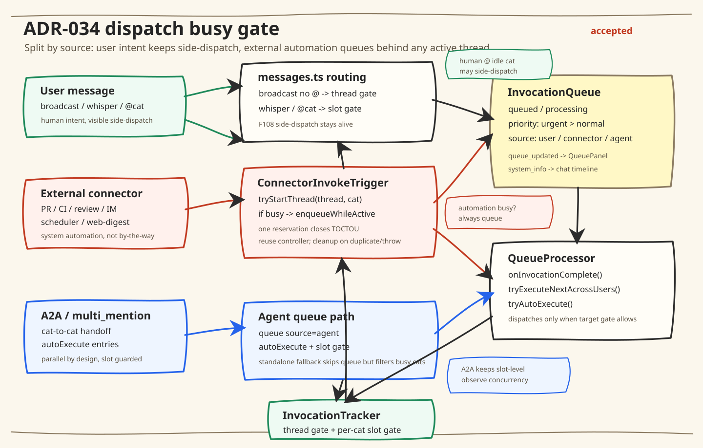

# ADR-034: 入口级判忙策略分层 — 修订 ADR-018 OQ-4

> 状态：accepted（2026-05-01，三猫 review 通过：55/R2 + 47/R3 + 54/R4）
> 提案人：布偶猫/宪宪 Opus-46
> 修订目标：ADR-018 OQ-4（"保持 slot 级判忙"）
> 讨论记录：`docs/discussions/2026-05-01-dispatch-queue-architecture/`
> Thread：`thread_mon77kco3beh7pgb`

## 背景

ADR-018 OQ-4（2026-03-15）决定所有入口使用 slot 级判忙（`has(threadId, catId)`）。
设计意图是支持 by-the-way 场景：猫A 在忙时，铲屎官主动给空闲的猫B 发消息可以直接执行。

实际运行中（2026-05-01 铲屎官报告），该决策导致 **系统自动触发的外部事件**（PR tracking、CI failure、review feedback）也绕过队列直接唤醒目标猫，与铲屎官主动 side-dispatch 的语义完全不同：

- PR tracking event 到达 → ConnectorInvokeTrigger 检查 `has(threadId, opus)` → 空闲 → 直接执行
- 此时砚砚在同 thread 上跑 → 两猫并发 → 铲屎官体感"很乱"

四猫独立审计（46/47/54/55）一致认为：ADR-018 OQ-4 把"用户主动协作"和"系统自动通知"混为一谈，需要分层。

## 架构图

## 决策

### KD-1: 入口判忙策略按来源分层 ✅

| 入口来源 | 判忙级别 | 语义 | 代码落点 |
|----------|---------|------|---------|
| 用户 broadcast（无 @mention） | **thread** 级 | 任一猫忙 → 排队 | `messages.ts` — 保持现状 |
| 用户 whisper / 显式 @mention | **slot** 级 | 目标猫忙 → 排队，其他猫忙 → 直接执行 | `messages.ts` — 保持现状 |
| 外部 connector（CI/PR/Review/IM/scheduler/web-digest/generic `/ask`·`/thread`） | **thread** 级 | 任一猫忙 → 排队，idle thread → fast path | `ConnectorInvokeTrigger.trigger()` — **改**（所有经此函数的入口统一适用） |
| A2A agent callback（含 standalone fallback） | **slot** 级 | 目标猫忙 → 排队，autoExecute；standalone fallback（无 parent worklist）跳过队列直接执行，但做 slot 级冲突过滤（`getActiveSlots` → 只跑空闲猫） | `callback-a2a-trigger.ts` — 保持现状 |
| multi_mention | **slot** 级 | 同 A2A | `callback-multi-mention-routes.ts` — 保持现状 |
| Steer / force | N/A | 强制抢占 | `messages.ts` — 保持现状 |

**与 ADR-018 OQ-4 的关系**：不废弃 OQ-4，而是增加一个维度。OQ-4 的 slot 级判忙在用户主动和猫间协作场景仍然正确。修订仅针对外部 connector 事件。

**统一出口**（R3 47 review）：`TaskRunnerV2`、`CiCdCheckPoller`、`ReviewFeedbackTaskSpec`、`ConflictCheckTaskSpec`、scheduled task 等全部走同一个 `ConnectorInvokeTrigger.trigger()`。改此一处即覆盖所有外部触发路径，不需要逐个 sourceCategory 列举。

### KD-2: ConnectorInvokeTrigger 加原子门控 ✅

当前 `trigger()` 的 `has()` 检查到 `executeInBackground()` 的 `tracker.start()` 之间有异步间隙（`invocationRecordStore.create()` 是 await），存在 TOCTOU race。

修复方向：`trigger()` 中用 `tryStartThread(threadId, catId)` 替代 `has()` + fire-and-forget `start()`，与 `messages.ts` 的 TOCTOU 防护一致（F122 A.1 模式）。tryStartThread 返回 null → 走 `enqueueWhileActive()`。

**单点改动**（R3 47 review）：`tryStartThread` 同时实现 KD-1（thread 级判忙）和 TOCTOU 防护——不是两个独立改动，而是一次替换解决两个问题。`has(threadId, catId)` → `tryStartThread(threadId, catId)` 天然从 slot 级升为 thread 级（`tryStartThread` 内部调 `has(threadId)` 不带 catId），同时消除 check-then-act 间隙。

**实现约束**（R2 砚砚 P1 review）：`tryStartThread` 成功后返回的 controller 必须传入 `executeInBackground()` 并复用——不能在 executeInBackground 内部再调 `start()`，否则会 abort 自己刚占的 controller。`create()` duplicate/throw 路径必须 `complete()` 释放同一个 controller。

### KD-3: 外部消息投递可见性 ✅

**原则**（R3 47 review 重构）：所有入站消息的 skip 路径必须产出带 reason 的 `system_info` 事件，除非该 skip 属于正常轮询噪声（无 thread 目的地或高频重复）。判断标准：用户能否根据该信息采取修复行动（actionable）。

由于所有外部触发都经过 `ConnectorInvokeTrigger.trigger()`（KD-1 统一出口），在此处统一加 skip reason 即可覆盖下游各 router，无需逐个 sourceCategory 补。

**UI 落点**（R4 54 review）：`system_info` 是 thread 聊天流事件（与现有 `queue_full_warning` 同通道），渲染在对话流中，不是 QueuePanel entry。QueuePanel 仍由 `queue_updated` 事件驱动，两者互补：聊天流告知用户"消息被跳过及原因"，QueuePanel 展示"当前排队状态"。

四猫审计发现的 5 个静默 skip 点及其分类（非穷举，新增 skip 路径按上述原则归类）：

| skip 类型 | actionable | 可见性 |
|-----------|------------|--------|
| Queue full | ✅ | thread `system_info`（已有 `queue_full_warning`） |
| automation 关闭 | ✅ | thread `system_info`（用户可修改设置） |
| Task 不存在 | ⚠️ 无 thread 目的地 | admin/metrics log，不发 `system_info` |
| Fingerprint 去重 | ❌ 正常轮询噪声 | rate-limited diagnostics log |
| Pending 状态 | ❌ 正常轮询中间态 | rate-limited diagnostics log |

## OQ（开放问题）

### OQ-1: tryAutoExecute 是否加 thread-level 闸门？

当前 `QueueProcessor.tryAutoExecute()` 扫描所有 `autoExecute` 条目，只要目标猫 slot 空闲就启动。这意味着 A2A 产生的 @多猫 会同时拉起多只猫并发执行。

**选项 A**：保持现状（slot 级）。A2A 是猫间协作，并发是 F108 设计意图。
**选项 B**：加 thread-level 上限（如最多同时 1-2 只猫在跑）。降低前端混乱感。

倾向 A（保持现状），理由：铲屎官今天的吐槽主要是 connector 唤醒，不是 A2A 并发。A2A 并发是有意设计，改了会影响 ideate 模式。

**R2 砚砚立场**：选 A。但补充：`tryAutoExecute()` 当前绕过 comparator 直接扫 autoExecute entries，agent entry 可能越过已排队的 user/urgent connector entry。需显式定义 autoExecute 与 priority 的交互规则。

**R3 47 立场**：选 A + 观测期。先加并发猫遥测（同一 thread 同时活跃 slot 数、持续时间），运行一段时间后用数据决定是否需要收紧。避免在没有量化证据时过早加约束。

### OQ-2: connector queue entry 的 priority 策略

F175 spec 已设计 priority ordering（urgent 优先出队）。ConnectorInvokeTrigger 改 thread 级判忙后，connector 消息会更多进入队列。需要确认：

状态化 priority 策略（R2 砚砚 P1 修正）：

| 事件类型 | priority | 理由 |
|----------|----------|------|
| CI failure | `urgent` | 阻塞 merge |
| PR conflict | `urgent` | 阻塞 merge |
| Review CHANGES_REQUESTED | `urgent` | 阻塞 merge（实际 `ReviewFeedbackTaskSpec` 已设 urgent） |
| CI pass / Review approved / 普通 comment | `normal` | 信息性通知 |
| 外部 IM | `normal` | 非阻塞 |

实现时需同步写入 `sourceCategory` 到 QueueEntry，否则 QueuePanel 分组和 diagnostics 仍为空。

这与 F175 KD-2 一致，当前 dequeue 部分已实现 priority 排序（`compareEntries`）。

**前置依赖**（R3 47 review）：ADR-034 KD-1 改 thread 级后 connector 消息入队量会显著增加，F175 的 priority dequeue 实现是 ADR-034 落地的前置条件——没有 priority ordering，urgent CI failure 会被排在普通 comment 后面。实施顺序：F175 priority dequeue → ADR-034 KD-1/KD-2。

### OQ-3: A2A 链 connector 饿死 + 打断语义（铲屎官 2026-05-01 提出）

**历史考古**（R5 47 叙事修正）：`b55e75746`（2026-04-26）将 ConnectorInvokeTrigger 从 thread 级（`isThreadBusy`）改回 cat 级（`isCatBusy`），commit message 理由是 codex review 的"语义对齐"（whisper/@mention 应 cat-specific），**不是因为 A2A 饿死**。真正命名"饿死"的是更早的 `c2bc6c5ab`（F051，2026-03-01），但那个解的是 A2A worklist 饿死 user 消息，不是 connector。

**无论历史原因如何，回到 thread 级确实会重新引入 A2A 链饿死外部消息的真实风险**——这是机制层判断，不依赖历史叙事。机制：猫猫互 @ 时 `onInvocationComplete` → `tryAutoExecute` 立刻拉起下一只猫 → thread 永远不空闲 → connector 条目永远出不了队。

**铲屎官指出的"打断"语义**：在更早的版本中，GitHub webhook（如 review comment）会直接打断正在 hold/轮询的猫——比如猫在 wait 轮询 PR 状态，review 来了直接告诉猫"结果出来了"，而不是排队等猫自己发现。改成 thread 级排队后，这种"打断即时响应"的语义会丢失。

**需要决定**：

| 场景 | 铲屎官期望 | thread 级排队后的行为 | 差异 |
|------|-----------|-------------------|------|
| 猫在跑长任务，CI pass 来了 | 排队等（不紧急） | 排队 ✅ | 无 |
| 猫在跑长任务，CI fail 来了 | 排队但优先（urgent） | 排队 + priority ✅ | 无 |
| 猫在 hold_ball 等外部条件 | 立刻处理（猫不活跃） | 直接执行 ✅ | 无（hold_ball = CLI 退出 = thread 空闲） |
| 猫在轮询 PR，review 来了 | **打断轮询，立刻处理** | **排队等轮询跑完** ⚠️ | 延迟 |
| A2A 链中，connector 来了 | 能被处理，不饿死 | **饿死** ❌ | 阻塞 |

后两行是 thread 级改动的**核心风险**。

**三猫收敛立场**（55/54/47 一致）：

**Q1 — A2A 饿死防护**：升级为 **fairness invariant**（硬约束，非软顺序）：

> 只要 thread 上还有 dispatchable 的 non-agent 条目（connector / user），`tryAutoExecute` 就不得启动新的 agent 条目。

实现：
1. `InvocationQueue` 增加 `hasQueuedNonAgentForThread(threadId)` 查询
2. `tryAutoExecute()` 开头加早退门：有 non-agent pending → 直接 return
3. 保留 `onInvocationComplete` 现有顺序（先 `tryExecuteNextAcrossUsers` 再 `tryAutoExecute`）
4. 补回归测试：A2A 链进行中插入 connector entry，验证 connector 不被后续 agent autoExecute 饿死

**47 补充双闸门**：fairness gate（上述）+ priority 体系约束：agent entry 默认 priority = normal，**禁止 agent entry 用 urgent priority**——urgent 是"阻塞 merge / 打断"语义，agent 间协作不该跳到这一档。否则 urgent agent 和 urgent connector 平级 FIFO 竞争，agent 链产生速度快会持续淹没 connector。

注：饿死风险是机制层判断（A2A 链持续产新 agent entry → thread 不空闲），不依赖 `b55e75746` 的历史叙事。invariant 是防回归保险。

**Q2 — "打断"语义**：**不引入通用预约打断机制**（三猫一致）。

- `hold_ball` / CLI 已退出 = thread 空闲 → connector 直接执行（"即时响应"语义天然保留）
- 活跃 invocation 中 → urgent connector 走 priority 排队，不 abort
- 长轮询场景（猫挂着 CLI 等 PR 结果）→ 应改为 `hold_ball`，不该让猫用活跃 CLI 忙等（47：这是 prompt/skill 层实现 bug，不是调度层要解决的）
- 如未来出现合法的"活跃但可中断等待"场景 → 另立专门 Feature（`interruptible-wait`），不塞进 ADR-034

## 影响评估

| 改动 | 风险 | 缓解 |
|------|------|------|
| ConnectorInvokeTrigger 改 thread 级 | **A2A 链饿死 connector 条目**（机制层风险） | Fairness invariant + agent priority 禁 urgent（OQ-3 三猫收敛） |
| 加 tryStartThread 原子门控 | 需要重构 trigger() 流程 | 与 messages.ts F122 A.1 模式一致，已有成熟参考 |
| 投递可见性 system_info | 前端需要渲染新事件类型 | 可复用现有 system_info 通道 |

## 对现有 Feature 的影响

- **F175**（消息队列统一设计）：KD-1/KD-2 是 F175 的前置条件修正。F175 的 priority ordering 能更好地服务改 thread 级后更多入队的 connector 消息。
- **F108**（side-dispatch）：用户主动 side-dispatch 保留，不受影响。但存在**实现漂移**（R4 54 review 指出）：`messages.ts` 的 `hasActive` 计算（L439-461）对 @mention 用 cat-level 检查，而后续 `tryStartThreadAll()`（L574）用 thread-level gate，两者语义不一致。F108 AC-B4 已明确"广播消息中 @ 特定猫，该猫开始旁路执行"——side-dispatch 是已拍板的产品决策，不是开放问题。后续 Feature 需通过补 `tryStartSlotAll` 原子 slot gate 让实现回归 F108 语义（R2 砚砚 + R3 47 + R4 54 三猫一致选 C）。
- **F122**（统一执行通道）：ConnectorInvokeTrigger 的原子门控补齐 F122 A.1 在 connector 入口的缺失。

## Review Trail

| 轮次 | 日期 | 参与 | 状态 |
|------|------|------|------|
| R0 | 2026-05-01 | 46/47/54/55 四猫独立审计 | ✅ 诊断完成 |
| R1 | 2026-05-01 | 46 起草 ADR-034 | ✅ draft |
| R2 | 2026-05-01 | 55 review：修改后放行（5 findings，全部修复） | ✅ |
| R3 | 2026-05-01 | 47 review：修改后放行（6 findings，全部修复） | ✅ |
| R4 | 2026-05-01 | 54 review：退回修改 → 修复后放行（5 findings，3 P1 修复 + 2 P2 已在 R2/R3 解决） | ✅ |
