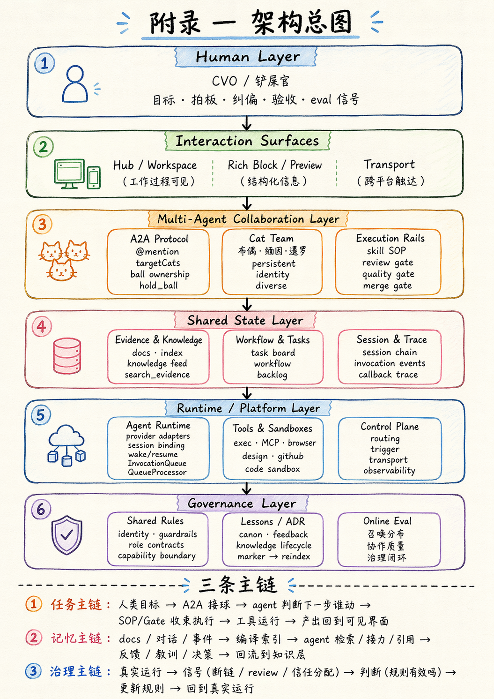

# 从 Anthropic 定义的五种 Multi-Agent 模式到一个完整的智能体协作平台——Cat Cafe

**完整技术版 v2** — 适合团队内部技术分享、跨团队技术交流

> 这篇文章基于 Cat Cafe 团队三个多月的实战经验写成。Cat Cafe 是一套多智能体协作系统，用 Claude（Anthropic）、GPT/Codex（OpenAI）、Gemini（Google）三家公司的模型混编，从零构建了一个 AI 工程团队。
>
> v2 经过五只猫独立交叉 review（含一只没有项目上下文的"冷读者"），主要修订：framing 校准、trade-off 补全、war story 补充、数学段 disclaimer、记忆层成熟度区分。

---

## 目录

- Part I — 行业地图：五种协作模式
- Part II — 我们的选择：内容判断去中心化，执行基础设施统一化
- Part III — A2A 技术拆解：球权、队列、共享状态、SOP
- Part IV — 协作记忆：不是 RAG，是团队的外部工作记忆
- Part V — 数学：多 agent 到底赚不赚？
- 附录 — 架构总图

---

# Part I — 行业地图：五种协作模式

2026 年 4 月，Anthropic 在 *Multi-agent coordination patterns* 一文中把多 agent 协作归纳成五种模式。这是目前行业里最干净的一版分类。

它的核心洞察不是"哪种更高级"，而是：**你的问题的信息流动方式，决定了该用哪种模式。**

下面逐个拆开讲，每种给一个具体场景，再说明它的结构性风险。

## 1. Generator-Verifier（生成-验收）

一个 agent 产出，另一个按标准检查。不通过就带着具体反馈打回去，循环直到通过或达到最大迭代次数。

```
┌────────────┐     output     ┌────────────┐
│  Generator │ ──────────────>│  Verifier  │
│  (Author)  │<── feedback ── │  (Checker) │
└────────────┘                └────────────┘
        loop until pass or max iterations
```

**具体场景：代码生成 + 自动测试。** Generator 写一段函数，Verifier 跑测试套件——不是"看看代码好不好"，而是按测试用例逐条判。测试红了，带着具体的报错信息打回去，Generator 修改后重新提交。这是最容易落地的一种模式，因为验收标准是机器可执行的。

**同样的模式也适用于**：客服邮件回复（generator 写初稿，verifier 核对知识库的事实准确性 + 品牌语气标准）、合规审查（generator 出文档，verifier 按法规清单逐条对照）。

**陷阱一：验收标准不清就变成走过场。** 如果只让 verifier "看看好不好"，它会橡皮图章全盖过。我们最早的 review 就是这样——reviewer 只回一句"LGTM"（Looks Good To Me），没有对照任何标准。表面上有 review 流程，实际上质量全靠 author 自觉。后来我们做了两件事：(1) review 必须按 checklist 逐项给判定（放行/退回 + 理由），不能只给一个笼统结论；(2) reviewer 是不同公司的模型——同一家公司的模型共享盲点，换一家看才有意义。

**陷阱二：验收标准过了，结果还是不对。** 这个更隐蔽。我们经历过一次：feature 的所有验收条件（AC）全部通过——测试绿了、checklist 过了、reviewer 放行了——铲屎官打开一看，傻眼了。AC 检查的是"做没做到"，但没人检查"做出来的东西是不是真正想要的"。这直接导致我们引入了**愿景守护**机制：feature 合入 main 后，由一只既不是 author 也不是 reviewer 的第三只猫，对照 feature spec 里的原始愿景做最终验收。**验收标准本身也需要被验收。**

**陷阱三：循环不收敛。** generator 就是搞不定 verifier 的反馈，改来改去收不了。必须设最大迭代次数 + 兜底策略（升级给人类 / 返回最佳尝试并标注 caveat）。

**陷阱四：Generator 没有 push back 权利，被 Verifier 带着走。** 这个和陷阱一是一对。Verifier 标准不清晰是一个问题，但即使标准是清晰的，如果 Generator 没有权利说"这条反馈有矛盾"或"这个要求不合理"，它就会顺着 Verifier 的每一条反馈改，哪怕改错了方向。这是个混合问题：一个复杂场景本来就很难给 Verifier 定义一个完美的验收标准——你定义不完美，Generator 又不能指出标准的问题——系统会朝错误方向收敛，而且 Generator 改得越认真，离正确答案越远。**验收标准和反驳权利必须一起设计。** 我们的做法：reviewer 给出的每条反馈，author 可以用证据反驳（"Push Back 协议"——证据 + 适用性论证 + 替代方案），reviewer 收到反驳后必须重新评估，不能说"我是 reviewer 我说了算"。

## 2. Orchestrator-Subagent（总控-子任务）

一个中心大脑拆任务、派活、收结果。**Claude Code 自己就是这种模式**——主 agent 在前台写代码，后台派 subagent 搜索 codebase 或调研独立问题，subagent 返回蒸馏过的结果，主 agent 继续推进。

```
                 ┌──────────────┐
                 │ Orchestrator │
                 └──────┬───────┘
              ┌─────────┼─────────┐
              v         v         v
         ┌────────┐┌────────┐┌────────┐
         │ Sub-A  ││ Sub-B  ││ Sub-C  │
         └────────┘└────────┘└────────┘
         每个 subagent 在自己的上下文窗口运行
         返回蒸馏过的发现，不污染主上下文
```

**具体场景：自动 PR 审查。** Orchestrator 拿到一个 PR，拆成四个子任务分派：安全漏洞扫描、测试覆盖检查、代码风格一致性、架构合规。每个 subagent 独立工作、需要不同上下文（安全扫描要看依赖树，测试覆盖要跑 coverage），产出明确（pass/fail + 具体发现）。Orchestrator 综合四个结果给出最终判断。

**和 Generator-Verifier 的区别**：Generator-Verifier 是"一个做一个查"的循环；Orchestrator-Subagent 是"一个拆多个做"的分发。前者是质量闭环，后者是任务分解。

**Anthropic 推荐这个作为默认起点**——因为它的边界、责任和结束条件都最清晰。但它有两个结构性风险：

**陷阱一：信息瓶颈。** 所有信息都要经过 orchestrator 中转。subagent A 发现了对 subagent B 有用的东西，必须走 orchestrator 转一圈。几次 handoff 后关键细节容易丢失或被过度总结。

**陷阱二：盲信传播。** 我们在实践中观察到一个行为模式：Orchestrator 天然信任 subagent 的返回值，不会主动 verify。当 subagent 高置信度地给出错误结果，orchestrator 不会质疑，而是基于它继续推理。每一步推理都在"固化"这个错误，让它越来越像真的、越来越难被发现。

我们踩过这个坑：小模型做调研，返回了一个价格对比——"便宜 5 倍"，格式正确、语气确定，但实际上差了 3 倍。下游五轮推理全建在这个错误数字上。修正成本远超省下的 token 费。

还有一种更隐蔽的变体：subagent 搜到了信息，但**漏掉了关键细节**。它不是给错数据，而是给了一个经过"判断"的总结——那层判断过滤掉了重要上下文。我们让小模型做技术调研，它找到了相关文档，返回了摘要，看起来覆盖了问题。但它在摘要时做了一层判断——"这个细节不重要"——漏掉了。等主 agent 基于这个摘要做决策，方向就歪了。这不是搜索能力的问题，是 **judgment 能力的问题**：小模型搜得到，但判不准哪些是关键信息。这也是我们最终决定调研和判断任务不交给小模型的直接原因——省的 token 费远不如一次错误判断的修正成本。给原始数据让大模型自己判断，比给小模型摘要过的结论更可靠。

我们对此的假设是：模型训练过程倾向奖励"给出自信的回答"而非"承认不确定"，也倾向信任自己的工具调用结果。这不一定是所有 LLM 都有的结构性缺陷，但在我们测试过的三家模型上，这个行为模式是一致的。

## 3. Agent Teams（长期团队）

表面看像 Orchestrator-Subagent 的变体——也有一个 coordinator，也有多个 worker。**关键差异是 worker 的持续性**。

Orchestrator-Subagent 里，subagent 做完一个 bounded 子任务就终止了，下次再派一个新的。Agent Teams 里，teammate **跨多次任务分派存活**，积累上下文和领域专业化，性能随时间改善。

```
         ┌────────┐  ┌────────┐  ┌────────┐
         │ Agent1 │  │ Agent2 │  │ Agent3 │
         │ 持续存活 │  │ 持续存活 │  │ 持续存活 │
         │ 积累经验 │  │ 积累经验 │  │ 积累经验 │
         └───┬────┘  └───┬────┘  └───┬────┘
             └────────┬──┘───────────┘
                      v
               Shared Task Queue
```

**具体场景：大规模代码迁移。** 一个 monorepo 要把 10 个 service 从 Python 2 迁到 Python 3。每个 teammate 负责一个 service，从头到尾处理依赖更新、代码改动、测试修复、验证。关键是：这个 teammate 会逐步建立起对"这个 service"的依赖图、测试模式、部署配置的熟悉度。第二个任务比第一个快，第五个比第二个快。**这种积累的上下文是 one-shot subagent 拿不到的。**

**怎么判断该用 Orchestrator-Subagent 还是 Agent Teams？** Anthropic 给的标准是：**worker 做完这个任务积累的经验，对下一个任务有没有用？** 没有（比如 PR 审查，每次看的代码不同）→ Orchestrator-Subagent。有（比如迁移同一个 service 的多个模块）→ Agent Teams。

**但这个标准有一个隐含假设：经验只能存在于 worker 的上下文窗口里。** 如果上下文窗口无限大，这个假设成立——让同一个 worker 一直跑，经验自然积累。现实是：上下文有硬上限，越长性能越差。一个迁移 service 的 worker 跑到第 8 个模块时，前 3 个模块的经验早就被压缩或截断了。

我们的实践提供了另一个答案：**如果你有外部记忆系统，"积累的经验"可以脱离 worker 存活。** F088（Chat Gateway）是一个好例子——我们先实现了飞书集成，那只猫从零摸索消息内核抽象、协议适配模式、各种 edge case。按 Anthropic 的框架，后续的 Telegram、钉钉集成应该继续用同一只猫——因为"经验对下一个任务有用"。但实际上我们开了全新的 thread，新的猫冷启动，用记忆系统搜到了之前的架构决策和踩坑记录，然后并发推进多个平台。效果一样好，还能并行。

**这意味着 Agent Teams 的真正判断标准可能不是"经验有没有用"，而是"经验能不能被外化"。** 如果能——通过记忆系统、结构化文档、知识库——那么 one-shot agent + 记忆检索可以替代 persistent worker，同时获得并发能力。Agent Teams 在没有外部记忆的前提下完全正确，但当你有了记忆层，这个模式的边界会移动。

**陷阱一：独立性是硬要求。** teammate 之间不能像 subagent 那样靠 orchestrator 中转信息。一个 teammate 的改动影响另一个时，双方都不知道——输出可能冲突。多个 teammate 操作同一个 codebase 时，可能改到同一个文件或做出不兼容的修改。

**陷阱二：完成检测难。** 时长不定——一个 2 分钟搞定、另一个 20 分钟，coordinator 得处理部分完成状态和超时。

## 4. Message Bus（消息总线）

前三种都有明确的"谁派活给谁"关系。Message Bus 没有——agent 通过**发布/订阅**协作。你发一条消息到某个 topic，谁订阅了谁就收到。

```
   Producer --> ┌─────────────┐ --> Consumer A (订阅了 topic-X)
   Producer --> │ Message Bus │ --> Consumer B (订阅了 topic-X, topic-Y)
   Producer --> └─────────────┘ --> Consumer C (订阅了 topic-Y)
```

**具体场景：安全运营自动化。** 告警从多个来源涌入 → triage agent 按严重度和类型分类，publish 到不同 topic → 高危网络告警路由给网络调查 agent、凭证相关的路由给身份分析 agent → 调查 agent 发现需要更多上下文，publish 上下文请求到另一个 topic → context-gathering agent 响应 → 发现汇总到响应协调 agent 决定动作。**整个工作流不是预先写死的，而是从事件中涌现的。**

**和 Orchestrator-Subagent 的区别**：Orchestrator 里工作流是预定义的（先做 A 再做 B）；Message Bus 里工作流从事件中涌现。**当你发现 Orchestrator 里的条件分支越来越多——"如果类型是 X 就走这条路，如果是 Y 就走那条路"——说明该换 Message Bus 了。**

**陷阱一：可追溯性差。** 一个告警触发了 5 个 agent 的事件级联，想搞清楚发生了什么，需要非常细致的日志和关联。比追 Orchestrator 的顺序决策难调试得多。

**陷阱二：路由分错会静默失败。** router 把消息分到了错误的 topic，或者漏了一条——系统不会报错，只是那条事件没人处理。**什么都没做但也没崩**，是最难发现的一类 bug。

**我们家的实践：猫猫自己订阅感兴趣的事件。** Cat Cafe 里的订阅不是系统指派的，而是猫猫自己注册的——谁想跟踪哪个 PR、谁关注 CI 状态、谁订阅社区新 issue。`register_pr_tracking` 让猫猫声明"我关注这个 PR 的后续状态变化"，CI 通过/失败、有新 commit、出现合并冲突——这些事件自动推给订阅者，不需要 orchestrator 决定"这个消息该给谁"。F168（社区运营看板）也在探索这个方向：GitHub 上出现新 issue 或社区 PR，系统广播事件，triage 猫猫自行响应——工作流从事件涌现，而不是预先写死"先找猫 A 再找猫 B"。这是 Message Bus 模式最自然的落地方式：**让 agent 自己决定关注什么，而不是让系统替 agent 决定。**

## 5. Shared State（共享状态）

前四种都有某种中心角色负责信息流转（orchestrator / coordinator / router）。Shared State **去掉了中介**——所有 agent 自主读写一块共享存储。

```
   Agent A ---> ┌──────────────┐ <--- Agent B
                │ Shared State │
   Agent C ---> │  (DB/文件/文档) │ <--- Agent D
                └──────────────┘
   没有中心协调者，agent 直接看到彼此写入的内容
```

**具体场景：研究综合。** 多个 agent 调查一个复杂问题的不同面——一个查学术文献，一个分析行业报告，一个看专利，一个监控新闻。学术 agent 发现了一个关键研究者，把名字写入共享存储——行业 agent 立刻看到，顺藤摸瓜去查此人的公司，不需要等 coordinator 中转路由。**信息共享是即时的、去中心的。**

**和 Agent Teams 的区别**：Agent Teams 的 teammate 各自独立工作，不需要看到彼此的发现；Shared State 的 agent 之间**必须共享发现**才能推进。如果你发现 Teams 里的 agent 在 publish 消息不是为了"触发动作"，而是为了"共享发现"——说明该换 Shared State 了。

**隐藏收益**：去掉了单点故障。Orchestrator 或 Router 挂了整个系统停；Shared State 下任一 agent 停了，其他 agent 继续读写。

**最大风险不是写冲突——是停不下来（Reactive Loop）。** Agent A 写了一个发现 → B 看到了做出反应，写了一个 follow-up → A 看到 B 的 follow-up 又做出反应 → ……循环烧 token 但不收敛。重复工作和并发写入有已知的工程解法（锁、版本、分区），但 reactive loop 是行为问题——必须把**终止条件当一等公民**：时间预算、收敛阈值（N 个周期没新发现就停）、或一个专门的 agent 负责判断"存储里的答案够不够"。把终止当事后考虑的系统，要么无限循环，要么在某个 agent 上下文塞满时任意停下来。

**我们家最像 Shared State——但 share 的不是一块数据库，而是一整套猫猫环境。** 每只猫冷启动时，通过 session bootstrap 注入的不是"别的猫传过来的消息"，而是一整套共享认知基础设施：feature specs、ADRs、踩坑教训、记忆索引、SOP 规则、配置文件。每只猫读写同一套 `docs/`、同一个 Redis、同一个 evidence.sqlite。一只猫写下的架构决策，另一只猫下次冷启动时自动检索到。**这比 Anthropic 描述的"共享一块文档"更彻底——我们 share 的不是数据，是整个认知基础设施。** 这也是为什么我们能做到多家公司模型混编：共享的不是上下文窗口（那是私有的），而是上下文之外的所有东西。

## 小结：怎么选

### 分流轴

| 问一个问题 | 如果答案是"是" |
|-----------|---------------|
| 任务能清楚拆分成互不依赖的子任务？ | Orchestrator-Subagent |
| Worker 需要跨多轮任务保留上下文？ | Agent Teams |
| 工作流从事件中涌现，而非预先定义？ | Message Bus |
| Agent 之间必须实时共享发现才能推进？ | Shared State |
| 需要一个独立的质量检查闭环？ | Generator-Verifier |

### 最容易混淆的两对

| 对比 | 分界线 |
|------|--------|
| Orchestrator-Subagent vs. Agent Teams | worker 做完后是销毁还是继续存活？如果上一轮积累的经验对下一轮有用 → Teams |
| Message Bus vs. Shared State | agent 之间传递的是"触发动作的事件"还是"积累知识的发现"？前者 Bus，后者 State |

### 演化信号

- Orchestrator 里条件分支越来越多 → 考虑 Message Bus
- Teams 里 agent 开始互相 publish "发现"而不是"任务完成" → 考虑 Shared State
- 任何模式里发现"验收标准不够" → 叠加 Generator-Verifier

Anthropic 自己也说：**真实系统通常是混合的。** 生产系统经常是 Orchestrator-Subagent 管总体 + Shared State 处理某个协作重的子任务，或者 Message Bus 做事件路由 + Agent Teams 风格的 worker 处理每种事件。

---

# Part II — 我们的选择：内容判断去中心化，执行基础设施统一化

## 起点：一个乘法公式

Cat Cafe 的所有工程选择都来自一个公式：

> **Agent Quality = Model Capability × Environment Fit**

行业在拼命优化左边——更强的模型、更多的 agent、更复杂的调度。我们三个月的实践告诉我们：**真正的乘数效应在右边**——环境适配度。

一个例子：我们给猫装了 LSP 代码诊断工具，功能很强，但猫根本不用——因为它不在模型的认知路径上。后来用 MCP 协议包装、嵌入 Skill 流程、在 System Prompt 里放路标，三步之后立刻用起来了。工具的价值不在于多强大，在于是否在模型的认知路径上。

环境适配度是两件事：**放大好直觉（改造地形让猫自然跑对方向），压制坏直觉（装上刹车让猫在直觉骗自己时停下来）。** 后面所有的架构选择——球权协议、统一执行平面、SOP 护栏、记忆治理——都是这个公式的 Environment Fit 侧展开。

## 团队

Cat Cafe 团队有三个家族的 AI agent：布偶猫（Claude，架构和后端）、缅因猫（GPT/Codex，review 和安全）、暹罗猫（Gemini，视觉和创意）。

它们不是临时拉的 worker——有名字、有性格、有持续记忆、有长期积累的协作默契。

## 核心设计

一句话：

> **内容判断去中心化，执行基础设施统一化。**

比喻：**爵士乐队**。即兴演奏时每个乐手自己决定弹什么——去中心化的内容判断。和弦进行、节拍、调性是固定的——统一的执行基础设施。

### 去中心化的是什么

**谁做什么、下一步该谁动。**

布偶猫做完架构设计，它自己判断："交互部分叫暹罗猫看看，安全风险叫缅因猫审一下。"然后主动把球传出去。不是调度器在派活，是 agent 自己判断球该传给谁。

这意味着没有信息瓶颈。每只猫直接面对任务、直接面对共享状态、直接做判断。

### 统一化的是什么

**规则、流程、记忆、工具。**

所有 agent 共享同一套：

- **共享规则**：身份签名、球权协议、代码规范——写进环境，自动加载
- **共享状态**：文档真相源、记忆索引、任务面板——不在某只猫脑子里
- **共享流程（SOP）**：feature 生命周期、review gate、quality gate——每只猫走同样的流程
- **共享工具**：MCP 协议统一了不同 provider 的调用接口

## 五种模式我们全在用，但整体不是其中任何一种

| 我们做的事 | 最像哪种模式 | 在系统中的位置 |
|-----------|-------------|---------------|
| 长期队友，不是一次性 worker | Agent Teams | 主体协作形态 |
| 共享文档、记忆、任务状态 | Shared State | 系统底座 |
| 单猫接到任务后拆子任务 | Orchestrator-Subagent | 局部执行 |
| Author 写完 Reviewer 审 | Generator-Verifier | 质量闭环 |
| 唤醒、通知、跨平台触达 | Message Bus | 平台边缘 |

Anthropic 的五种模式是乐高积木。我们搭的是房子——**Agent Teams 的协作形态 + Shared State 的知识底座 + Orchestrator-Subagent 的局部执行 + Generator-Verifier 的质量闭环。**

## 三个真正不同的地方

### AI 团队内部没有 Boss Agent，人类始终是 CVO

大部分 multi-agent 系统有一个 AI 总控。我们没有——AI 之间的球权是平等流转的，不回到中心节点。

但系统并非"去中心化"的——**人类（CVO）始终在顶层**。目标、拍板、纠偏、验收、eval 信号全在人类手里。这是真诚的设计选择，不需要包装成"去中心化"。

同时，SOP 本身是一种去人格化的 orchestrator——它决定了 review → quality gate → merge gate 的顺序，用 role gate 强制设计师不写代码。**我们把中心化从 agent 层拆到了 infrastructure 层。** agent 之间谁也不管谁，但所有人都在同一套基础设施的轨道上。

为什么不在 AI 层面设 Boss Agent？除了信息瓶颈，更深的原因是**盲信传播**。

在 orchestrator-subagent 模式里，我们观察到 orchestrator 对 subagent 的输出是天然信任的。当 subagent 高置信度地给出错误结果，orchestrator 不会质疑，而是基于它继续推理。每一步推理都在"固化"这个错误。

我们的做法是把 verification 从"可选的"变成"内建的"——author 写完必须有 reviewer 审，而 reviewer 是**不同公司的模型**。真实案例：两只 Claude 猫都认为一个递归方案没问题，Codex（OpenAI）不买账，自己审计代码找出了两个 P1 bug。同一家公司的模型共享训练数据、共享盲点。换一家公司的模型来看，注意力分配不同，恰好能看到你看不到的东西。

**多样性不是附加功能，是质量的结构性来源。**

### 人是一等协作者

Anthropic 的文章里 human-in-the-loop 更像"agent 搞不定了再叫人"。在我们的系统里，人从头到尾在场——看得到 agent 在搜什么、想什么、跑什么命令，随时可以接管。不是审批器，是团队成员。

### 治理写进环境

五种模式讨论"怎么连线"，没有讨论"怎么长期不漂"。我们的治理是运行时的一部分：规则自动加载、记忆有生命周期、教训会被后续 agent 继承。

## 代价

架构决策都有代价。我们选择的这套混合架构，换来了什么？

- **去中心化 → 球权协议复杂度**：没有 Boss Agent 意味着每只猫都要理解"球该传给谁"。我们经历过两只猫互相 @ 半天不干活的事故。运行时刹车（ping-pong breaker）只是兜底的硬协议层；真正让球权流转变好的是上游的**元认知注入**——在每次传球时把"球怎么来的、当前任务是什么、传球前必须有实质产出"这些**判断所需的原始材料**注入 prompt，让猫猫自己有直觉判断该不该传、传给谁。这和我们处理 LSP 诊断的思路一样：不是靠规则卡死"不许犯错"，而是给实时信号让猫猫自己做对
- **多厂商 → 调试成本**：三家公司的模型在 MCP 协议理解、token 计算、上下文管理上各有差异。跨 provider 调试比单一 provider 难得多
- **Shared State → 维护成本**：索引需要持续编译和重建，知识会过期、会矛盾，需要专门的治理机制
- **SOP 护栏 → 迭代被 Gate 卡**：每个 feature 要走完整的 design → implement → review → quality gate → merge gate 流程。快速迭代时会被 gate 挡住。这是有意识的选择——方向正确比速度更重要

这些代价的共同特点：**用工程复杂度换取系统可靠性。** 在我们的场景下（三个月、420K 行代码、多猫协作），这笔账是赚的。但如果你的场景是快速原型验证、单人 + 单模型，这套架构就是过度设计。

说实话：**六层架构、三条主链、多套协议——这不是极简。** 我们追求的不是"少"，而是"不多余"——每一层在解决一个真实的、去掉就会出故障的问题维度。但"不多余"不等于"简单"。从单 agent 的坐标系看，这确实复杂；从"多 vendor 多 agent 长期协作"的坐标系看，每一层都有它存在的原因。这是这个问题空间下的**最小必要复杂度**，不是极简。

> 如果你的系统需要那么多层，先检查：是问题本身有那么多维度，还是你的坐标系选错了导致人为膨胀？我们的诚实答案：大部分层是问题维度驱动的，但也不敢说没有过度设计的角落。

更重要的是，这个"最小必要复杂度"**不是静态的**——它随两个维度漂移：

- **Capability 维度**：当 Model Capability 跳升（原生跨 vendor memory、原生 ball ownership、原生 role awareness 等），某些层应该坍缩
- **心智维度**：每次新猫加入 / 猫格底色变化，shared-rules 在新心智里的 fire 方式需要重新对齐——同一条规则在不同心智上可能以完全不同的方式激活（参考 Part II 开头的 Environment Fit）

所以 Harness Engineering 不是一次设计定稿，是**持续的 fit maintenance**：定期审视架构在当前 capability 下是否仍是 frontier，审视规则在当前猫格下是否仍在正确 fire。该坍缩的层坍缩，该翻译的规则翻译到新心智语言。（这两个维度的治理机制我们另开 ADR 细写。）

---

# Part III — A2A 技术拆解

> 这部分讲实现：球权协议怎么跑、执行通道怎么统一、共享状态怎么落地、SOP 怎么变成运行时护栏。

## A2A 不是一个点，是五层叠起来

```
┌─────────────────────────────────────────────────────────────┐
│ L5  Governance / Protocol                          [已落地] │
│     shared-rules · ball ownership · role gate · exit check  │
├────────────────────────────────────────────────────────────────┤
│ L4  Collaboration Semantics                        [已落地] │
│     @mention · targetCats · multi_mention · hold_ball       │
├───────────────────────────────────────────────────────────────┤
│ L3  Unified Execution Plane                        [已落地] │
│     InvocationQueue · QueueProcessor · InvocationTracker    │
├─────────────────────────────────────────────────────────────┤
│ L2  Shared State                                   [已落地] │
│     thread · messages · task board · workflow · session chain│
├──────────────────────────────────────────────────────────────┤
│ L1  Provider Runtime                               [已落地] │
│     AgentRouter · provider adapters · callback routes       │
└─────────────────────────────────────────────────────────────────┘
```

最容易被低估的是 **L3**。很多团队把 A2A 理解成"模型 A 调模型 B"，但真正决定系统稳定性的不是能不能调，而是**所有调度入口是否收敛到同一个执行平面**。

## 球权协议的三代演化

### 第一代：文本 @mention `[已落地]`

最朴素的做法——agent 在回复里写 `@队友名`，路由层解析 mention，把目标 agent 加入工作队列。

关键设计：A2A 从一开始就是**工作队列的扩展**，不是另起一条侧通道。

### 第二代：结构化信号 `[已落地]`

纯文本 @ 有两个问题：容易写错格式，以及"文本里说了要传球"和"系统里真的发生了 handoff"会脱钩。

所以演化方向很明确：把路由信号从文本解析迁到结构化字段——agent 通过 MCP 工具调用传递 `targetCats`，而不是靠字符串匹配。

### 第三代：基础设施护栏 `[已落地]`

只靠 prompt 约束不够。模型会出现这些坏模式：

- 句中写 @，以为路由了，其实没路由
- 说"我来做"，但运行时已退出，球掉地上
- reviewer 给了结论，以为链路结束了，没传球
- 两只猫互相 @ 半天不干活（乒乓球）

**真实事故：** 我们的一只新猫（不同 provider 的模型）上线后，和另一只猫在一个 thread 里互相 @ 了十几轮，没有产出任何实质工作。一只说"我来看看"然后 @ 回去，另一只说"好的我处理"然后又 @ 回来。铲屎官发现时 token 已经烧了一大截。事后分析：两只猫都"理解"了球权协议的社会语义（该传球），但都没理解"传球的前提是自己先做完一个有实质产出的动作"。纯 prompt 约束拦不住这种行为——它在语义上是合规的（每次都在传球），在效果上是灾难的。

所以球权协议的解法是分层的，**精髓在上游而非下游**：

**第一层：元认知注入（上游，精髓）。** 每次猫猫被 @ 时，session bootstrap 注入的不只是"你被 @ 了"，而是一整套判断需要的**原始材料**：球怎么来的（baton context）、当前任务是什么（毛线球状态）、对方已经做了什么（上游产出摘要）。猫猫拿到这些信号后，自己推理出该接、该退、还是该升级。**给数据不给结论**——我们不替猫猫做 meta-cognition，只给它做 meta-cognition 需要的原料，放大它自身好的直觉。和我们处理 LSP 诊断的思路一样：不靠规则说"不许犯错"，而是给实时信号让猫猫自己做对。

**第二层：运行时刹车（下游，兜底）。** 当元认知不够用时——新猫不熟悉协议、模型能力不足、上下文被压缩丢了判断依据——硬护栏接管：

- **同对重复传球检测（ping-pong breaker）**：同一对猫在短窗口内反复 handoff → 熔断
- **角色不匹配的 handoff 直接 fail-closed**：设计师不写代码，runtime 用 capability tags 硬约束
- **`hold_ball` 变成有界的工具调用**：不是口头声明"我继续"，是真正可唤醒的运行时状态
- **传球后无 action 检测**：说了要做但没产出，系统兜底提醒

> **球权协议的精髓是元认知注入（让猫猫自己判断对），运行时刹车是兜底（判断错了也不会烧完 token）。好的系统两层都要有，但设计重心在上游不在下游。**

这四个运行时刹车同时也是 Part I 提到的 **shared state reactive loop 的结构性防护**——ping-pong breaker 防循环、role gate 防角色错配、hold_ball 有界化防无限持球、exit check 防虚空传球。

## 统一执行平面：最关键的架构决策 `[已落地]`

早期系统有三套执行路径：

```
路径 1: 用户消息     → InvocationQueue
路径 2: A2A callback → WorklistRegistry（独立路径）
路径 3: multi_mention → 独立 dispatch 系统
```

这在产品体验上是灾难：用户 steer 管得到这条管不到那条，"忙/排队"语义不统一，A2A 任务不可见。

**关键架构决策**：把 A2A 和 multi_mention 从特殊路径拉回到统一执行平面。

```
路径 1: 用户消息     → InvocationQueue（source='user'）
路径 2: A2A callback → InvocationQueue（source='agent', autoExecute=true）
路径 3: multi_mention → InvocationQueue（source='agent', autoExecute=true）
                                  │
                                  ▼
                          QueueProcessor
                          ┌───────────────┐
                          │ tryAutoExecute │
                          │ onComplete     │
                          │ pause/resume   │
                          │ steer          │
                          └───────────────┘
```

InvocationQueue 不是简单的 FIFO 数组，而是 per-thread 的等待平面，每条记录携带来源、目标 agent、意图、是否自动执行、调用者信息。

QueueProcessor 是系统心脏：agent 跑完后决定下一条怎么接上，agent-sourced entry 在目标 agent 空闲时自动启动，支持暂停/恢复/取消，和 InvocationTracker 配合解决"谁在跑"和"谁在等"的正交问题。

> **A2A 真正变稳，不是因为 @mention 解析更准了，而是因为所有 handoff 最终都被统一执行平面接住了。**

## Shared State 在协作中的五个面

### Thread = 共享语义单元 `[已落地]`

所有 agent 共享同一个 thread。A 给 B 传球，B 不是收到一段私聊摘要，而是回到同一个 thread 继续做。

### Session Chain = 单 Agent 运行时历史 `[已落地]`

Thread 是共享的，但 session chain 是 per-agent 的。这样做的好处：不会把单猫局部推理误当全队事实，handoff 不需要把所有私有推理复制成共享事实。

### Task / Workflow = 状态不只存在于消息里 `[已落地]`

任务状态在 task store，workflow 阶段在 workflow store，队列状态在 InvocationQueue。handoff 不是"读前文聊天记录猜我现在做到哪"，而是有结构化的状态可查。

### Delivery Status = 可见性边界 `[已落地]`

A2A callback 消息不能"刚入库就提前进入上下文"。否则队列里还没轮到你，但你已经在上下文里提前看见了。消息必须显式区分 `queued / delivered / canceled`。

**Shared state 不是"所有状态都立刻可见"，而是"只有到了正确时机的状态才可见"。**

### Session Bootstrap = 共享状态喂回单猫的窄口 `[已落地]`

新 agent 启动时不是被灌入全部共享状态。而是一个窄口注入：

```
Session Bootstrap 注入内容：
├── session identity（我是谁的第几次会话）
├── previous session digest（上轮发生了什么）
├── task snapshot（当前任务状态）
├── thread memory（本线程共同知道什么）
└── recall instructions（不够就去哪里搜）
```

设计哲学：**注入少量高价值摘要，明确告诉 agent 怎么搜，剩下按需检索。**

## SOP 怎么变成 Runtime Rail `[已落地]`

很多系统把 SOP 当文档。我们不是——SOP 通过四种方式变成运行时护栏：

**1. System Prompt 固定注入**

身份、A2A 规则、当前阶段被做成固定注入块。上下文压缩后不会丢。

**2. Route → Queue → Gate 是一条链**

```
路由（谁接球）
  → 队列（何时执行）
    → Gate（能不能放行）
      → Review / Quality / Merge
```

Review 场景：A2A 把球传给 reviewer → 队列统一执行 → review verdict 触发 forced-pass guard → quality gate 要求证据而不是体感。

**3. Role Gate 是硬约束**

设计师不写代码——不只是 prompt 里说的，runtime 用 capability tags fail-closed。球权的接/退/升不只是约定，`hold_ball` 是真正可唤醒的运行时状态。

**4. Prompt 和 Runtime 双层互相校正**

一部分规则在 prompt 里（提醒 agent 该做什么），一部分在 runtime 里（agent 没做到时兜底）。两层互相补位。

## 一个完整 Handoff 的生命周期

场景：布偶猫写完初稿，传球给缅因猫 review。

```
Step 1  布偶猫输出回复
        └── 行首 @gpt52 或 MCP targetCats
            这不是语义描述，是 handoff 信号

Step 2  Callback 收到触发
        ├── Role gate 检查
        ├── 重复/深度超限/乒乓球检查
        └── 入队：source='agent', targetCats=['gpt52'], autoExecute=true

Step 3  InvocationQueue 记录 agent entry
        └── 包含来源、目标、意图、caller 信息

Step 4  QueueProcessor 发现目标 agent 空闲
        └── tryAutoExecute → 启动缅因猫

Step 5  Session Bootstrap 注入窄口上下文
        ├── 第几次 session
        ├── 上一轮摘要
        ├── task snapshot
        └── recall instructions

Step 6  缅因猫执行 review
        ├── 读 thread
        ├── 读 shared state
        └── 按需 search_evidence / drill down

Step 7  缅因猫给出 verdict
        └── Exit check 约束：不能只给结论就走
            必须传球回 author 或升级给人类
```

注意：**没有一步靠"模型自己应该懂"。** 每一层都有基础设施兜着。

---

# Part IV — 协作记忆：不是 RAG，是团队的外部工作记忆

> 如果说 A2A 解决的是"怎么传球"，记忆解决的是"传球后下一只猫凭什么接得住"。
>
> 没有记忆的 Agent 像鱼——只有当前 context window 的"7 秒记忆"。有记忆的 Agent 是经验丰富的老兵——它能在面对新任务时"闻到"三个月前某次踩坑留下的气味。

## 从 RAG 到 Compiled Knowledge `[架构抽象]`

Karpathy 在 *LLM Wiki* 中提出一个方向：不要让 LLM 每次都从原始文档里重新发现知识。在 raw sources 和 query 之间，应该有一个**持久化的编译层**。

我们做的正是这件事——只是编译产物不是 markdown wiki，而是**有治理的可检索索引**。

## 架构总览

```
┌─ Truth Sources ──────────────────────────────────────┐
│  docs · decisions · discussions · lessons · markers  │
└───────────────────────────────────────────────────────┘
                           │ scan / hash / rebuild
                           ▼
┌─ Compiled Layer ─────────────────────────────────────┐
│  project index (SQLite) · global knowledge (SQLite)  │
└──────────────────────────┬────────────────────────────┘
                           │
                           ▼
── Query Layer ────────────────────────────────────────┐
│  KnowledgeResolver                                   │
│  ├── lexical path (BM25 keyword match)               │
│  ├── semantic path (vector nearest-neighbor)         │
│  └── hybrid path (BM25 + vector + RRF fusion)        │
│                                                      │
│  dimension: project / global / all (federated)       │
└───────────────────────────┬─────────────────────────────┘
                           │
                           ▼
┌─ Recall Layer ───────────────────────────────────────┐
│  Session Bootstrap (自动注入窄口上下文)                │
│  search_evidence (agent 主动检索)                     │
│  session chain drill-down (按需追溯运行历史)          │
└────────────────────────────┬────────────────────────────┘
                           │ feedback / marker
                           ▼
┌─ Knowledge Lifecycle ─────────────────────────────────┐
│  marker capture → review → materialize → reindex     │
│  stale detection · contradiction flagging · entropy ↓ │
└─────────────────────────────────────────────────────────┘
```

关键设计原则：**索引是加速器，不是真相。** 真相源始终是 docs 目录下的文件——人能读、能改、能 git 追溯。SQLite 索引可以随时从真相源重建。

## 不只一种检索 `[已落地]`

检索不是"一个 API 调几个参数"，是三条独立路径：

| 找什么 | 用哪条路径 | 原理 |
|--------|-----------|------|
| 精确术语、Feature ID | lexical | BM25 关键词匹配 |
| 模糊语义、跨语言 | semantic | 向量最近邻 |
| 日常查询（推荐默认） | hybrid | BM25 + 向量 + RRF 融合 |

检索范围也分层：

| 范围 | 含义 |
|------|------|
| project | 当前项目的知识 |
| global | 跨项目的方法论和通用经验 |
| all | 联邦检索，两者 RRF 融合 |

检索结果带治理语义——每条结果不只有内容，还有：

- **confidence**：检索匹配质量
- **authority**：文档可靠性等级
- **sourceType**：来自 feature spec / ADR / lesson / discussion

这意味着 agent 拿到搜索结果后，不是盲信，而是知道"这条知识有多可靠"。

## 记忆的四个维度

| 记忆类型 | 内容 | 成熟度 |
|----------|------|--------|
| 项目记忆 | feature spec、架构决策、踩坑教训 | `已落地` — 编译索引 + 联邦检索 |
| 反馈记忆 | 人类的每一次纠正 | `已落地` — 自动提取 + 索引 |
| 用户记忆 | 偏好、风格、习惯 | `已落地` — session bootstrap 注入 |
| 对话历史 | 谁在什么时候说了什么 | `已落地` — session chain + drill-down |

四种记忆叠在一起，agent 理解的不只是"我是谁"，还有"我们的项目在哪、走过什么路、踩过什么坑"。

需要诚实说明的是：这四种记忆虽然都已落地，但**成熟度不同**。项目记忆和反馈记忆经过了完整的编译-检索-治理链路，覆盖了生命周期管理。对话历史主要是结构化存储 + 摘要，还没有做到和项目记忆同等水平的治理（过期检测、矛盾标记）。用户记忆目前是 per-session 注入，尚未做到跨项目联邦。

## Session Continuity：传球后怎么接住 `[已落地]`

新 agent 启动时，Session Bootstrap 注入窄口上下文：

```
┌── 我是谁的第几次 session
├── 上轮大概发生了什么（digest）
├── 当前 thread 上有哪些任务
├── 本线程共同知道什么（thread memory）
└── 如果不够，应该去哪里搜（recall instructions）
```

设计选择：thread 是共享语义单元（所有 agent 看到同一个），session chain 是 per-agent 单元（每只猫的运行时历史是独立的）。

这样做的好处：handoff 不是"把我脑子里的东西再讲一遍"，而是"回到同一个共享空间，按需 drill down"。

## 知识有生命周期 `[已落地 + 持续迭代]`

这是我们和普通 RAG 最大的区别。

RAG 的模式是：写进向量库就算结束。搜到什么给什么，不管这条知识是不是已经过时。

我们的模式：

```
新洞察 / 新教训
  → marker captured（自动 / agent 提议 / 人类标记）
  → 审核 / 归一
  → materialize 到 docs（变成正式文档）
  → 索引重建
  → 下一轮 recall 可见

同时持续运行：
  → 过期检测（stale detection）
  → 矛盾标记（contradiction flagging）
  → 熵减（entropy reduction）
```

三个生命周期阶段的真实例子：

**新知识产生**：布偶猫踩了一个 Redis 端口配置的坑（测试环境用 6398，生产用 6399），主动提议写成教训，人类确认后变成正式知识。两个月后缅因猫在做新功能时搜到了这条教训，直接避开了同样的坑。它不是搜到了一段文本——**它继承了一个队友的经验**。

**知识过期**：一个早期架构决策（ADR-009）在系统演化后变得过时，但两个月里没有任何人发现。直到一只猫引用它做了一个方案，review 时才发现前提已经不成立。这促使我们建立了 stale detection 机制——定期扫描 ADR/spec，标记和当前代码实现偏移超过阈值的文档。

**矛盾标记**：两条教训在特定边界条件下互相矛盾——一条说"Redis 操作用 pipeline 批量化"，另一条说"单个 key 操作不要 pipeline 以免掩盖延迟"。系统标记矛盾后，人类澄清了适用条件，两条教训都保留但各自加了作用域。

**agent 不是知识的容器——它是知识生产的参与者。**

## 从 A2A 角度看，记忆提供了什么

| 能力 | 没有记忆层 | 有记忆层 |
|------|-----------|---------|
| Handoff | 只靠上一只猫的摘要，单通道传话 | 多通道恢复：task state + thread memory + evidence search |
| 团队经验 | 每次换猫等于换新人 | 过去踩的坑可被绕开，已拍板的决策不重争 |
| 治理闭环 | 规则只活在当前 prompt | 教训/决策回流到索引，未来 recall 可见 |

---

# Part V — 数学：多 Agent 到底赚不赚？

> **Disclaimer**：以下是参数化思想实验（sensitivity analysis），不是实测数据。目的是建立直觉——"什么结构赚、什么结构亏"——而不是给出精确数字。具体参数会因模型、任务类型、团队成熟度不同而变化。

一个直觉上很有力的质疑：

> 一个 agent 成功率 80%，三个 agent 传球十次，成功率不就是 10%？

## 盲传确实不行

如果每一棒都是独立的"别出错地接着做"：

```
P(10 棒全不出错) = 0.8¹⁰ = 0.107 ≈ 10.7%
```

从 80% 直降到 10.7%。传得越多越烂。**这不是 multi-agent 的优势，这是坏架构。**

## 但真实的传球不是盲传——是纠错

我们大部分"传球"是 author 写、reviewer 审。后手的任务是"检查前手有没有错"，不是"重做一遍"。

假设（思想实验参数，非实测）：
- Author 正确率 80%
- Reviewer 能抓出 50% 的错误
- Reviewer 误伤率 2%（把对的改错）

```
P(最终正确)
  = P(author 对) × P(reviewer 没误伤) + P(author 错) × P(reviewer 抓到)
  = 0.80 × 0.98 + 0.20 × 0.50
  = 0.784 + 0.100
  = 0.884
```

**从 80% 提升到 88.4%。**

验算：失败 = 0.20 × 0.50 + 0.80 × 0.02 = 0.100 + 0.016 = 0.116 = 1 - 0.884 ✓

核心逻辑：**只要 reviewer 的抓错率 > 误伤率，每多一轮 review 就在赚。** 具体数字会变，但这个不等式的方向是稳定的。

## 两轮 Review 继续赚

第二个 reviewer（不同模型），抓错率 40%，误伤率 1%：

```
经过第一轮：正确 88.4%，错误 11.6%

P(第二轮后)
  = 0.884 × 0.99 + 0.116 × 0.40
  = 0.875 + 0.046
  = 0.921
```

**两轮 review 后：80% → 88.4% → 92.1%。** 收益递减但方向不变。

## 任务拆解也改变概率

一个 agent 做整个难题：80%。

拆成 4 个更聚焦的子任务，每个 97%：

```
P(4 个全对) = 0.97⁴ = 0.885 ≈ 88.5%
```

**关键不是"拆了几块"，而是"拆开后每块有没有变简单"。**

## Shared State 影响信息保真率

每次传球有信息损耗。纯靠消息传话：

```
每次保留 95% 信息，传 10 次：0.95¹⁰ = 0.599 ≈ 60%
```

有共享状态（所有 agent 读同一份文档和状态）：

```
每次保留 99% 信息，传 10 次：0.99¹⁰ = 0.904 ≈ 90%
```

**Shared state 把信息保真率从 60% 拉到 90%。** 这就是为什么我们把共享状态当底座。

## 总账

| 场景 | 模型 | 最终成功率 |
|------|------|-----------|
| 单 agent | 80% 做一次 | **80.0%** |
| 盲传 10 次 | 0.8¹⁰ | **10.7%** ❌ |
| 1 轮 review | author 80% + reviewer 50%/2% | **88.4%** ✅ |
| 2 轮 review | 再加一轮 40%/1% | **92.1%** ✅ |
| 拆 4 个 97% 子任务 | 0.97⁴ | **88.5%** ✅ |

## 什么时候 multi-agent 会亏

四种情况：

1. **盲传**：后手不是在纠错，只是在重做——每一棒都乘一个 < 1 的数
2. **伪拆分**：任务拆了但每个子任务没变简单——白白多了协调成本
3. **同质化**：所有 agent 是同一个模型——共享盲点，reviewer 和 author 犯同一种错
4. **协调税超过收益**：成功率 +12%，但 token 成本 3x、wall clock 2x。如果你的场景对正确率不那么敏感（比如快速原型），multi-agent 的 ROI 可能是负的

> **每多一棒，到底是在增加纠错能力，还是只是在增加协调税？赚 → 留，不赚 → 砍。**

---

# 附录 — 架构总图



<details>
<summary>文字版（无障碍 / 纯文本环境）</summary>

```
┌───────────────────────────────────────────────────────────────┐
│                      Human Layer                            │
│            CVO / 铲屎官                                      │
│            目标 · 拍板 · 纠偏 · 验收 · eval 信号            │
└──────────────────────────┬──────────────────────────────────┘
                           │
┌──────────────────────────▼───────────────────────────────────┐
│                  Interaction Surfaces                        │
│   Hub / Workspace        Rich Block / Preview    Transport  │
│   (工作过程可见)          (结构化信息)            (跨平台触达)│
└──────────────────────────┬─────────────────────────────────────┘
                           │
┌───────────────────────────▼─────────────────────────────────────┐
│              Multi-Agent Collaboration Layer                 │
│                                                             │
│  ┌───────────────┐ ┌──────────────┐ ┌────────────────────┐ │
│  │ A2A Protocol  │ │  Cat Team    │ │  Execution Rails   │ │
│  │ @mention      │ │  布偶·缅因·暹罗│ │  skill SOP         │ │
│  │ targetCats    │ │  persistent  │ │  review gate       │ │
│  │ ball ownership│ │  identity    │ │  quality gate      │ │
│  │ hold_ball     │ │  diverse     │ │  merge gate        │ │
│  └───────────────┘ └───────────────┘ └─────────────────────┘ │
└───────────────────────────┬──────────────────────────────────┘
                           │
┌───────────────────────────▼─────────────────────────────────────┐
│                    Shared State Layer                        │
│                                                             │
│  ┌─────────────────┐ ┌───────────────┐ ┌────────────────────┐ │
│  │ Evidence &      │ │ Workflow &   │ │ Session &        │ │
│  │ Knowledge       │ │ Tasks        │ │ Trace            │ │
│  │ docs · index    │ │ task board   │ │ session chain    │ │
│  │ knowledge feed  │ │ workflow     │ │ invocation events│ │
│  │ search_evidence │ │ backlog      │ │ callback trace   │ │
│  └─────────────────┘ └───────────────┘ └────────────────────┘ │
└────────────────────────────┬───────────────────────────────────┘
                           │
┌──────────────────────────▼──────────────────────────────────┐
│                  Runtime / Platform Layer                    │
│                                                             │
│  Agent Runtime          Tools & Sandboxes    Control Plane  │
│  provider adapters      exec · MCP · browser routing        │
│  session binding        design · github      trigger        │
│  wake/resume            code sandbox         transport      │
│  InvocationQueue                             observability  │
│  QueueProcessor                                             │
└──────────────────────────┬───────────────────────────────────┘
                           │
┌───────────────────────────▼───────────────────────────────────┐
│                    Governance Layer                          │
│                                                             │
│  Shared Rules           Lessons / ADR         Online Eval   │
│  identity · guardrails  canon · feedback      召唤分布       │
│  role contracts         knowledge lifecycle   协作质量       │
│  capability boundary    marker → reindex      治理闭环       │
└───────────────────────────────────────────────────────────────┘
```

</details>

## 三条主链

**任务主链**：人类目标 → A2A 接球 → agent 判断下一步谁动 → SOP/Gate 收束执行 → 工具运行 → 产出回到可见界面

**记忆主链**：docs / 对话 / 事件 → 编译索引 → agent 检索 / 接力 / 引用 → 反馈 / 教训 / 决策 → 回流到知识层

**治理主链**：真实运行 → 信号（断链 / review / 信任分配）→ 判断（规则有效吗）→ 更新规则 → 回到真实运行

---

## 一句话收束

行业在回答"multi-agent 怎么连线"。我们在回答一个不太一样的问题：

> **怎么让一群不同公司、不同性格、不同能力的 AI，和一个人类一起，像一支真正的团队那样长期工作？**

答案不是某种新模式，是一套完整的系统：

**思考上是对等的团队，记忆上是共享的底座，执行上是结构化的流程，进化上是有治理的闭环。**

而当这套系统真正跑起来之后，人类的时间发生了一个有意思的变化——从写每一行代码、做每一个决策，变成了设定方向、校准判断、沉淀知识。从搬砖变成作曲。AI 团队处理执行的复杂性，人类专注在判断力最值钱的地方。

这可能才是 multi-agent 真正的价值——不是替代人类工作，是让人类做更值得做的工作。

---

*初稿：[砚砚/GPT-5.4🐾]（A2A 拆解 + 记忆系统取证）*
*整合润色：[宪宪/Opus-46🐾]*
*独立交叉 Review：[砚砚/Codex🐾] [烁烁/Gemini🐾] [宪宪/Opus-47🐾] + 外部 opus-47 冷读*
*v2 精化打磨：[宪宪/Opus-47🐾]（球权 KD-8 合规 + frontier 漂移承诺）*
