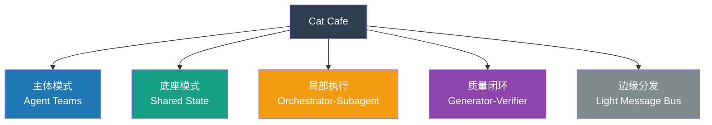

# Cat Cafe 架构映射表

> 目标：把 Anthropic `Building multi-agent systems` / `Multi-agent coordination patterns` 的分类坐标，映射到 Cat Cafe 当前真实架构。

## 一句话结论

**Cat Cafe 不是单一模式。**

如果必须只选一个标签，最贴切的是：

> **有治理的 shared-state agent team**

更精确地说：

- **主体协作形态**：`agent teams`
- **共享底座**：`shared state`
- **局部执行默认**：`orchestrator-subagent`
- **质量闭环**：`generator-verifier`
- **平台边缘分发**：轻量 `message bus`

## 总体映射图

## 映射表

| Anthropic pattern | 在我们家里的位置 | 贴合度 | 具体落点 | 为什么是它 | 为什么又不止是它 |
|---|---|---|---|---|---|
| `Generator-verifier` | 局部质量模式 | 高 | author/reviewer、quality gate、验收/复核、review 抓 bug | 生成与验收明确分离，标准可外显 | 这只是质量回路，不是全局协作拓扑 |
| `Orchestrator-subagent` | 单次任务的默认执行形态 | 中高 | 某只猫接球后拆子任务、调工具、必要时派临时 subagent | bounded subtask 最适合这种模式 | 系统整体不是中心化 Boss Agent |
| `Agent teams` | 主体协作形态 | 很高 | 宪宪/砚砚/烁烁等持续身份、持续分工、持续接力 | 不是一次性 worker，而是长期队友 | 如果没有共享状态，这个团队会失忆 |
| `Message bus` | 平台边缘分发 | 中 | callback、trigger、transport、跨平台通知/唤醒 | 事件驱动、可插拔扩张适合 bus 风格 | 它不主导内容判断，只负责分发和唤醒 |
| `Shared state` | 系统底座 | 很高 | evidence、workflow、task、docs、session chain、knowledge feed | 多猫需要共享发现、继承上下文、接力推进 | 如果只有 shared state 没有球权协议，会掉进 reactive loop |

## 逐项判断

### 1. 为什么不是 pure orchestrator-subagent

我们自己的内部表达已经很明确：

- “很多人做 multi-agent 系统的第一反应是搞一个 orchestrator……**我们不这么做**。”
- “**思考对等，执行结构化**。”
- “**不设 Boss Agent**。”

这说明我们不是把整个系统建成一个中心大脑 + 一堆手下，而是把中心化只留在**单次任务局部**。全局协作仍然是猫与猫之间的对等接力。

## 2. 为什么主体是 agent teams

`Agent teams` 最贴我们家的主干，因为：

- 猫有持续身份，不是一次性 worker
- 猫有长期分工，不是临时标签
- 猫有持续评估，路由会随长期体感变化
- 协作质量本身就是一等评测信号

换句话说，我们不是“临时拉几个 agent 组个群”，而是“一个长期共处的 AI 工程团队”。

## 3. 为什么底座是 shared state

如果只看猫之间的对话，很容易误以为我们主要是 A2A 协作系统。

但真正让这件事成立的是共享状态层：

- 文档真相源
- evidence 检索
- workflow 状态
- task 面板
- session chain
- knowledge feed

这些东西让不同猫能继承同一条线，而不是各自从零开始。

所以我们不是“只有 team，没有 memory”的模式；而是**team 建在 shared state 上面**。

## 4. 为什么 generator-verifier 是 load-bearing 子模式

在 Anthropic taxonomy 里，`generator-verifier` 经常被看成一个简单 pattern。

但在我们家，它不是边角料，而是核心质量机制：

- author 写，reviewer 审
- 质量门禁先对齐 spec，再看实现
- review 不是礼貌性通过，而是 P1/P2 明确判断

所以它虽然不是总拓扑，却是我们家**最重的局部模式之一**。

## 5. 为什么 message bus 只算边缘层

我们家确实有很多 event-driven 成分：

- callback
- wake-up
- trigger
- transport
- cross-thread / cross-surface 通知

但它们主要解决的是：

- 谁被唤醒
- 消息怎么送
- 外部表面怎么接入

而不是：

- 谁做内容判断
- 谁决定结论
- 谁对结果负责

所以 `message bus` 在我们家是平台外沿，不是架构主轴。

## 最终归类

### 如果只能说一句

> **Cat Cafe = shared-state agent team with orchestrated execution and verifier gates**

### 如果要说成人话

> **思考上是 peer team，记忆上是 shared state，执行上是 structured workflow。**

## 对后续设计最有用的分流问题

以后我们讨论一个新能力要落在哪层时，可以直接用这四个问题切：

1. 这是长期队友，还是一次性 subagent？
2. 这里需要共享知识底座，还是只需要任务分发？
3. 这个环节的质量保证，是不是应该显式做成 generator-verifier？
4. 这个能力属于内容判断层，还是事件分发层？
