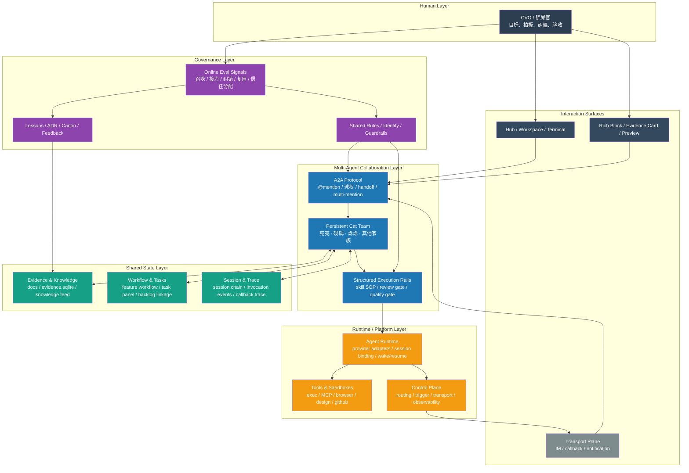
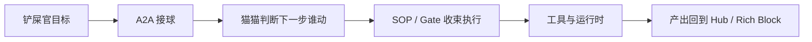
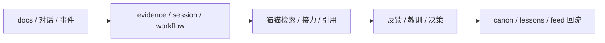
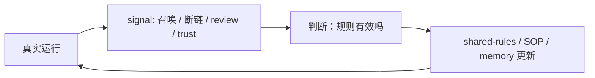

# Cat Cafe Multi-Agent 架构设计

> 目标：不是列 feature，而是把“人、猫、协议、状态、平台、治理”在运行时怎么咬合，画成一张可讨论的架构图。

## 设计原则

1. **思考对等，执行结构化**
2. **共享状态是底座，不是附属**
3. **治理写进环境，不靠口头约定**
4. **人类不是 fallback，而是系统内的一等协作者**

## 总体架构图

## 运行时解释

### 1. Human Layer

铲屎官不是系统外的审批器，而是系统内的一等节点：

- 给目标
- 纠偏
- 保留最终拍板权
- 提供最关键的 online eval 信号

## 2. Interaction Surfaces

Cat Cafe 不是单一聊天框，而是一个可见的共处空间：

- Hub / Workspace / Terminal 负责让工作过程可见
- Rich Block / Evidence Card 负责让结构化信息端上桌
- Transport Plane 负责跨表面触达

## 3. Multi-Agent Collaboration Layer

这是系统的“猫猫团队层”：

- `A2A Protocol` 负责球权、接力、唤醒
- `Persistent Cat Team` 负责人格化长期协作
- `Structured Execution Rails` 负责把自由思考收束到可交付执行

关键点是：**内容判断分布式，执行约束集中式。**

## 4. Shared State Layer

这层是整个系统的稳定器：

- `Evidence & Knowledge`：让猫有可继承的长期记忆
- `Workflow & Tasks`：让任务状态不只存在于消息里
- `Session & Trace`：让运行轨迹可回放、可追责、可恢复

没有这层，A2A 只是即时聊天；有了这层，A2A 才能变成长期协作。

## 5. Runtime / Platform Layer

这层负责“让猫真的动起来”：

- Runtime 统一不同 provider 的调用语义
- Tools & Sandboxes 提供执行手脚
- Control Plane 处理触发、路由、传输和观测

它的职责不是替猫思考，而是提供：

- capability boundary
- session lifecycle
- transport connectivity
- observability

## 6. Governance Layer

这是 Cat Cafe 最不像普通 agent framework 的地方。

治理不是系统外的文档，而是运行时的一部分：

- `Shared Rules / Identity / Guardrails` 决定角色边界
- `Lessons / ADR / Canon / Feedback` 决定知识如何沉淀
- `Online Eval Signals` 决定系统怎么通过真实使用继续进化

## 架构中的三条主链

### A. 任务主链

### B. 记忆主链

### C. 治理主链

## 一句话收束

> **Cat Cafe 不是“多个 agent + 一个 orchestrator”。**
>
> **Cat Cafe 是：一个由 persistent cats 组成、建在 shared state 之上、由 governance 持续塑形的人猫协作 runtime。**
