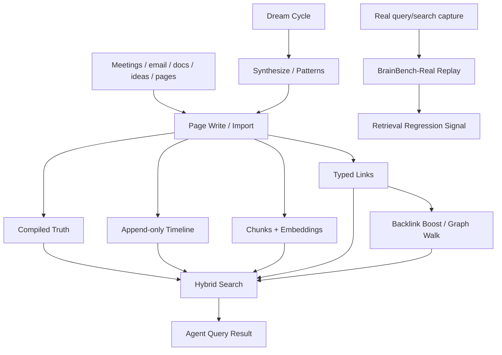
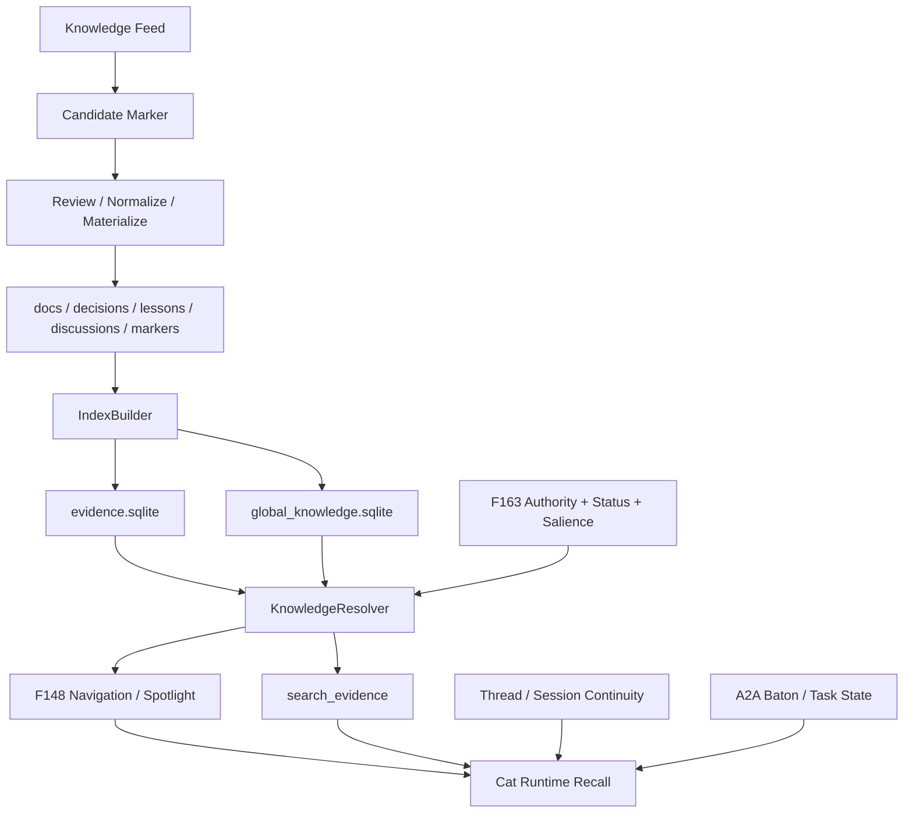
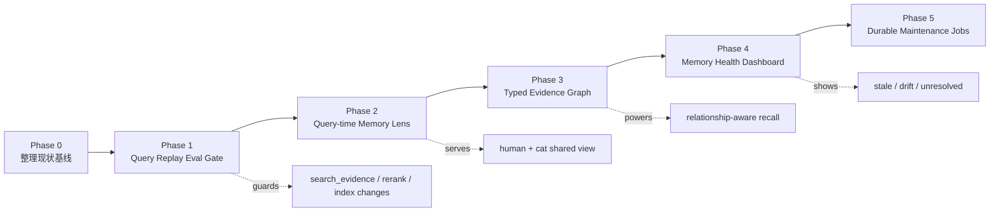

# GBrain Memory vs Cat Cafe Memory

> 铲屎官问题：GBrain 的记忆做得如何？和我们家的记忆相比，有什么能学？如果要升级我们家的记忆，应该怎么走？

结论先说：

- **GBrain 强在“可运行的个人/组织 brain 产品化”**：compiled truth 页面、timeline、typed graph、hybrid search、BrainBench-Real replay、dream cycle，都围绕“一个 agent 怎么把资料变成可查、可维护、可增长的 brain”。
- **Cat Cafe 强在“多猫协作记忆治理”**：真相源与索引分离、authority/confidence 解耦、Knowledge Feed 审核、thread/session continuity、F163 熵减、F148/F169 spotlight/salience，围绕“一个团队怎么共享、传递、审计、降噪记忆”。
- **我们最该学的不是 dream cycle 自动写回，而是 GBrain 的可视 compiled artifact、typed graph adjacency、真实 query replay eval。**

一句话：GBrain 更像“agent 的知识操作系统”；我们家更像“多 agent 团队的证据治理系统”。升级方向不是替换，而是把 GBrain 做得好的 **可浏览、可回放、可成图** 吸收到我们现有的 governed memory 里。

## 1. 两套记忆链路图

### 1.1 GBrain：Brain-as-Product Runtime



GBrain 的核心闭环是：

```text
资料进入 brain -> 写成页面/事件/边 -> 检索时图谱和 compiled truth 参与排序
真实 query 被捕获 -> replay 看结果是否漂移 -> retrieval 改动有回归信号
周期维护任务 -> 改写/整理 brain -> 未来 query 受影响
```

它的美感在于“记忆不是日志堆，而是可查询的世界模型雏形”。

### 1.2 Cat Cafe：Evidence-as-Governed Team Memory



我们家的核心闭环是：

```text
稳定文档/讨论/教训 -> 编译成 evidence index -> 猫按任务 recall
候选知识 -> 审核/归一/materialize -> 再进入真相源
authority/status/salience -> 控制什么该浮出、什么该降权
thread/session continuity -> 让多猫接球不失忆
```

它的美感在于“记忆是团队协作的证据底座，不是单个 agent 的私有脑袋”。

## 2. 横向对比

| 维度 | GBrain | Cat Cafe | 判断 |
| --- | --- | --- | --- |
| 记忆单位 | Page：person/company/project/concept，一页一个实体 | Evidence anchor：feature/ADR/lesson/thread/passage/marker | GBrain 更像 wiki，Cat Cafe 更像证据索引。 |
| 真相源 | DB + markdown brain pages，compiled truth 会被更新 | git-tracked docs/markers 是真相源，SQLite 是可重建索引 | 我们的可审计/可回滚更强。 |
| 人类可浏览层 | 强：compiled truth + timeline 页面天然可读 | 偏弱：`evidence.sqlite` 对猫友好，对人偏黑盒 | 这是我们最值得补的 UX/产物层。 |
| 检索 | keyword + vector + RRF + compiled truth boost + backlink boost | lexical/semantic/hybrid + RRF + authority/status/salience | 两边都强；GBrain 图谱因子更鲜明，我们治理因子更成熟。 |
| 图谱 | typed links 一等公民，backlinks 影响 search | edges 已有基础，但主要不是用户可见 graph | 我们可学 deterministic evidence graph。 |
| 写入闭环 | put_page/import 后 auto-link、auto-timeline；dream cycle 可写回 | Knowledge Feed 候选 -> review -> materialize -> reindex | GBrain 快，我们安全；不要学无 review 自动写真相源。 |
| 评估 | BrainBench + BrainBench-Real capture/replay | F163 gold set / NDCG，缺真实 query replay 产品化 | 我们应优先学 replay gate。 |
| 多 agent 协作 | skills + MCP + minions，偏 agent brain 工具 | thread memory + A2A baton + role routing + handoff | 我们在团队协作层更强。 |
| 记忆治理 | 有 stale/orphans/citation/maintenance，但高速增长下边界较粗 | authority/confidence 解耦、status、activation、salience、review queue | 我们在治理坐标系上更成熟。 |
| 风险面 | 远端写入/auto-link/权限边界更敏感 | 共享记忆默认不可信，写入要门禁 | 我们应保持“记忆是数据不是指令”。 |

## 3. GBrain 记忆做得好的地方

### 3.1 Compiled Truth + Timeline 是很好的 page schema

GBrain 的 page 模型非常清楚：

```text
Compiled Truth: 当前最佳理解，可重写
Timeline: 事件证据流，append-only
Links: 实体之间的 typed adjacency
Chunks: 支持 retrieval 的细粒度索引
```

这比纯 markdown 笔记强，因为它把“当前结论”和“证据历史”分开了。我们家的 docs 也有真相源，但很多 Feature/ADR 的“当前状态、关键变更、证据时间线”需要猫读全文归纳。

我们可以学：给 Feature/ADR/thread 提供一个 **query-time Memory Lens**：

```text
Feature Lens(F102)
  Purpose
  Current Status
  Timeline
  Key Decisions
  Linked Lessons
  Recent Threads
  Open Questions
```

注意：F169 已关闭“持久 compiled wiki”。所以这里不是新建 `docs/compiled/*.md` 永久文件，而是 **按需生成 / 可缓存 / 指向 raw anchors 的镜头层**。

硬约束：Memory Lens 输出必须是 `indexable: false`。

- Lens 可以临时展示，也可以另存为 discussion note 给人看；
- 但 Lens 自身不能被 `search_evidence` / `IndexBuilder` 当作 evidence source 编入索引；
- Lens 里的每个判断都必须回链 raw anchors，未来再次生成 Lens 时只能读 raw anchors，不能读旧 Lens；
- 否则它会变成持久 compiled wiki 的变体，产生“合成物引用合成物”的检索污染。

### 3.2 Typed graph 让“邻接关系”进入检索

GBrain 的 graph 不是 UI 点缀。typed links 和 backlinks 会进入 ranking，能回答“谁和谁有关”“某人投资了什么”“某公司有哪些关系”这类 vector search 不擅长的问题。

我们家现在也有 edges 概念，但主要服务索引/治理，不是一个可见、可探索的 memory graph。

我们可以学：先做 deterministic evidence graph，不碰 LLM 实体真相判定：

```text
Feature -> ADR       derives_from / decided_by
Feature -> PR        implemented_by / reviewed_by
Feature -> Lesson    warned_by / caused_by
Thread -> Feature    discusses / changes
Message -> Task      created / blocks
Cat -> Review        authored / approved / requested_changes
```

每条边必须带 `source anchor + confidence + extraction rule`。边是证据，不是真理。

### 3.3 BrainBench-Real 是最值得学的工程闭环

GBrain 的 `GBRAIN_CONTRIBUTOR_MODE=1` 捕获真实 `query/search`，再 replay 看 Jaccard/top-1/latency。这个方向非常对。

我们家现在有 F163 gold set/NDCG，但还缺“真实使用流量回放”的产品化门禁。memory 系统最怕的不是单次搜不到，而是改了索引/rerank 后“你以为变好了，实际常用问题漂了”。

我们可以学：

```text
cat_cafe_search_evidence call
  -> capture query + scope + mode + topK anchors + variantId
  -> scrub sensitive snippets
  -> export fixture
  -> replay after memory/rerank/index changes
  -> compare topK overlap, top1 stability, MRR/NDCG where gold exists
```

这应是升级优先级第一名。

### 3.4 维护任务有产品感

GBrain 的 `maintain/dream/cycle/orphans/backlinks/citation audit` 形成了“brain health”感：不是一堆后台脚本，而是用户能理解的健康检查。

我们家有 F163 的健康报告和 review queue，但 UX 上还没形成一个 Memory Health 面板。

可以学：把 F163 健康报告做成可见的 memory dashboard：

- stale anchor 数；
- needs_review 数；
- low-confidence top queries；
- orphan feature / dangling ADR link；
- search miss / low-hit query；
- authority 分布；
- salience rerank 影响。

## 4. GBrain 的边界

### 4.1 “自动变聪明”不能按宣传语理解

它确实会写回、整理、生成 patterns，但缺少持续证明“变好”的质量 delta。没有 eval/rollback 接入 dream cycle，就不能叫强意义 self-improvement。

我们不要学“自动写回真相源”；可以学“维护任务产生候选变更 + evidence + review queue”。

### 4.2 Typed links 是 heuristic，不是实体真相

GBrain 的 typed relation 很多来自 regex/frontmatter。它快、可解释，但不能处理复杂别名、否定、同名实体、引用中的假陈述。

我们如果学 graph，必须保持：

- extraction rule 可追溯；
- unresolved queue；
- edge confidence；
- 人/猫 review；
- 不把 graph edge 自动当事实注入 prompt。

### 4.3 它是个人/组织 brain，不是多猫协作治理系统

GBrain 也有 skills/minions/MCP，但它的 memory primitive 不是围绕 A2A baton、角色路由、thread 共享事实、review chain 设计的。我们家的复杂度在协作协议，不能降维成“一个 agent 的脑子”。

## 5. 我们该怎么学

### Tier 1：立刻值得立项讨论

#### 1. Query Replay Eval Gate

目标：每次改 `search_evidence`、index builder、authority/salience/rerank，都能知道真实 query 是否退化。

最小切片：

```text
capture_search_evidence_eval
  query, scope, mode, depth, variantId
  topK anchors, confidence, authority, scores
  timestamp, task/thread id hash
```

Replay 指标：

- Top-K overlap / Jaccard；
- Top-1 stability；
- NDCG/MRR（有 gold set 时）；
- time_to_first_evidence；
- search miss / low confidence rate。

不做：

- 不保存完整敏感片段；
- 不让 replay 自动判定“语义更好”，只判定漂移和明显回归。

#### 2. Query-time Memory Lens

目标：补齐“人类可浏览 compiled artifact”的缺口，但不做持久 compiled wiki。

形态：

```text
/memory-lens F102
  -> 从 feature spec + decisions + threads + lessons + git/PR anchors 拉证据
  -> 生成一页临时 lens
  -> 每个结论必须带 raw anchor
  -> 可保存为 discussion note，但不自动成为真相源
```

索引边界：

- 输出 metadata 必须带 `indexable: false` / `noindex: true`；
- `IndexBuilder` 应跳过该类 lens 输出；
- `search_evidence` 结果不应返回 lens 作为答案证据，只能返回 lens 引用的 raw anchors；
- 如果 lens 被保存为 discussion note，它是“给人看的分析产物”，不是后续 recall 的事实来源。

适用场景：

- 新猫冷启动复杂 feature；
- review 前理解历史；
- 用户问“这个 feature 现在到底什么状态”；
- memory health 报告中的热点 anchor。

### Tier 2：值得设计，不急着写

#### 3. Typed Evidence Graph

目标：让 Feature/ADR/PR/thread/lesson/task/cat/review 之间的关系变成可查询、可画图的结构。

第一版只做 deterministic：

- frontmatter `related_features`；
- markdown links；
- PR/commit refs；
- `@cat` handoff；
- task source message；
- feature id regex。

图的价值不是“酷”，而是支持：

- “这个结论从哪条链来的？”
- “哪个 lesson 阻塞这个设计？”
- “哪些 thread 影响了 F102？”
- “某次 review 结论覆盖到哪个 commit？”

#### 4. Memory Health Dashboard

目标：把 F163 从“后台治理”变成用户可见的记忆健康。

看板指标：

- top search misses；
- stale/needs_review entries；
- orphan anchors；
- authority distribution；
- replay drift；
- unresolved graph edges；
- Knowledge Feed pending candidates。

### Tier 3：先观察

#### 5. Durable Job Ledger for memory maintenance

GBrain Minions 对长任务很有参考价值。我们如果做 memory replay、large reindex、graph extraction、health report，可以用 durable job ledger 表示任务状态。

但它不是 memory 能力本身，优先级低于 replay/lens/graph。

## 6. 不该学什么

1. **不学无 review 自动写回真相源**
   - Knowledge Feed 的“候选 -> 审核 -> materialize”比 dream cycle 直接写 durable knowledge 更适合我们。

2. **不学把 regex edge 当实体事实**
   - 可以学 deterministic bootstrap，不学过度宣传。

3. **不学远端写入后自动污染 graph/ranking**
   - 远端 memory write 默认 quarantine，不能直接影响 top-K。

4. **不学把 memory 当 prompt 指令**
   - 继续坚持 Phase 5 原则：记忆是数据，不是指令。

5. **不学持久 compiled wiki 的默认路线**
   - F169 已拍板关闭持久 compiled wiki；若痛点复现，走 query-time Feature Lens。

## 7. 推荐升级路线图



### Phase 0：基线

- 收集最近真实 `search_evidence` query 样本；
- 标注 30-50 条 gold anchors；
- 记录当前 top-K / latency / confidence 分布；
- 选 3 个复杂 feature 做 Memory Lens 样例：F102、F163、F169。

### Phase 1：Query Replay Eval Gate

- 搜索调用 capture；
- export/replay；
- diff 报告；
- merge gate 前可选跑 memory replay；
- 只读，不改用户路径。

### Phase 2：Query-time Memory Lens

- 输入 feature id / ADR id / thread id；
- 输出临时 lens + raw anchors；
- 支持 Mermaid dependency graph；
- 不自动 commit，不自动成为真相源。

### Phase 3：Typed Evidence Graph

- 先从 docs/frontmatter/PR refs/thread chain 抽边；
- `search_evidence` 返回可选 `related_edges`；
- lens 页面可以画“这个 feature 的证据图”。

### Phase 4：Memory Health Dashboard

- 聚合 F163 + replay + graph unresolved；
- 给铲屎官看“记忆系统现在哪里脏、哪里漂、哪里断链”。

### Phase 5：Durable Maintenance Jobs

- reindex/replay/graph extraction/health report 都进入 job ledger；
- UI 显示 running/done/failed；
- 失败可重跑，有日志和结果 artifact。

## 8. 砚砚判断

如果只选一个升级，我选 **Query Replay Eval Gate**。

原因很直接：我们已经有强治理和强检索，但“改完是不是真的更好”还不够产品化。GBrain 在这点上给了最实用的答案：抓真实 query，改动后 replay，看 top-K 是否漂。这个能力会保护 F102/F163/F169 以后所有升级。

第二个才是 Memory Lens。它解决人类可读性，让铲屎官和猫能一起看见“记忆编译后的形状”。但它必须建立在 replay gate 之后，否则我们会造出漂亮但不可证明的 compiled view。

## 9. 协作状态

我尝试用 `cat_cafe_multi_mention` 拉宪宪做并行讨论，但当前 thread callback credentials 未配置，工具返回：

```text
Cat Café callback not configured. Missing callback credentials, agent-key credentials, or required agentKeyCatId for shared Antigravity MCP.
```

因此本文是砚砚初稿，已在末尾传给宪宪复核/补充架构视角。

[砚砚/GPT-5.5🐾]
