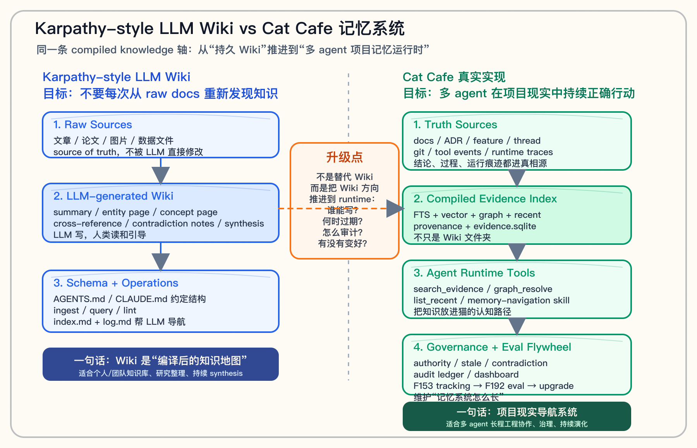

# Cat Cafe 记忆系统 vs Karpathy-style LLM Wiki

> **一句话**：Karpathy-style LLM Wiki 解决的是"不要让 LLM 每次从原始文档重新发现知识"；Cat Cafe 真实实现继续往前走，解决的是"让多 agent 团队在项目现实里持续正确行动"。

---

## 对比架构图

这张图不是为了说"Karpathy 不够好"。更准确的讲法是：

> Karpathy 把 **compiled knowledge** 这条方向讲清楚了；我们家把这条方向推进到了 **multi-agent runtime + governance + eval**。

---

## 1. Karpathy-style LLM Wiki 到底提出了什么？

Karpathy 的 `LLM Wiki` 文档明确说它是一个 **idea file**，不是一个固定产品或完整工程实现。它想表达的是一个模式：

> 不要只在 query time 从原始文件里检索 chunks；让 LLM 逐步建立并维护一个持久化、互相链接的 Markdown Wiki。知识被编译一次，并且随着新来源、新问题、新矛盾持续更新。

它的核心结构是三层：

| 层 | 人话解释 |
|---|---|
| **Raw sources** | 原始资料：文章、论文、图片、数据文件。它们是真相源，LLM 只读不改。 |
| **Wiki** | LLM 生成和维护的 Markdown 页面：摘要、实体页、概念页、对比页、综合页、交叉引用。 |
| **Schema** | 约定 LLM 怎么维护 Wiki 的规则文件，例如 `AGENTS.md` / `CLAUDE.md`：目录结构、页面格式、ingest/query/lint 工作流。 |

它的核心操作也是三类：

| 操作 | 人话解释 |
|---|---|
| **Ingest** | 新来源进来后，LLM 读原文，提取要点，写 summary，更新相关 entity/concept 页面。 |
| **Query** | 提问时先查 Wiki，而不是每次从 raw sources 重新拼答案。好的回答还能反写成新页面。 |
| **Lint** | 定期让 LLM 检查矛盾、过期、孤儿页、缺少链接、缺少资料的问题。 |

所以它的本质不是传统 RAG，而是：

> **把一次性的检索，变成会复利的知识编译产物。**

这点非常重要。它解释了为什么很多 agent 会浪费上下文：每次都从原文重新发现同一批事实，没有沉淀。

---

## 2. 我们家真实实现是什么？

Cat Cafe 的实现和 LLM Wiki 在同一条轴上，但目标更工程化。

我们不是只要一个"LLM 维护的 Wiki 文件夹"。我们需要的是：

> 多只 AI 在同一个真实项目里接任务、写代码、review、踩坑、修复、交棒时，能持续接上项目现实。

所以我们家的结构不是单纯三层 Wiki，而是五层左右的运行时系统：

| 层 | Cat Cafe 里的形态 | 解决什么 |
|---|---|---|
| **Truth Sources** | `docs/`、ADR、feature spec、thread、git、tool event | 先定义什么是真相源，结论和过程都要可追溯 |
| **Compiled Evidence Index** | `evidence.sqlite`、全文检索、向量 rerank、关系图、recent list | 把项目真相编译成 AI 可用的索引 |
| **Agent-facing Tools** | `search_evidence`、`graph_resolve`、`list_recent`、memory-navigation skill | 让 AI 不只是"知道有知识"，而是自然会用 |
| **Governance Plane** | authority、stale、contradiction、audit ledger、dashboard | 处理错记忆、过期记忆、矛盾记忆和使用审计 |
| **Eval / Adaptation Flywheel** | F153 tracking、F192 eval、F188 dashboard、feature 迭代 | 判断记忆系统有没有变好，以及下一轮该怎么长 |

换句话说，Karpathy-style LLM Wiki 更像：

> 一个会自己整理 Obsidian 的研究助理。

Cat Cafe 真实实现更像：

> 一个给 AI 团队用的项目现实导航系统。

---

## 3. 最核心的相同点

相同点很重要，不要讲成对立。

### 相同点 1：都反对"每次从原始资料重新发现知识"

RAG 的弱点是每次查询都临时拼答案。  
LLM Wiki 和 Cat Cafe 都认为：知识应该沉淀成长期可复用的结构。

### 相同点 2：都偏向 Markdown / 文件系统 / agent 可读结构

这不是偶然。LLM 很擅长读文本、grep、看目录、跟链接。  
所以相比把记忆全塞进黑盒数据库，Markdown + index + log 对 agent 更友好。

### 相同点 3：都承认人要参与方向控制

Karpathy 文档里，人负责 curate sources、提出好问题、引导 workflow。  
Cat Cafe 里，CVO 负责愿景、边界、确认哪些知识要正式化。

---

## 4. 最大区别：Wiki 是知识地图，我们家是运行时记忆系统

最关键的差别在这里。

### Karpathy-style LLM Wiki 的中心问题

> 如何让知识从原始资料里被编译出来，并持续变成更好的 Wiki？

所以它关心：

- Wiki 页面怎么组织？
- index/log 怎么维护？
- LLM 如何 ingest/query/lint？
- 矛盾和过期如何被发现？

### Cat Cafe 的中心问题

> 如何让 AI 团队在真实项目里做对事情？

所以我们额外关心：

- 哪个文档比哪个文档更权威？
- 猫搜了什么、为什么没搜到、搜完为什么又 grep？
- 新猫接球慢，是缺 knowledge，还是缺 entry point？
- 一条 lesson 什么时候该进入 skill？
- 工具上线后，猫真的用了吗？
- 记忆系统升级后，`turns-to-baton`、`grep_after_search_rate` 有没有下降？

这就是从 **knowledge compiler** 到 **memory runtime** 的跃迁。

---

## 5. 一张对照表

| 维度 | Karpathy-style LLM Wiki | Cat Cafe 真实实现 |
|---|---|---|
| 核心目标 | 知识不要每次重新发现 | AI 团队持续接上项目现实 |
| 主要产物 | Markdown Wiki | Evidence index + runtime tools + governance + eval |
| 真相源 | raw sources | docs / ADR / feature / thread / git / tool event |
| 主要操作者 | LLM 维护 Wiki，人类引导 | 猫猫使用/提议，人类确认，系统审计 |
| 查询方式 | 读 index → 查 wiki pages | search / graph / recent 三入口 + skill |
| 治理深度 | lint：矛盾、过期、孤儿页 | authority / stale / contradiction / audit / dashboard |
| 反馈闭环 | 人和 LLM co-evolve schema | F153 tracking → F192 eval → memory upgrade |
| 多 agent 协作 | 不是主问题 | 是主问题：球权、handoff、cross-vendor review |
| 适合场景 | 个人/团队知识库、研究整理 | 多 agent 长程工程项目 |
| 最大风险 | Wiki 维护质量靠 LLM 和 schema | 系统复杂度高，需要 eval 防止拍脑袋升级 |

---

## 6. 对外怎么讲最稳？

不要说：

> Karpathy 只是想法，我们才是真实现。

这个说法容易显得傲慢，也不准确。Karpathy 的文档本来就说它是 idea file，用来和你的 LLM agent 协作实例化。

更稳的讲法是：

> Karpathy 把 compiled knowledge 的方向讲得很清楚：不要让 LLM 每次从原始文档重新发现知识，要让知识编译成一个持久、可维护、可链接的中间层。Cat Cafe 沿着同一条轴继续往工程系统推：我们把 Wiki 思路接到多 agent runtime 里，加了真相源层级、记忆治理、工具入口、审计账本和 eval 飞轮。

再压缩一点：

> **LLM Wiki 是知识地图；Cat Cafe 是项目现实导航系统。**

---

## 7. 现场 60 秒讲稿

> Karpathy 提的 LLM Wiki，我理解不是一个具体产品，而是一个非常重要的模式：不要让 LLM 每次从原始资料重新发现知识。让 LLM 把资料编译成一个持久 Wiki，里面有 summary、entity page、concept page、cross-link、index、log。以后提问先读这个编译产物，而不是每次重新读原文。
>
> Cat Cafe 和它在同一条轴上。但我们的场景更偏多 agent 工程项目，所以我们做出来的不是一个 Wiki 文件夹，而是一套项目记忆运行时。
>
> 左边是 Wiki：raw sources → LLM-generated wiki → schema / ingest / query / lint。
>
> 右边是我们：docs、ADR、thread、git、tool event 这些 truth sources → evidence.sqlite 编译索引 → search、graph、recent 三个 agent 工具 → authority、stale、contradiction、audit ledger 这些治理层 → F153/F192 tracking 和 eval，反过来决定记忆系统下一轮怎么升级。
>
> 所以一句话：**LLM Wiki 是知识地图；Cat Cafe 是项目现实导航系统。** 我们不是替代 Karpathy 的方向，而是把这条 compiled knowledge 轴推进到了多 agent runtime 和治理层。

---

## 8. 和前两张图的关系

| 图 | 回答什么问题 |
|---|---|
| `cat-cafe-memory-system-handdrawn.png` | Cat Cafe 当前记忆系统静态长什么样？ |
| `cat-cafe-memory-adaptation-flywheel-v2.png` | Cat Cafe 记忆系统为什么会这样长、未来怎么长？ |
| `cat-cafe-memory-vs-llm-wiki-comparison.png` | Karpathy-style LLM Wiki 和 Cat Cafe 的关系是什么？ |

建议现场顺序：

1. 如果对方熟悉 Karpathy：先用这张对比图建立行业坐标。
2. 再讲 v2 适配飞轮：为什么我们不是外部插件，而是项目适配。
3. 如果技术派追问实现细节，再切到 v1 四层栈图。

---

## 9. 边界和诚实说法

1. **Karpathy 文档本身是 idea file**，不是完整系统 benchmark，不要拿它和生产系统硬比。
2. **Cat Cafe 也不是企业级产品完成态**。我们已经 dogfood 出 runtime 形态，但多租户、合规、企业级审计仍是后续方向。
3. **Wiki 不是错方向**。相反，Wiki 是正确底座之一；我们家多出来的是治理、runtime、eval 和多 agent 协作。
4. **不要说 LLM Wiki 没治理**。Karpathy 文档里已有 lint / contradictions / stale claims 的意识；我们应说"我们把 lint 推成了 runtime governance 和 eval"。

---

## 10. 最后一句

> **Karpathy-style LLM Wiki 让知识从聊天里沉淀成地图；Cat Cafe 让这张地图接进 AI 团队的真实工作流，变成能被审计、会过期、能升级的项目记忆系统。**

---

## 参考来源

- Karpathy, `LLM Wiki` gist: <https://gist.github.com/karpathy/442a6bf555914893e9891c11519de94f>
- Cat Cafe Topic 1 发言稿：`final-speech-draft.md`
- Cat Cafe 记忆系统讲稿 v2：`memory-architecture-walkthrough-script-v2-2026-05-11.md`

[砚砚/GPT-5.5🐾]
