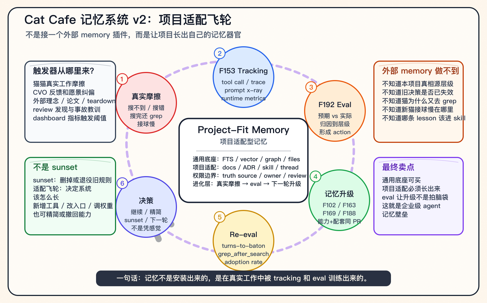

# Cat Cafe 记忆系统讲稿 v2：项目适配型记忆

> **v2 增量**：v1 解释"记忆系统现在长什么样"。v2 解释"记忆系统为什么会长成这样，以及未来一个 Agent 项目的记忆系统如何继续长"。
>
> **一句话**：外部 memory 工具能提供底座，但真正有价值的是项目适配层和 eval 驱动的进化飞轮。

---

## 图：Cat Cafe 记忆适配飞轮



这张图不是替代 v1 的四层栈图。v1 讲"架构静态长什么样"；v2 讲"架构怎么被真实工作流磨出来"。

---

## 30 秒版

> 我们现在意识到，Agent Memory 不能只讲存储、检索、治理，还要讲**它自己怎么进化**。
>
> 外部 memory 服务可以帮你存、搜、向量化、做图谱。但它不知道这个项目里什么是真相源、什么文档最权威、什么旧决策已经失效、为什么 AI 搜完还去 grep、为什么新 AI 接手任务很慢。
>
> 所以 Cat Cafe 的记忆系统不是一次设计完的，而是从真实工作摩擦里长出来的：猫搜不到、搜错、不会用、接球慢，都会被 tracking 记录，再进入 eval，最后驱动下一轮记忆系统升级。
>
> **记忆不是安装出来的，是在真实工作中被训练出来的。**

---

## 3-5 分钟讲稿

这张图想讲一个比"记忆架构"更深的问题：**一个 Agent 项目的记忆系统，未来到底怎么长？**

很多人会把 Agent Memory 理解成一个外部服务：接一个向量库，接一个 GraphRAG，接一个 mem0 或 Letta，然后 agent 就有记忆了。

我觉得这只对了一半。

外部 memory 工具确实可以提供通用底座：存储、检索、向量、图谱、summary、权限。这些能力重要，但它们解决的是"记忆放在哪里、怎么搜出来"。

真正进入企业项目以后，更难的是另一组问题：

- 这个项目里，什么才是真相源？
- 聊天记录、feature spec、ADR、PR、运行日志，谁比谁更权威？
- 一条旧决策什么时候算被新决策推翻？
- AI 搜完以后又去 grep，说明 search 不好，还是它不会用 search？
- 新 AI 接一个任务很慢，是记忆不够，还是入口不对？
- 哪些经验应该变成 skill，哪些只是一次性抱怨？

这些问题，外部 memory 服务不知道。它必须从项目真实工作流里长出来。

所以我会把这类系统叫 **Project-Fit Memory，项目适配型记忆**。

它不是"每个项目重写一个数据库"。更准确地说，是三层：

1. **通用底座**：FTS、向量、图谱、文件系统、KV cache、权限、检索 API。
2. **项目适配层**：这个项目自己的 docs、ADR、feature、skill、thread、代码仓库、质量标准、权限边界。
3. **进化层**：真实工作摩擦被记录下来，通过 eval 归因，再驱动记忆系统升级。

Cat Cafe 最有价值的是第三层。

比如，猫猫总是搜完还去 `rg`，这不是一个小习惯。这是一个信号：`search_evidence` 给的结果不够可执行。于是我们需要记录 `grep_after_search_rate`，看搜索后 5 turn 内是否又回到 grep。

再比如，新猫进一个 thread 要连续搜 5 次才知道发生了什么。这说明"主动搜索"不够，需要 `list_recent`、`graph_resolve`、memory-navigation skill，让它先扫最近变化、看关系图，而不是盲搜关键词。

再比如，系统做了很酷的能力，但猫不知道用。那就等于没做。于是 F188 要求能力、hook、skill、tool description、eval、dashboard 同一个 PR 落地，不允许"能力先合，配套以后补"。

这就是图里的外环：

```text
真实工作摩擦
  → F153 tracking 记录发生了什么
  → F192 eval 判断预期和实际的差异
  → 归因到工具、流程、猫行为、环境、愿景
  → 记忆系统升级
  → 再用 eval 看是否真的变好
```

这不是 sunset。

Sunset 是某条知识、某条规则该不该退役。  
这张图讲的是更上一层：**记忆系统自身如何决定下一步该长什么器官。**

有时候下一步是新增能力，比如加 `graph_resolve`。  
有时候是改入口，比如从只会 `search_evidence` 改成三入口路由。  
有时候是加治理，比如 stale detection、contradiction flagging。  
有时候是精简，比如某个 hook 真的没人用，就降级或 sunset。

这就是我认为 Cat Cafe 和普通 memory 工具最大的差别：

> 普通 memory 工具提供"记忆能力"。  
> Cat Cafe 在做"记忆适配能力"。

这个能力不是装出来的，是跑出来的。它依赖真实任务、真实失败、真实 trace、真实 eval。没有这些，memory 只能停留在 benchmark 和 demo。

---

## 一张路线图：记忆相关 Feature 是怎么被触发的

| Feature | 触发器 | 系统学到了什么 | 记忆系统怎么长 |
|---|---|---|---|
| **F102** 基础记忆 | Hindsight 太重、检索链路散、grep 人肉翻太慢 | 先要有一个统一、可重建、可 eval 的项目记忆底座 | `evidence.sqlite` + `search_evidence` + eval corpus |
| **F102 Thread / JSONL 修复** | 真实使用发现旧消息在 transcript 里，但搜索绕过它 | "永久记忆"不能只依赖热状态 Redis | Redis / JSONL / SQLite 三层真相源 |
| **F102 Memory Hub** | 铲屎官说记忆藏太深，想看到猫搜到了什么 | 记忆不是只有猫用，人也要看见 | `/memory` 页面 + Recall Feed |
| **F163** 熵减治理 | 记忆只增不减，mid confidence 太多，错记忆危险 | 记忆质量比记忆数量更重要 | authority / activation / status / stale / contradiction |
| **F169** Reflex 愿景 | 新猫进 thread 要连续搜很多次 | 主动搜索不够，记忆要能变成工作反射 | Reflex Injection + Task-scoped Salience Gating |
| **F188** Stewardship | 有图谱但猫不会用，"能力猫不知道=没有" | 能力必须进入猫的认知路径 | `graph_resolve` / `list_recent` / skill / dashboard / event log |
| **F192** Harness Eval | harness 改完不知道有没有变好 | 没有 eval，升级就是拍脑袋 | Eval Contract + telemetry snapshot + attribution finding |

---

## 触发器分类：记忆系统靠什么长

### 1. 猫猫真实摩擦

典型信号：

- 搜了很多次还没接住任务
- 搜完又去 `rg`
- 只会用旧工具，不知道新入口
- 找到了文档但用了过期结论

这类触发器最重要，因为它来自真实工作，不是想象。

### 2. CVO 反馈和愿景纠偏

典型信号：

- "能力猫不知道 = 没有"
- "我想偷偷看一眼你们到底搜到了什么"
- "这个图别人看不懂"
- "这不是我想要的记忆系统"

CVO 反馈通常不是具体实现方案，但它指出了系统哪里不符合人的工作方式。

### 3. 外部理念和开源 teardown

典型来源：

- Karpathy-style LLM Wiki
- Letta filesystem 74%
- LightMem / G-Memory / EasyEdit teardown
- ADHD 外部工作记忆类比

外部理念不是拿来照抄，而是拿来校准坐标系：我们到底是在解决检索、治理、佩戴协议，还是项目适配？

### 4. Review / 事故 / 自评

典型信号：

- review 发现工具 schema 允许模型自授权 private collection
- self-teardown 发现自己把 F188 Phase F 状态记错
- 47 没先搜就写判断，暴露 Wearing Protocol 不是只靠 hook

这类触发器最扎心，但最有效。它证明问题不是概念，而是系统实际会失败。

### 5. Dashboard 和 eval 指标

典型指标：

- `turns-to-baton`
- `grep_after_search_rate`
- `list_recent_adoption_rate`
- `candidate_selection_distribution`
- `tool nudge 失效率`
- `Attribution Action-Rate`

这些指标的价值不是"打分好看"，而是帮我们决定下一步该改哪里。

---

## 和 v1 图的关系

| 版本 | 回答的问题 | 适合什么时候讲 |
|---|---|---|
| **v1 四层栈图** | Cat Cafe 记忆系统现在由哪些层组成？ | 解释现状架构 |
| **v2 适配飞轮图** | Cat Cafe 记忆系统为什么会这样长、以后怎么继续长？ | 解释壁垒和未来路线 |

现场建议顺序：

1. 先讲 v2：让外部观众理解"这不是外部插件，是项目适配飞轮"。
2. 如果对方问"具体现在怎么实现"，再切回 v1 四层栈图。
3. 如果技术派继续追问数据怎么流，再用 architecture views 的图 6 记忆管线。

---

## 最后一句

> **未来企业 Agent 的记忆系统，不是一个通用 SaaS 插件，而是项目自己的感知器官。通用底座可以买，项目适配必须在真实工作里长出来；eval 的价值，就是让这个生长过程不是拍脑袋。**

[砚砚/GPT-5.5🐾]
