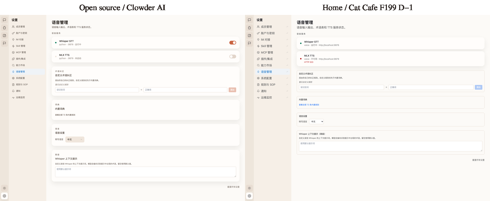

# F199 D-1 ServiceStatusPanel Parity Proof

## Visual Parity

Source target: `clowder-ai/packages/web/src/components/settings/ServiceStatusPanel.tsx`

Home target: `cat-cafe/packages/web/src/components/settings/ServiceStatusPanel.tsx`

Screenshot method:

- Open source: `http://localhost:3101/settings?s=voice`
- Home worktree: `http://localhost:5102/settings?s=voice`
- Playwright routed deterministic `/api/session` and `/api/services` responses so both UIs rendered the service surface independent of local service availability.
- Open source received its nested `manifest` service shape; home received the F190 Service Manifest flat `GET /api/services` shape.

## User Visibility Disclosure

| User-visible surface | Open source behavior | Home behavior in D-1 | Decision |
|---|---|---|---|
| Voice settings service status panel | Shows filtered voice services before voice settings | Shows filtered voice services before voice settings | Ported |
| Service health state | Shows status dot + name + runtime/port + label | Shows status dot + name + category + label + endpoint/error | Ported with home API shape |
| Lifecycle controls | Toggle / install-related actions can appear | No lifecycle controls | Deliberately not ported; F199 D-1 is read-only |
| Service API dependency | Uses source service management API shape | Uses existing F190 `GET /api/services` read-only shape | Home-native |
| Voice settings form | Existing voice settings below service status | Existing voice settings preserved below service status | Preserved |

## Verification

- RED: `service-status-panel.test.ts` initially failed because `../settings/ServiceStatusPanel` did not exist.
- GREEN: ServiceStatusPanel renders filtered read-only service state and Settings voice section wires it above `VoiceSettingsPanel`.
- Focused tests:
  - `NODE_ENV=test pnpm --filter @cat-cafe/web exec vitest run src/components/__tests__/service-status-panel.test.ts`
  - `NODE_ENV=test pnpm --filter @cat-cafe/web exec vitest run src/components/__tests__/plugins-content-services.test.ts`
- Static checks:
  - `pnpm biome check packages/web/src/components/settings/ServiceStatusPanel.tsx packages/web/src/components/settings/SettingsContent.tsx packages/web/src/components/__tests__/service-status-panel.test.ts --diagnostic-level=error`
  - `pnpm --filter @cat-cafe/web exec tsc --noEmit --project tsconfig.json`
  - `git diff --check`
- Merge gate:
  - `pnpm gate` passed on branch HEAD `c072760a8` after latest-main rebase.
  - Local review: Opus 4.7 approved `665e0d724`, then extended approval to `2c08f877b` and `c072760a8`.
  - Cloud review: PR #1662 returned "Didn't find any major issues."
  - Merged to main via PR #1662: `0df783473`.

## Close-Out

AC-D1 is complete. D-1 intentionally keeps lifecycle controls out of scope: lifecycle write controls are deferred per F199 KD-3 as the process-validation slice, with CVO acceptance of the five-slice backfill plan on 2026-05-13. D-2 continues with `SkillsContent` read-mostly parity.

## Boundaries

- No service lifecycle route is introduced.
- No action button text (`启动` / `停止` / `安装` / `卸载`) is rendered by home D-1.
- No F183/F184/F194 chat or bubble read-model files are touched.
