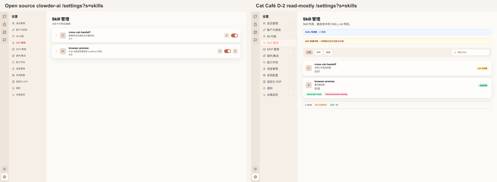

# F199 D-2 SkillsContent Parity Proof

## Visual Parity

Source target: `clowder-ai/packages/web/src/components/settings/SkillsContent.tsx`

Home target: `cat-cafe/packages/web/src/components/settings/SkillsContent.tsx`

Screenshot method:

- Open source: `http://localhost:3101/settings?s=skills`
- Home worktree: `http://localhost:5112/settings?s=skills`
- Playwright routed deterministic `/api/session`, `/api/capabilities`, `/api/skills`, and `/api/rules/skill/:id` responses so both UIs rendered the same two Skill records independent of local runtime data.
- Open source received its capability-board shape from `/api/capabilities`; home received the existing read-only `/api/skills` shape.
- Capture log: `./assets/capture-log.json` records zero console warnings/errors for both pages.

## User Visibility Disclosure

| User-visible surface | Open source behavior | Home behavior in D-2 | Decision |
|---|---|---|---|
| Skill settings entry | Shows Skill cards under `/settings?s=skills` | Shows Skill cards under `/settings?s=skills` | Ported |
| Skill preview | Clicking a card opens SKILL.md preview | Clicking a card opens the existing `SkillPreviewModal` via `/api/rules/skill/:id` | Ported |
| Skill filtering | Capability-board project/filter flow | Category filter + text search backed by `/api/skills` | Ported with home API shape |
| Mount health | Per-cat toggles expose raw edit controls | Passive mount summary (`全部挂载` / `n/4 已挂载`) | Read-mostly backfill |
| MCP dependency state | Source can drive install/repair flows through capability writes | Dependency chips show `ready` / `missing`; no repair button | Deliberately not ported; write flows stay deferred |
| Skills staleness / conflicts | Source can expose sync or conflict-resolution actions | Passive notifications show update/conflict counts only | Read-only notification; sync/resolve actions stay deferred to a higher-risk write slice |
| Sync/conflict actions | Source and old home surfaces can expose sync/resolve actions | Staleness/conflict banners are passive only | Deliberately not ported; D-2 is read-mostly |
| External skill uninstall | Source can render external uninstall action | No uninstall action | Deliberately not ported; DELETE/auth hardening remains a later F199 slice |

## Verification

- RED: `skills-content.test.tsx` initially failed because `../settings/SkillsContent` did not exist.
- GREEN: `SkillsContent` renders the read-mostly Skill list, category filter, dependency chips, passive staleness/conflict banners, and SKILL.md preview.
- Focused tests:
  - `NODE_ENV=test pnpm --filter @cat-cafe/web exec vitest run src/components/__tests__/skills-content.test.tsx`
  - `NODE_ENV=test pnpm --filter @cat-cafe/web exec vitest run src/components/__tests__/hub-skills-tab.test.tsx src/components/__tests__/hub-skills-install-missing.test.tsx`
- Static checks:
  - `pnpm biome check packages/web/src/components/settings/SkillsContent.tsx packages/web/src/components/settings/SettingsContent.tsx packages/web/src/components/__tests__/skills-content.test.tsx --diagnostic-level=error`
  - `pnpm --filter @cat-cafe/web exec tsc --noEmit --project tsconfig.json`

## Close-Out Notes

D-2 intentionally keeps write controls out of scope. This follows F199 KD-3: D-1/D-2 validate the upgraded parity SOP with read-mostly surfaces before the later high-risk secret/write slices. CVO accepted the complete five-slice backfill plan on 2026-05-13.

## Boundaries

- No `/api/capabilities` write is introduced.
- No skill DELETE/uninstall route is introduced.
- No sync, resolve, install, repair, or uninstall action button is rendered by home D-2.
- No F183/F184/F194 chat or bubble read-model files are touched.
