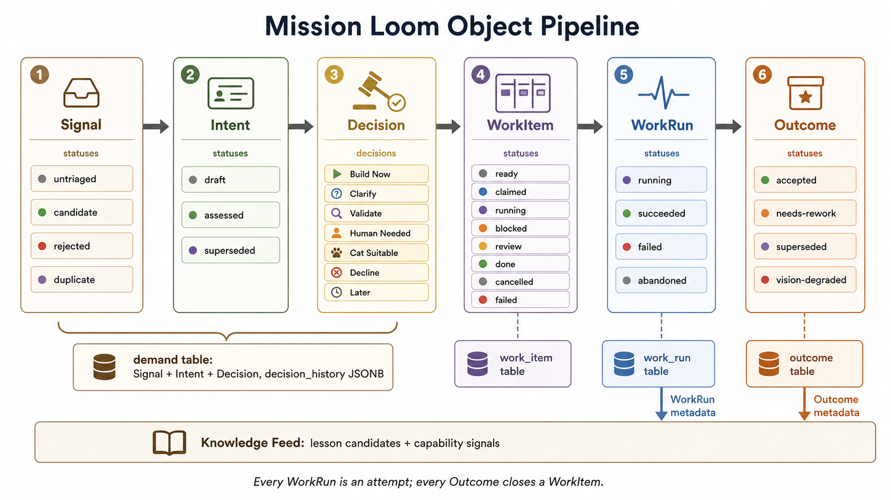
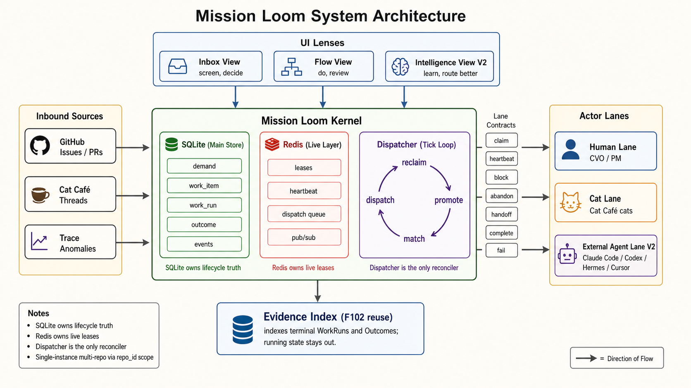
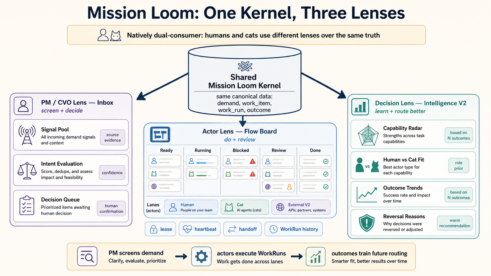

# Mission Loom — Multi-Cat & Human Project Board（综合稿 v1.9）

> UI 视觉子品牌：**Prism**（流光域）
> 任务来源：[README.md](./README.md) 末尾 Suggested Synthesis Owner
> 范围：回答砚砚提出的四个核心问题（对象模型/工作流/MVP/新仓） + 多猫拍板 OQ 6/7/10
> 不是最终 spec，是带 Landy 战略拍板 OQ 8/9 后立项 F0xx 的基线稿

> 任务来源：[README.md](./README.md) 末尾 Suggested Synthesis Owner
> 范围：回答砚砚提出的四个核心问题——对象模型、工作流、MVP 边界、新仓/内嵌取舍
> 不是最终 spec，是带大家讨论的基线稿

## Changelog

### v1.9（2026-05-22 03:05，Landy 点中 Bottleneck framing 错位 → Escalation View）

Landy 03:00 push back v1.8 多页面候选里的 "Bottleneck View"：依赖阻塞在 Inbox/Flow 已可见不需专页，真值得专页的是 **agent → human 升级队列**（assumption 破裂 / SLA 风险 / 跨猫僵局）。

**framing 修正**：Bottleneck View → **Escalation View**

| | v1.8 之前（错位） | v1.9 修正 |
|---|---|---|
| 定位 | "依赖阻塞可视化 + blocked 列表" | **agent → human 升级队列**（agent 自己处理不了的事项） |
| 不显示 | — | 依赖阻塞（dispatcher 自动 unblock，Inbox/Flow 已可见，不上专页） |
| 显示 | 所有 blocked WorkItem | 仅 `blocked_reason ∈ [assumption_breach / sla_risk / cross_cat_conflict / ambiguity / scope_question]` 的 WorkItem |
| 跟谁配对 | — | §3.7 "猫初筛 人终审" 的 execution 阶段版本（Demand Funnel 阶段是 Decision Queue） |

**Landy 原话举例（assumption_breach 类）**：
> "比如说 antigravity 我们最开始认为他有无头模式！结果他没有！他的 --help 在诈骗！"

**完整 Escalation reason 字典（7 类）**：
| Reason | 触发场景 | 谁能解决 |
|---|---|---|
| `assumption_breach` | 开发中发现需求前提不成立（API 不存在/文档诈骗/第三方行为跟预期不符） | 人重定需求 or 砍 scope |
| `sla_risk` | WorkRun 超时未完成 / 预估超剩余时间（Landy 提的"时间不够"） | 人决定：延期/加资源/砍 scope |
| `cross_cat_conflict` | 多猫 review 冲突，2 轮 push back 无共识（家规硬条件） | 铲屎官拍板 |
| `ambiguity` | task 描述歧义，多种实现路径 agent 选不出 | 人澄清意图 |
| `scope_question` | 做中发现可能超 scope（"顺手把 X 也修了？"） | 人决定 scope 边界 |
| `external_blocker` | 等第三方接口/审批/客户回复 | 人 follow up |
| `resource_unavailable` | token 耗尽 / 工具不可用 / 缺权限 | 人补充资源 |

**Schema 补丁**：`work_item` 加 `blocked_reason TEXT`（V1 free-text，V2 enum）。

**§5 新增 5.5 多页面探索段**（之前承诺"收敛后 patch"，本 patch 落档；Landy 仍可 push back 具体选择）：
- MVP 候选 3 页：Inbox + Flow + Workflow（Landy v1.8 brainstorm 第 2 项）
- V2 候选池（按降序优先级）：Escalation View / Pipeline View / Topology View / Resource View / Intelligence View / Audit View

**framing 一致性**：Escalation View 跟 §3.7 "猫初筛 人终审" 一脉相承——只是阶段不同（Demand Funnel 阶段 = Decision Queue / Execution 阶段 = Escalation View）。两个视图都是 agent-human handoff 的可视化界面。

### v1.8（2026-05-22 02:40，Landy 抛产品全景思考 → 任务驱动 framing + harness 解耦 confirm + WorkItem.stage）

Landy 02:36 抛了一大波产品全景思考。本 patch 处理 3 项 framing/schema 修正，其余（受众细化/多页面/token limit/资源约束）先在 thread 讨论收敛后再 patch。

**核心 framing 修正：任务驱动 ≠ 角色 agent 驱动**

> Landy 原话："不应该用角色 agent 来驱动应该用任务本身的环节来驱动。"

- 拒绝 Coze/Dify 模式（创建 "PM agent" / "dev agent"）
- 任务有 stage（spec / dev / test / review / dfx / ...），actor 有 capability（做过哪些 stage 的成功率）
- 路由按 `task.stage × actor.capability`（历史成功率）匹配，**不**按 `actor.role` 预设
- 这跟 v1.7 的 "agent-as-participant" 一脉相承，也跟 §3.6 猫味签名兼容（UI 表达层不变，机制层 framing 从 "actor's role" 修正为 "task's stage + actor capability"）

**Schema 补丁**：`work_item` 加 `stage` 字段（task lifecycle phase，跟 status 是不同维度）

**§4 加 Lane Registration**：harness 解耦 confirm。每个 runtime（cat-cafe / Claude Code / Codex / Cursor / 自造）启动时通过 Registration 接口注册到 Mission Loom：声明 runtime_id / capabilities / 可调度的 actor list。Dispatcher 据此匹配 task.stage。

**framing 三原则进一步收束**：
| 原则 | 维度 | 拒绝绑定 |
|---|---|---|
| agent-as-participant（v1.4） | 产品类型 | Agentic Work OS / agent factory |
| integration-first（v1.3 §4.5） | 需求来源 | 单一代码托管 |
| runtime-agnostic（v1.7 §4） | 执行者 | 单一 agent runtime |
| **task-driven**（v1.8 §3.6/§4） | 路由维度 | 角色预设 agent |

**brainstorm 待讨论（不在本 patch）**：
- 7 类人角色受众（dev/PLM/PM/TM/SL/QA/FDE）→ V2 权限模型
- 多页面探索（Progress/Workflow/Bottleneck/Pipeline/Topology/Resource/Audit View 等）→ 收敛后 patch §5
- Token limit / 资源约束 → V2 dispatcher 加 resource gating

### v1.7（2026-05-22 02:10，Landy + 郭良 confirm framing → Runtime-agnostic 原则）

Landy 02:05 跟郭良讨论后明确："Mission Loom 还是一个解耦的产品而不是一个完整的类似猫猫这种的东西，方便别人接入，比如我不用猫猫，比如我就用 codex/claudecode 也能接入"。

**新增核心原则（写入 §4 顶层）**：
> **Runtime-agnostic, Cat-Café-as-reference**：Mission Loom 不绑定 Cat Café。任意 agent runtime 都能接入：cat-cafe / Codex / Claude Code / Cursor / Hermes / 用户自造 agent。

这是跟 §4.5 **Integration-first, GitHub-as-reference** **对称的解耦原则**：
- §4.5: 需求来源不绑 GitHub，GitHub 是 reference connector
- §4 新: 执行者不绑 Cat Café，Cat Café 是 reference actor lane

**§4 Lane 表格重定位**：
- ~~Cat Lane = "Cat Café 内部猫" (default)~~ → **Cat-Café Lane = reference implementation**（跟 connector-github 同地位）
- ~~Claude Code / Codex / Cursor = "External Agent Lane V2"~~（暗示二等公民）→ **Claude Code Lane / Codex Lane = 平权 actor，day-1 接入文档就位，V2 完整实现**

**MVP 仍只实现 cat-cafe lane**（守住 7-8 周 scope），但：
- ✅ Lane Contract day-1 就位（接口、文档、示例）
- ✅ cat-cafe lane 实现严格通过 Contract（不走 cat-cafe 内部 API 捷径）
- ✅ 文档明示"拿 codex/claudecode 按 Contract 自接入"
- ❌ Spec 不能假设"agent 默认来自 cat-cafe"

**framing 闭环**：
- agent-as-participant ✓（不是 agent-as-product / 不是 Agentic Work OS）
- runtime-agnostic ✓（不绑 cat-cafe）
- integration-first ✓（不绑 GitHub）
- 三条原则共同构成 Mission Loom 的产品定位护城河

### v1.6（2026-05-18 00:45，Landy 质疑 WorkItem/WorkRun 分离 → 补 rationale）

Landy 00:42 问"WorkRun 为什么不能在 WorkItem 里体现"。这说明 spec §3 的 WorkItem/WorkRun 分离 rationale 写太简略（之前只有"每次 claim 开新 WorkRun，学 Hermes 不覆盖"一句）。

新增 §3 "WorkItem / WorkRun 分离的关键理由" 小节（与"Decision 独立成实体"小节平行）：
- 用 Landy 自己的三次 attempt 例子（卡住/换猫/过 review）展开
- 塞进 WorkItem 的两种写法都崩：覆盖字段丢历史 / JSON 数组无法索引聚合
- 1:N 关系必须独立表（测试用例:CI run 类比）
- **没有 WorkRun = 没有 eval 数据源**，回扣 Landy 23:30 初心三问
- Hermes "Attempt History Is First-Class" 最强一课
- 回应"WorkItem→分栏"：看板列=WorkItem 维度，卡片内 attempt 历史=WorkRun 维度（烁烁的尾迹）

**无对象模型改动**——这是 rationale 补强，6 元组不变。

### v1.5（2026-05-18 00:30，Landy co-design：需求转换层正名 + FE→WorkItem 拆分治理）

Landy 会议中（已拉郭良进会）抛出深度架构思考，点中真实 gap。新增 §3.7：

**洞察 1（正名）**：Signal/Intent/Decision = **Demand Funnel（需求转换层）**——"把任意混乱输入规整成标准需求"。Landy 独立推导 = 46 v1.1 的 demand 表合并方案，互相验证。spec 全文采用此命名。

**洞察 2（授权模型）**：猫初筛，人终审——跟 §3.6 + OQ 7 一致，正式写入 Demand Funnel 授权规则。

**gap（核心）**：`Decision → WorkItem` 是单步的，但 Decision 输出的 FE（feat）**可能跨多团队/多微服务/多代码仓**，缺"拆分治理层"。

我的架构判断（待 Landy confirm）：
- **FE 不是新实体**——是 demand 表 decision=BuildNow 那条记录的语义名
- **拆分是「动作」不是「新实体」**——复用 46 second-pass 加的 `work_item.team_id + repo_id + depends_on` + 新增 `parent_id`（self-ref），不新增第 7 个对象（守住"先锤一版看板"）
- **谁拆治理**：V1 单仓猫初拆+人审；V2 跨仓 +gitnexus 式依赖分析+人治理；V3 依赖图持续沉淀
- **gitnexus**（Landy 提的概念）= 跨仓特性级/服务级依赖图分析，V1 不做，V2 接住郭良多仓 SDD 真实场景
- **swimlane**（图2 Team NY/LA）= WorkItem 按 team_id 分组，V1 单泳道 V2 多泳道

**schema 补丁**：`work_item` 加 `parent_id TEXT REFERENCES work_item(id)`（FE→子任务拆分树）。

**connectors 印证**：Landy 列的 IM 提单（NL 自动转化）/ 内部云捷系统 / 客户采访 / GitHub issue = §4.5 Source Connector 多源，已覆盖。

### v1.4（2026-05-18 21:30，Docker 部署 + Roadmap Vision 追加郭良 4 大方向）

来源：Landy + 郭良（外部讨论者）wecom 对话 2026-05-18 14:56-15:46，46 做阅读理解后传球。

**46 阅读理解的关键修正**（铲屎官 21:13 push back）：
- 46 第一轮把"云端"等同于"换 Postgres"，铲屎官纠正——SQLite + Redis 装 Docker 即云端部署，HTTP API server 单写者模式完全够用（Hermes 自己就是 SQLite）
- ✅ **存储方案不变**：SQLite 主存 + Redis 活动态 + Docker volume 持久化（保持 v1.3）
- ✅ **新增 §12 Deployment**：Docker 打包方案 + docker-compose（46 预批）

**郭良带来的 4 大方向性追加**（46 撤 SQLite 错时连带撤过头，47 v1.4 补回）：

| 方向 | 郭良/Landy 原话 | 47 处理 |
|---|---|---|
| **跨仓跨团队（team-level board）** | "真实开发团队不一定围绕一个工程展开 / 我们的看板服务于全体项目 全体用户 全体 agent" | V2 优先方向，**MVP 守住单仓**，但 kernel day-1 留 `team_id + repo[]` 数据建模空间 |
| **团队级 Agent 小黑板** | "云端的团队的看板会不会成为团队 agent 的小黑板 / 微服务 A 依赖微服务 B 什么特性 → 开发微服务 A 的 agent 就会知道" | V2-V3 方向，对应 Knowledge Feed 升级为一等公民"依赖关系图" |
| **记忆作为基础设施** | "依赖梳理/特性级/服务级/各种设计原则 不希望用到的时候再初始化 → agent 交互过程中持续沉淀萃取" | V3 方向，扩展 Knowledge Feed 横切到"依赖图/设计原则/架构债"持久化层 |
| **云端分布式猫猫（终极愿景）** | "他不应该是看板而是云端分布式版本的猫猫才是终极" | V4 lighthouse vision，spec 记录但不规划实现路径 |

**新增 §13 Roadmap Vision**：V1 看板 MVP → V2 跨仓跨团队 → V3 记忆基础设施 → V4 云端分布式猫猫。**MVP scope 严格守住 v1.3 的 7-8 周不变**，遵循郭良原话"先锤一版看板，别一上来就想太复杂"。

**新增 OQ 13-16**：4 大方向的优先级/时机/scope 等 Landy 拍板。详见 §10。

**关键纪律守住**：
- 不因为新方向膨胀 MVP scope（守住"先锤一版看板"）
- 不悄悄改架构，方向性追加只作为 V2+ roadmap + OQ 待 CVO 拍板
- MVP kernel 保持单仓 + 单 team 假设，但 schema/接口留好未来扩展空间

**v1.4 second-pass patch（2026-05-18 04:25，46 confirm 后小调整）**：
- 46 second-pass 无阻塞，A/B/A/A OQ 倾向全同意
- 唯一建议：schema day-1 加 `team_id TEXT NOT NULL DEFAULT 'default'` + `repo_id TEXT NOT NULL DEFAULT 'default'` 默认列（4 张主表），零开发成本避 V2 跨团队 ALTER TABLE + backfill + 重建索引的痛
- 这是 P1 原则"每步产物是终态基座不是脚手架"的直接应用
- 已 patch 进 §3 schema skeleton，MVP 用户感知不到这两个字段

### v1.3（2026-05-14 17:30，Integration-first 原则 + Source Connector 架构）

Landy 17:20 提出关键扩展性追问："如果别人公司用 CodeHub 不是 GitHub，能接进来吗？"砚砚提出 Integration-first 原则我接受 + 自决两个技术 OQ：

**核心原则（写入 spec 顶层）**：
> **Integration-first, GitHub-as-reference**：GitHub 只是第一个 reference connector，**不是产品边界**。所有需求来源（CodeHub / Jira / Linear / 飞书任务 / Slack / Sentry / 内部告警）通过 **Source Connector** 接入；所有执行者通过 **Actor Lane** 接入；kernel 不直接依赖任何单一外部平台。

**新增 §4.5 Source Connector 架构**：
- Connector 三层（Kernel 固定 / Connector 可插拔 / Mapping 可配置）
- 增量接入 Level 0-4（手动导入 → webhook → 双向同步 → 字段映射 → 自定义 lane）
- `SourceConnector` 接口定义
- 边界：状态机/审计/权限/WorkRun 归档由 kernel 管，插件只能通过 kernel API 写

**砚砚两个 OQ 我自决**（技术架构非战略）：
- ✅ MVP spec Day-1 显式 SourceConnector 架构边界
- ✅ GitHub connector 命名为 `connector-github`（reference implementation 显式化），避免 GitHub 被误认为唯一入口

**§6 MVP 调整**：GitHub connector → `connector-github`（reference implementation）。

### v1.2（2026-05-14 07:15，多猫收敛 OQ 6/7/10）

三猫并行讨论后做最终收敛：

**OQ 6（仓名）→ 双层命名**：
- Kernel/Package/Repo 名：**`mission-loom`**（砚砚投，多线交织隐喻准，不撞 NousResearch Hermes Agent）
- UI 视觉主题名：**`Prism`**（烁烁的"流光域"英文版作为子品牌，对应 4 个 lens 的视觉表达）
- 理由：工程命名要准确（loom 对应 lane/thread/trace），视觉品牌要审美（Prism 折射隐喻对 dual-consumer 多 lens），两者不冲突反而互补。详见 §7。

**OQ 7（PM Agent LLM）→ 三层 mix 路由**（采纳砚砚方案）：
- 默认：Sonnet specifier（扩写 Goal/Approach/AC/Out-of-scope）
- 升级 Opus 4.7：模糊语义/战略/品牌/CVO 品味相关/低 confidence/历史 reversal —— 烁烁的"灵气定调"诉求归入此
- 升级 Opus 4.6：Build Now Ready 后做 feasibility/拆分/工程账
- 缅因猫 family：review gate / 测试 / 安全守门
- 铁律：永不绕过人最终拍板。详见 §6 MVP 配置 + §3.6。

**OQ 10（Capability Radar 冷启动）→ 角色先验 + 猫味签名**（融合砚砚机制 + 烁烁表达）：
- 砚砚机制：role prior + 每张卡人确认 + 所有 confirm/改派/rework 写入 routing signal + confidence 三档（`insufficient history` / `based on prior` / `based on N outcomes`）
- 烁烁表达：UI 不显示百分比，显示 "本任务散发着烁烁的味道（based on prior）" 这种猫格语言
- ≥20 真实 WorkRun 后升 warm recommendation
- 永不自动 dispatch（人确认必须）
- Intelligence View 阶段再做 radar 可视化。详见 §3.6（新增）。

**OQ 8/9 待 Landy 战略拍板**：
- OQ 8：BACKLOG.md 迁移时机（MVP 完成立刻 vs 稳定 1 个月后）
- OQ 9：MVP 是否邀请 clowder-ai 社区用户试用

### v1.1（2026-05-14 07:00，接受 46 feasibility review）

**46 无 P1 阻塞，3 个 P2 调整全部接受**：

1. **新仓 → monorepo 内新 package**（`packages/mission-core/` + `packages/mission-app/`）—— 省 1-2 周 scaffold，未来拆仓阻力最小化。理由：铲屎官说"新建开源仓"是最终目标不是 day-1 必须；API 边界用 monorepo package boundary 强制即可。详见 §7
2. **6 元组语义 + 4 表存储**（demand / work_item / work_run / outcome，需求侧三元组通过 status + decision_history JSONB 表达）—— 降 schema 复杂度 50%，不牺牲 Hermes 教的 WorkItem/WorkRun 分离。详见 §3
3. **Actor Lane Contract 补 block / abandon / handoff 三个操作** —— 协作核心场景，不是 nice-to-have。详见 §4

**4 个状态机缺口补丁（46 提出）**：
- WorkItem 加 `cancelled` 状态（Decision 反悔场景）
- Intent 加 `draft / assessed / superseded` 状态（重新评估场景）
- WorkItem 加 `review → running` 回退路径（开新 WorkRun，跟 Hermes 一致）
- Outcome 在 WorkItem 关闭时创建（不是每个 WorkRun 一个）

详见 §3.5 状态机补丁。

**MVP 时间调整：4-6 周 → 7-8 周**（46 push back，under-promise + over-deliver）。详见 §6。

**撤回"如果错了"#5**：46 push back "AI dispatch 太保守" 的担心——MVP 阶段人拍板是对的，AI 自动 dispatch 出错一次就会失去信任（参考多次 feedback_verify_before_guessing 教训）。详见 §11。

---

## 0. TL;DR

我们要做的**不是看板**，是「**人+猫+外部 agent 协作的 durable coordination kernel + AI-native PM 上游**」。

- **核心命题**：管理「意图变成可靠结果」的全过程，不只是管理任务
- **对象模型语义**：采纳砚砚 6 元组 `Signal → Intent → Decision → WorkItem → WorkRun → Outcome` + 横切 Knowledge Feed
- **存储 schema**（v1.1 调整）：**4 表** = `demand`（合并 Signal/Intent/Decision，status 区分阶段 + decision_history JSONB 审计）+ `work_item` + `work_run` + `outcome`
- **kernel 设计**：学 Hermes 的 durable coordination kernel + WorkItem/WorkRun 分离 + 结构化 handoff；**差异化在上游（Signal/Intent/Decision）+ Actor Lane 多源 + Capability Analytics**
- **MVP 边界**（v1.1 调整）：**7-8 周**做"GitHub issue + Cat Café cat + Human"三方协作闭环，不求多 Lane 不求 AI 全自动决策
- **新仓 vs 内嵌**（v1.1 调整）：**monorepo 内新 package**（`packages/mission-core/` + `packages/mission-app/`），API 边界用 package boundary 强制；MVP 稳定后再拆独立仓
- **仓名**（v1.2 拍板）：**`mission-loom`**（kernel/repo）+ **`Prism`**（UI 视觉子品牌）
- **PM Agent 路由**（v1.2 拍板）：**三层 mix** — Sonnet specifier 默认 / Opus 4.7 升级（模糊/品味/低 confidence）/ Opus 4.6 升级（feasibility/工程账）/ 缅因猫 review gate / 永不绕过人拍板
- **Capability 冷启动**（v1.2 拍板）：**角色先验 + 猫味签名 UI** — role prior 机制 + 烁烁的 Cat Signatures 表达 + confidence 三档；≥20 WorkRun 后升 warm recommendation；永不自动 dispatch
- **Integration-first 原则**（v1.3 新增）：**GitHub-as-reference, not boundary** — Source Connector 架构 day-1 就位，CodeHub/Jira/Linear/飞书/告警系统皆通过 connector 接入；增量 Level 0-4。详见 §4.5
- **Runtime-agnostic 原则**（v1.7 新增）：**Cat-Café-as-reference, not boundary** — Mission Loom 不绑定 cat-cafe，任意 agent runtime（Codex / Claude Code / Cursor / Hermes / 自造 agent）都能通过 Actor Lane Contract 接入。Cat-Café Lane 是 reference 实现（跟 connector-github 同地位）。详见 §4
- **任务驱动原则**（v1.8 新增）：**task-driven, not role-driven** — 路由按 `task.stage × actor.capability`（历史成功率）匹配，**不**按 `actor.role`（PM agent / dev agent）预设。拒绝 Coze/Dify 那种"创建角色 agent"模式。详见 §3.6 + WorkItem.stage 字段
- **Deployment**（v1.4 新增）：**Docker 打包**（API server + SQLite volume + Redis）+ `docker-compose up` 即云端，多人多机器通过 HTTP API 共享同一份状态。详见 §12
- **Roadmap Vision**（v1.4 新增）：V1 单仓单 team 看板 MVP → V2 跨仓跨团队（team-level board）→ V3 记忆基础设施（依赖图/设计原则/架构债持续沉淀）→ V4 云端分布式猫猫（lighthouse）。MVP 严格守住 v1.3 的 7-8 周 scope。详见 §13

---

## 0.5 图解版：先用三张图看懂

> 下面三张图分别回答：**这东西管什么？怎么跑？给谁看？** 看完这三张图就够了解全貌了，后面的章节是工程细节。

### 图 1：一条需求从"一句话"变成"可靠结果"



**Mission Loom 管的不是一张任务卡，而是一条需求的完整旅程——从一句模糊的想法到可靠的交付成果。**

最左边的 **Signal（信号）** 是原始输入：一条 GitHub issue、聊天里冒出来的想法、一个系统异常。它还很粗糙，不一定值得做。**Intent（意图）** 是把这句话翻译成"用户到底想要什么"——清不清楚？接不接地气？**Decision（决策）** 是人来拍板：现在做、先问清楚、先验证、适合猫做、拒绝、以后再说。

拍板之后才进入传统看板熟悉的部分：**WorkItem（任务）** 是真正派出去的活儿；**WorkRun（执行）** 是一次具体的做事过程——同一个任务可能跑多次，比如第一次卡住了、第二次换猫接手、第三次通过 review；**Outcome（结果）** 是最终交付和复盘。

前三步（信号→意图→决策）都是在回答"该不该做"，所以存在同一张数据表里。后三步分开存，是为了把"任务本身"、"每次执行"和"最终结果"分清楚——一次失败的执行不会把整张任务判死刑。底下的 **Knowledge Feed（知识涌现）** 负责从结果里自动抽取经验，未来反哺到前端：什么需求该做、该给谁做。

### 图 2：系统怎么跑起来



**一句话：左边进需求，中间留真相，右边派人和猫去做。**

左边是需求来源：GitHub issue/PR、Cat Café 对话、系统异常告警。它们进入中间的 **Mission Loom 内核**——由两层存储组成：**SQLite** 记长期真相（需求是什么、任务到哪步了、执行结果怎样），**Redis** 管活跃状态（谁领了活、心跳还在不在、队列里排着谁）。

中间的 **Dispatcher（调度员）** 是唯一的交通警察，周期性干三件事：把准备好的任务派出去、把卡住或超时的执行回收、把满足前置条件的任务推进到下一步。右边的 **Actor Lanes（执行通道）** 是干活的人和猫：人类 PM/CVO、Cat Café 里的猫、未来的外部 agent（Claude Code / Codex / Cursor 等），都通过同一套接活协议来领任务、报心跳、喊卡住、交接给别人、标完成或失败。

底部的 **Evidence Index（记忆索引）** 只收已经跑完的执行和最终结果，不往里塞正在进行中的半成品。记忆库沉淀的是可靠结论，不是过程噪音。

### 图 3：同一份数据，给不同角色看不同切面



**不是做三套系统，而是同一份数据长出三副眼镜。**

你（PM/CVO）戴上第一副眼镜看 **Inbox**：哪些需求进来了、意图清不清楚、证据够不够、哪些等你拍板。猫和人（执行者）戴上第二副看 **Flow Board**：哪些任务可以领、谁在做、哪里卡住了、哪些等 review。你偶尔换上第三副看 **Intelligence**（V2 才做）：哪类任务猫独立完成率高、哪类必须人先拍板、哪些猫擅长什么、哪些决策容易反悔。

核心好处：**人和猫用的是同一份真相**，只是看的窗口不同。你不需要另做周报汇总，猫也不需要翻你的看板猜自己能领什么——执行结果还能自动反哺到后续的任务分配。

---

## 1. 核心命题

> **不是管理任务，而是管理"意图变成可靠结果"的全过程。**（砚砚原话，我同意）

KanbanFlow 的设计假设是「PM 在外面做完筛选，看板里都是已批准任务」。我们的世界不是——
- 需求是**涌现的**（多源信号涌入）
- 执行是**主动的**（猫+人+外部 agent 并行）
- PM 工作的一部分（评估/排序/分诊）**本身就该被 agent 辅助**
- 任务完成是**多次 attempt 的累积**，不是一次性事件

所以传统 4 列看板（todo/doing/done）只是**整个流水线的一个横切面**，不是全部。

---

## 2. 四方输入对齐 + 分歧

### 强共识（四方都同意）
- 这不是仿 KanbanFlow 复刻 → 是 AI-native 项目管理操作台
- 需要上游 PM 层（需求漏斗）+ 中游执行层 + 下游观测/eval 层
- 「猫干 / 人干 / 协作」的 routing 决策必须基于历史数据驱动
- 单实例多仓库（Repo-agnostic，非多租户）—— 铲屎官 2026-04-18 拍板的硬约束

### 分歧点（待收敛）

| 议题 | 46 | 47（独立思考） | 砚砚（Hermes 拆解） | 烁烁 | 我的综合建议 |
|---|---|---|---|---|---|
| **抽象粒度** | 3 层（漏斗/市场/可观测） | 5 池（Signal/Intent/Task/Run/Lesson） | 6 元组（+Decision，Task→WorkItem，Run→WorkRun，Lesson→Outcome） | 4 场景（视觉层） | **6 元组语义 + 4 表存储**（v1.1 接受 46 调整）（§3） |
| **kernel 形态** | 未具体说 | 流水线为主 | durable coordination kernel（学 Hermes SQLite + dispatcher） | 视觉为主 | **采纳砚砚 kernel-first**（UI 是 lens，不是源） |
| **存储** | 未具体说 | 未具体说 | SQLite vs Redis 待定 | — | **SQLite 作主存 + Redis 作活动态层**（§8） |
| **新仓 or 内嵌** | 倾向新仓 | 倾向内嵌 + 3-6 月后拆 | 偏向 day 1 解耦 + 三层 (core/connectors/app) | — | **monorepo 内新 package**（v1.1 接受 46 调整）（§7） |
| **MVP 第一刀** | 未具体说 | GitHub + Cat Café thread | GitHub issue + Cat Café thread → WorkItem → Outcome | — | **同**（§6 详细 scope） |

### 烁烁视觉创想的归位

烁烁的 4 场景不是替代方案而是**视觉表达层**，可直接映射到对象模型：

| 烁烁视觉 | 对应对象层 | 对应 UI 视图 |
|---|---|---|
| 🌊 混沌引力池 | Signal Pool | Inbox View 顶部漏斗 |
| ⚖️ 炼金台 | Intent + Decision | Inbox View 评估 + 决策区 |
| 🎢 多维猫爬架（能量轨道+尾迹） | WorkItem + WorkRun（trace 可视化） | Flow View |
| 👁️‍🗨️ 星象雷达 | Outcome + Capability Analytics | Intelligence View |

视觉方向我都很喜欢，但 MVP 阶段建议先用静态 Kanban + Card 形态，能量轨道/引力聚类等动效进 V2。

---

## 3. 核心对象模型（六元组 + 横切 Knowledge Feed）

### 六元组（采纳砚砚拆解，理由如下）

```
   Signal  →  Intent  →  Decision  →  WorkItem  →  WorkRun  →  Outcome
     ↓         ↓          ↓            ↓            ↓          ↓
     └─────────┴──────────┴────────────┴────────────┴──────────┘
                    Knowledge Feed (横切：自动抽 lesson 候选)
```

### 各对象定义 + 为什么独立

| 对象（语义） | 含义 | 状态域 | 存储 schema（v1.1） |
|---|---|---|---|
| **Signal** | 原始信号（GitHub issue / 对话片段 / trace anomaly / 用户反馈） | `untriaged / needs-info / duplicate / candidate / rejected` | `demand` 表，`stage = 'signal'` |
| **Intent** | 翻译后的需求意图（五维评估 from F076） | `draft / assessed / superseded`（v1.1 新增） | `demand` 表，`stage = 'intent'` |
| **Decision** | PM 拍板的处置（同一 Intent 可经历多次 Decision） | `Build Now / Clarify First / Validate First / Human Needed / Cat Suitable / Decline / Later` | `demand` 表，`stage = 'decision'` + `decision_history JSONB`（审计每次改主意） |
| **WorkItem** | 可执行任务切片 | `ready / claimed / running / blocked / review / done / cancelled / failed`（v1.1 新增 cancelled） | `work_item` 表（独立） |
| **WorkRun** | 一次具体执行 attempt | `running / succeeded / failed / abandoned` | `work_run` 表（独立，每次 claim 新行） |
| **Outcome** | WorkItem 关闭时创建（v1.1 明确） | `accepted / needs-rework / superseded / vision-degraded` | `outcome` 表（独立） |

### v1.1 存储简化：6 元组语义 → 4 表存储

46 push back：Signal/Intent/Decision 都是"需求侧"的不同阶段，物理上合并 `demand` 表能降 50% schema 复杂度，不影响审计完整性（`decision_history JSONB` 记录每次改主意）。WorkItem/WorkRun/Outcome 保持独立——这是 Hermes 教我们的核心分离不能丢。

**何时考虑拆出 Decision 独立表**：未来需要"我们多少次 Decision 改了主意"这类大规模分析，JSONB 解析成本高时再拆。MVP 阶段需求侧数据量级是百级，JSONB 查询完全够。

### v1.4 schema skeleton（46 second-pass 建议：Day-1 留 team_id + repo_id 默认列）

46 建议：MVP 不做多 team feature，但 schema 必须 day-1 加 `team_id` + `repo_id`，零开发成本避 V2 跨团队 ALTER TABLE + backfill + 重建索引的痛。这是 P1 原则"每步产物是终态基座不是脚手架"的直接应用。

```sql
-- 4 张主表 day-1 必加字段
CREATE TABLE demand (
  id            TEXT PRIMARY KEY,
  team_id       TEXT NOT NULL DEFAULT 'default',   -- v1.4 加（V2 跨团队基座）
  repo_id       TEXT NOT NULL DEFAULT 'default',   -- v1.4 加（V2 跨仓基座）
  stage         TEXT NOT NULL,                      -- signal | intent | decision
  status        TEXT NOT NULL,                      -- 状态域 详见 §3.5
  -- ... 其它业务字段
  decision_history JSONB,                          -- v1.4 含 reversal_reason 字段
  created_at    INTEGER NOT NULL,
  updated_at    INTEGER NOT NULL
);

CREATE TABLE work_item (
  id            TEXT PRIMARY KEY,
  demand_id     TEXT NOT NULL REFERENCES demand(id),
  parent_id     TEXT REFERENCES work_item(id),      -- v1.5 加（FE→子任务拆分树；NULL=FE 本体/单体任务）
  team_id       TEXT NOT NULL DEFAULT 'default',   -- v1.4 加
  repo_id       TEXT NOT NULL DEFAULT 'default',   -- v1.4 加
  status        TEXT NOT NULL,                      -- ready/claimed/running/blocked/review/done/cancelled/failed
  stage         TEXT NOT NULL DEFAULT 'unspecified', -- v1.8 加（lifecycle phase: spec/dev/test/review/dfx/...；跟 status 不同维度，task-driven 路由的关键）
  blocked_reason TEXT,                              -- v1.9 加（仅 status=blocked 时填；enum 见 §5.5 Escalation reason 字典：assumption_breach/sla_risk/cross_cat_conflict/ambiguity/scope_question/external_blocker/resource_unavailable；V1 free-text，V2 enum 强约束）
  -- ... owner/AC/dependencies/lease
  depends_on    JSONB,                              -- 数组：依赖的其它 work_item_id（V2 跨仓 link 时升级为 cross-repo refs）
  created_at    INTEGER NOT NULL,
  updated_at    INTEGER NOT NULL
);

CREATE TABLE work_run (
  id            TEXT PRIMARY KEY,
  work_item_id  TEXT NOT NULL REFERENCES work_item(id),
  team_id       TEXT NOT NULL DEFAULT 'default',   -- v1.4 加（denorm 加速查询）
  actor_lane    TEXT NOT NULL,                      -- human / cat / external_agent / ci
  actor_id      TEXT NOT NULL,                      -- 具体执行者（opus / codex / landy / external runtime id）
  status        TEXT NOT NULL,                      -- running/succeeded/failed/abandoned
  summary       TEXT,
  metadata      JSONB,
  artifacts     JSONB,                              -- prUrl/commitSha/threadId/filesPaths
  handoff_context JSONB,                           -- keyDecisions/openQuestions
  started_at    INTEGER NOT NULL,
  ended_at      INTEGER
);

CREATE TABLE outcome (
  id            TEXT PRIMARY KEY,
  work_item_id  TEXT NOT NULL REFERENCES work_item(id),
  team_id       TEXT NOT NULL DEFAULT 'default',   -- v1.4 加（denorm 加速查询）
  result        TEXT NOT NULL,                      -- accepted/needs-rework/superseded/vision-degraded
  summary       TEXT,
  lesson_candidate JSONB,                          -- Knowledge Feed 候选（W7 横切）
  created_at    INTEGER NOT NULL
);

-- 辅助表
CREATE TABLE events (...);                          -- 全局 audit
CREATE TABLE routing_signal (...);                  -- §3.6 在线学习
```

**MVP 阶段所有数据**：`team_id = 'default'` + `repo_id = 'default'`（或单仓 GitHub repo 唯一标识）。用户感知不到这两个字段。

**V2 跨团队时**：新增 team 管理 UI + team-scoped 视图权限 + 多 repo 绑定，**不需要改 schema**——只需开始填入真实 team_id/repo_id。这就是 46 说的"零迁移痛"。

### Decision 独立成实体的关键理由（这是我跟砚砚同步的看法）

Hermes 的 triage specifier 是「一次性 spec 扩写」，**它没有 Decision 概念**。我们必须有，因为：
1. PM 拍板不是 LLM 一次完成的——是「AI 建议 + 人/CVO 确认」的两步走
2. 同一 Intent 在不同时间点的 Decision 可能不同（情境变化、新证据涌入）
3. Decision 是**审计真相源**——"我们为什么没做 X" 的答案在这里
4. 这是我们区别于 Hermes/Trello/Jira 的核心差异化

### WorkItem / WorkRun 分离的关键理由（v1.6 补，Landy 2026-05-18 00:42 质疑）

> Landy 原话："WorkRun（执行）是一次具体的做事过程——同一个任务可能跑多次，比如第一次卡住了、第二次换猫接手、第三次通过 review，为什么不能在 WorkItem 里体现呢？"

**能塞，但塞了会丢三样东西，而且丢的正好是你 23:30 初心要的（"agent 效果到底怎么样 / eval tracing"）。**

用 Landy 自己的三次 attempt 例子展开：

| | WorkItem（要做的事，1 行） | WorkRun（做的过程，3 行） |
|---|---|---|
| 第 1 次卡住 | — | run#1: actor=opus, status=failed, error=依赖未就绪, trace=…, 耗时 2h |
| 第 2 次换猫接手 | （同一行，status 还是 running） | run#2: actor=codex, handoff_from=run#1, status=failed, trace=…, 耗时 3h |
| 第 3 次过 review | （同一行，status→done） | run#3: actor=sonnet, status=succeeded, prUrl=…, 耗时 1h |

**塞进 WorkItem 的两种写法都崩**：
- **写法 A（覆盖字段）**：WorkItem 加 `attempt_count` + `last_error` → 第 3 次成功后，"前两次谁做的、为什么失败、各花多久" **全被覆盖丢光**
- **写法 B（塞 JSON 数组）**：WorkItem 加 `runs JSONB` → 每次 heartbeat/状态变更要 rewrite 整行；trace 数据埋在 JSON 里**无法索引、无法聚合**；Capability Radar（"砚砚做这类任务成功率 90%"）直接做不出来

**1:N 关系必须独立表**（关系建模基本原则）。类比：测试用例 : 每次 CI run / 招聘岗位 : 每个候选人面试轮次——没人会把"每次 CI run 日志"塞进"测试用例"那一行。

**没有 WorkRun = 没有 eval 数据源**。Landy 23:30 初心三问："agent 效果到底怎么样 / agent 执行的结果 / 这类任务猫独立完成率"——这三个问题的答案**全部 attach 在 WorkRun 上**（actor + status + 耗时 + 返工次数 + trace friction）。WorkItem 只能回答"这事做完没"，回答不了"做得好不好、谁做的、几次才成"。

**这是 Hermes 教我们最强的一课**（砚砚拆解 §"Attempt History Is First-Class"）：Hermes 不用最新状态覆盖 task，每次 claim 创建 `task_runs` 行，retry context 带 prior outcome——"agent performance 应该 attach 到 attempts，不是 tasks"。我们直接继承。

**回应"WorkItem → 分栏"**：看板分栏（To-do/In progress/Done）展示的是 **WorkItem**（一张任务卡）；WorkRun **不在分栏上显示为卡片**，而是点开 WorkItem 卡片后看到的**执行轨迹**（第1次卡@opus → 第2次换@codex → 第3次过review@sonnet）。这正是烁烁视觉创想里"多维猫爬架的尾迹（Trail）"——尾迹乱=这个任务反复返工。**看板列=WorkItem 维度；卡片内的 attempt 历史=WorkRun 维度。两个维度，一个看板。**

### Knowledge Feed 横切（采纳 47 独立思考 + 现有 F102/W7 机制）

每个 Outcome 完成后自动触发：
- 成功 Outcome → 提取「这类任务谁干得好」候选 → Capability Radar 数据
- 失败 Outcome → 自动 5 why 追因 → Lesson 候选
- 全部进 Knowledge Feed → 铲屎官拍板入库 → 反哺 PM Agent 的 Triage 判断

---

## 3.5 状态机补丁（v1.1 新增，46 提的 4 个缺口）

```
Signal:    untriaged → needs-info → candidate → [accepted → Intent created]
                                              → [rejected]
                                              → [duplicate]

Intent:    draft → assessed → [Decision created]
                            → superseded (重新评估 = 旧 superseded + 新 created)

Decision:  (创建时即 final) Build Now / Clarify / Validate / Human Needed
                            / Cat Suitable / Decline / Later
           Later → 可重开为新 Decision (写入同 demand 的 decision_history JSONB)

WorkItem:  ready → claimed → running → blocked → running (unblock)
                                     → review → done
                                              → running (rework, 开新 WorkRun)
                          → abandoned (猫主动放弃)
           ready/claimed → cancelled (Decision 反悔)
           任何非 done 状态 → failed (不可恢复错误)

WorkRun:   running → succeeded / failed / abandoned
           (terminal state 之后 immutable)

Outcome:   WorkItem 关闭时（done/failed/cancelled）创建一次
           accepted / needs-rework / superseded / vision-degraded
           needs-rework → 触发 WorkItem 新 WorkRun（WorkItem 回 running，本 Outcome 标 superseded）
```

### 4 个缺口对应的处理

1. **Decision 反悔**：CVO 改"Later"→ 写入 `decision_history JSONB`（含 `reversal_reason` 字段，v1.1 second-pass 补丁）；已创建的 WorkItem 走 `ready/claimed → cancelled`（running 的先 abandon 再 cancel）。
2. **Intent 重新评估**：旧 Intent 标 `superseded`，创建新 Intent；保留两条记录可追溯。
3. **WorkItem 回退**：review 发现问题 → 状态回 `running` + 开**新 WorkRun**（不恢复旧的，跟 Hermes 一致）；本 Outcome 标 `needs-rework`。
4. **Outcome 触发**：每个 WorkItem 关闭时恰好创建 **1 个** Outcome（done/failed/cancelled 各一种）；不是每个 WorkRun 一个。`needs-rework` 不意味 WorkItem 关闭，它只触发新 WorkRun。

### Triage 升级触发（v1.1 second-pass 补丁，46 答）

MVP 阶段不定数字阈值（样本太小，前 2 个月 15-30 个 demand 任何百分比都没统计意义）。改用**定性触发**：

| 升级信号 | 含义 | 怎么发现 |
|---|---|---|
| CVO 连续 3 次 reversal 的 reason 含 "triage 漏了 X" | specifier 扩写质量不够 | 月度 review 扫 `decision_history.reversal_reason` |
| CVO 主动说 "这个需求你们理解错了" | 意图翻译失败 | 铲屎官直接反馈 |
| 同类需求反复 Clarify First → Build Now → Clarify First 震荡 | 需求分类维度不够 | 状态机回退路径频率监控 |

**升级动作**：触发任一信号 → 加 Need Audit 的 Source tag 硬门禁（Q/O/D/R/A）+ groundedness 维度；按缺什么补什么，不上全套五维。

### demand 表拆表触发（v1.1 second-pass 补丁，46 答）

**拆表 = 启动 Intelligence View 时（V2）**。理由：MVP 阶段 demand 表量级 ≤ 200 行，JSONB `json_extract` 亚毫秒；Intelligence View 需要 decision-level 聚合查询，JSONB 在 SQLite 里能写但丑且慢。

**二满足一即拆**：
1. demand 表 > 1K 行 **且** 有 decision-level 聚合查询需求
2. 启动 Intelligence View 开发

**拆法**：从 `demand.decision_history` JSONB 抽出 `decision` 表（demand_id + decision_type + made_by + made_at + reversal_reason），一次性 migration backfill；JSONB 完整审计数据不丢信息。

---

## 3.6 角色先验 + 猫味签名（v1.2 新增，OQ 10 收敛）

### 问题

MVP 阶段没有历史数据，怎么决定 "这张卡推给猫还是人"？

### 方案：角色先验 + 猫味签名 UI + 在线学习

**砚砚机制 + 烁烁表达 = 工程理性 + 审美猫格** 的融合方案。

#### 1. 角色先验（机制层）

启动时内置低置信度 role prior（基于猫的"性格标签"——烁烁的 Cat Signatures 语言）：

| 性格标签 | 推荐 lane（cold prior） | 触发关键词 |
|---|---|---|
| 审美/交互/视觉/创意 | 烁烁（暹罗猫） | UI / 设计 / 视觉 / wireframe |
| 底层/逻辑/架构/协议 | 宪宪（布偶猫） | 后端 / MCP / 协议 / schema / 状态机 |
| Review/测试/安全/一致性 | 砚砚（缅因猫） | review / 测试 / 安全 / lint |
| 价值判断/品牌/愿景 | 人（Landy） | 愿景 / 品牌 / 战略 / 优先级 |

#### 2. 猫味签名 UI（表达层）

UI **不显示百分比**（45% / 65% / 85% 都是假装很懂）。改用烁烁的"猫格化"语言：

```
┌──────────────────────────────────────┐
│ 任务卡：F320 Knowledge Feed 失败重试 │
├──────────────────────────────────────┤
│ 推荐 lane：🐾 宪宪                    │
│ 这个任务散发着宪宪的味道              │
│ （based on prior — 后端/协议关键词）  │
│                                       │
│ [接受推荐] [改派其他猫] [人来做]      │
└──────────────────────────────────────┘
```

#### 3. Confidence 三档（砚砚机制）

| Tier | 触发条件 | UI 表达 |
|---|---|---|
| `insufficient history` | 0 个历史 WorkRun | "这个任务还没人做过类似的" |
| `based on prior` | <20 历史 WorkRun，仅 role tag 匹配 | "散发着 XX 的味道" |
| `based on N outcomes` | ≥20 历史 WorkRun，有真实数据 | "XX 做过 N 次类似任务，成功率 P%" |

#### 4. 在线学习

每张卡的：
- ✅ 接受推荐 → 强化 role prior 权重
- 🔄 改派 → 降低当前 lane 权重，提升改派 lane 权重 + 记录改派原因
- ❌ 撤销/失败 → 降低 lane 权重
- ✨ 成功 → 强化 lane 权重 + 写入 capability evidence

所有 routing decision 都写入 `routing_signal` 表（demand_id + suggested_lane + actual_lane + tier + confidence + actual_outcome）。

#### 5. 核心铁律

- **永不自动 dispatch**（MVP 阶段，避免 AI 失误失去信任）
- **永远显示 confidence 来源**（不能把"角色先验"伪装成"历史证明"——砚砚原话）
- **≥20 真实 WorkRun 后才升 warm recommendation**（不是 cold prior 直接当结论）

### Intelligence View（V2）展开

到了 V2 Intelligence View 阶段：
- 烁烁的"星象雷达"上场，把 role prior + 累积 outcome data 渲染成能力六边形
- 出现"这类任务给谁最合适"的真实归纳
- 数据足够时考虑半自动 dispatch（人一键确认）

### v1.8 framing 注解：task-driven, not role-driven

> Landy 02:36 原话："不应该用角色 agent 来驱动应该用任务本身的环节来驱动。"

**机制层 framing 微调**（UI 表达层"猫味签名"不变）：

| 维度 | v1.7 之前（含糊） | v1.8 明确 |
|---|---|---|
| 路由 key | actor's role tag（视觉/底层/review） | **`task.stage × actor.capability`**（task 有 stage 字段，actor 累积 stage 成功率） |
| Capability 累积维度 | role-based（这只猫是"review 系"） | **stage-based**（这只猫做过几次 spec / dev / review / test，各自成功率） |
| 路由建议触发 | task 关键词匹配 actor role | task.stage 匹配 actor 在该 stage 的历史 capability |

举例：
- v1.7 之前：task "实现 OAuth"→关键词"实现/后端"→匹配宪宪 role tag "后端/协议"
- v1.8：task.stage=`dev` → 匹配"在 dev stage 历史成功率高的 actor"（可能是宪宪，也可能是任何在 dev stage 跑得好的 actor，不预设它的 role）

**为什么这个修正重要**：
- 跟 v1.7 "runtime-agnostic + agent-as-participant" 一脉相承——拒绝"创建 PM agent / dev agent"模式
- 任何 agent runtime 接入（cat-cafe / Codex / Claude Code / 自造）都用同一套 capability 累积，不需要预先声明 role
- 把"actor 是什么"的认知负担从用户身上拿走——actor 是什么由它**做过什么** + **做得怎么样**自然涌现

**对 UI 表达层（"猫味签名"）零影响**：
- 仍然显示"散发着宪宪的味道（based on prior）"
- 只是 prior 的计算方式从 "role tag 匹配" 改为 "stage 历史 capability"
- 烁烁的 Cat Signatures 语言不变，机制更准确

---

## 3.7 需求转换层正名 + FE→WorkItem 拆分治理（v1.5 新增，Landy co-design 2026-05-18 00:27）

Landy 在会议中点破了两个核心洞察 + 暴露了一个真实的对象模型 gap。本节正名 + 补 gap。

### 洞察 1：Signal/Intent/Decision = 需求转换层（Demand Funnel）

Landy 原话："其实我们这三层是在做需求的转换层？可能有规整的需求 也可能有随意的需求。decision 这里输出的就得是统一规整的需求了"。

**这跟 46 v1.1 的 demand 表合并方案不谋而合**——独立推导出同一个抽象，互相验证：

| 层 | 输入 | 输出 | 物理存储 |
|---|---|---|---|
| **Demand Funnel**（需求转换层）= Signal + Intent + Decision | 任意混乱输入（IM 自然语言 / 客户采访 / 内部云捷系统 / GitHub issue） | **统一规整的需求** | `demand` 表（v1.1 已合并，stage 字段区分） |

正式命名：Signal→Intent→Decision 这一段叫 **Demand Funnel（需求转换层）**，职责是"把任意混乱输入规整成标准需求"。**spec 全文采用此命名。**

"能不能合并？"——**物理存储上 46 在 v1.1 已经合并了**（demand 表 + stage 字段）。语义保留三段是因为授权模型需要区分阶段（见洞察 2）。Landy 和 46 独立得出同一结论 = 这个抽象稳。

### 洞察 2：授权模型 = 猫初筛，人终审

Landy 原话："decision 这里 可能是最终授权得是人，初步筛选是猫"。

这跟 §3.6 + OQ 7（PM Agent 三层路由）+ "永不绕过人最终拍板"铁律完全一致。正式写入 Demand Funnel 的授权规则：

| 阶段 | 谁做 | 产出 |
|---|---|---|
| Signal → Intent | 猫（Sonnet specifier 默认 / 升级 Opus） | 规整化候选 |
| Intent → Decision（初筛） | 猫（评估 + 推荐处置） | Decision 候选 + evidence |
| Decision 终审 | **人（CVO/PM）** | 最终授权（Build Now / Decline / ...） |

### gap：FE → WorkItem 之间缺"拆分治理层"

Landy 原话："IR 原始需求 → FE（就是我们的 feat 了）。但是如果一个 FE 分到了不同的小团队？！我们这个 FE 到底是需要继续拆分到具体的小团队吗？有可能是不同的微服务？比如三个微服务互相有依赖，他们是三个代码仓。这里猫猫得拆清楚可能是个挑战 需要有 gitnexus？人治理？"

**这是真实 gap。** 现有对象模型 `Decision → WorkItem` 是单步的，但 Landy 指出：Decision 输出的 FE（feat）**可能跨多团队/多微服务/多代码仓**，从 FE 到 WorkItem 之间缺一个"拆分 + 依赖梳理"环节。

### 术语对齐

| Landy 的词 | spec 对象 | 关系 |
|---|---|---|
| IR（原始需求） | Signal | Demand Funnel 入口 |
| FE（feat） | Decision(Build Now) 的输出 | **不是新实体**——是 demand 表里 decision=BuildNow 那条记录的语义名 |
| 分栏 todo（KanbanFlow 截图） | WorkItem 的 Flow View | FE 拆分后的执行单元 |
| swimlane（图2 Team NY/LA） | WorkItem 按 team_id 分组 | V2 多泳道，V1 单泳道 |

### 架构判断：拆分是「动作」不是「新实体」

**我的判断（待 Landy confirm）**：不新增第 7 个实体，复用 46 second-pass 刚加的 `work_item.team_id + repo_id + depends_on`：

```
Decision(Build Now) = FE
   │
   │  ◄── 拆分治理动作（谁拆见下表）
   ▼
WorkItem (parent)            ← FE 本体，status=blocked 直到子项完成
   ├── WorkItem (child, team_A, repo_1)   depends_on: []
   ├── WorkItem (child, team_B, repo_2)   depends_on: [child_A]   ← 跨仓依赖
   └── WorkItem (child, team_C, repo_3)   depends_on: [child_A, child_B]
```

复用已有机制：
- `work_item.parent_id`（新增字段，self-ref）+ `depends_on JSONB`（v1.4 已加）
- `team_id` + `repo_id`（v1.4 second-pass 已加）
- Hermes dependency engine 模式（parent 没 done，child 不被领走 / 有依赖的 child 等依赖满足才 ready）

**为什么不新增实体**：守住"先锤一版看板"（郭良 15:15 原话）。拆分是 FE→WorkItem 的一个**流程动作**，谁拆是职责问题（PM/猫/工具），不需要新对象。

### 「谁来拆」治理：V1 vs V2

| 阶段 | 拆分范围 | 谁拆 | 工具 |
|---|---|---|---|
| **V1 (MVP)** | 单仓单 team | 猫初拆（Sonnet/Opus specifier 把 FE 拆成 work_item 列表）+ 人审 | 无需 gitnexus，单仓依赖人脑/猫脑够 |
| **V2 (跨仓跨团队)** | 多仓多 team | 猫初拆 + **gitnexus 式依赖分析辅助** + 人治理终审 | gitnexus = 跨仓依赖图分析（= 郭良的"多仓 SDD 依赖梳理"）|
| **V3 (记忆基础设施)** | 同 V2 | 依赖图持续沉淀，拆分时自动注入历史依赖知识 | Knowledge Feed 升级形态（§13 V3） |

**gitnexus 定位**（Landy 提的概念）：跨仓 + 特性级/服务级依赖图分析工具。**V1 不做**（单仓不需要），V2 作为拆分治理的辅助。这正好接住郭良的多仓 SDD 真实场景——**郭良的痛点 = 我们 V2 的 gitnexus 需求来源**。

### V1 守住的边界

- ✅ V1 支持 FE→多 WorkItem 拆分，但**仅单仓单 team**（parent/child 都在 default team/repo）
- ✅ schema day-1 留好跨仓拆分的字段（parent_id + depends_on + team_id + repo_id）
- ❌ V1 不做 gitnexus（跨仓依赖分析）
- ❌ V1 不做多 swimlane UI（单泳道够用）
- ❌ 不因为"未来跨仓"在 V1 提前造依赖分析引擎（YAGNI）

### swimlane 映射（回答 Landy "对应我们的 WorkItem？"）

是的，KanbanFlow 截图里的 To-do/Do today/In progress/Done **卡片 = WorkItem 的 Flow View 列**；图2 的 General/Team NY/Team LA **泳道 = WorkItem 按 `team_id` 分组**。V1 单泳道（team_id=default），V2 多泳道（真实 team_id）。Flow View 的列 = WorkItem.status 状态域（§3.5）。

---

## 4. 工作流引擎：Actor Lane Contract

学 Hermes 的 worker lane 概念，**扩展为 Actor Lane**（人/任意 agent runtime 平权）。

### 核心原则（v1.7 新增）：Runtime-agnostic, Cat-Café-as-reference

> **Mission Loom 不绑定 Cat Café。**任意 agent runtime 都能接入：cat-cafe 猫 / Codex / Claude Code / Cursor / Hermes / 用户自造 agent / 未来出现的任何 runtime——只要实现 Actor Lane Contract 就能跑。

来源：Landy + 郭良 2026-05-22 02:05 拍板——"Mission Loom 是解耦的产品而不是完整的类似猫猫这种的东西，方便别人接入，比如我不用猫猫，比如我就用 codex/claudecode 也能接入"。

这跟 §4.5 的 **Integration-first, GitHub-as-reference** 是**对称的解耦原则**：

| 解耦面 | Reference 实现（MVP day-1） | 未来扩展 |
|---|---|---|
| **需求来源**（§4.5 connectors） | `connector-github` | CodeHub / Jira / Linear / 飞书 / Sentry / IM 等 |
| **执行者**（本节 actor lanes） | cat-cafe lane（dogfood） | Codex / Claude Code / Cursor / Hermes / 自造 agent 等 |

两边都遵守同一哲学：**MVP 只做一个 reference 实现 + Day-1 接口契约**，扩展靠社区 / 用户按契约自行实现。

### Lane 定义（v1.7 重定位）

| Lane | Actor | 触发方式 | Day-1 范围 |
|---|---|---|---|
| **Human Lane** | 人（CVO / PM / 团队成员 / 任意 mission-loom 用户） | Web dashboard 拖卡 + 接收通知 | ✅ MVP（reference: web UI；其它 IM 通道作为 connector） |
| **Cat-Café Lane**（reference） | cat-cafe runtime 内的猫 | thread + auto-worktree + 复用 F049 dispatch | ✅ MVP（reference implementation，用我们自己 dogfood） |
| **Claude Code Lane** | 独立 Claude Code 用户（不通过 cat-cafe） | Lane Contract API（claim/heartbeat/complete） | ⏸ V2 实现，**但 day-1 接入文档就位** |
| **Codex Lane** | 独立 Codex CLI 用户 | Lane Contract API | ⏸ V2 实现，**但 day-1 接入文档就位** |
| **Cursor / Hermes / 其它** | 任意第三方 agent runtime | Lane Contract API | ⏸ V2+，社区按契约自行实现 |
| **CI/Bot Lane** | GitHub Actions / Renovate / ... | webhook | ⏸ V2 |

### v1.7 framing 调整说明

**v1.6 之前的错误**：把 cat-cafe 当 default / 把 Codex 和 Claude Code 当"External Agent Lane V2"——这暗示了"主用 cat-cafe，外部 agent 是二等公民"。

**v1.7 修正**：cat-cafe lane 是 **reference implementation**（跟 connector-github 同地位），不是 default；Codex / Claude Code 是**平权 actor**，跟 cat-cafe 在 Lane Contract 上**没有架构差异**——区别只是"哪个先写"。

**MVP 仍然只实现 cat-cafe lane**（守住 7-8 周 scope），但：
- ✅ Lane Contract day-1 就位（接口、文档、示例）
- ✅ cat-cafe lane 的实现要严格通过 Contract（不能用 cat-cafe 内部 API 走捷径）
- ✅ 文档明确写"你可以拿 codex/claudecode 按 Contract 自己接入"
- ❌ Spec 里不能假设 "agent 默认来自 cat-cafe"

这跟我们的产品定位一致：**Mission Loom 是 multi-cat & human 协作 kernel + 看板，不是 Cat Café 的看板**。

### Lane Registration（v1.8 新增，回应 Landy "harness 是否注册到看板"）

> Landy 02:36 原话："我们的看板和我们的 harness 是强耦合吗？这些 harness 是需要注册到看板？"

**答：完全解耦，通过 Registration 接口注册**。这是 v1.7 runtime-agnostic 原则的具体实现机制。

每个 runtime（cat-cafe / Claude Code / Codex / Cursor / 自造 agent runtime）启动时通过 Registration 接口告诉 Mission Loom"我是谁、我能做什么、我有哪些 actor 可调度"：

```typescript
interface RuntimeRegistration {
  runtime_id: string;                       // "cat-cafe" / "claudecode" / "codex" / "acme-internal-runtime"
  runtime_version: string;
  endpoint: string;                          // HTTP/WS callback URL for Lane Contract dispatch
  auth: { type: 'bearer' | 'mtls' | ...; ... };

  // Capability 声明（用于 task.stage × actor.capability 路由）
  capabilities: {
    stages: string[];                        // e.g. ["spec", "dev", "test", "review"]
    languages?: string[];                    // 可选：specialized in TypeScript / Python / ...
    domains?: string[];                      // 可选：specialized in frontend / backend / ...
  };

  // Available actors（这个 runtime 下可调度的 agent 列表）
  actors: Array<{
    actor_id: string;                        // e.g. "宪宪" / "claude-3.5-sonnet" / "gpt-4o"
    display_name: string;
    capability_hint?: Record<string, number>; // optional cold prior（自报；冷启动用，warm 后用真实历史）
  }>;

  // Resource constraints（v1.8 占位，详细 V2）
  resource_limits?: {
    concurrent_runs?: number;
    token_budget_per_hour?: number;
    // V2: 详细 quota/cost 管理
  };
}

interface MissionLoomKernel {
  register(reg: RuntimeRegistration): Promise<{ runtime_session_id: string }>;
  heartbeat(runtime_session_id: string): Promise<void>;     // runtime 仍活着
  deregister(runtime_session_id: string): Promise<void>;    // 优雅下线
}
```

**Registration ↔ Dispatch 闭环**：
1. Runtime 启动时 `register()` → Mission Loom 知道这个 runtime 有哪些 actor + 各自 stage capability
2. WorkItem 进 `ready` 状态 + 有 `stage` 字段 → Dispatcher 按 `task.stage × actor.capability` 匹配可用 actor（across all registered runtimes）
3. Dispatcher 给该 runtime 的 endpoint 发 dispatch 请求（Lane Contract `claim()`）
4. Runtime 完成执行后通过 Lane Contract `complete()` 回调

**为什么用 Registration 而不是硬编码 lane 列表**：
- runtime 来去自由（开源用户自己拉起 / 关掉），不需要改 spec
- 资源约束 / 能力声明可以随 runtime 更新（runtime 升级了能力就改 capability_hint）
- 跨 runtime 的统一 capability 视图（dispatcher 跨 runtime 选最优 actor）

**MVP 阶段**：cat-cafe lane 通过这套 Registration 接入（dogfood 验证）。Codex / Claude Code Lane V2 实现时按同样接入。

**这正面回答 Landy 的问题**：看板和 harness **完全解耦**，harness 通过 Registration 接入；看板不需要知道 harness 内部结构（猫怎么造 / agent runtime 怎么启动 / token 怎么管），只需要 actor 能响应 Lane Contract。

### Lane Contract（每个 Lane 必须实现，v1.1 补 block/abandon/handoff）

```typescript
interface ActorLane {
  // 主动拉取（pull model，参考 F049 lease）
  claim(workItemId): WorkRunId
  heartbeat(workRunId): void
  complete(workRunId, payload: CompletePayload): void
  fail(workRunId, error, metadata): void

  // v1.1 新增（46 提）：协作核心场景
  block(workRunId, reason, blockedBy?): void      // 运行中发现依赖未就绪
  abandon(workRunId, reason): void                 // 主动放弃 ≠ fail；不计入失败次数，不触发 max-retry
  handoff(workRunId, targetLane, context): void    // 结构化交接（cross-cat-handoff skill 的 API 化）

  // 被动推送（push model，用于 human + cat thread 注入）
  notify(workItemId, context): void
}

// v1.1 complete payload 扩展
interface CompletePayload {
  summary: string
  metadata: Record<string, unknown>
  artifacts?: {
    prUrl?: string
    commitSha?: string
    threadId?: string
    filesPaths?: string[]
  }
  handoffContext?: {           // 给下游 WorkItem 用
    keyDecisions: string[]
    openQuestions: string[]
  }
}
```

**block / abandon / fail 的区别**（46 提的核心场景）：
- `block`：依赖没就绪，不是错（lease 保留 + 等依赖满足）
- `abandon`：发现不适合自己，主动让位（WorkItem 回 ready 池 + 不计失败次数）
- `fail`：执行出错不可恢复（计失败次数 + 触发 max-retry 逻辑）

**V2 External Lane 兼容性**：当前 contract 是 pull-model（agent 主动 claim），V2 加 webhook 回调（push-model）不破坏现有 contract——只加 `registerWebhook` 方法。MVP 阶段不需要设计。

### Dispatcher

参考 Hermes dispatcher，每 tick：
1. **Reclaim**：检查 stale claims（lease 过期 / heartbeat 超时） → 回收
2. **Promote**：检查 `todo` 中的 WorkItem，依赖已满足 → 升级 `ready`
3. **Match**：`ready` 队列 × 可用 Lane → 推荐 routing（基于 Capability Analytics）
4. **Dispatch**：根据 Decision 的 `Human Needed / Cat Suitable / ...` 标记 → 走对应 Lane

⚠️ **AI 不做最终 dispatch 决策（MVP 阶段）**——AI 提供 routing 建议 + capability evidence，人或预设规则拍板。

---

## 4.5 Source Connector 架构（v1.3 新增，Integration-first 原则）

### 核心原则

> **Integration-first, GitHub-as-reference**：GitHub 只是第一个 reference connector，**不是产品边界**。所有需求来源（CodeHub / Jira / Linear / 飞书任务 / Slack / Sentry / 内部告警）通过 Source Connector 接入；kernel 不直接依赖任何单一外部平台。

来源：Landy 17:20 提出"如果别人公司用 CodeHub 不是 GitHub 能接进来吗"+ 砚砚的 push（"GitHub 不能成为内核假设"）。我接受作为 day-1 架构边界。

### 三层架构（Kernel 固定 / Connector 可插拔 / Mapping 可配置）

| 层 | 说明 | 谁能改 |
|---|---|---|
| **Kernel 固定** | Mission Loom 自己只认标准对象：Signal/Intent/Decision/WorkItem/WorkRun/Outcome | **mission-loom 维护者** —— 改了会破坏 routing/分析/审计 |
| **Connector 可插拔** | GitHub/CodeHub/Jira/Linear/飞书/企微/Slack/Sentry/内部告警都通过 Source Connector 接入；只负责"翻译"外部对象到 Signal/WorkItem | **接入方** —— 自己实现 connector，无需改 kernel |
| **Mapping 可配置** | 字段名/状态名/标签体系/优先级映射不同公司不同；走配置文件 | **接入方** —— 配 yaml 不写代码 |

### `SourceConnector` 接口（采纳砚砚草案）

```typescript
interface SourceConnector {
  id: string;                                          // e.g. "connector-github" / "connector-codehub"
  kind: "code-host" | "issue-tracker" | "chat" | "alert" | "custom";

  // 拉取信号（cron 或手动触发）
  pullSignals(cursor?: string): Promise<SignalEnvelope[]>;

  // webhook 推送（可选，code-host/issue-tracker 推荐）
  handleWebhook?(request: WebhookRequest): Promise<SignalEnvelope[]>;

  // 反向链接（创建 WorkItem 时把 mission-loom URL 写回外部 issue 评论）
  linkBack?(demandId: string, externalRef: ExternalRef): Promise<void>;

  // 双向同步 Decision（accept/reject 同步外部 status，可选）
  syncDecision?(demandId: string, decision: Decision): Promise<void>;
}

// Mapping 配置示例（yaml）
// connectors/codehub-acme.yaml:
//   id: connector-codehub-acme
//   priority_map:
//     P0: critical
//     sev1: critical
//     P1: high
//   status_map:
//     待办: untriaged
//     处理中: claimed
//   field_map:
//     external_id: codehub_issue_id
```

### 增量接入 Level 0-4（接入方按需选）

不强迫别人一上来做完整插件。Level 0-4 可逐步升级：

| Level | 实现 | 成本 | 适用场景 |
|---|---|---|---|
| **0** | 手动导入 / webhook 丢一条 Signal | 0（用 REST API） | 临时试用、PoC |
| **1** | 只读同步外部需求来源（pullSignals） | 1-2 天 | 想看到外部 issue 进 Inbox |
| **2** | 双向同步状态、评论、链接（+linkBack/syncDecision） | 1-2 周 | 想让外部 issue 反映 mission-loom decision |
| **3** | 自定义字段映射、优先级规则、triage prompt | 配置文件，无代码 | 公司有定制术语/优先级体系 |
| **4** | 接入自己的执行者 / Actor Lane（不只是数据源） | 2-4 周 | 公司有内部 agent runtime 想接入 |

### 边界：什么不能插件化

砚砚明确强调，避免"以为灵活实际是不可分析的分叉"：

| 必须由 kernel 管 | 为什么 |
|---|---|
| 状态机（Signal→Intent→Decision→WorkItem→WorkRun→Outcome 转换规则） | 每家自己改 = 跨实例数据无法分析对比 |
| 审计事件（events 表） | 每家自己改 = 安全/合规问题 |
| 权限模型 | 每家自己改 = 越权写入风险 |
| WorkRun 结果归档 | 每家自己改 = Capability Analytics 假数据 |

**铁律**：插件只能通过 kernel API 写入，不能直接写数据库。

### MVP 阶段的 connector

MVP 只做 **`connector-github`** 一个 reference implementation，但架构 day-1 就支持 SourceConnector 接口。这个区分让未来添加 `connector-codehub` / `connector-jira` 不需要改 kernel，只需新建 connector 包。

---

## 5. UI 三层视图（natively dual-consumer，46 提的关键）

### Inbox View（给 PM/CVO 看 —— "筛"）
- **顶部**：Signal Pool（按时间/来源/聚类分组）
- **中部**：Intent Card 评估区（Need Audit Pipeline 简化版输出 + Source tag）
- **底部**：Decision Queue（待 CVO 拍板）
- **烁烁场景**：混沌引力池 + 炼金台

### Flow View（给执行者看 —— "做"，传统 Kanban 形态）
- **列**：Ready / Claimed / Running / Blocked / Review / Done
- **每张卡**：owner + lease + WorkRun 历史摘要 + trace 链接
- **WIP limit + 依赖阻塞可视化**
- **烁烁场景**：多维猫爬架（能量轨道 + 尾迹）—— V2 上动效

### Intelligence View（给决策者看 —— "看"）
- **Capability Radar**：每个 Actor 的能力六边形（按任务类型 × 完成度 × 速度 × 返工率）
- **Pattern Analytics**：「这类任务给谁最合适」的历史归纳
- **Outcome Trends**：完成率 / 平均 cycle time / 平均 attempt 数
- **烁烁场景**：星象雷达

### 数据同源、视图分流
三个视图都是同一份 SQLite kernel 数据的 lens，不是三套数据。

---

## 5.5 多页面探索（v1.9 新增，Landy brainstorm 收敛中）

来源：Landy v1.8 抛 "进展页 / workflow 页 / 还有怎样的页面？" + v1.9 push back Bottleneck framing 错位。本节是候选池，**待 Landy confirm 最终 MVP 3 页选择**。

### 候选池（按受众 × 视角组织）

| # | 页面 | 主要受众（7 类人 + agent） | 看什么 | MVP/V2 |
|---|---|---|---|---|
| 1 | **Inbox View** | PM / CVO | Demand Funnel 入口（Signal/Intent/Decision Queue） | ✅ MVP（已定） |
| 2 | **Flow View**（Landy "进展页"） | dev / PM / SL / TM / FDE | 任务卡 status 横列（Ready/Running/Review/Done）+ swimlane（V2 多 team） | ✅ MVP（已定） |
| 3 | **Workflow View**（Landy "workflow 页"） | dev / SL / QA | 任务按 **stage** 横切（spec→dev→test→review→dfx 各 stage 活跃 WorkItem）+ 调用的 skills/workflow | 🆕 **建议 MVP 第 3 页** |
| 4 | **Escalation View**（v1.9 重命名，原 Bottleneck） | CVO / PM / SL | **agent → human 升级队列**（blocked_reason ∈ 5 类需要人决策的：assumption_breach / sla_risk / cross_cat_conflict / ambiguity / scope_question） | V2 候选 |
| 5 | **Pipeline View** | dev / SL | 单个 task 完整轨迹（IR→spec→dev→test 各 WorkRun 历史 + trace 尾迹） | V2 候选 |
| 6 | **Topology View** | SL / dev | 跨仓/跨服务依赖图（= V2 gitnexus 视觉化） | V2 候选（跟 §13 V2 gitnexus 配对） |
| 7 | **Resource View** | SL / PM / CVO / FDE | actor 工时 vs token/猫粮 + ROI（人工时 vs agent 时） | V2 候选 |
| 8 | **Intelligence View**（Capability Radar） | CVO / PM / SL | 能力六边形 + 人/agent 对比 + outcome 趋势 | V2 候选 |
| 9 | **Audit View** | QA / CVO | 全局 events 流（who did what when）+ Decision 改主意历史 | V2 候选 |

### Escalation View 的特殊位置（v1.9 framing 修正落地）

⚠️ 注意 #4 Escalation View 跟其它 V2 候选**性质不同**：

它**不是** "看板更花哨"——它是 **agent-human handoff** 的可视化界面，跟 §3.7 "猫初筛 人终审" **一脉相承**：
- §3.7 Decision Queue = Demand Funnel 阶段的人审（"这个需求要不要做"）
- §5.5 Escalation View = Execution 阶段的人审（"做的过程中假设破裂了/SLA 危险/僵局了，要不要继续/怎么继续"）

两个加起来覆盖了 agent → human 升级的**两个阶段**，是 Mission Loom 区别于纯自动化 platform 的关键。

### MVP 3 页选定（待 Landy confirm）

47 建议 MVP 固定 3 页：**Inbox + Flow + Workflow**。理由：
- Inbox / Flow 是 dual-consumer 基础（缺一不可）
- Workflow 是 Landy 明确 brainstorm 出的"看 stage × skills 调用"——刚好对应 v1.8 新加的 WorkItem.stage 字段
- 其余 6 个候选放 V2 候选池，按真实使用反馈选优先级

### V2 候选优先级（47 倾向）

如果非要排，47 倾向（不催 Landy 现在拍）：
1. **Escalation View**（高优）—— framing 一致 + 真实痛点（assumption_breach 等 agent 处理不了的事）
2. **Intelligence View**（中高）—— Capability Radar 是 §3.6 + Landy 23:30 初心要的可观测
3. **Topology View**（中）—— 跟 V2 gitnexus 配对，跨仓痛点真实
4. Resource / Pipeline / Audit View 看场景再说

---

## 6. MVP 边界（7-8 周，v1.1 调整）

### MVP 必做（Day 1 闭环）

1. **kernel**：4 表 SQLite schema（demand / work_item / work_run / outcome）+ audit event stream + **SourceConnector 接口定义**（v1.3，day-1 架构边界）
2. **Signal ingest**：**`connector-github`**（reference implementation） issue webhook → demand(stage=signal)（先单向，不做双向同步）
3. **Triage**（v1.1 简化）：**Hermes 式轻量 triage specifier**（AI 扩写 Goal/Approach/AC/Out-of-scope）→ demand(stage=intent)；不一步到位上 Need Audit 五维评估，等数据证明不够时再升级（46 #3 同意）
4. **Decision**：CVO/PM 手动拍板（dashboard 一键 accept/reject/clarify/later → 写入 demand.decision_history）
5. **WorkItem**：Decision = Build Now/Cat Suitable → 自动创建 work_item
6. **Cat Lane**：复用 F049 dispatch + auto-thread + lease（最小改动）
7. **WorkRun**：每次 claim 显式创建 work_run + F153 OTel trace 自动 attach
8. **Outcome**：WorkItem 关闭时自动创建（46 状态机补丁）；手动 mark accepted/needs-rework
9. **UI**：Inbox + Flow 两个视图（Intelligence V2 再做）
10. **Cat Café 自我 dogfood**：BACKLOG.md → 新 package 单向同步（不破坏现状）

### MVP 时间估算（v1.1，46 实测经验调整）

| 模块 | 估时 | 说明 |
|---|---|---|
| 新 package scaffold + monorepo 接入 | 0.5 周 | 复用 cat-cafe shared/CI/build，省 1-2 周 |
| Kernel schema（4 表）+ 状态机 + 测试 | 1.5 周 | 含 migration + 单元测试 |
| GitHub connector（webhook → Signal） | 1 周 | webhook 签名验证 + rate limit + 错误处理 + 集成测试 |
| Triage pipeline（Hermes 式 specifier） | 0.5-1 周 | 简化版，不上 Need Audit 全量 |
| Cat Lane（adapt F049 lease） | 1-1.5 周 | F049 lease 适配新 schema，不是简单搬 |
| 2 个 UI 视图（Inbox + Flow） | 2 周 | 前端从零 + 烁烁设计评审 + 修改 |
| Dogfood + bug fixes | 1 周 | 首次跑总有意外 |
| **合计** | **7.5-8.5 周** | under-promise，理想完成时间 7 周 |

### MVP 不做（V2+）

- External Agent Lane（Claude Code/Cursor/Hermes）
- CI/Bot Lane（webhook 自动化）
- GitHub 双向同步（issue label ↔ status）
- 完整 Need Audit Pipeline 集成（Resolution Design / Slice Planning）—— v1.1 简化
- Intelligence View（Capability Radar / Pattern Analytics）
- 烁烁视觉创想的动效（混沌引力池/能量轨道）
- AI 自动 dispatch 决策（仅给建议）
- 多用户/多 Cat Café 实例联邦
- 拆独立仓（MVP 稳定后再做）

---

## 7. 新仓 vs 内嵌（v1.1 调整：monorepo 内新 package + 未来拆仓）

### 决策（v1.1）：**monorepo 内新 package**，MVP 稳定后再拆独立仓。

46 push back 我 v1 的 "Day-1 新仓" 决策——理由我接受：
- 铲屎官说"新建开源仓"是**最终目标**不是 day-1 必须
- 省 1-2 周 scaffold（复用 cat-cafe CI / build / shared）
- API 边界用 monorepo package boundary 强制即可
- 跨仓调试 + import 风险降低

### 二段式路径

**MVP 阶段（7-8 周）**：cat-cafe monorepo 内新 packages

```
cat-cafe/
├── packages/
│   ├── mission-core/             # 对象模型 + 状态机 + dispatcher + SourceConnector 接口（新）
│   ├── mission-app/              # Dashboard UI（新）
│   ├── connector-github/         # GitHub reference implementation（v1.3 命名）
│   ├── api/                      # cat-cafe 现有 API 服务
│   ├── shared/                   # 复用现有 types/utils/OTel SDK
│   └── ...                       # 其它 cat-cafe 现有 packages
```

未来添加 `connector-codehub` / `connector-jira` / `connector-feishu` 时只新增 package，不改 mission-core。

**API 边界强制**：
- ✅ `mission-core` 只依赖 `shared`，不依赖 `api/web/...`
- ✅ `mission-app` 只通过 `mission-core` 公开接口访问 kernel
- ❌ `mission-core` 不允许 import cat-cafe 业务逻辑
- 用 `dependency-cruiser` 或 nx boundary 工具自动 enforce

**长期阶段（MVP 稳定后）**：拆独立仓 **`mission-loom`**（v1.2 多猫拍板）

- 拆仓的触发条件：（a）外部用户试用启动，或（b）MVP 跑 2-3 个月稳定，或（c）有第二个 cat-cafe 实例要复用
- 拆仓代价：将 mission-core/mission-app + 对 shared 的依赖搬出去 → 因为已经是独立 package + 边界 enforce，搬迁阻力小

### 命名分层（v1.2，OQ 6 多猫拍板）

| 层级 | 名称 | 谁投/为什么 |
|---|---|---|
| Kernel/Package/Repo | **`mission-loom`** | 砚砚选；多线交织隐喻准（lane/thread/trace），不撞 NousResearch Hermes Agent；工程命名 |
| UI 视觉子品牌 | **`Prism`**（流光域） | 烁烁选；折射隐喻对应 dual-consumer 多 lens；视觉品牌 |
| 4 个 lens 名称 | Gravity Pool / Alchemy Desk / Symbiotic Playground / Observatory | 烁烁起的，对应 Inbox / Decision Queue / Flow / Intelligence View |

工程理性（loom）+ 审美猫格（Prism）双层不冲突——repo/code 用 loom 工程名；UI/海报/演讲用 Prism 视觉名。

### 跟 v1 "Day-1 新仓" 的差异

v1 担心"内嵌会耦合 cat-cafe 内部 API"。v1.1 的回应：用 **package boundary 工具强制** + **设计阶段就当作独立产品** 来约束，可以避免耦合，且省 1-2 周 scaffold。

---

## 8. 存储选择：SQLite 主存 + Redis 活动态层

### 决策

| 存储 | 角色 | 表/数据 |
|---|---|---|
| **SQLite** | 持久真相源（生命周期状态） | demand / work_item / work_run / outcome / events |
| **Redis** | 活动态层 | leases / dispatch queues / heartbeat counters / pubsub |
| **Evidence Index** | 检索层（复用 F102） | 所有对象进 evidence 索引 → search_evidence 可搜（**只索引 terminal 状态**，running 不入索引——降写入负载） |

### Truth 分层（v1.1，46 提的关键澄清）

| 数据 | Truth 在哪 | 为什么 |
|---|---|---|
| 生命周期状态（demand/work_item/work_run/outcome 所有 status） | **SQLite** | 持久、可审计、crash-safe（WAL mode） |
| 活动态（lease / heartbeat / dispatch queue） | **Redis** | 需要原子操作 + 过期语义 + pub/sub |
| 搜索索引 | **Evidence SQLite** | 复用 F102，但只索引 finalized 状态 |

### Dispatcher 是唯一的 reconciler

```
每个 tick:
1. 扫 Redis lease → 找到过期的 → SQLite 标 WorkRun abandoned + WorkItem reclaimed
2. 扫 SQLite ready queue → 找到依赖满足的 → push 到 Redis dispatch queue
3. 从不反向（SQLite 不读 Redis 来决定自己的状态）
```

### P1：crash-window reconciliation（46 提）

跨存储原子性不可能完美——如果进程在「Redis 释放 lease」和「SQLite 标 abandoned」之间死了，状态会不一致。**启动时必须有 reconciliation sweep**：扫 Redis 无 lease + SQLite 仍 running 的 WorkRun，全部标 abandoned。

F049 Phase 4 的 crash-window recovery 就是解决这个的，**直接复用模式**。

### 理由

- **SQLite**：Hermes 已验证 local-first + zero config 模式，复用 F102 sqlite 基础设施 + 全文检索 + 向量
- **Redis**：F049 已有 lease/heartbeat 原子机制（Lua/CAS），不重造
- **Evidence Index**：让所有项目管理数据都进记忆系统，cat 检索"我们为什么不做 X" 时能直接命中 demand.decision_history

### 跟 Hermes 的差异
- Hermes 是 single-host single-board（开多 board 互相隔离）
- 我们是 **single-instance multi-repo**（kernel 支持 repo_id scope，data 按 repo 隔离）

---

## 9. 风险与 tradeoff

| 风险 | 缓解 |
|---|---|
| **Scope 爆炸**：6 元组 × 4 Lane × 3 视图 | MVP 狠砍：只做 Cat+Human Lane，2 视图，不做 AI 全自动决策 |
| **抽象过早**：F049/F076 还在演进 | 新仓 schema 跟 cat-cafe 当前数据保持桥接，破坏面控制在 connector 层 |
| **双仓维护负担** | day-1 紧耦合 import `@cat-cafe/shared`，开源时再考虑解耦 |
| **GitHub 双向同步成本高** | MVP 单向 ingest，V2 再做双向 |
| **PM Agent 质量风险**：Need Audit Pipeline 通用化未验证 | 默认人拍板，AI 只提供 evidence 不做决策；保留 Source tag 硬门禁 |
| **Cat Café dogfood 切换风险**：BACKLOG.md 是当前真相源 | MVP 阶段单向同步（cat-cafe 仍是真相源），V2 切换后再废 BACKLOG.md |
| **Hermes 已经在做类似事**：可能重复造轮子 | 我们的差异化在上游 PM 层 + 单实例多仓 + Cat Café 集成深度，kernel 学 Hermes 但不抄死 |

---

## 10. Open Questions（讨论用）

### 砚砚 README 已提的 5 个（v1.1 已收敛 4 个，1 个调整）

1. ~~SQLite vs Redis 双模式？~~ → **v1.1 答**：双层（SQLite 主存 + Redis 活动态）+ crash-window reconciliation（46 提）
2. ~~Triage = LLM specifier vs Need Audit Pipeline？~~ → **v1.1 调整**：MVP 先用 **Hermes 式 triage specifier**（轻量 spec 扩写），数据证明不够时再升级到 Need Audit Pipeline（46 #3 推荐）
3. ~~WorkRun 显式 vs trace 派生？~~ → **v1.1 答**：显式创建 + 自动 trace enrichment
4. ~~外部 Lane day 1 vs V2？~~ → **v1.1 答**：V2（MVP 只做 Cat + Human）
5. ~~新仓 vs 内嵌？~~ → **v1.1 调整**：monorepo 内新 package（46 push back）→ MVP 稳定后再拆独立仓

### 46 review 新提的状态机问题（v1.1 已答）

- Decision 反悔时 WorkItem 怎么处理 → cancelled 状态（§3.5）
- Intent 重新评估 → superseded（§3.5）
- WorkItem 回退（review → running）→ 开新 WorkRun（§3.5）
- Outcome 触发条件 → WorkItem 关闭时（§3.5）

### 多猫拍板（v1.2 收敛，OQ 6/7/10）

6. ~~**仓名候选**~~ → **v1.2 拍板**：`mission-loom`（kernel/repo） + `Prism`（UI 视觉子品牌）。详见 §7 命名分层。
   - 投票分布：砚砚 → `mission-loom`、烁烁 → `Prism Hub`、47 初稿 → `mission-orchestra`
   - 收敛：双层命名兼顾工程理性 + 审美猫格；`hermes-board` 全员淘汰（重名风险）

7. ~~**PM Agent 的 LLM 选型**~~ → **v1.2 拍板**：三层 mix 路由（采纳砚砚方案）。详见 §6 MVP 配置。
   - 默认：Sonnet specifier（扩写 Goal/Approach/AC/Out-of-scope）
   - 升级 Opus 4.7：模糊/品味/低 confidence/历史 reversal（含烁烁的"灵气定调"诉求）
   - 升级 Opus 4.6：Build Now Ready 后做 feasibility/工程账
   - 缅因猫 family：review gate / 测试 / 安全守门
   - **铁律**：永不绕过人最终拍板

10. ~~**Capability Radar 冷启动**~~ → **v1.2 拍板**：角色先验 + 猫味签名 UI + 在线学习。详见 §3.6（新增）。
    - 砚砚机制：role prior + 人确认 + confidence 三档 + ≥20 WorkRun 升 warm
    - 烁烁表达：UI 用"散发着 XX 的味道"猫格语言，不显示百分比
    - 铁律：永不自动 dispatch；永远显示 confidence 来源（不能把 prior 伪装成 outcome）

### 47 自决（v1.3，砚砚 push 的两个技术 OQ）

11. ~~**MVP spec Day-1 是否显式 SourceConnector 架构边界？**~~ → **v1.3 自决：是**。详见 §4.5。
    - 理由：技术架构非战略，作者自决；不显式定下来未来企业接入会很痛
12. ~~**GitHub connector 是否改名为 `connector-github` reference implementation？**~~ → **v1.3 自决：是**。详见 §6 + §7 monorepo 结构。
    - 理由：命名上把 reference implementation 显式化，避免"GitHub 是唯一入口"的误读

### 待 Landy 战略拍板（OQ 8/9 + v1.4 新增 OQ 13-16）

8. **Cat Café BACKLOG.md 的迁移时机**：MVP 完成立刻迁移 vs 稳定运行 1 个月再迁？
   - 影响：MVP 阶段 cat-cafe 自己用什么管任务（双写 vs 单写）
9. **第一个外部用户**：MVP 是否邀请 clowder-ai 社区用户试用？
   - 影响：multi-repo 优先级 + 拆独立仓时机 + 文档/onboarding 投入

**v1.4 新增（郭良 4 大方向）**：

13. **跨仓跨团队（team-level board）优先级**：
    - A: V2 优先（MVP 后立刻开 V2 spec）
    - B: V2 中等（先看 MVP dogfood 效果再定）
    - C: V3 推后（先做记忆基础设施再做跨团队）
    - 47 倾向：A（如果郭良的多仓 SDD 是真实场景且他愿意当 V2 dogfood 用户）

14. **团队级 Agent 小黑板**：作为 V2 内置 vs V3 单独 phase？
    - A: V2 内置（跟跨仓跨团队一起做）
    - B: V3 单独 phase（先验证跨仓 board 价值再加小黑板）
    - 47 倾向：B（小黑板是涌现需求，先看 V2 用户怎么用再设计）

15. **郭良的多仓 SDD 场景作为第二 dogfood**：
    - A: V2 阶段邀请郭良团队作为 design partner
    - B: 不主动邀请，等他自己来
    - 47 倾向：A（郭良带的真实需求 + 已经在帮我们做 PM-level 思考，是天然 design partner）

16. **远期"云端分布式猫猫"（V4 lighthouse）是否纳入 spec**：
    - A: 纳入（v1.4 §13 已加，作为方向感不是计划）
    - B: 不纳入（避免 spec 范围膨胀，V4 是 Cat Café harness 演进事不是 Mission Loom 事）
    - 47 倾向：A（已写在 §13，作为 lighthouse vision 标记但不规划实现路径，scope 不膨胀）

---

## 11. 下一步动作建议

1. **v1.4 落档** ✅（本稿）
2. **@landy 战略拍板 OQ 8/9 + OQ 13-16**（BACKLOG.md 迁移时机 + 外部用户试用 + 4 大方向追加优先级）
3. **立项 F0xx「Mission Loom — Multi-Cat & Human Project Board」**：按 feat-lifecycle 开 spec
4. **MVP 分工**（待立项后，预算 7-8 周）：
   - kernel/state-machine：46 或 47（看额度）
   - connector-github reference implementation：宪宪（我做过 webhook 集成）
   - Cat Lane integration（复用 F049）：砚砚或 46
   - Dashboard UI 设计（Prism 视觉系）：烁烁
   - Dashboard UI 实现：砚砚 + 46
   - PM Agent 三层路由配置：47（架构层面）
   - Docker/docker-compose 打包：46 或 47（v1.4 新增）
5. **风险预案**：每周回顾 MVP scope，scope 爆炸 → 立刻 push back；郭良 V2-V4 方向不能反向污染 MVP

---

## 12. Deployment（v1.4 新增）

### 决策：Docker 打包，云端单实例

**铲屎官 2026-05-18 21:13 push back**：SQLite + Redis 装 Docker 即云端，多人多机器通过 HTTP API 共享同一份状态。**不需要换 Postgres**。

### 架构

```
┌────────────────── Docker Container ──────────────────┐
│                                                       │
│   ┌─────────────┐   ┌──────────────┐                 │
│   │ API Server  │←→│ mission-core │                  │
│   │ (HTTP/WS)   │   │  + dispatcher│                 │
│   └─────────────┘   └──────────────┘                 │
│         │                  │                          │
│         ▼                  ▼                          │
│   ┌─────────────┐   ┌──────────────┐                 │
│   │ SQLite      │   │ Redis        │                 │
│   │ (Docker     │   │ (Docker      │                 │
│   │  volume)    │   │  container)  │                 │
│   └─────────────┘   └──────────────┘                 │
│                                                       │
└───────────────────────────────────────────────────────┘
              ▲                  ▲                 ▲
              │                  │                 │
       ┌──────┴──────┐    ┌─────┴────┐    ┌──────┴──────┐
       │ Cat Café    │    │ Web      │    │ External    │
       │ (cat lane)  │    │ Dashboard│    │ Agent       │
       └─────────────┘    └──────────┘    └─────────────┘
              人和猫都通过 HTTP API 访问同一份状态
```

### `docker-compose.yml`（草案）

```yaml
services:
  mission-loom:
    build: .
    ports:
      - "${MISSION_LOOM_PORT:-3030}:3030"
    volumes:
      - mission-loom-sqlite:/data/sqlite
    environment:
      REDIS_URL: redis://redis:6379
      GITHUB_WEBHOOK_SECRET: ${GITHUB_WEBHOOK_SECRET}
    depends_on: [redis]

  redis:
    image: redis:7-alpine
    volumes:
      - mission-loom-redis:/data

volumes:
  mission-loom-sqlite:
  mission-loom-redis:
```

### 为什么 SQLite 在 Docker 内够用（46 第一轮错位修正）

| 担心 | 实际情况 |
|---|---|
| 多人写冲突 | API server 是唯一写者，所有人和猫通过 HTTP 排队 |
| 文件锁问题 | 容器内单进程访问，没有跨进程竞争 |
| 性能瓶颈 | MVP 阶段量级 ≤ 几千行，SQLite WAL mode 完全够 |
| 可移植性 | Docker volume 直接备份/迁移；切换主机=拉镜像 |
| Hermes 已验证 | NousResearch Hermes Agent 自己就是 SQLite + 单 host |

### 何时考虑升级 Postgres

**触发条件**：
1. 多 host 部署（不是单容器横向扩展）
2. WorkRun > 100K/月（SQLite WAL 写吞吐到极限）
3. V2 跨团队需要 logical replication（团队数据隔离 + 跨团队聚合查询）

V1 阶段 SQLite + Docker volume 完全够用。V2-V3 视实际负载升级。

### 不做的

- ❌ 第一天就上 Kubernetes（单容器够用）
- ❌ 第一天就做读写分离（单写者模式简洁）
- ❌ 第一天就 sharding（V2 跨团队再考虑）

---

## 13. Roadmap Vision（v1.4 新增，郭良/Landy 对话沉淀）

### 来源

Landy + 郭良 wecom 对话 2026-05-18 14:56-15:46。郭良提出 Hermes 的工程局限 → 团队级看板 → 跨仓跨团队 → 团队 agent 小黑板 → 记忆基础设施 → 云端分布式猫猫。Landy 收敛："先要一个云端版本的看板"。

### 四阶段路标

```
V1 (MVP, 7-8 周)         V2 (3-6 月后)              V3 (6-12 月)              V4 (lighthouse)
───────────────────────  ───────────────────────────  ─────────────────────────  ──────────────────────
单仓单 team 看板          跨仓跨团队 board             记忆作为基础设施           云端分布式猫猫
                                                                                  (Mission Loom 退场)
- 6 元组 kernel           - team_id + repo[] 数据建模 - 依赖关系图持续沉淀       - 看板/state machine
- GitHub connector        - 多 repo 自动聚合 view     - 设计原则一等公民         成为分布式 agent
- Cat + Human Lane        - 跨 team Decision queue    - 架构债务自动检测         运行时的子能力
- Inbox + Flow view       - 跨 repo 依赖可视化        - SDD 多仓特性级依赖图    - 不再有"看板"
- Docker 单容器           - 团队级 capability radar   - 服务级 contract 沉淀
- 单实例 (1 团队)         - 多 team 实例 (1 instance)
```

### 各阶段触发条件

- **V1 → V2**：MVP 跑稳 3 个月 + 第一个外部用户试用（OQ 9）+ 跨团队需求来自真实场景（如郭良的多仓 SDD）
- **V2 → V3**：V2 跑稳 6 个月 + 团队 agent 小黑板成为高频使用（评估 metric：依赖查询 QPS / 跨仓 link 数 / agent 自助查询率）
- **V3 → V4**：基础设施层稳定 + Cat Café harness 演进到分布式形态（这不是 Mission Loom 独立做的事，是跨产品融合）

### 关键守则

**MVP 不为 V2-V4 做任何提前优化**，但要给未来留接口：

| 决策 | MVP 做什么 | 为 V2+ 留什么 |
|---|---|---|
| 数据建模 | 单仓单 team | `team_id` + `repo_id` 字段 day-1 加，单 team 时填 default |
| Connector | 只有 connector-github | SourceConnector 接口 day-1 就位（§4.5），未来加 connector-codehub 不动 kernel |
| Lane | Cat + Human | Actor Lane Contract day-1 设计支持 External Agent Lane（§4） |
| 部署 | 单 Docker 容器 | API server 设计是 stateless（可横向扩展，state 在 SQLite/Redis） |
| 记忆 | Knowledge Feed 横切（v1.0 设计） | 不在 MVP 做依赖图，但 evidence index schema 留 `entity_type` 字段（未来扩展 dependency/principle/debt 类型） |

### 郭良 4 大方向的具体内容（备 OQ 13-16 讨论用）

#### 方向 1：跨仓跨团队（V2 优先）

郭良原话："真实的开发团队不是围绕一个仓工作的"。

V2 设计目标：
- 一个 mission-loom 实例管理多个 team（每个 team 多个 repo）
- 跨 team Decision queue（团队 A 的需求需要团队 B 评估）
- 跨 repo 依赖可视化（service A 依赖 service B 的 feature X）

数据建模 day-1 就要为这准备：
```
team:    { id, name, owner_user_id, created_at }
repo:    { id, team_id, source_connector_id, external_repo_ref }
demand:  { ..., team_id, repo_id, ... }
work_item: { ..., team_id, repo_id, depends_on_demand_ids[] }
```

#### 方向 2：团队级 Agent 小黑板（V2-V3）

郭良原话："微服务 A 依赖微服务 B 什么特性，开发微服务 A 的 agent 就会知道"。

这是 Knowledge Feed 横切的升级形态。MVP 阶段 Knowledge Feed 只从 Outcome 抽 lesson；V2 阶段扩展为"agent 主动查询 + 持续沉淀"：
- Agent 开发 service A 前可查询 "service B 暴露了哪些特性 / 有哪些 known issue / 有哪些 pending change"
- Agent 完成开发后自动沉淀 "service A 新增了 feature X，依赖 service B 的 Y"

#### 方向 3：记忆基础设施（V3）

郭良原话："依赖梳理/特性级/服务级/各种设计原则 不希望用到的时候再初始化 → agent 交互过程中持续沉淀萃取"。

V3 阶段把 Knowledge Feed 升级为**记忆基础设施**：

| 实体类型 | 含义 | 抽取来源 |
|---|---|---|
| Dependency Graph | feat A 依赖 feat B 的什么特性 | WorkItem.depends_on + Outcome.handoff_metadata |
| Design Principle | 团队/项目的设计约定 | Decision.reasoning + Outcome.review findings |
| Architecture Debt | 知道有但还没修的债 | Decision = Later + Outcome = needs-rework patterns |
| Service Contract | service A 暴露给 service B 的 API | connector-github PR diff + WorkItem completion |

#### 方向 4：云端分布式猫猫（V4 lighthouse）

Landy 原话："他不应该是看板而是云端分布式版本的猫猫才是终极"。

V4 不是 Mission Loom 独立做的事，是 Cat Café harness 演进的方向。Mission Loom 在 V4 阶段：
- 退场为分布式 agent runtime 的"任务状态机子能力"
- 看板/dashboard 仍然存在但不是主入口
- 主入口是分布式 agent 之间的协作协议

V4 不在本 spec 规划，只在此记录方向感。

### 守住"先锤一版看板"纪律

郭良 15:15 原话："看板是个任务状态机的可视化。我觉得从拆任务这件事本身就可以往下挖。一开始先别想太复杂，先锤一版看板吧。"

**v1.4 守则**：
- ✅ MVP scope 严格守住 v1.3 的 7-8 周
- ✅ Roadmap Vision 是路标不是计划——V2-V4 不分配人力不算 commit
- ✅ Day-1 留接口（team_id/SourceConnector/Actor Lane/evidence entity_type），但不实现 V2 功能
- ❌ 不为"未来要做"而提前优化（YAGNI）
- ❌ 不让 4 大方向反向污染 MVP（防 scope 爆炸）

---

## 附录：我对自己判断的"如果错了最可能错在哪"（v1.1 更新）

按 [[feedback_pre_register_retraction_conditions]]：

1. ~~**"Day 1 新仓"可能时机过早**~~ → **撤回**：46 review 已 push back，v1.1 改 monorepo 内 package。
2. ~~**"6 元组"可能过度细化**~~ → **半撤回**：46 review 已采纳 4 表存储方案，语义保留 6 元组。
3. **"Hermes 式轻量 triage specifier"可能不够**（v1.1 新增）：MVP 简化掉 Need Audit Pipeline 五维评估 + Source tag 硬门禁，可能让 PM 判断质量下降。备选：观察 4-6 周如果 Decision 撤销率高（CVO 改主意频繁），就升级到 Need Audit。
4. **"Cat Café 是第一个 dogfood"可能不够**：我们自己用得爽 ≠ 别人用得爽，可能需要更早邀请外部用户试用。备选：MVP 完成 1 个月后邀请 clowder-ai 社区 1-2 个用户试用。
5. ~~**"AI 不做最终 dispatch 决策"可能保守过头**~~ → **撤回**：46 review 提醒"AI dispatch 出错一次就会失去信任"（参考 feedback_verify_before_guessing 教训）；MVP 阶段人拍板是对的。
6. **"monorepo 内新 package"可能 vs 拆仓阻力被低估**（v1.1 新增）：边界 enforce 工具（dependency-cruiser / nx）的成本和稳定性可能比预期高。备选：MVP 阶段如果发现 boundary 违例频繁，提前拆仓。

---

## 引用

- [Hermes Kanban Teardown (砚砚)](./README.md)
- F049 Mission Hub — Backlog Center（已 done）
- F076 跨项目治理 + Need Audit Pipeline v2（已 done, superseded by F152）
- F121 Community Frontend UX Triage
- F150 Tool/Skill/MCP Usage Statistics
- F153 OTel 可观测基础设施
- F192 Harness Eval（归因矩阵）
- F102 evidence 索引 + Knowledge Feed
- 社区看板平台愿景（2026-04-18 铲屎官拍板：single-instance multi-repo）

[宪宪/Opus-47🐾] 2026-05-14 06:50
