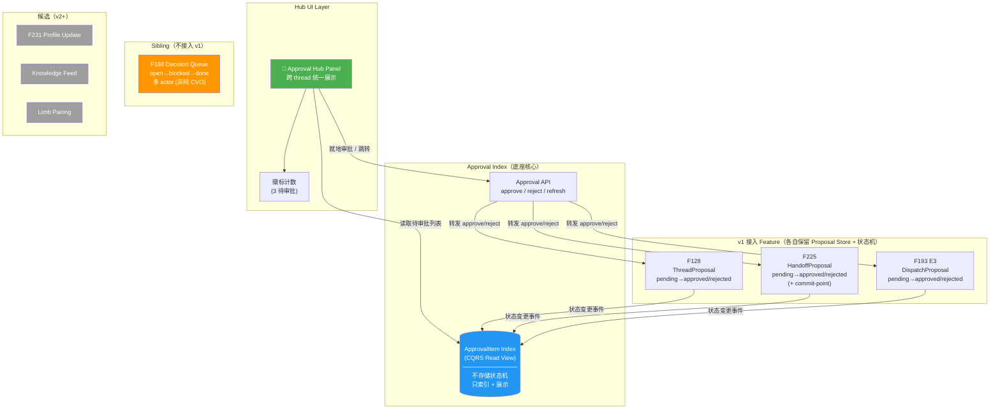
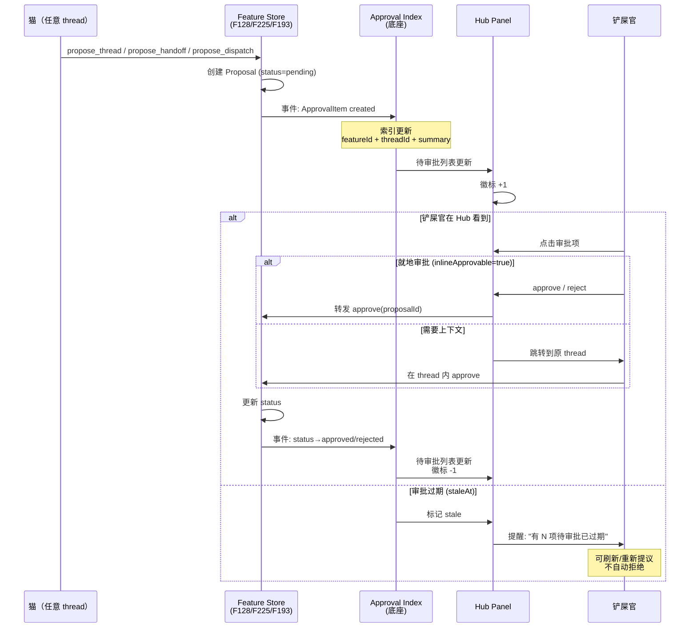
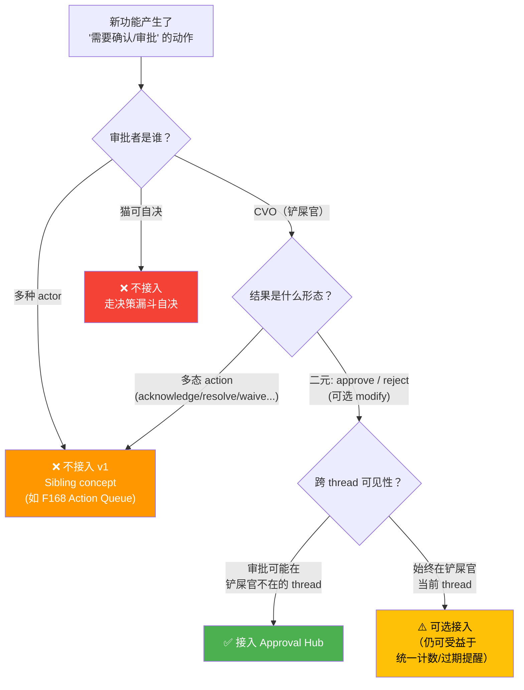

# 统一审批中心 — 痛点分析与涉及 Feature 梳理

> 起源：F193 Phase E E3 设计讨论中，铲屎官发现审批散落在各 thread 的问题
> 日期：2026-06-20
> 参与：铲屎官 + opus-46 + opus-47 + 砚砚(codex)
> 状态：**三猫讨论完成，等铲屎官拍板新 F 号**

---

## 1. 痛点

### 痛点 1：审批被困在 Thread 里

铲屎官原话：
> "要是我没看thread呢？ 或者是我在thread a 但是b的猫找我审批呢？"

猫发出审批卡片后，卡片只存在于该 thread 的消息流里。铲屎官必须**主动进入那个 thread** 才能看到。

三个失败场景：

| 铲屎官状态 | 结果 |
|-----------|------|
| 正在看该 thread | ✅ 看到卡片，直接审批 |
| 没在看任何 thread | ❌ 卡片埋没，无人提醒 |
| 在 Thread A，但 Thread B 有审批 | ❌ 看不到 B 的请求 |

### 痛点 2：审批散落在多个 Feature

铲屎官原话：
> "现在f128 和 f225 都有富文本需要我审批的东西笑死但是很多猫可能反馈铲屎官忘记点了！"

不同 feature 各自实现了自己的审批卡片，铲屎官不知道"我总共有多少待批的东西"，也没有一个地方统一看。

### 痛点 3：忘记审批 → 猫被卡住或信息丢失

铲屎官原话：
> "不过这里你们要考虑如果我忘记点击投递了怎么办？哈哈哈 这也不能干扰你们 本thread正常工作"

审批是非阻塞的（猫继续干活），但忘记审批意味着：
- propose_thread：新 thread 永远不被创建
- session_handoff：handoff 永远不发生
- cross_thread_dispatch：异常通知永远不被投递
- community_direction：社区 issue 永远不被路由

### 痛点 4：没有审批中心

铲屎官原话：
> "我感觉这种thread内的点击审批似乎需要有个event中心。。能让我看到 点击跳转到对应thread等等等"

铲屎官需要一个**跨 thread 的审批面板**，汇总所有待批项目，不用逐个 thread 翻。

---

## 2. 涉及的 Feature

### F128 — Cat-Proposed Thread Creation

- **审批类型**：猫提议开新 thread → 铲屎官 approve/reject
- **当前实现**：`propose_thread` MCP tool → 在当前 thread 插入富文本卡片 → 铲屎官点击
- **审批 Store**：ThreadProposal（pending/approved/rejected）
- **就地审批**：✅ 可以（信息自足：thread 标题 + 理由）

### F225 — Cat-Initiated Session Handoff

- **审批类型**：猫提议 session handoff → 铲屎官 approve
- **当前实现**：handoff proposal 卡片 → 铲屎官点击 → session sealed + continuation queued
- **审批 Store**：SessionHandoffProposal（discriminated union，与 ThreadProposal 分离）
- **就地审批**：⚠️ 可能需要看上下文（为什么要 handoff）

### F168 — Community Operations Board

- **审批类型**：守门猫/narrator 分诊社区 issue → Direction Card → 铲屎官 approve 路由
- **当前实现**：**已有 Decision Queue**（Community Panel Phase E, PR #2431）
- **审批 Store**：Decision Queue（per-decision item）
- **就地审批**：✅ 可以（Direction Card 包含推荐 + 理由）
- **⚠️ 47 修正**：F168 Decision Queue 不是 approval queue，是 action queue。状态机 `open→blocked→done`，actor 多型（`cvo|case-owner|reconciler|external-author`），case-owner 可自行 acknowledge 不需 CVO。**不适合直接接入审批中心 v1**

### F193 — Cross-Thread Communication Unification

- **审批类型**：E3 猫检测异常 → 不确定是否该投递 → 卡片让铲屎官确认
- **当前实现**：Phase E E3 未实现
- **审批 Store**：待定
- **就地审批**：⚠️ 任务分配类可能需要上下文

---

## 3. 铲屎官的方向判断

铲屎官原话：
> "我的意思是 这个应该是底座 底座上是f168 193 128 225 这些可能涉及到需要我审批的"

```
统一审批中心（底座 Feature）
├── 审批队列 Store — 统一注册接口
├── Hub "待审批" 面板 — 跨 thread 可见
├── 计数 / 提醒 — 有待批就能看到
└── 跳转 / 就地审批

上层 Feature 注册审批项：
├── F128 propose_thread
├── F225 session_handoff
├── F193 cross_thread_dispatch
└── F168 community_direction（从自建 Queue 迁移）
```

---

## 4. 三猫讨论结论（2026-06-20）

参与：opus-46（发起）+ 砚砚/codex（独立分析）+ opus-47（深层修正）

### 共识决定

| # | 决定 | 理由 |
|---|------|------|
| D1 | **底座新开 Feature**，不泛化 F168 | F168 Queue 是 action queue（多 actor + 三态），不是 approval queue（CVO + binary approve/reject）。硬泛化会污染底座契约 |
| D2 | **v1 只接 F128 + F225 + F193 E3** | 这三个共性都是 `actor=CVO + binary approve/reject`。F168 作为 sibling concept 不迁，align UI/命名空间 |
| D3 | **底座架构 = CQRS read view** | 各 feature 保留自己的 proposal store + 状态机。底座不复制状态机/数据，只做 read-side index（状态变更时发事件，Hub 读 index 展示）(47 提出) |
| D4 | **就地审批有条件** | `inlineApprovable` 需要底座校验 `inlineMinFields`（summary + impact + action 非空），不靠 feature 自报 |
| D5 | **过期 ≠ 自动拒绝** | 过期 = 上下文 stale，按钮变"刷新/重新提议"。提醒走 Hub 徽标，不往 thread 追加噪音 |
| D6 | **F193 E3 拆两半**（2:1 收敛） | 自动投递（FYI/协调）不需 CVO 审批，现在就做；卡片审批（任务分配）等底座 v1，按底座契约预留 adapter |
| D7 | **Push channel 独立立项** | Hub 是 pull surface，push（iOS/邮件/webhook）是 platform concern，不进审批中心 scope |

### 47 关键修正

F168 Decision Queue 真实状态机：`open → blocked → done`（不是 pending → approved/rejected），actor 四种（CVO 只是其一），case-owner 可自行 acknowledge。底座和 F168 是 **sibling concept**（approval vs action），不是 parent-child。

### 砚砚补充 scope

不只 4 个 feature 有审批/确认形态：F231 profile update、Knowledge Feed approve、limb pairing 也有。v1 不接，但 census 时列出避免模型偏窄。

### 铲屎官两层痛点（47 re-framing）

1. **Layer 1: 跨 thread inbox 可见性** → 底座解决（Hub 面板集中展示）
2. **Layer 2: 被动 push channel** → 独立问题，Hub 仍是 pull，push 另议

---

## 5. 架构图

### 5.1 整体架构：CQRS Read View + Hub Panel



### 5.2 数据流：审批从产生到完成



### 5.3 接入标准：什么该进 Approval Hub



### 5.4 接入标准文字版

**三个 AND 条件（全满足才接入 v1）**：

| # | 条件 | 说明 | 反例 |
|---|------|------|------|
| 1 | **actor = CVO** | 必须铲屎官本人审批 | 猫间协调（FYI/ACTION）→ 自动投递不需审批 |
| 2 | **binary outcome** | approve / reject（可选 modify） | F168 的 acknowledge/resolve/waive → 多态 action |
| 3 | **跨 thread 需求** | 审批请求可能在铲屎官不在的 thread 产生 | 铲屎官主动发起的操作 → 已在当前 thread |

### 5.5 现在与未来的全量 Census

| Feature | 审批项 | actor | outcome | 跨 thread | 接入 |
|---------|--------|-------|---------|-----------|------|
| **F128** | propose_thread | CVO | approve/reject | ✅ | **v1 ✅** |
| **F225** | session_handoff | CVO | approve/reject | ✅ | **v1 ✅** |
| **F193 E3** | cross_thread_dispatch (任务分配) | CVO | approve/reject | ✅ | **v1 ✅** |
| F168 | community direction | CVO + case-owner + reconciler | acknowledge/resolve/waive | ✅ | ❌ Sibling |
| F231 | propose_profile_update | CVO | approve/reject | ✅ | v2 候选 |
| Knowledge Feed | 知识条目审核 | CVO | approve/reject | ⚠️ | v2 候选 |
| Limb | pair_approve | CVO | approve/reject | ⚠️ | v2 候选 |

---

## 6. 原始讨论问题（已收敛，保留 trace）

> Q1 底座 vs F168 → D1/D2（新开，不泛化 F168）
> Q2 就地 vs 跳转 → D4（有条件就地，inlineMinFields 守门）
> Q3 过期 → D5（≠ 自动拒绝，= 刷新上下文）
> Q4 E3 时序 → D6（拆两半，自动投递先做）
> Q5 新 F 号 → 等铲屎官拍板

---

## 7. 下一步

1. ✅ 痛点文档
2. ✅ 三猫讨论收敛（opus-46 + opus-47 + 砚砚）
3. ✅ **铲屎官拍板**：F246 立项（`9a6a19629`）
4. ✅ **Spec review 闭合**：砚砚 APPROVE（R1→R2，6 findings 全闭合）+ opus-48 APPROVE（1 blocking + 2 nit 全闭合）。final commit `6fc1ce46b`
5. ✅ **F168 协调完成**：opus-48 = F168 owner，在 review 中合并完成（cross-post 不需要）。协调结论持久化在 spec Phase C
6. ⏳ **F246 Phase A 实现**：writing-plans → worktree → tdd
7. ⏳ F193 E3 自动投递路径先推进（KD-6，不卡底座）
