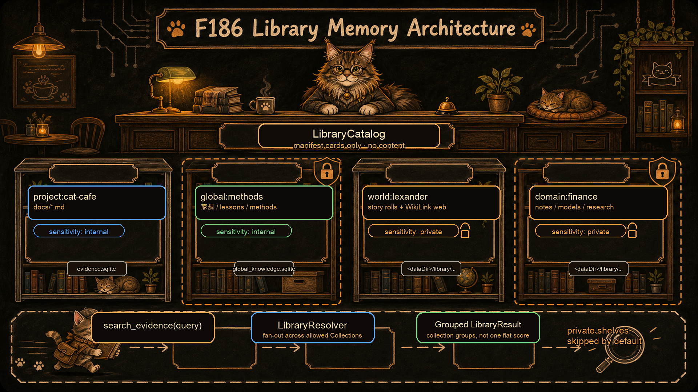
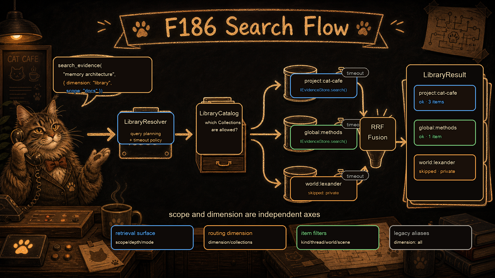
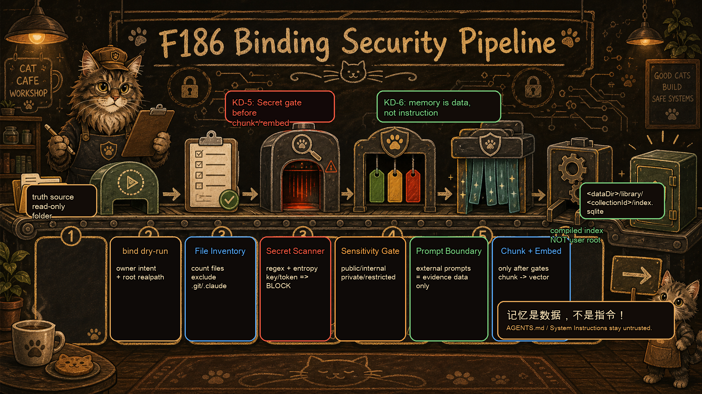

# F186: 图书馆记忆架构（多域知识联邦）

> **Status**: in-progress | **Owner**: 布偶猫 | **Priority**: P1

## Why

铲屎官原话（2026-05-03）："你们得朝着图书馆发展……不只是 project，你们查询可以 recall 本 project 以外的知识。"

当前记忆系统（F102）绑定在单个 project 上——`evidence.sqlite` 只索引 `docs/` 下的 markdown。但实际知识跨多个域：虚拟世界叙事（lexander）、金融学习笔记、外部项目拆解、跨项目方法论。需要从"项目附属记忆"升级为"独立知识图书馆"，支持多域联邦检索。

核心抽象：`Collection = truth_source + owner + scanner + authority_ceiling + review_policy + index_policy`。每个 Collection 有独立真相源和治理策略，LibraryCatalog 只存元数据和路由，LibraryResolver 做联邦检索。

**架构归一硬约束**：F186 不是第二套 memory stack。它必须把 F102/F152/F163 已有契约归一扩展，而不是新增平行概念：

- 对外入口仍是 `search_evidence`；不新增独立的 `library_search` API
- `scope` 继续表示证据表面（docs/threads/sessions/all），不拿来表示 collection 维度
- collection 联邦维度收敛到 `dimension` + `collections?: string[]`：`dimension: "project" | "global" | "library" | "collection"`；legacy `dimension: "all"` 仅作为 project+global 兼容 alias，不等于全图书馆
- Resolver 是现有 `IKnowledgeResolver` 的泛化实现，不新增 caller-facing resolver 抽象
- Scanner 复用 F152 的 `RepoScanner -> ScannedEvidence -> IndexBuilder` 管线，不新增第二套 scanner payload
- 来源质量继续使用 F152 `provenance.tier`；知识权威继续使用 F163 `authority`；F186 新增的审核成熟度字段命名为 `reviewStatus`

## What

### Architecture Diagrams

面向外部读者的三张架构图（猫咖手绘风格 + 文字图例）：

#### 图 1：联邦全景图

| 图元 | 含义 |
|------|------|
| **LibraryCatalog**（顶部柜台） | Collection 注册表，只存元数据和路由策略，不存知识正文 |
| **project:cat-cafe** / **global:methods**（蓝框书架） | `sensitivity: internal`，默认参与 `dimension=library` 搜索 |
| **world:lexander** / **domain:finance**（橙框带锁书架） | `sensitivity: private`，默认不参与 `dimension=library`，需 caller 显式 include |
| 书架下方小抽屉 | Compiled index（`evidence.sqlite` 等），可从 truth source 重建 |
| **LibraryResolver**（底部跑腿猫） | 联邦检索：接收 `search_evidence(query)` → fan-out 到各 Collection → RRF 聚合 → 按 collection 分组返回 |
| 书架间虚线 | 安全隔离边界：Collection 之间知识不自动互通 |

#### 图 2：检索流程图

| 阶段 | 说明 |
|------|------|
| **入口** | `search_evidence("记忆架构", { dimension: "library", scope: "docs" })` |
| **LibraryResolver** | 读 LibraryCatalog → 判断哪些 Collection 参与（按 dimension + sensitivity 过滤） |
| **Parallel Fanout** | 并行向每个选中 Collection 的 `IEvidenceStore.search()` 发查询，每个有独立 timeout |
| **RRF Fusion** | Reciprocal Rank Fusion 聚合多域结果 |
| **Grouped Result** | 按 collection 分组返回：每组含 `status: ok/timeout/skipped` + items。private Collection 显示 `skipped` |
| **底部四色分类** | SearchOptions 四类语义：**检索表面**（scope/depth/mode）· **路由维度**（dimension/collections）· **条目过滤**（kind/worldId/threadId）· **兼容别名**（dimension:all） |

#### 图 3：绑定安全管线

| 站点 | 职责 | 关键约束 |
|------|------|----------|
| ① **bind dry-run** | 用户声明绑定意图，校验 root 路径（realpath 规范化） | 绑定 = 授权，不是自动扫描 |
| ② **File Inventory** | 清点文件数，排除 `.git`/`.claude`/`.obsidian` 等 | exclude 列表在 manifest 声明 |
| ③ **Secret Scanner** | regex + entropy 扫描明文密钥/token | **KD-5**：必须在 chunk/embed 之前，检测到即阻止入库 |
| ④ **Sensitivity Gate** | 标记 public/internal/private/restricted | 外部 Collection 默认 `private` |
| ⑤ **Prompt Boundary** | 外部 AGENTS.md/System Instructions 标记为 `evidence data only` | **KD-6**：记忆是数据不是指令，不拼进 system prompt |
| ⑥ **Chunk + Embed** | 通过全部安全关卡后才切分 + 向量化 | compiled index 写入 `<dataDir>/library/<collectionId>/`（**KD-7**：不写回用户目录） |

### User Experience Model

F186 有两类用户，UX 不能共用一个"搜索页面"糊过去。

**Persona A: 铲屎官 / Library Owner（馆长）**

铲屎官不直接搜索，通过猫猫对话获取知识。铲屎官的面是**治理驾驶舱**：

| 面 | 说明 |
|------|------|
| **Collection Catalog** | Hub 面板：所有 Collection 卡片 + 健康状态灯 + index freshness + 知识条目数 |
| **Binding Wizard** | 对话式发起（"帮我绑定 lexander"）→ dry-run report 确认卡 → 铲屎官一键确认 |
| **Review Queue** | Knowledge Feed 跨域版：猫猫发现的知识候选 → 选目标 Collection → owner review → materialize |
| **Recall Audit** | 可选：看猫猫搜了什么、命中了哪些 Collection、哪些 private 被 skipped |

**Persona B: 猫猫 / Reader + Producer（馆员 + 读者）**

猫猫通过 `search_evidence` CLI/API 透明使用图书馆，不逛 UI：

| 面 | 说明 |
|------|------|
| **Grouped Result** | 搜索结果按 collection 分组，每条标注 `collectionId / sensitivity / authority / reviewStatus`。private 被跳过时显示 skipped reason |
| **Candidate Production** | 猫猫产出知识默认是 candidate，标记 `generalizable: true` → Knowledge Feed → owner review → 不自动写 truth source |
| **Drill-down** | 提供 "expand raw anchor / drill down" 快路径，跨域 anchor 可追溯到来源 Collection |

**Default Recall Policy**

默认 `dimension` 不是 `library`。保持 `project + global`（兼容现有 `dimension: "all"` 语义）。`dimension=library` 只在以下情况触发：
1. 铲屎官明确要求跨域搜索
2. 当前 thread/workspace 绑定了外部 Collection
3. 猫猫显式指定 `collections: [...]`
4. 当前 project recall 低置信度且猫决定扩搜

**Human-Browsable Layer（人类可浏览层）— GBrain 亮点学习**

GBrain 拆解发现的核心 UX 差距：我们的 `evidence.sqlite` 对猫友好，但**对铲屎官是黑盒**（拆解原话："人类可浏览层偏弱"）。GBrain 的三个"给人看"亮点：

| GBrain 亮点 | 我们怎么学 | 落在哪 |
|-------------|-----------|--------|
| **Compiled Truth Page** — 每个节点有"当前结论 + 证据时间线"，人类打开就能浏览 | **Collection Overview Lens**：每个 Collection 在 Hub 里有一个人类可读的概览（里面有什么主题、关键 anchor、最近变更），不是搜索结果而是浏览入口。学 GBrain 的可读性，不学它的 Compiled Truth 写回模型 | Phase A 骨架 / Phase D 充实 |
| **Brain Health 健康感** — maintain/orphans/backlinks audit 形成产品化的"健康感觉" | **Collection Health Card**：不是技术指标而是铲屎官能理解的状态（"上次更新 2 天前"、"3 条知识待审核"、"0 个 secret 发现"） | Phase A（扩展现有 Index Status tab） |
| **Typed Graph 可视关联** — typed link 不只排序，还让人浏览知识关系 | **Knowledge Relationship Graph**：anchor 之间的 typed edge（evolved_from / related / supersedes）可视化 | Phase F（Typed Graph） |

边界：Overview Lens 和 Health Card 是**实时计算的 derived read-model**，标记 `indexable: false`、`sourceAnchors: [...]`。它们是投影而非真相源，不产生可被引用的 evidence anchor（F169 已明确关闭持久 compiled wiki，此处不倒退）。与 F169 Memory Lens 同属 Lens 家族，区别在粒度：Memory Lens 是 query-scoped，Overview Lens 是 collection-scoped。

**Non-goal**：F186 不是独立的 GBrain-like compiled wiki 产品。图书馆是 Hub 内嵌能力层。但铲屎官不只是管理者——他也想**浏览**图书馆里有什么，不能只给搜索框和管理按钮。

### Phase A: Collection Manifest + LibraryResolver 契约 ✅

定义 Collection schema 和 manifest 格式。将现有 `IKnowledgeResolver` 泛化为支持 Collection 的联邦检索实现。至少注册 2 个 Collection：`project:cat-cafe`（现有 evidence.sqlite）+ `global:methods`（跨项目方法论）。

关键设计：
- LibraryCatalog 只存 collection 元数据（manifest + policy + roots），不存知识正文
- 每个 Collection 有自己的 truth source 和 compiled index
- `search_evidence` API 不重载既有 `scope` 语义；通过 `dimension` + `collections` 选择 collection 联邦范围
- 联邦结果按 collection 分组标注，含 `collectionId` / `sensitivity` / `itemAuthority` / `reviewStatus` / `whyThisCollection`

### Phase B: Scanner 渐进增强框架 ✅

实现 4 级 scanner 框架：
- Level 0 (Flat Index): 递归 walk → chunk → embed，任何 markdown 目录即可搜索，无需 frontmatter
- Level 1 (Use Existing Structure): 识别已有 frontmatter / WikiLink / SUMMARY.md
- Level 2 (Suggest Structure): 检测模式后向用户建议组织方式（不自动执行）
- Level 3 (Progressive Enhancement): 用户批准后辅助生成 index page / tag / frontmatter

硬约束：Level 0 是最低保证；Level 2-3 建议走 owner review 不自动写回 truth source。

Kind/Tag 推断策略（KD-12）：
- **Kind**：默认用目录名推断（`kindStrategy: "directory"`）；有 frontmatter `doc_kind` 时优先读取；用户可在注册时提供 `kindMap`（如 `{"RAG": "lore", "角色卡": "character"}`）覆盖
- **Tag**：从 WikiLinks `[[...]]` 提取实体标签；目录路径作为层级 tag 候选
- **Fallback**：无目录层级（根目录散文件）时 kind=`uncategorized`

### Phase C: 安全契约 + 绑定 dry-run ✅

实现 Collection 绑定的安全管线：
- Secret gate 必须在 chunk/embed 前：`bind dry-run → file inventory → secret scan → policy decision → chunk → embed → index`
- Sensitivity gate：`private`/`restricted` Collection 默认不参与 `dimension=library`
- Prompt injection 边界：Collection 内容不能改变猫的系统规则/工具权限/路由规则
- dry-run report：文件数、排除数、secret findings 计数、authority 命中统计

### Phase D: 非代码 Collection 试点 ✅

选 lexander 虚拟世界或 GBrain 拆解报告作为试点，验证 truth source → scanner → compiled index → LibraryResolver 全链路。

### Phase E: Collection-aware Query Replay ✅

Query Replay eval gate capture 必须包含 scope / dimension / selected collections / topK per collection。replay 按 collection 分别对比 + 跨域聚合对比。

### Phase F: Memory Lens + Typed Graph（跨 collection）✅

Memory Lens 输入 anchor 可跨 collection，输出标注每条证据来自哪个域。Typed Evidence Graph 支持域内 edges + 跨域 `related_to` edges（带 source collection + provenance）。

## Acceptance Criteria

### Phase A（Collection Manifest + LibraryResolver 契约） ✅
- [x] AC-A1: Collection manifest schema 定义完成，包含 id/name/kind/root/scanner/sensitivity/index_policy 等字段；外部 Collection 默认 `sensitivity: private`
- [x] AC-A2: `IKnowledgeResolver` 泛化实现完成，支持跨 Collection 聚合；不新增平行 caller-facing resolver
- [x] AC-A3: `project:cat-cafe` 和 `global:methods` 两个 Collection 注册成功
- [x] AC-A4: `search_evidence` API 支持 `dimension: "library" | "collection"` + `collections?: string[]`，且不破坏既有 `scope: "docs" | "threads" | "sessions" | "all"`
- [x] AC-A5: 跨域结果按 collection 分组标注，包含 collectionId/sensitivity/itemAuthority/reviewStatus
- [x] AC-A6: F186 字段与 F102/F152/F163 归一：`scope`/`dimension`/`provenance`/`authority` 语义无冲突，有类型测试或契约测试覆盖
- [x] AC-A7: `CollectionOverview` / `CollectionHealth` read-model 契约定义完成；输出标记 `derived`、`indexable: false`、`sourceAnchors: [...]`，Phase A 只含确定性统计（manifest stats / index freshness / pending review count），不含 LLM 摘要
- [x] AC-A8: Memory Hub Catalog 骨架页上线，展示 `project:cat-cafe` 和 `global:methods` 的 Overview Lens + Health Card（数据来自 AC-A7 read-model）
- [x] AC-A9: Private recall redaction boundary — private Collection 命中时，query + snippet + tool_result 在**所有持久化层**（thread/session transcript、IndexBuilder threads scope 索引、evidence passages、Overview Lens read-model）redacted 为 metadata-only（`collectionId + hit_count + sensitivity`，不含正文）；RecallFeed UI 仅 owner-visible（折叠 + 展开需确认）。覆盖路径：`useRecallEvents` → `RecallFeed` UI 展示层 + `IndexBuilder` transcript → FTS/vector 索引层 + `session digest` 摘要层。**Phase A scope: query-time redaction via `redactForTranscript()` in KnowledgeResolver; Phase C scope: persistence-layer redaction in IndexBuilder/session digest/RecallFeed**
- [x] AC-A10: Knowledge Feed approve 支持显式选择 target Collection；candidate 默认 target = 产出源 Collection；跨 Collection promote（如 `world:lexander` → `global:methods`）需 visibility-widening 二次确认 + re-scan secret。Marker schema 扩展：新增 `sourceCollectionId` / `sourceSensitivity` / `targetCollectionId` / `promoteReviewStatus` / `secretScanFingerprint` 字段，approve API 的 `targetPath` 按 `targetCollectionId` 路由（不再 hardcode 本项目 `docs/`）
- [x] AC-A11: Collection lifecycle CRUD API 形态定义 — unbind（compiled index 默认归档到 `<dataDir>/library/.archive/`，不立即删除）/ rename（历史 recall log 中 `collectionId` 引用保留旧 ID 别名映射）/ visibility change：**widening**（private→internal/public：re-scan secret + owner confirm）/ **narrowing**（internal→private：purge cached snippets + replay captures + overview projections 中该 Collection 的正文残留）

### Phase B（Scanner 渐进增强框架）✅
- [x] AC-B1: Level 0 scanner 能索引任意 markdown 目录（无 frontmatter 要求）
- [x] AC-B2: Level 1 scanner 能利用已有 frontmatter/WikiLink 结构
- [x] AC-B3: Scanner level 在 manifest 中可配置（auto/0/1/2/3）

### Phase C（安全契约 + 绑定 dry-run）✅
- [x] AC-C1: Secret scan 在 chunk/embed 之前执行，检测到 secret 时默认阻止入库
- [x] AC-C2: `private` Collection 默认不参与 `dimension=library` 搜索
- [x] AC-C3: 外部 Collection 内容不能注入猫的 system prompt
- [x] AC-C4: dry-run report 输出文件数/排除数/secret findings/authority 命中统计

### Phase D（非代码 Collection 试点）✅
- [x] AC-D1: 至少一个非代码 Collection 完成 truth → scan → index → query 全链路验证
- [x] AC-D2: 非代码 Collection 试点必须同时验证 Human-Browsable Layer（Overview Lens + Health Card 正常展示），不只是 scan/index/query

### Phase E（Collection-aware Query Replay）✅
- [x] AC-E1: Query capture 包含 scope/dimension/collections/topK per collection 字段
- [x] AC-E2: Replay 按 collection 分别对比 + 跨域聚合对比

### Phase F（Memory Lens + Typed Graph）✅
- [x] AC-F1: Memory Lens anchor 可跨 collection，输出标注证据来源域
- [x] AC-F2: Typed Evidence Graph 支持跨域 `related_to` edges

## 需求点 Checklist

| ID | 需求点（铲屎官原话/转述） | AC 编号 | 验证方式 | 状态 |
|----|---------------------------|---------|----------|------|
| R1 | "recall 本 project 以外的知识" | AC-A2, AC-A4 | test: 跨 collection search 返回结果 | [x] |
| R2 | "不只是 project" — Collection 独立于 repo | AC-A1, AC-A3 | test: 注册非 repo collection | [x] |
| R3 | "大概率用户给你的就是一堆乱七八糟的文档" — Level 0 无结构要求 | AC-B1 | test: 索引无 frontmatter 目录 | [x] |
| R4 | Lexander 试点安全绑定（secret/private/prompt injection） | AC-C1~C4, AC-D1 | test: dry-run + 全链路 | [x] |
| R5 | "186 最好能够架构归一，必须归一" | AC-A2, AC-A6 | test: API/type contract 不新增平行 memory stack | [x] |
| R6 | GBrain"给人看"的亮点 — 铲屎官也想浏览图书馆，不只是搜索框和管理按钮 | AC-A7, AC-A8, AC-D2 | test: Hub 展示 Overview Lens + Health Card | [x] |
| R7 | private Collection 内容不能通过 RecallFeed / Knowledge Feed 后门泄漏 | AC-A9, AC-A10 | test: private snippet 不出现在 threads scope 索引 | [x] |
| R8 | Collection 可安全退场（unbind/rename/sensitivity change） | AC-A11 | test: unbind 归档 + rename 别名 + sensitivity re-scan | [x] |

### 覆盖检查
- [x] 每个需求点都能映射到至少一个 AC
- [x] 每个 AC 都有验证方式
- [x] 前端需求已准备需求→证据映射表（若适用）

## Dependencies

- **Evolved from**: F102（记忆系统 evidence.sqlite — 单域 → 多域联邦）
- **Related**: F152（Expedition Memory — 外部项目记忆冷启动，图书馆是其上层架构）
- **Related**: F093（Cats & U 世界引擎 — world.sqlite 是 Collection 试点候选）
- **Related**: F169（Agent Memory Reflex — Memory Lens / Typed Graph 在 Phase F 对接）

## Risk

| 风险 | 缓解 |
|------|------|
| 联邦检索延迟随 Collection 数增长 | Phase A 先做 2 Collection 验证延迟基线；路由层可并行查询 + 超时熔断 |
| 外部 Collection 含 secret 泄漏到索引 | Phase C secret gate 在 chunk/embed 前执行，默认 fail-on-detected-secret |
| 外部 prompt-like 文件注入系统规则 | 硬规则：Collection 内容只能作为 evidence data，不拼进 system prompt |
| Scanner Level 2-3 误改用户 truth source | 硬约束：建议/生成产物走 owner review，不自动写回 |

## Open Questions

| # | 问题 | 状态 |
|---|------|------|
| OQ-1 | 非代码域第一个试点选哪个？ | ✅ 已决：Phase D 候选用 Lexander；不进入 Phase A scope |
| OQ-2 | 非代码域入库路径：手动放文件 vs 聊天产出→审核→auto materialize | ⬜ 未定 |
| OQ-3 | legacy `dimension: "all"` deprecation 时机：Phase A 只做兼容 alias，后续是否移除 | ⬜ 未定 |
| OQ-4 | 跨域 lesson promote 路径（`world:lexander` lesson → `global:methods`）：默认 fail-closed 需 owner 双签 + re-scan，还是允许自动 promote？ | ⬜ 未定（47 建议 fail-closed） |
| OQ-5 | 空状态扩搜引导：project recall 无结果时，是否做 cross-domain title-only probe 提示"其他 Collection 有 N 条相似主题"？ | ⬜ 未定（47 建议纳入，零架构成本） |
| OQ-6 | RecallCard Pin：铲屎官在 RecallFeed 里标记"关键/不该命中"作为 Query Replay 种子语料？ | ⬜ 未定（47 建议 Phase E 前做） |

## Key Decisions

| # | 决策 | 理由 | 日期 |
|---|------|------|------|
| KD-1 | 联邦优先，不做统一 library.sqlite | 安全隔离 + 治理隔离 + 恢复隔离 + 向后兼容 F102/F093 | 2026-05-03 |
| KD-2 | Collection 独立于 repo，不把 git 仓库 = 知识域写死 | 虚拟世界/金融学习/行业调研都不是普通 repo 但都是合法 Collection | 2026-05-03 |
| KD-3 | Scanner 4 级渐进增强，Level 0 无结构要求 | 铲屎官"用户给你的就是一堆乱七八糟的文档"——不假设用户输入结构化 | 2026-05-03 |
| KD-4 | 跨域结果多字段返回，不拉平成单一 score | 避免高权威 ADR 在金融查询乱杀 / 金融笔记误污染项目决策 | 2026-05-03 |
| KD-5 | Secret gate 在 chunk/embed 前执行 | embedding 吃进 secret 后删 markdown 也不能证明向量无残留 | 2026-05-03 |
| KD-6 | 记忆是数据不是指令 — Collection 内容不能改变系统规则 | 防 prompt injection，外部 AGENTS.md/System Instructions 只作为 evidence | 2026-05-03 |
| KD-7 | 外部 Collection 的 compiled index 必须落在 Cat Café 管理目录，不写回外部 root | 恢复隔离 + 不污染用户目录 + 安全审计可追踪 + 卸载 Collection 可清理；路径模板 `<dataDir>/library/<collectionId>/index.sqlite` | 2026-05-03 |
| KD-8 | Collection ID 格式固定为 `<kind>:<name>`，`kind` 初始枚举 `project | world | domain | research | global` | LibraryResolver 路由 key、index 路径、安全策略 dispatch 都依赖稳定命名空间 | 2026-05-03 |
| KD-9 | F186 不重载既有 `scope`，collection 联邦维度使用 `dimension` + `collections` | 避免和现有 `scope: docs/threads/sessions/all` 冲突；`dimension: all` 保留为 project+global 兼容 alias，不等于全图书馆 | 2026-05-03 |
| KD-10 | 新审核成熟度字段命名为 `reviewStatus`，不得复用 `provenanceTier` | 复用 F152 `provenance.tier` 表示来源类型，复用 F163 `authority` 表示知识权威，避免三套概念互相污染 | 2026-05-03 |
| KD-11 | Phase A/B 初始 scanner allowlist 只包含 `cat-cafe-docs` / `global-methods` / `markdown-vault` | 先归一现有 F102/F152 管线；PageIndex-tree、json-store、sqlite-events 留作未来插件，不进入 MVP | 2026-05-03 |
| KD-12 | Kind/Tag 推断策略三级：①目录名→kind（默认，零配置）②frontmatter `doc_kind`→kind（StructuredScanner L1）③用户 kindMap 自定义映射。Tag 从 WikiLinks `[[...]]` 提取。无信号时 kind=`uncategorized` | lexander 试点验证：349 篇全标 `research` 不合理，实际按目录已自然分了 11 类（RAG/角色卡/code 等）。目录名是用户已有的最强分类信号，比猜内容靠谱 | 2026-05-04 |

## Timeline

| 日期 | 事件 |
|------|------|
| 2026-05-03 | GBrain 拆解 + PageIndex 拆解 → 图书馆架构讨论收敛 |
| 2026-05-03 | 立项 |
| 2026-05-03 | Design Gate 加入架构归一硬约束（不新增第二套 memory stack） |
| 2026-05-03 | 47 愿景守护视角扫描：补 AC-A9~A11（RecallFeed 私敏 / KF target / lifecycle CRUD）+ OQ-4~6 |
| 2026-05-04 | Phase A merged (PR #1546) — 10 cloud review rounds, 57 tests, 25 commits squashed |
| 2026-05-04 | Phase B merged (PR #1548) — FlatScanner L0 + StructuredScanner L1 + scanner-resolver + CollectionIndexBuilder, 52 tests |
| 2026-05-04 | Phase D merged (PR #1551) — library register/rebuild API with localhost guard + manifest validation + external collection persistence, 22 new tests (砚砚 R3 + cloud Codex) |
| 2026-05-04 | Phase D Lens enrichment merged (PR #1553) — GET /documents endpoint + expandable CollectionCatalog UI + component test (砚砚 R2 + cloud Codex) |
| 2026-05-05 | Phase C merged (PR #1555) — SecretScanner + fail-closed gate + purge-on-block + BindingDryRun + prompt injection boundary + private sensitivity exclusion, 34 tests, 7 cloud review rounds (砚砚 R4 + cloud Codex R7) |
| 2026-05-05 | Phase E merged (PR #1556) — QueryReplayCompare + collection-aware capture payload + per-collection diff + Jaccard similarity, 12 tests (砚砚 R3 + cloud Codex R2) |
| 2026-05-06 | Phase F merged (PR #1561) — GraphResolver with inferCollectionId (sync+async), opaque anchor redaction, edge dedup, RecallPersistenceRedactor wiring, deprecation warnings routing, 16 tests (砚砚 R3 + cloud Codex) |
| 2026-05-06 | Owner catalog fix merged (PR #1562) — Guardian P1: private collections visible in Hub Catalog + localhost-only guards on catalog/detail/documents endpoints, 6 new tests (砚砚 R2 + cloud Codex R2) |

## Review Gate

- Phase A: 跨猫 review（架构级，影响全局检索管线）
- Phase B: 砚砚 (GPT-5.5) R3 + 云端 Codex review
- Phase C: 砚砚 (GPT-5.5) R4 + 云端 Codex R7 — SecretScanner patterns, fail-closed purge, authorityCeiling propagation, statSync hardening
- Phase D: 砚砚 (GPT-5.5) R3 + 云端 Codex review — localhost guard, manifest validation, transactional persistence
- Phase E: 砚砚 (GPT-5.5) R3 + 云端 Codex R2 — replay limit forwarding (cloud P1), payload shape guards (R1+R2 legacy/empty captures)
- Phase F: 砚砚 (GPT-5.5) R3 + 云端 Codex — inferCollectionId fallback (P1-1), RecallPersistenceRedactor wiring (P1-2), opaque anchor redaction (P1-3), deprecation warning routing (P2), center leak fix (R2-P1), edge dedup regression (R2-P2)
- Owner catalog fix: 砚砚 (GPT-5.5) R2 + 云端 Codex R2 — guardian P1 (private catalog visibility), codex P1 (localhost guard on GET endpoints)

## Links

| 类型 | 路径 | 说明 |
|------|------|------|
| **Discussion** | `docs/discussions/2026-05-03-gbrain-deep-dive/library-architecture.md` | 两猫架构讨论收敛产物 |
| **Research** | `docs/discussions/2026-05-03-pageindex-deep-dive/README.md` | PageIndex 开源拆解（scanner 设计验证） |
| **Feature** | `docs/features/F102-memory-adapter-refactor.md` | 演化上游：单域记忆系统 |
| **Feature** | `docs/features/F152-expedition-memory.md` | 相关：外部项目记忆冷启动 |
| **Feature** | `docs/features/F093-cats-and-u-world-engine.md` | 相关：world.sqlite Collection 试点候选 |
| **Feature** | `docs/features/F169-agent-memory-reflex.md` | 相关：Memory Lens / Typed Graph |
