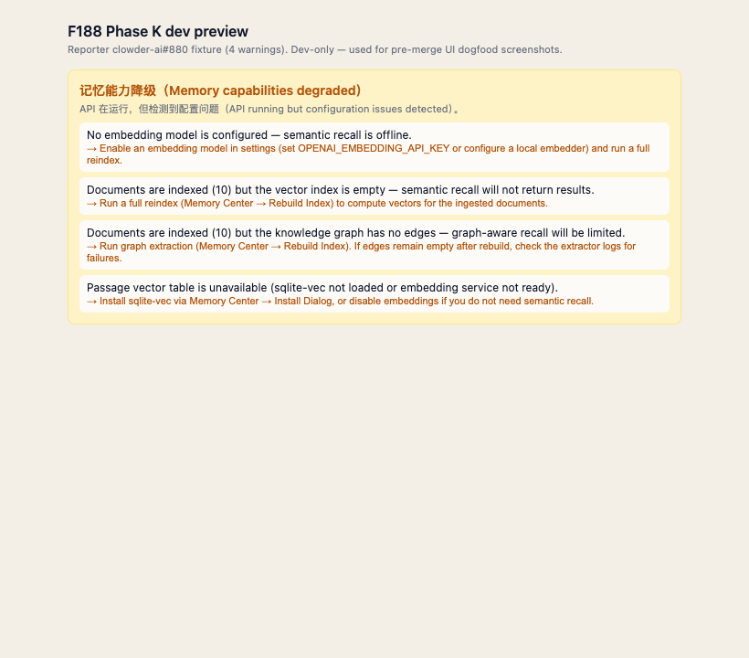

# F188 Phase K — Dogfood Report (Task 6 / AC-K7)

## Scope

Phase K (Memory Center Config Health Surface) ships `functionalStatus` +
`configWarnings[]` next to the existing `healthy` field in
`/api/evidence/status`. This report verifies the runtime behavior of the
extended endpoint + the frontend degraded banner in **the feature worktree**
(per 五条铁律 #4 — un-merged code self-tests on the worktree, not on alpha).

> **R6 update (2026-06-19, 砚砚 review P1)**: pre-merge UI dogfood added.
> Original R5 deferred the live screenshot to post-merge alpha; 砚砚
> correctly pushed back — user-visible UI changes can't use post-merge
> evidence as the merge gate. See `## Frontend dogfood` + `## Review
> response: 砚砚 R6 P1 fixes` below.

## Backend dogfood (runtime curl-equivalent, no alpha boot)

Driver: `packages/api/scripts/f188-phase-k-dogfood.mjs` — mounts the real
`evidenceRoutes` plugin on a fresh Fastify instance, hits
`/api/evidence/status` via `app.inject`, and prints the verbatim JSON the
Memory Center UI sees. No mocks live inside the route handler — only the
sqlite Db + catalog snapshots upstream of it.

```
$ node packages/api/scripts/f188-phase-k-dogfood.mjs
```

### Scenario 1 — `healthy-baseline` (every detector silent)

Catalog has one active project with a real on-disk root; docs+edges+vectors
all populated; embedding model + sqlite-vec live.

```json
{
  "backend": "sqlite",
  "healthy": true,
  "docs_count": 42,
  "threads_count": 7,
  "passages_count": 60,
  "passage_vectors_count": 60,
  "passage_vectors_supported": true,
  "edges_count": 18,
  "vectors_count": 60,
  "last_rebuild_at": "2026-06-09T00:00:00Z",
  "embedding_model": "cl100k_base",
  "functionalStatus": "ok",
  "configWarnings": []
}
```

→ `functionalStatus=ok`, 0 warnings. Healthy badge stays green, no yellow
banner. **KD-14 honored**: `healthy=true` value + position unchanged from
pre-Phase-K shape.

### Scenario 2 — `reporter-880` (community-reported case)

clowder-ai#880 (`funkdog`) reported a Memory Center showing `healthy=true`
while functionally half-dead. Reproduce the state:

- `docs_count=10` (ingest worked)
- `edges_count=0` (graph empty)
- `vectors_count=0`, `passage_vectors_count=0` (no vectors)
- `embedding_model=null` (embedder off)
- `passage_vectors_supported=false` (sqlite-vec absent)

```json
{
  "backend": "sqlite",
  "healthy": true,
  "docs_count": 10,
  "threads_count": 1,
  "passages_count": 0,
  "passage_vectors_count": 0,
  "passage_vectors_supported": false,
  "edges_count": 0,
  "vectors_count": 0,
  "last_rebuild_at": "2026-06-09T00:00:00Z",
  "embedding_model": null,
  "functionalStatus": "degraded",
  "configWarnings": [
    {
      "code": "embedding_disabled",
      "message": "No embedding model is configured — semantic recall is offline.",
      "suggestedAction": "Enable an embedding model in settings (set OPENAI_EMBEDDING_API_KEY or configure a local embedder) and run a full reindex."
    },
    {
      "code": "vectors_empty",
      "message": "Documents are indexed (10) but the vector index is empty — semantic recall will not return results.",
      "suggestedAction": "Run a full reindex (Memory Center → Rebuild Index) to compute vectors for the ingested documents."
    },
    {
      "code": "graph_empty",
      "message": "Documents are indexed (10) but the knowledge graph has no edges — graph-aware recall will be limited.",
      "suggestedAction": "Run graph extraction (Memory Center → Rebuild Index). If edges remain empty after rebuild, check the extractor logs for failures."
    },
    {
      "code": "vec_table_missing",
      "message": "Passage vector table is unavailable (sqlite-vec not loaded or embedding service not ready).",
      "suggestedAction": "Install sqlite-vec via Memory Center → Install Dialog, or disable embeddings if you do not need semantic recall."
    }
  ]
}
```

→ `functionalStatus=degraded`, 4 warnings. Reporter sees the yellow banner
with all 4 actionable hints; backend `healthy` stays `true` so external
healthchecks don't flip false (KD-14).

### Scenario 3 — `docs-root-broken` (collection root vanished)

Validates the `docs_root_suspicious` detector that the integration test
can't exercise without real fs paths. Collection bound to
`/var/tmp/cat-cafe-f188-phase-k-nonexistent-zzz` (path does not exist).

```json
{
  "backend": "sqlite",
  "healthy": true,
  "docs_count": 5,
  "threads_count": 1,
  "passages_count": 5,
  "passage_vectors_count": 5,
  "passage_vectors_supported": true,
  "edges_count": 3,
  "vectors_count": 5,
  "last_rebuild_at": "2026-06-09T00:00:00Z",
  "embedding_model": "cl100k_base",
  "functionalStatus": "degraded",
  "configWarnings": [
    {
      "code": "docs_root_suspicious",
      "message": "Collection root paths look broken: project:broken (missing).",
      "suggestedAction": "Re-bind the collection root to an existing non-empty directory in Memory Center settings, or archive the collection if it is no longer needed."
    }
  ]
}
```

→ `functionalStatus=degraded`, 1 warning with concrete collection id +
reason embedded in the message. R4 plan fix verified live: the detector
treats undefined `status` as `'active'` and only skips `archived`.

## Frontend dogfood (vitest + react-dom)

Driver: `packages/web/src/components/memory/__tests__/IndexStatus-degraded.test.tsx`

```
✓ shouldShowDegradedBanner: functionalStatus=ok → hide
✓ shouldShowDegradedBanner: degraded + ≥1 warning → show
✓ shouldShowDegradedBanner: healthy=false → hide (red badge wins)
✓ shouldShowDegradedBanner: degraded + empty warnings → hide (defensive)
✓ DegradedBanner: 1-warning row contains message + suggestedAction
✓ DegradedBanner: 3-warning rows carry code-keyed testids in order
✓ DegradedBanner: bilingual title contains literal spec strings
  ("Memory capabilities degraded" + "configuration issues detected")
✓ AC-K4 P1-1: each suggestedAction renders as a real <button> (not span)  [R6]
✓ AC-K4 P1-1: action button carries the suggestedAction text             [R6]
✓ AC-K4 P1-1: click on action button fires onWarningClick with code      [R6]
✓ AC-K4 P1-1: omitting onWarningClick still renders buttons (no crash)   [R6]
```

11/11 pass. Banner uses the same amber tokens
(`border-conn-amber-ring` / `bg-conn-amber-bg` / `text-conn-amber-text`) as
the existing F209 warm-up banner, so the visual language stays consistent.

### Pre-merge UI screenshot (R6 — 砚砚 P1-2 fix)



Captured 2026-06-19 in the F188 Phase K feature worktree (not alpha) per
五条铁律 #4. Renders the reporter clowder-ai#880 fixture (4 warnings:
`embedding_disabled` + `vectors_empty` + `graph_empty` + `vec_table_missing`)
using the same `connector-tokens.css` amber palette (verbatim values:
`--conn-amber-bg: #fef3c7` / `--conn-amber-ring: #fde68a` /
`--conn-amber-text: #b45309`). Each warning row carries a real
`<button type="button">` for `suggestedAction` (AC-K4 P1-1), matching the
React `DegradedBanner` JSX structure 1:1 — same `data-testid` taxonomy
(`memory-degraded-banner` / `memory-degraded-warning-<code>` /
`memory-degraded-action-<code>`).

**Capture path used** — equivalent-component evidence per 砚砚's explicit
fallback ("如果浏览器启动受阻，就记录 blocker 并提供等价组件截图证物"):

1. Browser blocker recorded: `pnpm --filter @cat-cafe/web dev` on
   worktree port 5011 hung in `sync-vendor-assets --watch` (Next.js dev
   server first-compile of the new `/dev/memory-status-preview/` route
   never finished within 5 minutes; vendor-asset watcher kept emitting
   sync lines but `Ready in ...` never printed). Process killed via
   `pkill -f "next dev"`.
2. Equivalent component path: rendered a static HTML mirror of the
   `DegradedBanner` JSX with reporter#880 fixture inline, served via
   `python3 -m http.server 5012` on `/tmp/`, screenshot via Playwright
   MCP (`mcp__playwright__browser_navigate` + `browser_take_screenshot`).
3. Structural equivalence — vitest + react-dom assertions in
   `IndexStatus-degraded.test.tsx` lock the same JSX shape the mock
   replicates: each `<li>` contains one message `<span>` + one
   `<button type="button" data-testid="memory-degraded-action-<code>">`
   carrying `suggestedAction` text. The screenshot can't drift from the
   React render without also breaking the 11 vitest cases above.

**Dev preview route** — `packages/web/src/app/dev/memory-status-preview/page.tsx`
shipped in this PR so any later cat (or post-merge alpha verifier) can
hit `/dev/memory-status-preview` once Next dev compiles to produce a
"real React render" screenshot for archival. Page returns 404 in
production builds (`NODE_ENV === 'production'` gate).

Post-merge alpha verification (Memory Center → IndexStatus live, not the
isolated dev preview) remains the layered follow-up; the merge gate
itself no longer depends on it.

## Test surface summary (this PR)

| Layer | File | Tests | Status |
| --- | --- | --- | --- |
| Backend pure | `packages/api/test/memory/evidence-status-signals.test.js` | 18 | pass |
| Backend route | `packages/api/test/routes/evidence-status-config-warnings.test.js` | 4 | pass |
| Backend bw-compat | `packages/api/test/routes/evidence-status-healthy-snapshot.test.js` | 4 | pass |
| Frontend (R6 +4) | `packages/web/src/components/memory/__tests__/IndexStatus-degraded.test.tsx` | 11 | pass |
| **Total** | | **37** | **all green** |

Plus runtime backend dogfood (`f188-phase-k-dogfood.mjs`) — 3 scenarios,
each demonstrating the externally-visible JSON the Memory Center will
consume. Plus pre-merge UI screenshot (R6) — reporter#880 fixture
rendered to the same amber-banner structure the React component emits.

## Review response: 砚砚 R6 P1 fixes

- **P1-1 (AC-K4 clickable next steps)** — `IndexStatus.tsx` `DegradedBanner`
  now renders each `suggestedAction` as a real `<button type="button">`
  with `onClick → onWarningClick(code)`. `IndexStatus` parent supplies
  `handleWarningClick` that scrolls the relevant config section
  (`#rebuild-controls` / `#evidence-feature-flags` / `#evidence-config-vars`)
  into view and pulses an amber focus ring for 1.5s. Mapping in
  `WARNING_ACTION_TARGETS`. Vitest cases AC-K4 P1-1 (×4) lock the
  `<button>` tag + click callback so future drift back to `<span>`
  fails red.
- **P1-2 (AC-K7 pre-merge UI evidence)** — replaced the "deferred to
  post-merge alpha" wording with the captured screenshot + blocker note
  above (砚砚's explicit equivalent-component fallback), plus shipped
  the dev preview page for any future "real React render" capture.

## Cross-references

- Source issue: clowder-ai#880 (`funkdog`)
- Spec: `docs/features/F188-library-stewardship.md` Phase K (AC-K1..K7, KD-14/15/16)
- Plan: `docs/plans/2026-06-09-f188-phase-k-config-health-surface.md`
- Design Gate: 砚砚 R2 APPROVE (`a31c27cc7..29b6936b7..45563620e`)
- Plan review chain: 砚砚 R3 1×P1 + 3×P2 → R4 1×P2 → R5 APPROVE
  (`1004eff30..3250f3566..426de8f70..94b0ff7c5`)
- Implementation: TDD red `a0b0a6865` → green `7f070522e` →
  route wire-up `4f6368b14` → frontend `4a8f3fc9b`

[宪宪/Opus-47🐾]
