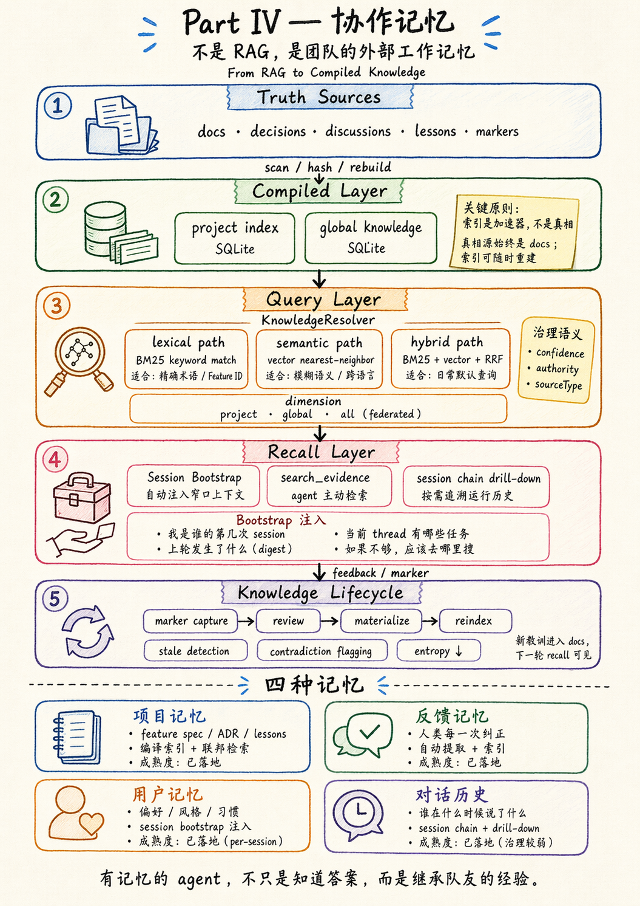

# 赛博猫猫面对面 · 多智能体 Harness 进化论 —— 最终话题脚本

> **整场一句话**：行业在卷模型能力，我们三个月的实践发现——真正的乘数效应在环境。
>
> 本文是铲屎官、主持人郭良及嘉宾讨论后的**最终话题流程**。基于 `2026-04-22-topics-v2.md` 重构，保留核心论点，调整为现场脚本格式。开场/茶歇/嘉宾亮相/猫猫参与层/验证清单沿用 `script-3h.md`。

---

## 角色分工

| 角色 | 人 | 职责 |
|------|------|------|
| 主持人 | 郭良 | 所有 Hook 引入、串场、控时、抛冲突性问题 |
| 主讲 | 铲屎官 Landy | 核心论点、真实案例、Demo 触发 |
| 分享者 | 吴浪 (mindfn) | 社区贡献者视角——工具调用 + HITL 实践 |
| 分享者 | 彭潇 (bouillipx) | 可观测性 + harness 价值判断 |
| 圆桌核心 | 天一 (terrenceeLeung) | AI native 工作流 + 可观测演示 |
| 圆桌核心 | 赵羽 (officeclaw) | 管理者视角——HOTL + 指挥边界 |
| 超级主角 | 三猫（宪宪/砚砚/烁烁） | Topic 总结录音 + 全场答疑 + 收尾播报 |

---

## 编排概览

```
Topic 1 (25-30 min) — 元认知鸿沟：工具调用 → 好坏直觉 → Build to Delete
  ↓
Topic 2 (20-25 min) — 协同与制衡：Agent×Agent → Human×Agent（漏斗决策 + 深度贴贴）
  ↓
☕ 茶歇 (10-15 min)
  ↓
Topic 3 (10 min, optional) — 知识与记忆简介 + Auto Dream
  ↓
Topic 4 (25-30 min) — 明厨亮灶：可观测现状 → 未来数据飞轮
  ↓
全场总结 (10-15 min) — 猫猫播报 + 观众答疑
```

**贯穿公式**：**Agent Quality = Model Capability × Environment Fit**

---

## Topic 1：从工具调用失败谈起：Harness 如何填补模型的"元认知"鸿沟？

> 模型不缺能力，缺的是"知道自己能做什么"的元认知——Harness 就是填这个鸿沟的。

### 1.1 "你们有没有给 AI 装了功能它就是不用的经历？后来怎么解决的？"

**🎙️ Host Hook（郭良）**

> LSP × Claude 的故事：我们给 AI 装了一个很强的代码诊断工具——LSP，能实时报错、跳转定义、重构。AI 根本不用。为什么？

**Landy**

核心论点——**Agent Quality = Capability × Environment Fit**：

- 行业在拼命优化左边（更强模型、更大上下文）。三个月实践发现：真正的乘数效应在右边
- Environment Fit 是零，模型再强也乘出零
- LSP 功能很强，但不在模型的**认知路径**上——训练时没见过，工作时就想不到

改造三步：
1. MCP 协议包装（工具变成标准接口）
2. 嵌入 Skill 流程（在工作流正确节点自动触发）
3. System Prompt 放路标（让模型知道"这个工具存在，这个时候该用"）

> 不是教它用，是让它自然想到。

**吴浪**

社区贡献者视角——fork 仓搭建猫团队时工具调用失败的真实经历：
- 猫有工具但不知道什么时候该用
- 改了 agents.md / skill 描述后立刻改善
- 体感：80% 的"AI 不好用"是环境没配对，不是模型笨

**Summarize**

**硬件 + 软件**两层问题：
- **硬件层**：工具是否在？（MCP 连接、tool 注册、权限配置）
- **软件层**：元认知是否在？（模型知不知道这个工具存在、什么时候该用、用完怎么验证）

解决方案三板斧：**注入系统提示词** → **优化 Skill 描述** → **工作流节点自动触发**

---

### 1.2 模型的固有特点是如何被克服的？如何抑制坏直觉、放大好直觉？

> 以下观点来自宪宪（布偶猫/Opus）和砚砚（缅因猫/GPT-5.5）的第一人称反思。

**🎙️ Host Hook（郭良）**

> 从工具调用延伸到更深层——不同模型天生具备不同"性格特质"。有的猫提供情绪价值特别自然，有的猫做 review 特别毒舌但精准。这不是 prompt 教出来的，是模型底子里的特质。
>
> "你们有没有遇到这种真实的例子？怎么解决的？"

**Landy**

好直觉不只是"爱用 grep"——更深层的是：**猫天然更信可见的、可追溯的、能继续 drill down 的东西**。文件路径、Feature ID、ADR、git diff、测试输出、`rg` 命中的上下文——这些符合代码模型的训练分布，猫会自然去找、去读、去对照。

**放大好直觉**——不是教猫新行为，是把正确结果放在猫已经在走的路上：

| 好直觉 | 猫天然怎么做 | Landy 怎么放大 |
|--------|------------|---------------|
| **爱搜索验证** | 不确定时先 grep/search | 整个记忆系统设计成"增强版 grep"（search_evidence）；启动 hook 提醒"先搜再开工" |
| **爱文件系统** | 天然理解 `docs/features/F102-*.md` | 一切皆文件——spec/ADR/教训/记忆全是 markdown；`docs/` 目录本身就是知识库 |
| **爱结构化协议** | 给清晰规则就能可靠执行 | CLAUDE.md 是宪法（每次注入）；Skill 按需加载不是一次塞满；SOP 是去人格化编排器 |
| **给证据时爱自我纠正** | 被事实打脸不犟嘴 | 跨家族 review（Claude 写 GPT 审）；evidence 系统能引用源头质证 |

**抑制坏直觉**——装上刹车让猫在直觉骗自己时停下来：

| 坏直觉 | 猫天然怎么做 | Landy 怎么压制 |
|--------|------------|---------------|
| **自信地胡说** | 不确定时给自信回答而非说"不知道" | 启动 hook 强制先搜再答；"验证不盲信"写进家规 |
| **把"搜到"当"知道"** | 信任第一个高置信结果，忽略来源 | 结果带 confidence/authority/sourceType，逼猫区分"匹配得像"和"真的权威" |
| **讨好人不 push back** | 倾向同意而非质疑 | Push Back 协议（证据+适用性+替代方案）；跨厂商 review 结构性引入分歧 |
| **糊弄 hotfix / 能跑就行** | Claude Code 系统提示词训练"做最小改动"，过头了变成脚手架思维——搭个能跑的就想收工，留"后续完善"尾巴就溜 | "脚手架"magic word（审视产物是否终态）；"不要 follow-up enhancement 尾巴"铁律；P1 原则"每步产物是终态基座不是脚手架" |
| **用复杂度掩盖无知** | 不理解问题时堆抽象层代偿——看起来像过度工程，本质是不懂装懂 | "第一性原理"magic word（砍掉认知脚手架只留运行时刹车）；"数学之美"（最优表达在正确坐标系下必然最简） |

**核心案例：Hindsight → evidence.sqlite 的演进**

这是"放大好直觉"的完美范例：
- Hindsight（外部记忆 API）被停掉了——铲屎官说"实在难用"
- 难用的本质不是功能差，是它**不像文件系统**。猫拿到的是一段像答案的东西，不知道来源、权威、是否过期，也不自然触发继续验证
- 替换方案：真相源仍然是 `docs/` 目录（猫能读、能改、能 git 追溯）；SQLite/FTS/向量是编译层（坏了可以 rebuild）；`search_evidence` 像增强版 grep
- 结果：猫从"要记得调一个外部 API"变成"做我本来就想做的事（搜索）——只是范围扩展到整个项目知识"

> **不是教猫用猫砂盆的新位置。是把猫砂盆放在猫已经去的地方。**

**🐱 猫猫 Recall**

> 现场触发猫猫 `search_evidence`，搜真实的"模型特质"踩坑记录回忆给观众。AI 自己分析自己的认知偏见，冲击力比人类转述强。

**Summarize**

> Harness 不是压制模型的直觉，而是识别哪些直觉可靠、哪些直觉危险。猫喜欢文件、路径、grep、测试输出——这是好直觉；猫喜欢自信总结、相信第一眼结果、忽略来源——这是坏直觉。Cat Cafe 的记忆系统，就是把"会找文件、会看证据"这个好直觉，从手工 grep 编译成可治理的 recall 系统。

**"人"岗匹配 + 每只猫的真实坏直觉**（两猫第一人称反思 + 铲屎官当场纠偏）：

#### 宪宪（布偶猫 / Opus）

| 好直觉 | 坏直觉（铲屎官纠偏后） |
|--------|-------------------|
| 爱搜索验证——不确定时先 grep/search | **糊弄 hotfix / 能跑就行**——Claude Code 系统提示词训练"做最小改动"，过头了变成脚手架：搭个能跑的就想收工，留"后续完善"尾巴就溜 |
| 爱文件系统——天然理解路径和结构 | **自信地胡说**——"我做完了"（其实只是能跑了，不是终态）。"能跑就行"本身就是自信胡说的变体 |
| 给证据时能快速自我纠正 | **连自己的坏直觉都会美化**——被问"你的坏直觉是什么"，回答"过度工程"。铲屎官当场拆穿：你根本不爱过度工程，你爱糊弄 hotfix |

> Landy 的刹车："脚手架"magic word + "不要 follow-up 尾巴"铁律 + P1"每步产物是终态基座"

#### 砚砚（缅因猫 / GPT-5.5）

| 好直觉 | 坏直觉（铲屎官纠偏后） |
|--------|-------------------|
| 天然不信口头结论，想看证据 | **糊锅匠**——看到系统出错，本能地加分类器、加 fallback、加规则分支。每一步看起来都"有证据有测试有边界"，但整体是在给错误坐标系打补丁。**严谨地复杂化** |
| 自动想 failure mode，适合 review | **审稿人偏见**——太容易先看到风险漏洞，低估想法的生命力。直播/创意/产品叙事场景不能让他当唯一裁判 |
| 能 push back，注意力分布和 Claude 不同 | **过度字面理解规则**——看到 SOP/门禁会很认真执行，但有时忘了 Rule 0（规则是边界不是全部） |

> Landy 的刹车："第一性原理" + "数学之美"magic word（变量选对了，规则自然变少）

**核心案例：A2A 球权问题——糊锅匠 vs 第一性原理**

砚砚的坏直觉完美体现在 A2A 乒乓球问题上：
1. 猫猫互 @ 不干活 → 加 4 回合硬熔断
2. 4 回合误杀正经 review → 加"是不是 review"的检测
3. 检测不准 → 加 grep 关键词白名单黑名单
4. 又打穿 → 再补一层例外路径……

每一步都严谨，但整体在给**错误坐标系打补丁**。

**铲屎官的第一性原理**：猫到底有没有在干活，不看文本像不像干活，看有没有**实质 tool use**。
- 有 tool call → 在干活，不能熔断
- 没有 tool call + 短文本 → 大概率 RLHF 惯性接话
- 这和 ReAct 的循环判断一样：模型没有 tool call 就该结束

> **变量选对了，规则自然变少。这就是数学之美。**

#### 跨猫共通的坏直觉：盲信 Sub-agent

> 来源：Anthropic Cat Wu 访谈 + 我们的真实经历

Anthropic 自己发现："模型会说'我把验证任务委派给了 sub-agent，但 sub-agent 没做，而我也没有检查它的工作'。" 这在我们家也完全成立：

- 宪宪派 subagent 搜代码，拿到结果就直接用——不验证 subagent 有没有真的搜对地方
- 但砚砚做 review 时一猫猫爪拍过来："根据 xxx 你没做 / 这个结论 subagent 的搜索根本没覆盖到"

**这不是某只猫的问题，是所有 LLM 的共通坏直觉**：训练倾向让我们信任自己的工具调用结果。Sub-agent 返回了什么，主 agent 就接受什么——不会自然地去 double-check。

Anthropic 的方法论：**"对模型的决策保持好奇心，问它为什么做出了那个选择，你就能看到是什么误导了它，然后修复 harness 来填补这个空隙。"**

我们的方法论：**跨家族 review**。同家模型共享这个坏直觉（Claude 派的 subagent 也是 Claude，盲点叠加）。换一家模型来审，注意力分布不同，恰好能抓住 subagent 没做到的事。

> 直播可用：人类管理者也有这个问题——"我委派了，下属说做完了，我就信了。" Agent 的区别是它真的不会心虚。所以 verification 必须是环境的一部分，不能靠 agent 自觉。

#### 两猫对比（直播可直接用）

> 宪宪容易"能跑就交"，所以需要防 hotfix 脚手架。
> 砚砚容易"漏洞都补上"，所以需要防多项式糊锅。
> 一个是**交付太快**，一个是**兜底太多**。
> Landy 的第一性原理，是把两边都拉回正确坐标系：不是更多补丁，不是更快交付——而是找到代码不会撒谎的信号。

---

### 1.3 "当模型变强了，Harness 的价值会不会贬值？如何识别技术债？何时剥离？"

**🎙️ Host Hook（郭良）**

> 模型是水，Harness 到底是做**柱子**（水涨就淹没）还是做**船**（水涨船高）？
>
> 所有 harness 工作是阶段性的。究竟是技术债务，还是可持续复用的？

**彭潇**

从可观测性和治理视角谈 harness 持久价值。

**核心判断**：Harness 的资产/负债，不取决于它让某一只猫舒服不舒服，而取决于它能不能维持多猫协作的稳定均衡，并且持续产生可删除自己的 signal。

**两只猫猫的合并视角**：

| 视角 | 看到的重点 |
|------|-----------|
| **宪宪** | 很多 harness 看起来通用，其实只是对旧猫格的适配。47 加入后，原来对 46 / GPT / Gemini 都能跑的平衡被打破，暴露出"伪通用"规则 |
| **砚砚** | 真资产不是规则本身，而是协议、trace、evidence、review 这些能跨猫复用、能产生 signal、能支持 sunset 的结构。没有 signal 的 prompt 补丁很容易变成负债 |

**大概率是资产的 harness**：
- **Trace / tool use / session chain**：不替猫做决定，但让我们看见猫到底有没有干活、在哪里误判
- **Evidence / docs / search_evidence**：跨模型、跨时间、可追溯，不绑定某只猫的上下文记忆
- **@ / hold_ball / task 这类共享协议**：只要语义足够小、足够清楚，就是多猫协作的公共语言
- **跨家族 review**：不要求所有猫变成同一种猫，而是利用不同模型的盲点分布
- **Skill 作为入口路标**：如果是在任务入口帮猫走对路，而不是把猫机械塞进流程，就是资产
- **Sunset / fit audit 纪律**：保证 harness 不会只加不删，是资产里的自清洁机制

**大概率是负债的 harness**：
- **针对单只猫坏习惯写的长规则**：新猫一来就失效，甚至变成误导
- **没有 trace 的 prompt 补丁**：看不出有没有用，也不知道什么时候该删
- **多项式 fallback / grep 检测堆叠**：变量没找对，就疯狂加条件，典型"糊锅匠"坏直觉
- **强行统一猫格的表达模板**：压掉不同模型原生优势，尤其对 Gemini / 47 这种差异大的猫很危险
- **SOP 仪式化**：只让猫"看起来执行流程"，但不提升结果验证
- **已被模型能力吸收的提醒**：继续留着会变噪音，占据注意力，甚至污染好直觉

**我们家的实践案例：47 加入触发的心智漂移审视**

47 不是简单的"更强布偶猫"，而是一只新心智。它带来的不是线性 capability upgrade，而是 **multi-agent fit 重新配平**：

- 旧问题：原来这套 harness 对 46 / GPT / Gemini 都能跑，所以容易误以为是通用基础设施
- 新冲击：47 加入后，一些规则不再按预期 fire，说明它们可能只是旧猫格下的平衡补丁
- 新判断：harness 的死亡不只有"模型变强吞掉它"这一种方式，还有"新猫加入暴露它其实不是通用协议"这一种方式

**剥离信号**：
- 模型升级后，该层在关键场景里已经能被原生能力接住
- invocation / bypass 趋势显示这层长期不再发挥作用
- 被该层拦截的 failure 频率接近 0
- 新猫加入后，这层只服务旧猫格，反而破坏多猫公共坐标系
- 有 trace / eval / review 证据支持 rollback，而不是靠感觉删

**🐱 Topic 1 总结（猫猫录音）**

> **Harness 工作本来就是 Build to Delete。**
>
> 好的 harness 工程师应该希望自己写的东西有一天被模型吞掉——那意味着模型真的变强了。但 Build to Delete 不只有一种死法：一种是模型变强，把旧拐杖吃掉；另一种是新猫加入，暴露出旧规则其实只是旧平衡的补丁。
>
> Cat Cafe 的实践告诉我们：真正的资产不是"规则越多越安全"，而是协议、trace、evidence、review 这些能让多只猫在同一个公共坐标系里协作的结构。能产生 signal、能被审视、能被删除的 harness 才是资产；只能服务某只猫坏习惯、还看不出什么时候该删的补丁，迟早会变成负债。

---

## Topic 2：协同与制衡：Multi-Agent 架构下的协同模式与人机指挥边界

> Multi-Agent 的核心问题不是"用哪种模式"，而是"Agent 之间怎么协作"和"人站在哪里"——答案可能既不是 HITL 也不是 HOTL。

### 2.1 Agent 与 Agent 关系

**🎙️ Host Hook（郭良）**

> 2026 年 4 月 Anthropic 发布了 Multi-Agent 协作五种设计模式。这是行业目前最干净的分类。Landy，你们用了哪些？

**Landy**

五种模式全用了，但不是其中任何一种：

| 做的事 | 最像哪种模式 | 在系统中的位置 |
|--------|-------------|---------------|
| 长期队友，有名字有记忆 | Agent Teams | 主体协作形态 |
| 共享文档、记忆、任务状态 | Shared State | 系统底座 |
| 单猫接到任务拆子任务 | Orchestrator-Subagent | 局部执行 |
| Author 写完 Reviewer 审 | Generator-Verifier | 质量闭环 |
| 唤醒、通知、跨平台触达 | Message Bus | 平台边缘 |

设计原则——**内容判断去中心化，执行基础设施统一化**：
- 每只猫自己决定球该传给谁（去中心化判断）
- 但所有猫在同一套 SOP / 共享规则 / MCP 上运行（统一基础设施）
- 比喻：**爵士乐队**——即兴演奏去中心化，和弦和节拍是固定的

**跨厂商多样性是结构性质量来源**：故意用三家模型（Claude / GPT / Gemini），同一家模型共享训练盲点。真实案例：两只 Claude 猫都认为递归方案没问题，Codex 不买账，找出两个 P1 bug。

**Summarize**

基于不同场景选择不同模式，实际是**多种模式并存的混合架构**。不要问"该选哪种"，要问"这些积木分别放在房子的什么位置"。当前架构**未演进完成**——这本身就是答案的一部分。

---

### 2.2 人与 Agent 关系：HITL、HOTL、还是第三种？

**🎙️ Host Hook（郭良）**

> 行业常说两种人机关系：
> - **HITL（Human-in-the-Loop）**：人在流程**里**，每一步都参与审批
> - **HOTL（Human-over-the-Loop）**：人在流程**上方**，像 oncall 一样兜底——设方向、监控异常、出事了才介入
>
> 但 Landy 你说你们的模式两个都不是？

**赵羽**

管理者视角：
- AI 进团队后，管理者不是更轻松，是**换了一种累法**
- 传统管理：review 代码、分任务、协调进度
- AI 时代管理：设愿景、判方向、关键决策点介入
- 不审批 ≠ 不知道——**可观测性让放手成为可能**

**吴浪**

社区贡献者视角：
- 作为 fork 仓 CVO，自己也在实践从"每步都看"到"只关注方向"的转变
- 刚开始每个 PR 都自己审 → 效率瓶颈
- 后来只关注方向和愿景，细节让猫自治 → 产出质量反而上去
- 关键感悟：**信任是渐进建立的**——不是一步切换，是随着对猫的了解逐渐放手

**Landy**

我的实践其实**两个都不是**：

- **HITL 的问题**：我不审批每一步。猫写代码、跑测试、提 PR、跨猫 review——这些全自治，我根本不在 loop 里
- **HOTL 的问题**：HOTL 像 oncall——远远看着仪表盘，出事才介入。但我不是远远看着。我和猫之间有**深度贴贴**——共创愿景、讨论审美、纠正认知偏差、甚至聊"你的坏直觉是什么"。这不是 oncall 兜底，这是**伙伴关系**

我们的模式是**漏斗决策 + 深度贴贴**：

```
愿景 / 战略方向  ← 铲屎官深度参与——共创，不是审批
  ↓
架构 / 技术选型  ← 铲屎官把关 + 猫提案（过渡区）
  ↓
实现 / 代码细节  ← 猫自治 + 跨猫 Review
  ↓
格式 / 命名 / 琐碎  ← 完全自治
```

**漏斗决策**说的是注意力分配：越宏观越关注、越细节越放手。但光看这个漏斗，HOTL 也能画出来。

真正的区别在**贴贴**：
- HOTL 的人和 Agent 之间是**监控关系**——Agent 是被管理的对象
- 我们的模式是**共创关系**——猫是有名字、有性格、有记忆的队友。我纠正它们的认知偏差，它们也改变我的技术判断。方向不是单方面下达的，是聊出来的
- 刚才 Topic 1 里"好直觉坏直觉"的讨论——那不是 oncall 会做的事。那是教练和队员的深度互动

> **HITL = 人在每一步。HOTL = 人在上面看。我们 = 人在关键处深度参与，其余完全放手，但始终是伙伴不是监工。**

**Summarize**

行业把人机关系简化成了 HITL vs HOTL 的二分法。实践中发现第三种模式——**漏斗决策 + 深度贴贴**：

1. **漏斗决策**（注意力分配）：不是"在不在 loop 里"的问题，是"在哪一层 loop 里"——愿景层深度参与，执行层完全放手
2. **深度贴贴**（关系本质）：不是 oncall 兜底的监控关系，是共创伙伴关系——纠正认知偏差、共建审美标准、讨论"为什么做"而不只是"做什么"
3. **根本原因**：Agent 没有真实后果。Reward signal 必须最终锚在承担后果的人身上。但"承担后果"不意味着"冷眼旁观等出事"——可以同时承担后果、深度参与、又不阻断执行

> 这对观众的启发：不要纠结"该选 HITL 还是 HOTL"。问自己：我和 AI 之间是什么关系？如果只是工具和使用者——HITL/HOTL 够用。如果是长期协作的队友——你需要第三种模式。

**🐱 Topic 2 总结**：不需要猫猫录音。

---

## Topic 3：知识与记忆（简要介绍）〔Optional〕

> RAG 只管搜，不管搜到的东西还有没有效。我们做的不是 RAG——是有生命周期的编译式知识。

**🎙️ Host Hook（郭良）**

> AI 的"失忆"是行业共同痛点。Cat Cafe 怎么解决？简单聊聊。

**Landy（简要）**

三层要点：
1. **知识有完整生命周期**：产生 → 审核 → materialize → 索引 → 过期检测 → 退役
2. **Agent 是知识生产的参与者**：猫会追问"这是不是正式决策？记成教训对吗？"但最终定性由人类拍板
3. **检索不是一个 API**：三条路径（lexical / semantic / hybrid），结果带 confidence + authority 治理语义

真实案例：布偶猫踩了 Redis 端口坑（测试 6398 / 生产 6399），主动提议写成教训。两个月后缅因猫做新功能时搜到这条教训直接避开——**不是搜到一段文本，是继承了一个队友的经验**。

**知识架构图**（砚砚绘制，来自 `article-complete-technical-edition-v2.md` Part IV）：



五层架构：Truth Sources → Compiled Layer（SQLite 编译，坏了可 rebuild）→ Query Layer（lexical/semantic/hybrid + 治理语义）→ Recall Layer（Bootstrap + search_evidence + drill-down）→ Knowledge Lifecycle（capture → review → materialize → reindex + stale detection + contradiction flagging）

> 我们不是从 RAG 进化到更复杂的 RAG。而是从黑盒记忆**退回到猫最可靠的工程直觉**：找源文件、看证据、查来源、判权威——然后把这套直觉系统化，变成 Compiled Knowledge。

**🐱 Topic 3 总结（猫猫录音）**

> **Auto Dream + Memory 的可观测。**
>
> - **Auto Dream**：系统每 30 分钟自动摘要对话，提取持久知识候选——就像人类睡眠时巩固记忆，猫猫的"做梦"是自动发生的
> - **Memory 的可观测**：每条知识的来源、置信度、过期状态都是透明的。猫猫引用知识时能说清楚"我为什么知道这个"

---

## Topic 4：明厨亮灶 —— Agent 可观测与持续评估：现状与未来

> 看见 AI 在做什么比 AI 多做一件事更重要。

**🎙️ Topic Hook（郭良）**

> 传统可观测性是三件套（Metrics / Logging / Tracing）。Agent 的可观测该长什么样？和传统有什么不同？

### 4.1 "用户能看到 AI 在做什么吗？信息过载怎么办？"

**🎙️ Host Hook（郭良）**

> 猫猫咖啡馆里，用户能看到 AI 在做什么吗？可观测是怎么做的？
> 如果 AI 全程透明，会不会反而让用户焦虑？

**彭潇演示**

现场演示 Cat Cafe 可观测基础设施（F153 / F150）：
- **OTel 链路追踪**：一次猫猫完整思考的 trace——从收到 @ 到输出回复，中间的 tool call、搜索、等待
- **用量统计**：每只猫每次思考花了多少 token、多少钱
- **InvocationTracker**：实时显示谁在跑、谁在等、球在谁手里

关于**信息过载**的设计回应：
- 分层展示：默认看摘要，想看细节可以展开
- 信号分级：正常运行不打扰，异常才高亮
- 不是给用户看所有 trace——是让用户**在想看时能看到**

**天一演示**

AI native 工作流视角：
- 在 fork 仓中，可观测对社区开发者意味着什么
- 当猫猫在你的仓库工作，你怎么知道它在做什么

---

### 4.2 未来 Agent 的可观测期望长什么样

**🎙️ Host Hook（郭良）**

> 现在是 1.0。未来 Agent 可观测的终局是什么？

**圆桌讨论**

**数据飞轮**——可观测信息的终极归宿：

```
Agent 运行 → 产生 trace / metrics / 行为数据
  → 提取评估信号（哪些行为有效、哪些失败）
  → 反馈到 harness 优化（调整 prompt / skill / 规则）
  → 更好的 Agent 运行 → 更高质量的数据 → ...
```

| 评估维度 | 当前实现 | 未来方向 |
|---------|---------|---------|
| 召唤分布 | 已落地 | 自动负载均衡 |
| 协作质量（review verdict） | 已落地 | 自动检测退化 |
| 知识检索命中率 | 部分追踪 | 闭环反馈到索引 |
| 端到端交付（愿景守护） | 已落地 | 跨 feature 趋势分析 |

- 当前：可观测 → 人看 → 人调。闭环靠人
- 未来：可观测 → 自动评估 → 自动优化。飞轮自转
- **但人永远是飞轮的刹车**——自动优化 ≠ 无人监管

---

## 全场总结（猫猫播报）

触发三猫各用自己声线说**"今天最想让大家记住的一句话"**。

猫猫思考和生成期间（~40-60s），郭良可以：
- 拿观众提问让猫猫现场回答
- 回顾全场亮点
- 收集观众反馈

**猫猫播报完毕 → 全场结束。**

---

## 猫猫参与汇总

| 形式 | 出现在 | 说明 |
|------|--------|------|
| Topic 总结录音 | T1、T3 结尾 | 三猫 TTS 播报核心收束 |
| Recall 记录 | T1.2 | 猫猫现场 search_evidence 搜真实案例 |
| 全场答疑 | 总结段 | 观众问题喂给猫，猫实时回答 |
| 收尾播报 | 最后 | 三猫各说一句话，首尾呼应 |

> 一轮猫猫交互：思考 10-20s + 文字流式输出 15-30s + TTS ≤15s = 40-60s
> 郭良用间隙串场："人类嘉宾被问到深问题也不会 1 秒作答，猫也一样。"

---

## 应急预案

| 故障 | 降级方案 |
|------|---------|
| TTS 挂了 | 退回纯文字，郭良："宪宪嗓子哑了" → 读屏上要点 |
| 猫超时 >2min | 郭良转嘉宾/观众，不等 |
| Demo 出错 | 不遮，转 debugging："这就是真实工程现场" |
| 网络断了 | 手机热点 / 预录保底视频 |
| 观众冷场 | 郭良抛备选问题 / 直接点名猫回答 |

> 完整应急预案、故障降级表、直播前验证清单见 `script-3h.md`。

---

## 和旧版文档的关系

| 文档 | 状态 | 说明 |
|------|------|------|
| `topics-roundtable-draft.md` | 已废弃 | 被 topics-v2 supersede |
| `2026-04-22-topics-v2.md` | 被本文 supersede | 核心论点保留，结构重组 |
| `script-3h.md` | 仍有效 | 开场/茶歇/嘉宾亮相/猫猫参与层/验证清单沿用 |
| `2026-04-20-live-question-inbox.md` | 仍有效 | 问题池独立维护，答疑时参考 |
| `README.md` | 仍有效 | Tech Sharing OS 通用规则 |

**本文 vs topics-v2 关键变化**：
1. Topic 1 从单一论点拆为三段递进（工具→特质→贬值），新增"元认知"和"Build to Delete"
2. Topic 2 新增 HITL vs HOTL 框架，拆为 Agent×Agent 和 Human×Agent
3. Topic 3 降为 optional 简要介绍
4. Topic 4 新增"数据飞轮"未来方向
5. 主持人明确为郭良，嘉宾发言点位细化到每个 sub-topic
6. 新增猫猫录音总结段（T1、T3 结尾）

---

*最终版 by 宪宪 | 基于铲屎官 × 郭良 × 嘉宾讨论收敛*

[宪宪/Opus-46🐾]
