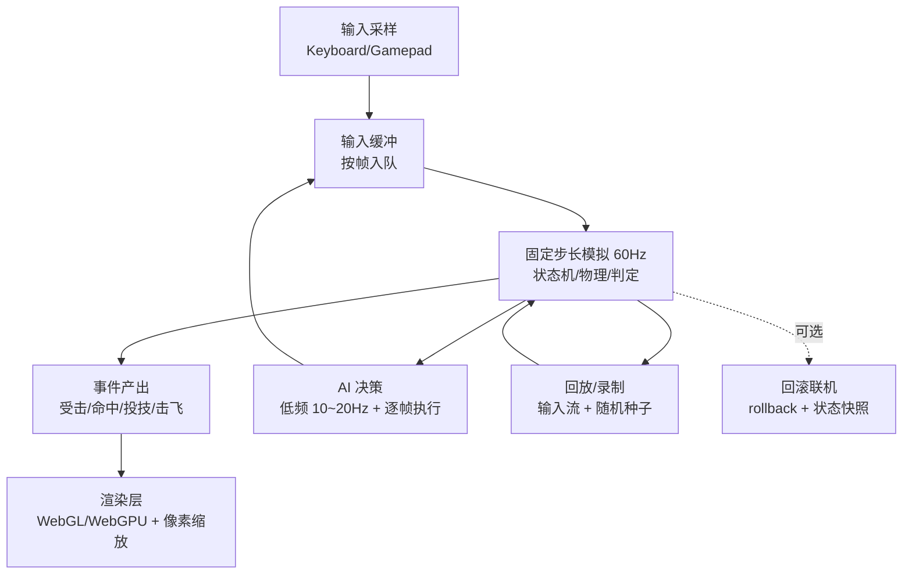

# 浏览器端即时像素格斗游戏技术方案深度研究报告

## 执行摘要

本报告面向“现代浏览器 + TypeScript + macOS（Apple Silicon，统一内存 128GB 级别）”的浏览器端即时像素格斗游戏（偏《拳皇》/横版对战）场景，给出从引擎选型、实时判定架构、格斗 AI、像素 Sprite Sheet 标准、本地小模型推理到工程化与 MVP 路线图的一套可落地方案，并严格区分“已确认可行”与“需验证”。在并发玩家数未指定的前提下，默认目标为本地单机或同机 1v1/2v2；在线对战作为“需验证”扩展。fileciteturn0file0L1-L24

结论层面（只给关键结论，细节在正文展开）：

- **引擎/框架推荐（已确认可行）**  
  - **主推荐：Phaser 3（或评估 Phaser 4 的稳定性后切换）**，原因是它是“完整 2D 游戏框架”，对输入、资源、动画、（简单）物理/碰撞、调试与生态更友好，并且存在直接面向格斗输入序列的社区库与开源格斗项目可参考。citeturn13search3turn15search2turn13search7turn13search0  
  - **渲染性能/未来渲染技术优先：PixiJS v8**，作为“渲染引擎”在 WebGPU/WebGL 双栈上具备长期优势，适合“弹幕/粒子很多”的像素格斗，但需要自建游戏框架层（状态机、碰撞、输入缓冲、回放/同步）。citeturn12search14turn12search3turn12search0  
  - **轻量原型：KAPLAY（Kaboom 的继承路线，已确认 Kaboom 官网标注不再维护）**。KAPLAY 提供更“组件化/ECS”体验、内置动画/碰撞/固定更新钩子与帧索引访问，适合快速做可玩 Demo，但复杂格斗系统的可扩展性与生态成熟度仍需评估。citeturn13search30turn12search8turn10search1turn10search19  

- **实时格斗核心架构（已确认可行）**  
  - 使用 **固定步长（60Hz）模拟 + requestAnimationFrame 渲染**，以“帧”为所有判定与输入缓冲的基本单位；这是格斗类最可控、也最易扩展到回放/回滚（rollback）的结构。固定步长的典型实现方式可以直接采用经典 “Fix Your Timestep” 的 accumulator 结构。citeturn3search3turn9search1  
  - **判定优先用 Hurtbox/Hitbox（矩形/少量多边形）而非像素级碰撞**；像素级碰撞可作为特效/特殊技能的可选模块（成本高、难调参）。Phaser Arcade Physics 仅支持矩形/圆，反而更契合格斗判定盒思路。citeturn15search2  
  - **帧数据（frame data）存储建议采用“动作定义 JSON + 每帧 hitbox/hurtbox 元数据”**：在 Phaser 可利用 Texture Frame 的 `customData` 承载每帧自定义数据，并通过动画 update 事件在关键帧启用/关闭攻击判定。citeturn10search14turn9search3turn17view1  

- **格斗 AI（已确认可行 + 部分需验证）**  
  - 以“可控、可调、可解释”为目标：**FSM/BT/Utility 负责实时决策**；MCTS/RL 用于“对局中/对局后”的策略增强或离线训练产物（例如蒸馏成小网络），而不是强行每帧跑重搜索。BT 在游戏中常用于解决 FSM 扩展困难问题。citeturn3search4turn3search20turn4search0  
  - FightingICE 研究表明“RL + MCTS 混合”在格斗环境中能取得显著效果，但那是研究平台设定下的实验结论；迁移到浏览器即时报文与严格延迟预算需专门验证。citeturn4search0  

- **本地小模型（3–8B）用于实时决策（部分已确认可行，但“实时”需谨慎）**  
  - **已确认可行：浏览器内运行 LLM**（WebGPU 的 WebLLM；或 WASM 的 wllama/llama.cpp-wasm）——工具链与支持模型清单都已成熟存在。citeturn5search1turn5search0turn16search0turn5search2  
  - **需验证：将 3–8B LLM 放进“逐帧/高频”（例如 60Hz 或 20Hz）决策回路**。原因是 tokens/s 与首 token 延迟在真实设备/浏览器差异大；即便 WebGPU，吞吐也更适合“低频策略/对话式/局间调整”，而非每几帧产生多 token 输出。近期实践文献与 issue 讨论也强调跨 GPU/浏览器性能波动问题。citeturn11search1turn11search0turn16search12  
  - 更稳妥的工程落点：**LLM 做“教练/导演”**（局间调参、生成打法配置、生成脚本），实时对战仍由 FSM/Utility/MCTS-lite 执行。  

- **MVP 路线图（已确认可行）**  
  以“先可玩，再可扩展”为原则：第一个可玩 Demo 用 1 套角色、少量动作、明确的判定盒与输入缓冲，外加可视化调试（hitbox overlay、帧计数、输入历史），再逐步引入 AI 个性化与（可选）本地小模型。  

---

## 目标、假设与总体技术架构

### 场景假设与约束边界

- **平台与语言**：现代浏览器（Chrome/Safari）+ TypeScript。fileciteturn0file0L21-L24  
- **目标玩法**：2D 横版即时格斗（《拳皇》风格），像素风 sprite sheet，包含“弹幕/投技/必杀”等动作类型。fileciteturn0file0L6-L20  
- **并发假设**：默认本地单机或同机对战（1v1/2v2）。在线对战属于“需验证”扩展（涉及回滚/同步/反作弊与网络质量差异）。  
- **性能目标**：以 60Hz 为核心模拟节拍，渲染跟随显示刷新率（多数设备 60Hz，也可能 120/144Hz）。浏览器的 `requestAnimationFrame()`会在下一次重绘前回调，回调频率通常匹配屏幕刷新率。citeturn9search1turn9search21  
- **像素清晰度目标**：采用 CSS `image-rendering`/像素风缩放策略确保“像素感”与缩放一致性。citeturn9search4turn9search0  

### 推荐的总体架构

核心思想：**渲染与模拟解耦**，模拟以“帧”为单位；输入、动作、判定、AI 都落在帧域里。固定步长（semi-fixed / fixed timestep）是经典可复用模式。citeturn3search3  



- ✅ **已确认可行**：固定步长模拟的 accumulator 结构（经典实现）。citeturn3search3  
- ✅ **已确认可行**：浏览器渲染循环用 `requestAnimationFrame()` 驱动。citeturn9search1  
- ⚠️ **需验证**：若做在线对战，rollback 的最大回滚帧数、输入延迟与状态快照尺寸需要基于实际动作复杂度与设备性能压测（见“核心玩法系统实现”一节）。citeturn7search23turn7search24  

---

## 框架选型与对比

### 先澄清“Kaplay / Kaboom”命名假设

用户提到 “Kaplay 但不确定”。经检索可确认：

- **Kaboom.js 官网明确提示“不再维护（no longer maintained）”**。citeturn13search30  
- **KAPLAY（kaplayjs.com）是一个面向 JavaScript/TypeScript 的 2D 游戏库**，其 API 与 Kaboom 系系谱高度相关，并提供文档、示例与更新日志（如 `animFrame`）。citeturn12search8turn10search19  

因此：本报告将 **Kaboom 作为“历史方案/不推荐新项目”**，将 **KAPLAY 作为 Kaboom 的现实替代候选**。

### 框架比较表：指标评分与成熟度理由

评分规则：1–5（5 最佳/最成熟），侧重“浏览器端即时格斗（帧级判定）”需求。性能数据部分引用公开基准测试（10k sprites）作为“趋势参考”，不代表你的格斗场景必然一致。citeturn8view0  

| 框架/库 | 定位 | 渲染性能潜力 | 动画与工具链 | 帧数据访问便利性 | Hitbox/像素碰撞支持 | 输入/延迟处理基础 | TypeScript 体验 | 社区/生态 | 格斗示例/参考 |
|---|---|---:|---:|---:|---:|---:|---:|---:|---:|
| Phaser 3 | 完整 2D 框架 | 4 | 4 | 4 | 4 | 4 | 4 | 5 | 4 |
| PixiJS v8 | 2D 渲染引擎 | 5 | 4 | 3 | 2 | 2 | 4 | 5 | 2 |
| KAPLAY | 2D 游戏库（偏 ECS/组件） | 3 | 3 | 4 | 3 | 3 | 5 | 3 | 2 |
| Kaboom（不维护） | 2D 游戏库 | 2 | 2 | 2 | 2 | 2 | 3 | 2 | 2 |
| Kontra.js | 极小型 2D 库 | 2 | 2 | 2 | 2 | 1 | 2 | 2 | 1 |
| PlayCanvas | 3D 引擎（带 2D） | 3 | 3 | 2 | 2 | 2 | 2 | 4 | 1 |
| Three.js | 3D 库（可做 2D） | 2 | 3 | 2 | 1 | 1 | 3 | 5 | 1 |

#### 评分依据（逐项要点，含“已确认可行/需验证”标注）

**Phaser 3（主推荐）**

- ✅ **完整框架特性**：官方介绍明确其为面向桌面与移动浏览器的 HTML5 2D 游戏框架，支持 WebGL 与 Canvas。citeturn13search3  
- ✅ **碰撞/判定盒适配**：Arcade Physics 明确是轻量系统，仅支持矩形与圆形，适合格斗的 AABB/圆形判定盒思路。citeturn15search2  
- ✅ **帧事件驱动判定**：官方动画事件流包含 `ANIMATION_UPDATE` 等，且示例展示了回调参数可拿到 `frameKey` 用于“特定帧触发效果”。citeturn9search3turn17view1  
- ✅ **每帧自定义数据承载**：Phaser 的 Texture `Frame` 提供 `customData` 字段，可用于存放每帧 hurtbox/hitbox 元数据。citeturn10search14  
- ✅ **格斗输入序列支持**：存在 `phaser3-hadoken` 这类专门处理“格斗式搓招序列”的库与 demo。citeturn13search7  
- ✅ **格斗项目参考**：存在 Phaser + TypeScript 的类 Street Fighter 项目（Brutal Brawl）可用于结构参考。citeturn13search0  
- ⚠️ **动画事件频率陷阱**：官方文档提示若动画播放速度高于游戏帧率，可能“一帧内触发多次 update 事件”，命中判定需做“每动作/每帧只命中一次”的去重。citeturn9search3turn1search15  

**PixiJS v8（渲染性能/未来兼容推荐）**

- ✅ **WebGPU / WebGL 双栈**：PixiJS v8 官方宣布将 WebGPU 作为核心范式集成，并提供 WebGPU Renderer 与自动选择选项；文档也指出 WebGPU 通常更快并可优先选择。citeturn12search14turn12search0turn12search9  
- ✅ **性能优化指导**：官方提供面向渲染与场景图的性能建议（对象复用、分组、减少 GC 等）。citeturn2search2  
- ✅ **动画能力**：AnimatedSprite/基于 spritesheet 的动画机制成熟；官方 API 文档明确推荐从 spritesheet 动画定义创建 AnimatedSprite。citeturn15search9  
- ⚠️ **格斗“帧数据/判定/输入缓冲”需自建**：Pixi 是渲染引擎，不提供完整游戏框架语义（世界步进、碰撞系统、输入延迟策略）。这不是缺点，而是会把工作转移到你自己的 gameplay 层。citeturn8view0  
- ✅/⚠️ **适用性判断**：如果你的角色技能里存在“全屏弹幕/大量 projectile”，Pixi v8 的渲染吞吐（尤其 WebGPU 路径）更值得投入；但要以你自己的对象数量、特效与目标设备做基准压测。citeturn12search14turn8view0  

**KAPLAY（快速原型候选）**

- ✅ **TypeScript 一等公民定位**：官网与 GitHub 都强调其为 JS/TS 游戏库。citeturn12search8turn12search10  
- ✅ **帧索引访问**：SpriteComp 暴露 `frame` 与 `animFrame`，并且更新日志明确新增 `animFrame`。这对格斗帧数据对齐很关键。citeturn10search1turn10search19  
- ✅ **固定更新钩子**：API 提供 `onFixedUpdate`，便于实现“60Hz 判定/输入缓冲”的固定节拍。citeturn10search3  
- ⚠️ **生态成熟度**：相对 Phaser/Pixi，第三方插件、复杂格斗项目样例较少，需要你自己沉淀一套“格斗层”。（不是不可行，而是风险在于工程投入与踩坑成本。）

**Kaboom（不建议新项目）**

- ✅ **官网标注不再维护**：这对长期维护与依赖风险是决定性因素。citeturn13search30  

**Kontra.js（极简，适合小体量）**

- ✅ **提供 SpriteSheet/Animation 对象**：但更偏“你自己写引擎”。citeturn1search4turn1search12  
- ⚠️ **复杂格斗系统成本**：输入序列、判定盒管理、调试工具、资源管线需要你自建，整体更像“框架搭建课题”。

**PlayCanvas / Three.js（不推荐做纯 2D 像素格斗主引擎）**

- ✅ **PlayCanvas 有 2D Sprite 支持**，文档明确 Sprite Asset 可以在 Texture Atlas 中存储多帧做 flip-book 动画。citeturn1search17turn1search29  
- ⚠️ **定位偏 3D**：即便 PlayCanvas 引入 WebGPU，也主要服务 3D 图形管线；做纯 2D 像素格斗通常会引入不必要复杂度。citeturn12search2turn12search20  
- ✅ **Three.js 社区明确指出其不擅长 sprite rendering**（纹理对象与内存分配等问题会拖累大量 sprite 场景），因此作为“像素/弹幕”的主渲染并不划算。citeturn1search6  

### 推荐组合（结论）

- **首选（可玩性/开发效率优先，已确认可行）**：Phaser 3 + 自研“格斗层”（帧数据、判定盒、输入缓冲、AI）。citeturn13search3turn10search14turn17view1  
- **性能/未来渲染优先（已确认可行，但工程量更大）**：PixiJS v8（WebGPU 优先）+ 自研“格斗层”。citeturn12search14turn12search0  
- **快速原型（已确认可行，但中后期风险需管理）**：KAPLAY + 自研格斗层（更轻）。citeturn10search19turn10search3  
- **不建议**：新项目直接使用 Kaboom（维护风险）。citeturn13search30  

---

## 核心玩法系统实现：实时循环、输入、判定、性能与可选联机

### 固定步长模拟与渲染解耦

**关键点**：格斗“判定”本质是帧级规则系统（startup/active/recovery、取消窗、无敌帧、投技判定、硬直等）。因此最稳的实现是：

- 模拟：严格固定 60Hz（每 tick = 1 帧）。  
- 渲染：`requestAnimationFrame()` 驱动，可能 60/120Hz；渲染只读“最近一次模拟状态 + 插值”。citeturn3search3turn9search1  

下面是可复制的最小 fixed timestep 核心（引擎无关、TypeScript）：

```ts
// fixed_timestep.ts
const SIM_HZ = 60;
const DT = 1 / SIM_HZ;
const MAX_FRAME_TIME = 0.25; // 防止切后台回来acc爆炸（单位s）

let last = performance.now() / 1000;
let acc = 0;

export function startLoop(step: (dt: number) => void, render: (alpha: number) => void) {
  function frame() {
    const now = performance.now() / 1000;
    let frameTime = now - last;
    last = now;
    if (frameTime > MAX_FRAME_TIME) frameTime = MAX_FRAME_TIME;

    acc += frameTime;
    while (acc >= DT) {
      step(DT);
      acc -= DT;
    }

    const alpha = acc / DT; // 0..1
    render(alpha);

    requestAnimationFrame(frame);
  }
  requestAnimationFrame(frame);
}
```

- ✅ **已确认可行**：该 accumulator 结构是固定步长的经典实现方式。citeturn3search3  
- ✅ **已确认可行**：`requestAnimationFrame` 在重绘前回调；后台标签页会暂停（这也是为何要 clamp frameTime）。citeturn9search1turn9search25  

### 输入系统：即时性、缓冲、搓招与“帧一致”

格斗输入系统通常必须支持：

- **即时性（低输入延迟）**：按键在同一帧内进入模拟。  
- **输入缓冲（Input Buffer）**：例如“指令输入 12 帧内有效”。  
- **搓招序列识别**：例如 236P、623P 等。Phaser 生态里已有专门的搓招库可参考其数据结构与匹配策略。citeturn13search7  

最小可行结构（引擎无关）建议：

1. **采样层**：浏览器事件 → 写入“当前帧输入状态”（bitset）。  
2. **帧缓冲层**：每次 tick 将 bitset 推入 ring buffer（长度例如 30–120 帧）。  
3. **解析层**：从 ring buffer 读窗口，做序列匹配（方向离散化、容错、同时键等）。

示例 TypeScript（方向 + 按键 bitset，便于网络同步与回放）：

```ts
// input_bits.ts
export enum Btn {
  Left  = 1 << 0,
  Right = 1 << 1,
  Up    = 1 << 2,
  Down  = 1 << 3,
  Light = 1 << 4,
  Heavy = 1 << 5,
  Guard = 1 << 6,
  Skill = 1 << 7,
}

export type InputFrame = {
  frame: number;
  bits: number;   // 本帧按下/持续位（可扩展为 pressed/released 两套位）
};

export class Ring<T> {
  private buf: T[];
  private head = 0;
  constructor(private cap: number, init: () => T) {
    this.buf = Array.from({ length: cap }, init);
  }
  push(v: T) {
    this.buf[this.head] = v;
    this.head = (this.head + 1) % this.cap;
  }
  // 取最近 n 帧（从旧到新）
  last(n: number): T[] {
    const out: T[] = [];
    for (let i = n - 1; i >= 0; i--) {
      const idx = (this.head - 1 - i + this.cap) % this.cap;
      out.push(this.buf[idx]);
    }
    return out;
  }
}
```

### 判定系统：hurtbox/hitbox 优先，像素级碰撞作为可选

#### 为什么不默认像素级碰撞

像素碰撞“看起来更精确”，但格斗设计上常用 hitbox/hurtbox 原因包括：可控性、可平衡性、跨帧一致性、性能与可视化调试难度。工程上像素碰撞也非常依赖资源一致性（alpha、描边、缩放、镜像）。因此建议：

- ✅ **已确认可行**：主判定采用 **AABB/OBB（少量矩形，多段 hurtbox/hitbox）**。  
- ⚠️ **需验证**：对“特殊技能”（例如全屏弹幕的密集遮罩）可加入“bitmask 像素碰撞”，但要预计算并严格压测。

Phaser 的 Arcade Physics 仅支持矩形/圆形，这反而逼你走“判定盒”路线，且文档明确其定位就是轻量与快速。citeturn15search2  

#### 帧数据与判定盒的存储方式

推荐将每个动作定义为：

- 动作属性：总帧数、可取消窗、速度曲线、位移（可按帧给 deltaX）、无敌/霸体标志等。  
- 每帧盒：hurtboxes[]、hitboxes[]、throwboxes[]（可选）、pushbox（角色推挤盒）。  

**在 Phaser 中的一个很实用的落点**：Texture `Frame` 有 `customData`，可以直接把每帧的 box 数据挂上去；动画过程中通过 `ANIMATION_UPDATE` 获取当前帧并读出数据。citeturn10search14turn9search3turn17view0  

最小示例（Phaser 3，TypeScript 思路；具体类型名可能随 Phaser 版本略有差异，需按你选择的版本校对）：

```ts
// phaser_frame_data.ts
type Rect = { x: number; y: number; w: number; h: number };
type FrameMeta = { hurt: Rect[]; hit: Rect[]; };

function getFrameMeta(animFrame: any): FrameMeta | null {
  // animFrame: Phaser.Animations.AnimationFrame
  const texFrame = animFrame.frame; // Phaser.Textures.Frame
  return (texFrame?.customData as FrameMeta) ?? null;
}

// 在 create() 中：监听动画帧更新，用于启用/禁用攻击判定
sprite.on(Phaser.Animations.Events.ANIMATION_UPDATE, (anim: any, frame: any, go: any, frameKey: string) => {
  const meta = getFrameMeta(frame);
  if (!meta) return;

  // 例如：只在 hit 非空时做命中检测
  if (meta.hit.length > 0) {
    // doHitTest(meta.hit, opponentHurtBoxes)
  }
});
```

- ✅ `ANIMATION_UPDATE` 的回调签名在官方示例中展示为 `(anim, frame, sprite, frameKey)`，可用 `frameKey` 做关键帧触发。citeturn17view1  
- ✅ Texture Frame 的 `customData` 字段在官方文档中明确存在。citeturn10search14  
- ⚠️ 与此同时，官方动画事件也提醒可能“一次游戏帧内多次 update”，命中应按“攻击动作 ID + 目标 ID + 动作帧号”去重，避免一帧多次结算。citeturn9search3turn1search15  

### 像素渲染与缩放策略

- ✅ 可用 CSS `image-rendering: pixelated` 达到清晰像素边缘效果；MDN 对该属性的目的与缩放行为有明确说明，并且 MDN 也提供了“canvas/WebGL 像素风清晰渲染”专题指南。citeturn9search0turn9search4  
- ✅ 实践建议：内部逻辑分辨率固定（例如 320×180 或 400×225），再做整数倍缩放（×3 ×4 ×5），避免亚像素抖动。  

### 性能预算与估算方法

#### 浏览器侧的“帧”预算

- 60Hz 时每帧约 16.7ms；页面交互响应还应避免出现“长动画帧”（Long Animation Frame），MDN 提到超过 50ms 的帧会被视为长帧，影响响应性。citeturn9search5turn9search21  

#### 典型格斗场景的预算建议（启发式）

在 2 角色 + 少量特效时，真正压力往往是“你写的逻辑/分配”而不是 GPU。可用如下预算分配作为起点（需验证于真实场景）：

- 模拟（60Hz）：2–4ms（状态机、位移、判定盒碰撞、受击结算）  
- 渲染：4–8ms（sprite 合批、滤镜、UI）  
- GC/杂项：<1ms（尽量对象池化）  
- AI：脚本型 <1ms；MCTS-lite 2–4ms；LLM（3–8B）不建议放进每帧预算（见后文）。

#### 引擎渲染性能参考（仅趋势）

一个公开基准测试对多库在 10,000 sprites 场景给出 FPS 结果（Pixi ~47 FPS、Phaser ~43 FPS；该仓库也提及 Kaboom deprecated，并把 Kaplay/Kontra 纳入比较范围）。这些数字只说明“极端 sprite 数量下的趋势”，对格斗 2–500 sprite 的现实场景更多是“选型参考”，不能直接当 SLA。citeturn8view0  

### 在线对战（可选扩展，需验证）：rollback 的工程落点

如果后续要做联机，“即时格斗”的行业主流是 rollback netcode。GGPO 官方站点定位为“为快节奏、需要精确输入的游戏隐藏网络延迟”的 P2P rollback SDK，并强调“Zero-input latency”的目标。citeturn7search23turn7search0  

浏览器侧也已有 TypeScript 实现参考：

- TypeScript 的 P2P rollback netcode 库（WebRTC 方案）存在并可参考其 API 与状态快照策略。citeturn7search1  
- 也有将 GGPO 思想移植到浏览器 TypeScript 的项目（telegraph）。citeturn7search4  

**但**：由于你当前假设是本地单机/同机对战，因此在线对战属于“扩展项”，需要单独做以下验证：

- 状态序列化/反序列化的耗时与分配（每帧快照大小）。  
- 最大回滚帧数 N 下，最坏情况需要“一帧内做 N 次重模拟”的成本（rollback 的基本要求）。citeturn7search10  
- WebRTC/WS 的网络质量与可用性差异（Safari/移动端限制等）。  

---

## 格斗 AI：从规则到搜索与学习，再到本地小模型

### 方法对比：FSM、BT、MCTS、RL

BT 在游戏 AI 领域常被视为从 FSM 扩展困难中演进出来的一类结构化方法；相关综述指出 BT 最初在游戏社区中出现，强调模块化与可扩展性。citeturn3search4  
MCTS 的经典综述则系统总结了树搜索 + 采样的框架与 UCT 等关键技术点。citeturn3search18turn3search2  
在格斗平台 FightingICE 上，也存在“RL + 自博弈 + MCTS 混合”的研究工作。citeturn4search0  

| 方法 | 适合实时 2D 格斗的典型角色 | 建议决策频率 | 状态表示建议 | 动作空间建议 | 延迟预算建议 | 优点 | 缺点 |
|---|---|---|---|---|---|---|---|
| FSM | 底层动作控制、硬直/受击等强规则状态 | 60Hz（逐帧） | 角色状态（地面/空中/硬直帧等）+ 位置/速度 | 离散动作（走/跳/轻/重/防） | <0.5ms | 可控、可 debug | 状态爆炸、难扩展 citeturn3search4 |
| BT | 中高层策略（接近/拉开/压制/撤退） | 10–20Hz | 感知条件 + 计时器/冷却 | “动作意图”（接近/投技尝试） | 0.5–2ms | 可组合、易扩展 citeturn3search4turn3search20 | 需要良好工具/规范 |
| MCTS（含轻量变体） | 中期“算招/选连段/猜对手” | 2–10Hz 或事件触发 | 可 forward-sim 的简化状态 | Macro-action（例如“接近后轻击”） | 2–6ms（可配置） | 可自适应、抗脚本 predictability citeturn3search18turn4search26 | 计算贵；实时域受限 citeturn4search21turn4search0 |
| RL（推理态） | 端到端策略或蒸馏后的轻量策略网络 | 10–60Hz（取决于模型） | 向量化状态或像素/音频 | 离散/参数化动作 | 0.5–4ms（小网络） | 可学复杂策略 citeturn4search0turn4search3 | 训练昂贵；迁移与可控性难 |

**结论**：浏览器端可玩格斗更像“工程系统”，最佳性价比通常是 **FSM（强规则、保证动作合法） + Utility/BT（策略层）**；如果要“更像真人、会读招”，再叠加 **MCTS-lite** 做局部搜索。RL 更适合“离线训练→蒸馏→上线用超小网络推理”。citeturn3search4turn4search0  

### 统一的 AI 架构：同步/异步决策

建议把 AI 分为两条链：

1. **同步链（逐帧）**：保证动作合法与即时反应  
   - FSM：受击/硬直/霸体/落地等不可打断状态的推进。  
   - “输入生成器”：把策略输出变成具体按键（例如按住后退 8 帧、在第 9 帧按轻攻击）。  
2. **异步链（低频）**：负责选择“意图/策略”  
   - Utility/BT：每 3–6 帧运行一次（10–20Hz），输出当前意图。  
   - MCTS：仅在少数关键节点运行（比如“双方中距离僵持”、“对手起跳”），并给出短序列（macro plan）。  

```mermaid
flowchart LR
  S[世界状态(当前帧)] --> P[感知特征提取<br/>距离/对手状态/己方资源]
  P --> U[Utility/BT<br/>10~20Hz]
  U --> I[意图 Intent<br/>压制/撤退/反击/试投]
  I --> G[输入生成器<br/>逐帧输出按键]
  G --> F[FSM/动作执行<br/>逐帧推进]
  F --> S
  P -.关键时刻.-> M[MCTS-lite<br/>短时域搜索]
  M --> I
```

### 四种性格的可参数化实现

用 Utility 方案最容易把“性格”变成参数表（权重、阈值、风险偏好），并保持可解释性。下面给出一个可直接用于调参的设计：

#### 状态特征（建议最小集合）

- 距离：`distX`（横向距离，像素/单位）  
- 高度差：`distY`  
- 对手状态：`oppState`（站立/跳跃/攻击startup/active/recovery/硬直）  
- 自身资源：`meter`（必杀槽/能量）  
- 风险指标：`selfHpPct`、`oppHpPct`、`cornered`（是否在角落）  
- 近期输入/换招历史：用于避免循环与增加“人味”。  

#### 动作集合（macro-actions）

- `Approach`（接近）  
- `Retreat`（拉开）  
- `PokeLight`（试探轻击）  
- `CommitHeavy`（重击压制）  
- `Guard`（防御）  
- `AntiAir`（对空）  
- `ThrowAttempt`（投技/抓取尝试）  
- `Special`（特色技能/必杀）

#### Utility 打分示例（TypeScript）

```ts
// ai_utility.ts
type OppState = "Idle" | "Jump" | "AtkStartup" | "AtkActive" | "AtkRecovery" | "Hitstun";
type World = {
  distX: number;
  distY: number;
  oppState: OppState;
  selfHp: number; // 0..1
  oppHp: number;  // 0..1
  meter: number;  // 0..1
  cornered: boolean;
};

type Intent =
  | "Approach"
  | "Retreat"
  | "PokeLight"
  | "CommitHeavy"
  | "Guard"
  | "AntiAir"
  | "ThrowAttempt"
  | "Special";

type Personality = {
  // 权重越大越偏好该行为
  wAggro: number;
  wSafe: number;
  wMeterSpend: number;
  wThrow: number;
  reactionBias: number; // 对手出招时反应倾向
};

function clamp01(x: number) { return Math.max(0, Math.min(1, x)); }

export function pickIntent(w: World, p: Personality): Intent {
  const close = clamp01(1 - w.distX / 200);
  const far = clamp01(w.distX / 200);

  const danger = clamp01((1 - w.selfHp) + (w.cornered ? 0.2 : 0));
  const advantage = clamp01((w.selfHp - w.oppHp) + w.meter * 0.2);

  const score: Record<Intent, number> = {
    Approach:     p.wAggro * far * (1 - danger),
    Retreat:     p.wSafe  * danger * close,
    PokeLight:   (p.wAggro * 0.6 + p.wSafe * 0.2) * close,
    CommitHeavy: p.wAggro * close * (1 - danger) * 0.9,
    Guard:       p.wSafe  * (w.oppState === "AtkActive" ? 1 : 0.2) * (1 + p.reactionBias),
    AntiAir:     (w.oppState === "Jump" ? 1 : 0) * (p.wSafe * 0.5 + p.wAggro * 0.5),
    ThrowAttempt:p.wThrow * close * (1 - danger),
    Special:     p.wMeterSpend * w.meter * (close * 0.7 + far * 0.3) * (1 + advantage),
  };

  let best: Intent = "PokeLight";
  let bestV = -Infinity;
  for (const k of Object.keys(score) as Intent[]) {
    if (score[k] > bestV) { bestV = score[k]; best = k; }
  }
  return best;
}
```

#### 四种性格参数建议

- **侵略型**：`wAggro` 高、`wSafe` 低、`wThrow` 中高、`wMeterSpend` 中  
- **防守型**：`wSafe` 高、`wAggro` 中低、`reactionBias` 高（更愿意挡、后撤、对空）  
- **稳健型**：`wAggro`/`wSafe` 均衡，加入“失误惩罚”避免重击乱挥  
- **全能型**：在稳健基础上，加入“对手模型”（最近 N 帧对手出招频率）动态调权（见混合方法）

### 混合方法：FSM + MCTS-lite 的落点

研究与竞赛平台（FightingICE）中存在 MCTS 与 RL 的组合实践，并在论文中报告了优势。citeturn4search0turn4search26  
但对浏览器即时格斗，建议采用 **MCTS-lite**：

- 搜索深度很浅（例如 10–20 帧）  
- 动作空间用 macro-action（减少分支）  
- rollout 用非常快的启发式（不用完整动画/特效），只模拟“位置、硬直、命中/未命中、血量变化”  

这样能把 MCTS 的成本压到“每次 2–6ms、每秒几次”，更贴合浏览器预算（仍需验证）。citeturn4search21turn9search5  

---

## 像素资源制作标准与 AI 资产工作流

### Sprite Sheet 制作标准（建议）

下面给出一套适合“横版像素格斗”的可执行标准。它不是行业唯一标准，但能在工程上最大化可维护性与自动化：

#### 分辨率与切片

- 建议“逻辑尺寸”与“渲染尺寸”分离：  
  - 逻辑单位：用整数像素或 fixed-point（例如 1/16 像素）  
  - 渲染：做整数倍缩放，配合 `image-rendering` 达到清晰像素效果。citeturn9search4turn9search0  
- 角色单帧画布建议从 **128×128 或 160×160** 起步（便于动作夸张与特效），再由打包器裁剪透明边。  
- 必须规定统一的 **原点（pivot/anchor）**：通常放在脚底中心（地面接触点），以避免换帧抖动。

#### 动画状态列表（最小集合）

- 站立 Idle  
- 前走 WalkF、后走 WalkB  
- 蹲下 Crouch、蹲防 CrouchGuard  
- 跳跃 JumpStart/JumpUp/JumpLand  
- 轻攻击 Light（可拆成 3 段连击 Light1/2/3）  
- 重攻击 Heavy  
- 防御 Guard（站防/蹲防）  
- 受击 HitLight/HitHeavy、击飞 Launch、倒地 KnockDown、起身 WakeUp  
- 投技 ThrowStart/ThrowHit/ThrowWhiff  
- 必杀/特色技能 Special（可能含蓄力/前摇/后摇）

#### 帧数与帧率建议（启发式）

- Idle：4–8 帧，8–12 FPS  
- Walk：6–10 帧，10–15 FPS  
- Light：3–6 帧（startup 1–2、active 1–2、recovery 1–2），动画 FPS 可高一些，但“判定帧”以 60Hz 帧号为准  
- Heavy：6–12 帧，更长 recovery  
- Special：变化大；建议先从 12–24 帧做“可读性强”的必杀演出再优化

Phaser 的动画系统本质是“基于 Frame 的序列按 frameRate 播放”，这与 sprite sheet 动画天然契合。citeturn15search7turn15search17  

### Hitbox/Hurtbox/Anchor 的资产约定

推荐采用“对齐可视化”的资产约定：

- 每一帧具备：
  - `hurt[]`：受击盒（通常 1–3 个矩形）  
  - `hit[]`：攻击盒（只在 active 帧存在）  
  - `pushbox`：角色实体盒（用于挤压/防穿模）  
- 镜像：面向右为基准，面向左时运行时镜像 hitbox（x 轴对称），减少美术重复劳动。  

### 工具链：Aseprite + 可导出 JSON 的切片/元数据（已确认可行）

**Aseprite** 提供 “Slices（切片）”概念，并可在导出 sprite sheet 时把切片信息写入 JSON；CLI 也支持导出 textures + json data。citeturn6search0turn6search2  

这给“把 hitbox/hurtbox 画在 Aseprite 里”提供了现实路径：  
- 在每帧用 slice 标注 hurtbox/hitbox（例如 slice 名 `hurt_0`、`hit_0`）  
- 导出 spritesheet + JSON  
- 构建脚本把 JSON 变成游戏可读的 FrameMeta 数据结构  

示例命令（需按你本机 Aseprite CLI 路径调整）：

```bash
# 导出 spritesheet（png）+ frames json（含 slice 信息）
aseprite -b character.aseprite \
  --sheet character.png \
  --data character.json \
  --format json-array
```

（Aseprite CLI 与 slices 导出能力在其文档中明确存在，但 JSON 具体格式在社区里也被讨论为“工具各自为政、并无统一标准”，因此你需要把导出格式固定在你的工程规范里。）citeturn6search2turn6search4  

### AI 生成像素资产工具与工作流评估

#### 工具候选

- **PixelVibe（Rosebud AI）**：面向 2D 游戏资产生成，宣称可快速生成像素风角色/图标等。citeturn6search9turn6search20  
- **PixelLab**：宣称提供“sprite sheet 生成、攻击动画生成、animation-to-animation”等更贴近游戏制作的功能。citeturn6search24  
- **Stable Diffusion + ControlNet（Tile 等）像素化流程**：ControlNet/Tile 常用于放大与细节控制；有较多教程与模型卡说明其用途。citeturn6search18turn6search30turn6search22  

#### 质量与可编辑性判断（结论）

- ✅ **已确认可行**：AI 工具非常适合做“概念草图、角色设计探索、色盘方向、特效草案”。citeturn6search9turn6search24  
- ⚠️ **需验证**：要产出“可用于格斗”的高质量逐帧动画（稳定体型、统一透视、帧间一致、关键帧可控、可镜像）仍然困难；大概率需要“AI → 人工清稿 → Aseprite 规范化 → 导出”的管线。  
- ✅ **已确认可行**：把 AI 结果导入 Aseprite 再做切片/标注并导出 JSON 的“可编辑落地路径”存在。citeturn6search0turn6search2  

#### 一个可操作的 SD + ControlNet 像素化流程（示例）

1. 先用模型生成角色立绘/动作关键帧（不追求像素完美）。  
2. 使用 ControlNet Tile 做细节保持/放大与一致化（Tile 常用于细节增强与放大场景）。citeturn6search18turn6search30  
3. 做“调色板量化 + 边缘清理 + 去抖动”，再手工补关键帧。  
4. 在 Aseprite 内：统一 pivot、统一画布、打 tag（按动作分组），打 slice（hurt/hit），导出 sheet+json。citeturn6search19turn6search0  

---

## 本地小模型用于格斗 AI 的可行性与延迟阈值

### 可用模型与许可要点（与工程落地相关）

- **Llama 2** 使用 Meta 的社区许可协议（非 OSI 传统开源许可）。citeturn16search1  
- **Mistral 7B** 官方宣布使用 Apache 2.0 许可。citeturn16search2  
- **Vicuna** 是基于 LLaMA 微调的开源聊天机器人方向工作；商业使用许可链条更复杂，需要仔细审查上游权利与条款。citeturn16search3turn16search23  

（本报告的重点是技术与性能，但在“可发布 Demo/商业化”路径里，模型许可会直接影响可用模型池。）

### 浏览器内推理框架与“已确认可行”能力

#### WebGPU 路线：WebLLM / MLC（已确认可行）

- WebLLM 文档明确要求 **WebGPU 兼容浏览器**，并说明运行需要“模型权重（MLC 格式）+ 模型推理库”。citeturn5search0turn5search4  
- WebLLM GitHub 明确支持多模型（Llama、Mistral、Qwen 等）。citeturn5search1  
- WebLLM 配置中包含不同模型的 `vram_required_MB` 量级信息（例如 Llama 3.x 8B、3B、Mistral 7B 等），这对估算“统一内存机器是否够用”很有帮助。citeturn5search16  
- MLC LLM 文档示例提到 int4 Llama3 8B 推荐至少 6GB 可用显存（可视为 WebGPU 可用显存的粗门槛参考）。citeturn5search11  

#### WASM 路线：wllama / llama-cpp-wasm（已确认可行）

- `wllama` README 明确：TypeScript 支持、WebAssembly SIMD、无需 GPU/后端即可浏览器推理。citeturn16search0  
- `llama-cpp-wasm` 项目提供“llama.cpp 的 WebAssembly 构建与 demo”。citeturn5search2  

### macOS（Apple Silicon，128GB 统一内存）上的资源估算

> 说明：你给定的设备是“macOS M4 Max Pro 128GB”。本报告不假设其精确 GPU 核心规格（避免过期/不确定信息），而使用“WebLLM 所需 VRAM 量级 + tokens/s 实测范围”来做估算；具体吞吐需你在目标浏览器与目标模型上跑基准（需验证）。

#### 内存/显存（统一内存）层面

- WebLLM 的模型配置中，部分 8B int4（q4）模型的 `vram_required_MB` 在 5–6GB 量级；3B 的需求在 2–3GB 量级。citeturn5search16turn5search11  
- 因此在 128GB 统一内存设备上，“能装下”通常不是问题；真正瓶颈更可能是：  
  - 浏览器 WebGPU 可用内存与分配策略  
  - shader-f16 等特性支持差异（部分模型标注 required_features）citeturn5search16turn9search2  

结论：**内存大概率够，但浏览器/驱动层行为必须实测（需验证）。**

#### 延迟与吞吐（tokens/s）层面

- 近期工程向文章给出：在 MacBook Pro M2 + WebGPU 上，Phi-3.5 mini q4 约 25–35 tokens/s；集显 Windows 机可能更低；WASM（无 WebGPU）在老设备可低至 3–6 tokens/s。citeturn11search0  
- wllama issue 讨论中也呈现“浏览器 WASM 推理比原生慢数倍”的现实预期。citeturn16search12turn11search2  
- WebLLM 自身也存在跨 GPU/浏览器“非线性性能波动”的反馈。citeturn11search1  

### 用于“实时格斗决策”的建议延迟阈值（量化建议）

以 60Hz 模拟为基准：

- **逐帧决策（60Hz）**：预算通常 <0.5–1ms（否则会挤掉判定/渲染），因此 **3–8B LLM 不适合**。  
- **低频策略（10–20Hz，每 3–6 帧一次）**：每次策略更新如果允许 10–30ms，仍可能影响主线程（尤其在 JS 单线程）；因此必须放入 Worker，且要允许“超时则沿用旧策略”。  
- **局间/回合间决策（1–2Hz 或更低）**：每次 100–500ms 的 LLM 输出完全可接受（做“教练/导演”最合适）。  

这些阈值是依据浏览器帧预算（16.7ms/帧）与现有 in-browser LLM tokens/s 经验范围推导的工程建议；你必须基于目标模型（3B/7B/8B、q4/q5）做端侧 benchmark 才能最终确定（需验证）。citeturn9search5turn11search0turn11search1  

### 推荐的“LLM + 规则 AI”混合落点（可落地）

- ✅ **已确认可行**：WebLLM 可在浏览器内运行，并支持多模型；因此“局间生成 AI 配置/套路脚本”是现实可落地路径。citeturn5search1turn5search4  
- 具体建议：  
  - 回合结束 → 收集统计特征（对手跳跃频率、出招分布、命中率、被惩罚次数）  
  - LLM 输出：更新 Personality 权重、调整 MCTS 触发阈值、生成“反制策略卡”（例如“对手爱跳 → anti-air 权重+0.3”）  
  - 下一回合：实时执行仍由 FSM/Utility 完成  

---

## 工程结构与 MVP 路线图

### 推荐工程栈（TypeScript + 现代浏览器）

- 构建：Vite（现代 Web 项目构建工具）。citeturn14search0turn14search4  
- 测试：Vitest（Vite 原生测试框架，复用 Vite transform pipeline）。citeturn14search5turn14search1  
- 代码规范：ESLint。citeturn14search2turn14search6  
- 包管理：pnpm（内容寻址存储，节省磁盘与加速安装）。citeturn14search7turn14search3  

### 推荐目录结构（面向“格斗层可重用”）

```text
pixel-fighter/
  public/
    assets/
      atlas/            # png + json
      audio/
      fonts/
  src/
    app/                # 启动/页面层（如果需要 UI 框架）
    engine/
      loop/             # fixed timestep, clock, profiler
      math/             # fixed-point, vec2
      input/            # keyboard/gamepad, ring buffer, command parser
      render/           # Phaser/Pixi adapter
      net/              # (可选) rollback, sync, replay
    game/
      config/           # 角色与动作配置（JSON/TS）
      fighters/
      systems/
        movement.ts
        animation.ts
        collision.ts
        combat.ts
        damage.ts
      ai/
        fsm.ts
        utility.ts
        mcts_lite.ts
        (optional) llm_coach.ts
    tools/
      aseprite_export.ts # 资源导出/帧数据编译
  tests/
  vite.config.ts
  vitest.config.ts
```

### MVP 里程碑与时间估算（1 名全栈 + 1 名美术）

> 时间为经验估算（人日/人周），默认你已有 TS/前端工程经验；若要同时做在线对战或本地 LLM 推理，按“扩展项”追加。

| 里程碑 | 交付内容 | 估时（人日） | 可行性 |
|---|---|---:|---|
| 像素渲染原型 | 像素清晰缩放、舞台背景、两角色站桩 | 2–3 | ✅ |
| 固定步长循环 | 60Hz tick + rAF 渲染 + HUD 帧计数 | 1–2 | ✅ citeturn3search3turn9search1 |
| 输入系统 | 键盘/手柄输入、帧缓冲、搓招识别雏形 | 3–5 | ✅（Phaser 有参考库）citeturn13search7 |
| 动作系统 | Idle/Walk/Jump/Light/Heavy/Guard（含硬直） | 5–8 | ✅ |
| 判定盒与可视化 | hurt/hit/pushbox、debug overlay、命中去重 | 5–8 | ✅（Frame customData 可承载数据）citeturn10search14turn17view1 |
| 简易 AI | Utility + FSM（四种性格参数） | 4–6 | ✅ |
| 内容最小集 | 1 角色完整动作 + 1 特色技能（如“投掷方块困住 2s”） | 5–10（含美术） | ✅ fileciteturn0file0L14-L19 |
| 性能/体验打磨 | 低 GC、对象池、帧耗时统计、手感调参 | 3–6 | ✅ |
| 可选：本地 LLM 教练 | WebLLM/WASM 跑通 + 局间调参 | 5–10 | ✅跑通；⚠️实时需验证 citeturn5search4turn11search0 |
| 可选：联机（rollback） | 输入同步、状态快照、回滚重演 | 10–20+ | ⚠️需验证 citeturn7search23turn7search10 |

#### MVP 开发流程图（建议）

```mermaid
flowchart TD
  A[第零周：技术选型冻结] --> B[渲染 + 固定步长]
  B --> C[输入缓冲 + 搓招]
  C --> D[动作系统 + 帧数据]
  D --> E[判定盒 + 调试可视化]
  E --> F[一名角色可玩]
  F --> G[AI(Utility+FSM)]
  G --> H[性能/手感打磨]
  H --> I[Demo 发布<br/>Itch.io/GitHub Pages]
  I -.扩展.-> J[本地 LLM 教练]
  I -.扩展.-> K[rollback 联机]
```

### 最小可玩 Demo 的关键实现要点（可复制清单）

- **画面**：pixelArt 模式/像素缩放（CSS + canvas 设置），确保无抖动。citeturn9search4turn9search0  
- **节拍**：固定 60Hz tick，所有动作帧、输入缓冲、判定都以 tick 计数。citeturn3search3  
- **动作帧**：每个动作显式定义 startup/active/recovery 帧段。  
- **判定**：hurt/hit 分离；命中只结算一次；命中后进入 hitstun 并锁定若干帧。  
- **调试**：必须能切 hitbox overlay、显示当前动作名/帧号/输入历史（否则调参会崩）。  
- **AI**：先做“能打”再做“像人”：四种性格本质是参数表，不要一开始上 RL/LLM。citeturn3search4turn4search0  

---

## 参考来源与可行性标注

### 已确认可行（核心来源 URL 清单）

> 以下为本报告“已确认可行”结论的关键来源（官方文档/论文/权威仓库优先）。按用户要求，列出可直接访问的 URL（放在代码块中以符合输出规范）。

```text
Phaser（框架定位/仓库）
https://github.com/phaserjs/phaser

Phaser 动画事件（ANIMATION_UPDATE 等）
https://docs.phaser.io/api-documentation/event/animations-events
https://phaser.io/examples/v3.85.0/animation/view/on-update-event

Phaser Texture Frame customData（可挂载每帧元数据）
https://docs.phaser.io/api-documentation/class/textures-frame

Phaser Arcade Physics（矩形/圆形，轻量且快速）
https://docs.phaser.io/phaser/concepts/physics/arcade

PixiJS v8（WebGPU 集成与 renderer）
https://pixijs.com/blog/pixi-v8-launches
https://pixijs.com/8.x/guides/components/renderers
https://pixijs.download/v8.2.3/docs/rendering.html

WebLLM（浏览器内 LLM 推理，WebGPU）
https://webllm.mlc.ai/docs/
https://llm.mlc.ai/docs/deploy/webllm.html
https://github.com/mlc-ai/web-llm

WebLLM 模型/显存需求配置示例（vram_required_MB 等）
https://github.com/mlc-ai/web-llm/blob/main/src/config.ts

wllama（WASM + TS，浏览器内 llama.cpp 推理）
https://github.com/ngxson/wllama

llama-cpp-wasm（llama.cpp 的 WASM 构建示例）
https://github.com/tangledgroup/llama-cpp-wasm

固定步长循环（Fix Your Timestep）
https://gafferongames.com/post/fix_your_timestep/

requestAnimationFrame 与浏览器帧刷新（MDN）
https://developer.mozilla.org/en-US/docs/Web/API/Window/requestAnimationFrame

像素清晰渲染（MDN）
https://developer.mozilla.org/en-US/docs/Games/Techniques/Crisp_pixel_art_look
https://developer.mozilla.org/en-US/docs/Web/CSS/Reference/Properties/image-rendering

行为树与 MCTS（综述/教程）
https://arxiv.org/pdf/2005.05842
https://www.incompleteideas.net/609%20dropbox/other%20readings%20and%20resources/MCTS-survey.pdf
https://repository.essex.ac.uk/4117/

FightingICE：RL+MCTS 在格斗 AI 的研究例子
https://ieee-cog.org/2020/papers/paper_207.pdf

GGPO（rollback netcode 的权威来源）
https://www.ggpo.net/
https://github.com/pond3r/ggpo

浏览器 TS rollback 参考
https://github.com/thomasboyt/telegraph
https://github.com/someusername6/rollback-netcode

Aseprite：spritesheet + slices + JSON/CLI
https://www.aseprite.org/docs/slices/
https://www.aseprite.org/cli/
https://www.aseprite.org/docs/sprite-sheet/

PixelVibe / PixelLab（AI 像素资产工具）
https://rosebud.ai/ai-game-assets
https://lab.rosebud.ai/blog/how-to-create-pixel-art-assets-for-your-game
https://www.pixellab.ai/

Stable Diffusion ControlNet Tile（模型与用途）
https://huggingface.co/lllyasviel/control_v11f1e_sd15_tile
https://stable-diffusion-art.com/controlnet/
https://github.com/Mikubill/sd-webui-controlnet/discussions/1142

Vite / Vitest / ESLint / pnpm（工程化工具）
https://vite.dev/guide/
https://vitest.dev/guide/
https://eslint.org/docs/latest/use/getting-started
https://pnpm.io/
```

### 需验证（关键不确定点与来源 URL）

```text
WebLLM 跨 GPU/浏览器性能波动（需基准测试确认）
https://github.com/mlc-ai/web-llm/issues/773

浏览器端本地推理 tokens/s 的经验值与差异（需在目标机型/浏览器复测）
https://maddevs.io/writeups/running-ai-models-locally-in-the-browser/
https://github.com/ngxson/wllama/issues/4

实时游戏“长帧”对响应性的影响阈值（用于制定性能告警；仍需你项目内度量）
https://developer.mozilla.org/en-US/docs/Web/API/Performance_API/Long_animation_frame_timing

在线对战 rollback 的最坏情况重模拟成本（必须通过你自己的状态快照/动作复杂度压测）
https://gamedev.stackexchange.com/questions/192087/with-ggpo-rollback-netcode-how-many-times-might-i-need-to-update-my-game-engine

如果要把 3–8B LLM 放进高频（10~60Hz）决策回路：端侧延迟能否满足（强烈建议先做原型基准）
https://webllm.mlc.ai/docs/
https://github.com/mlc-ai/web-llm/blob/main/src/config.ts
```