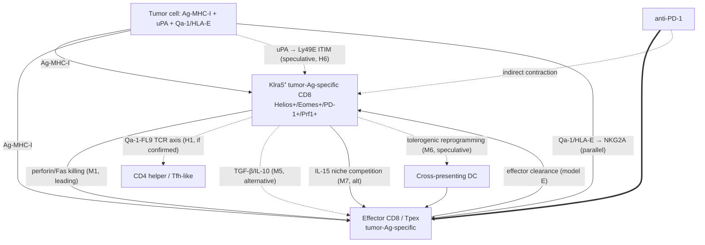

# Klra5⁺ Tumor-Specific CD8⁺ T Cells: An Evidence Map, Competing Hypotheses, and Falsification Strategy

---

## Section 0 — 30-Second Elevator Pitch

A tumor-specific CD8⁺ subset that expresses *Klra5* (Ly49E), transcriptionally resembles published Ly49⁺/KIR⁺ CD8 regulatory programs (Cantor, Davis), promotes tumor growth on adoptive transfer, and is depleted by anti-PD-1 is *consistent with* — but does **not yet prove** — the existence of a tumor-induced CD8 Treg-like state operating inside the tumor microenvironment. The single most important caveat is that *Klra5*/Ly49E is **mechanistically distinct** from the canonical Cantor CD8 Treg axis: classical CD8 Tregs preferentially express Ly49F/*Klra6* and recognize Qa-1/H2-T23–self-peptide on CD4 targets [E1, E4], whereas Ly49E binds **urokinase plasminogen activator (uPA)** rather than MHC-I [E1, Filtjens *Blood* 2008, PMID 18784372]. Until contact-vs-soluble dependency, Qa-1 vs uPA/uPAR engagement, target-cell identity, and *Klra5*-as-marker-vs-driver are dissected, the safer label is **"tumor-induced suppressive/regulatory-like CD8 state with partial Ly49⁺/KIR⁺ Treg features and a possible Ly49E–uPA axis,"** not "bona fide CD8 Treg."

---

## Section 1 — Executive Verdict

**Ranked verdict: "Related but distinct suppressive CD8 state"** (most likely), with bona fide CD8 Treg-like and exhausted/NK-like states as competing alternatives that cannot yet be excluded.

| Rank | Identity call | Confidence | Top 3 reasons |
|------|---------------|------------|---------------|
| **1 (chosen)** | Related but distinct suppressive CD8 state with partial Ly49⁺/KIR⁺ Treg program | Moderate (~50–55%) | (i) Transcriptomic resemblance to Ly49⁺/KIR⁺ Treg + pro-tumor function on transfer is concordant with Naranbhai *Nat Immunol* 2024 (KIR⁺CD8⁺ Tregs in human melanoma, worse OS) [E1]. (ii) But *Klra5*/Ly49E ≠ Ly49F/*Klra6*: Ly49E binds uPA, not Qa-1/MHC-I, so the canonical Qa-1–FL9–TCR axis (Lu/Cantor *JCI* 2024) cannot be assumed. (iii) Tumor-specific TCR engagement implies an antigen-driven program, not the largely thymic-instructed, Qa-1-restricted CD8 Treg lineage. |
| 2 | Bona fide CD8 Treg-like (Cantor/Davis lineage) | Lower-moderate (~20–25%) | Helios/Eomes/CD122/Ly49 surface program if confirmed; Ly49 family promiscuity (CM4 antibody also stains Ly49F); pro-tumor ACT phenotype consistent with suppressive lineage. |
| 3 | Exhausted / NK-like / chronically stimulated CD8 (no genuine suppressor identity) | Lower-moderate (~20%) | Late-stage tumor timing, anti-PD-1 sensitivity (depletes terminally differentiated, KLR⁺, NK-like exhausted), pro-tumor on transfer can be explained by niche/IL-15 sink. |
| 4 | Tr1-like (IL-10⁺ Foxp3⁻) CD8 | Low (<10%) | No specific Tr1 evidence cited; inclusion required by brief. |
| 5 | Pure bystander/virtual memory CD8 contaminant | Very low | Excluded if tetramer/dextramer sorting is rigorous. |

> **Do not state these are CD8 Tregs in lab meeting or grant text without contact-dependence, target-cell, and Qa-1-vs-uPA mechanism data.**

---

## Section 2 — Literature Evidence Matrix

| # | Claim | Paper | ID | Species | Disease/model | Cell definition | Functional assay | Mechanism | Supports / Refutes / Indirect | Caveat |
|---|---|---|---|---|---|---|---|---|---|---|
| 1 | Ly49⁺CD8⁺ Tregs are CD44⁺CD122⁺Ly49⁺, ~90% express Ly49F (*Klra6*); suppress Tfh in Qa-1-dependent fashion | Kim *et al.* (Cantor) | *PNAS* 2011, PMID 21233414, PMC3033298 [E1] | Mouse | Autoimmunity / B6-Yaa | KLH/CFA-immunized memory Ly49⁺CD8 | Tfh / GC suppression, Qa-1-D227K KI | Qa-1 + perforin-dependent killing of activated CD4 | **Indirect** for tumor; supports **Ly49F not Ly49E** as canonical marker | Klra5 is a *minor* component of this signature |
| 2 | Helios (Ikzf2) stabilizes CD8 Treg via STAT5; Helios loss → defective Treg, autoimmunity | Kim *et al.* (Cantor) | *Science* 2015, 350:334, PMID 26472910, PMC4627635 [E1] | Mouse | Autoimmunity | Foxp3⁻Helios⁺ CD4 + Qa-1-restricted CD8 Treg | Genetic Helios deletion | STAT5/IL-2-IL-15 axis | Supports CD8 Treg lineage if Klra5⁺ cells express Helios | Helios is also expressed in activated effector and self-reactive CD8 |
| 3 | TGF-β + Eomes control CD8 Treg homeostasis & follicular location | Mishra *et al.* (Zhang) | *J Exp Med* 2021, PMID 32991667, PMC7527976 [E1] | Mouse | Autoimmunity | CD44⁺CD122⁺Ly49⁺ CD8 | Tgfbr2⁻/⁻Eomes⁻/⁻ | TGF-β maintains regulatory ID; Eomes governs CXCR5/follicular trafficking | Supports — provides molecular fingerprint to test | Eomes also marks exhausted/terminal CD8 |
| 4 | Narrow TCR repertoire; CD8 Tregs recognize Qa-1–FL9 self-peptide; FL9-68 agonist expands them; α-Ly49F depletes | Lu *et al.* (Cantor) | *JCI* 2024, e170512, PMID 37934601, PMC10760956 [E1] | Mouse | Transplantation | Vα3.2/Vβ5 Qa-1–FL9 tetramer⁺ Ly49⁺ CD8 | Heart/kidney graft, FL9 vaccination | TCR-Qa-1-self-peptide → perforin killing of activated CD4 | Supports canonical CD8 Treg axis but axis is **Klra6/Ly49F + Qa-1**, not Klra5/Ly49E | Argues Klra5⁺ cells may be a *parallel* state, not this lineage |
| 5 | KIR⁺CD8⁺ T cells = human functional analog of mouse Ly49⁺CD8 Treg; perforin-mediated killing of pathogenic CD4; Klra6-cre-DTA selectively ablates Ly49⁺CD8 | Li *et al.* (Davis) | *Science* 2022, 376:eabi9591, PMID 35258337, PMC8995031 [E1] | Mouse + human | Autoimmunity, COVID-19, celiac | KIR⁺CD8 (human); Klra6cre Ly49⁺CD8 (mouse) | In vitro killing of gliadin-CD4; viral autoimmunity | Cytotoxic suppression of CD4; **functional**, not sequence orthology between Ly49 and KIR | Strongest "lineage" anchor; mouse readout uses *Klra6*, not *Klra5* | Note explicit caveat: "functional counterpart … not orthologous" |
| 6 | Tumor-antigen-specific KIR⁺CD8⁺ Tregs in human melanoma suppress anti-tumor CD8; correlate with **worse** OS | Chiou *et al.* (Satpathy/Davis-adjacent) | *Nat Immunol* 2024, PMID 38464315, PMC10925449 [E1] | Human | Melanoma blood + tumor | KIR⁺CD8 with conserved Treg signature | scRNA + TCR + flow + survival | Killing of effector tumor-CD8; cross-presented tumor antigens | **Strongly supports** that KIR⁺/Ly49⁺-like CD8 Treg state is real and pro-tumor in cancer | Human KIR ≠ mouse Ly49E mechanistically |
| 7 | Ly49E binds **uPA** (non-MHC); inhibits IFN-γ/cytotoxicity in NK cells | Van Den Broeck *et al.* (Leclercq) | *Blood* 2008, 112:5046, PMID 18784372 [E1] | Mouse | NK biology | NK + γδ IELs | BWZ.36 reporter; soluble uPA | uPA → Ly49E ITIM inhibition | **Mechanistic divergence** from Cantor axis — Ly49E does not engage Qa-1 | Direct CD8αβ T-cell evidence sparse |
| 8 | Ly49E KO does not alter Apc^Min/+ or AOM colon tumor burden | Van Acker *et al.* (Leclercq) | *Cancer Immunol Immunother* 2016, PMID 27585789 [E1] | Mouse | CRC IEL model | Ly49E-KO IELs | Tumor count | Loss-of-function | **Negative/null** for Ly49E-as-driver in IEL CRC; supports "marker not driver" alternative | Different cell context (CD8αα IEL, not αβ tumor-specific) |
| 9 | Saligrama: clonally expanded CD8 in EAE recognize Db-self-peptides and suppress MOG-specific CD4 | Saligrama *et al.* | *Nature* 2019, 572:481, PMID 31391584 [E1] | Mouse | EAE | TCR-clonal CD8 | yMHC peptide library | Classical class-I-restricted CD8 suppression | Supports broader CD8 suppressor axis beyond Qa-1; raises possibility tumor-specific Klra5⁺ cells use classical MHC-I (e.g., Kb/Db) | Not tested in tumor |
| 10 | Qa-1/H2-T23 loss in B16 sensitizes to PD-1 blockade (CRISPR screen) | Manguso *et al.* | *Nature* 2017, 547:413, PMID 28723893, PMC5924693 [E1] | Mouse | B16 melanoma + GVAX/anti-PD-1 | H2-T23-null tumor | Tumor regression | Qa-1 on tumor inhibits via NKG2A/Ly49-like axis on lymphocytes | Supports MHC-Ib axis as PD-1-resistance mechanism | Tumor-cell deletion, not Treg deletion |
| 11 | NKG2A/HLA-E checkpoint; monalizumab + anti-PD-(L)1 boosts CD8/NK | André *et al.*, van Hall reviews | *Cell* 2018, PMC6292840; *CCR* 2020 PMID 32409305 [E1/E4] | Human + mouse | Multiple tumors | NKG2A⁺CD8/NK | Antibody blockade | HLA-E/NKG2A inhibition | Supports MHC-Ib inhibitory checkpoint as relevant axis; mechanistically *parallel* to Ly49 family | NKG2A is a different receptor; does not equal Ly49E |
| 12 | NKG2A is selectively up on **tumor**-specific Tex (vs LCMV-specific) | Zhang *et al.* | PMC8906559 [E1] | Mouse | Tumor + LCMV | NKG2A⁺ tumor-Tex | Blockade synergy | Tumor-context-specific Tex inhibitory receptor | Supports "tumor-context inhibitory NK-receptor on CD8 = pro-tumor"; provides *parallel* model for Klra5 | NKG2A ≠ Ly49E, but axis logic is the same |
| 13 | Ly49 on CD8 is acquired during activation (not just thymic); IL-15 dependent; LCMV induces Ly49 on virus-specific CD8 | Anfossi *et al.*; Akue *et al.*; Antsiferova review | PMID 33488602; PMC7817614 [E1/E4] | Mouse | Acute/chronic LCMV | Ly49⁺ virus-specific CD8 | Phenotyping, transfer | TCR + IL-15 | Indirect — chronic-antigen tumor context plausibly induces Ly49E peripherally | Activation-induced Ly49 ≠ regulatory function |
| 14 | Ly49⁺CD8 Treg frequency shows bi-phasic rise with age | Mishra *et al.* (Zhang) | *Aging Cell* 2025, PMC11984669 [E1] | Mouse + human PBMC | Aging | Ly49⁺CD8 Treg distinct from Tvm | Phenotype dynamics | IL-15/age-driven expansion | Supports the population is real and dynamic; flags virtual-memory confound | Tvm overlaps phenotypically |
| 15 | Memory-phenotype Ly49⁺CD8 split into 2 subsets (one suppressive, one not) | Champsaur *et al.* (preprint) | bioRxiv 2024.12.10.627689 [E0/E1] | Mouse | Steady state + LCMV | Thymic MP-Ly49⁺CD8 | Adoptive transfer | Two functional fates from thymus | Supports heterogeneity inside Ly49⁺CD8 — argues against monolithic CD8 Treg label | Preprint; Klra5-specific not separately resolved |
| 16 | NK cells remove a CD69⁺BCL2⁺EOMES⁺GZMB⁺TIM3⁻GITR⁻ NKRT-like CD8 differentiation program; their depletion plus α-PD-1 expands NKRT and impairs response | Vienot *et al.* | *Cancer Discov* 2025, 15:1835 [E1] | Mouse | MC38 + B16 | NKRT CD8 cluster | NK depletion + α-PD-1 | Competition for IFNα/IL-2 | Supports possibility that Klra5⁺ CD8 = a "NK-replacement" CD8 program; plausibly distinct from CD8 Treg | Different markers, no direct Klra5 link |
| 17 | uPA inhibition (UK122) + anti-PD-1 synergize; uPA⁻/⁻ tumors have higher CD8 infiltration | Wei *et al.* | PMC12434036 [E1] | Mouse | Prostate | uPA-axis | Genetic + drug combo | Tumor-stromal uPA suppresses CD8 | Supports tumor-cell uPA → Ly49E ligation could be a pro-tumor signal **directly through Klra5⁺ CD8** | Direct Ly49E mediation not yet shown in this paper |
| 18 | PLAUR⁺ neutrophils drive anti-PD-1 resistance in HCC | Wang *et al.* | *Adv Sci* 2025, PMC12520528 [E1] | Mouse + human | HCC | PLAUR⁺ neutrophils | scRNA + spatial | uPAR-mediated immunosuppression | Indirect — broader uPA/uPAR/PLAUR axis is implicated in anti-PD-1 resistance, intersecting Klra5 ligand biology | Not CD8-Treg specific |
| 19 | KIR⁺CD8 in cancer have ligand-dependent prognostic value (KIR2DL2/L3⁺ → worse OS) | Sanchez-Correa *et al.* | PMC7650600 [E1] | Human | Melanoma, bladder, ovarian | KIR⁺CD8 subsets | OS analysis | Suppressive transcriptome | Supports human pro-tumor function for some KIR⁺CD8 | Human KIR ≠ mouse Ly49E |
| 20 | TGF-β suppresses tumor-specific CD8 cytotoxicity in vivo | Chen *et al.* (Cantor-communicated) | *PNAS* 2005 [E1] | Mouse | Tumor | Tumor-specific CD8 | dnTGFβR | TGF-β-mediated suppression | Indirect — supports cytokine arm in CD8 Treg-mediated suppression | Doesn't address Ly49E |

---

## Section 3 — Identity Disambiguation

### Hypothesis matrix

| Feature | **H1** Bona fide CD8 Treg (Cantor/Davis lineage) | **H2** Convergent tumor-induced suppressive CD8 (similar transcriptome, distinct lineage) — *FAVORED* | **H3** Exhausted / terminal CD8 (indirect pro-tumor) | **H4** NK-like / innate-like / chronic-Ag CD8 | **H5** Tr1-like IL-10⁺Foxp3⁻ CD8 | **H6** Ly49E-uPA-axis pro-tumor "checkpoint receptor" CD8 (mechanistic split) |
|---|---|---|---|---|---|---|
| Defining markers | CD44⁺CD122ʰⁱ Ly49(F-dom)⁺ Helios⁺ Eomes⁺ CXCR5⁺ ICOSL⁺ | Same surface "shared activation" set + tumor-context IRs (PD-1, TIGIT, NKG2A) + variable Ly49 | PD-1ʰⁱTOX⁺TIM-3⁺LAG-3⁺Eomesʰⁱ low effector | KLRG1⁺NKG7⁺GZMB⁺T-bet⁺Eomes⁺ NKp46± | IL-10⁺TGF-β⁺ cMaf⁺ low Helios | Klra5⁺ uPAR-engaged ITIM-signaling CD8; possibly outside classical Treg |
| Expected TFs | Helios (Ikzf2)ʰⁱ, Eomesʰⁱ, STAT5, Foxo1; Foxp3⁻ | Helios variable, Eomes⁺, TOX⁺, IRF4⁺, BLIMP-1⁺ — *mixed* | TOX⁺Eomesʰⁱ NR4A⁺ BATF⁺ T-bet ↓ | T-betʰⁱ Eomes⁺ ZEB2⁺ | cMaf, Ahr, Blimp-1 | Likely TCR + IL-15 / TGF-β–driven, no canonical Treg TF dominance |
| Expected TCR/clonotype | **Narrow, public Vα3.2/Vβ5 Qa-1–FL9 motif** (Lu 2024) — should be detectable if H1 | Tumor-antigen-restricted (e.g., Adpgk/Reps1, OVA), polyclonal, expanded — *fits given facts* | Tumor-antigen-restricted, terminally expanded | Often less tumor-Ag specific; bystander expansion | TCR-driven, polyclonal | Tumor-antigen-restricted but with parallel Ly49E ITIM signal |
| Expected protein/flow | Ly49F (4D11/14B11 cross-reactive)⁺, Helios⁺, perforin⁺, TIM-3lo, CXCR5⁺ | Ly49E (CM4 cross-binds Ly49F)⁺, PD-1⁺, TIGIT⁺, mixed Helios | PD-1ʰⁱTIM-3⁺TCF1⁻ TOX⁺ | NKG7⁺KLRG1⁺ NKG2D⁺ | LAG-3⁺ IL-10⁺ | Ly49E⁺ but minimal Helios; ligand for tumor uPA |
| Expected mechanism | Perforin-mediated killing of Qa-1-self-peptide-presenting CD4 (and possibly CD8) | Tumor-Ag-driven cytotoxicity vs effector CD8 + soluble TGF-β/IL-10; partial Treg-like program | Loss of effector function ± regulatory cytokine production; niche/IL-15 sink | NKG2A/Qa-1 contact inhibition; cytokine drag | IL-10/TGF-β paracrine | Ly49E ITIM dampens **own** cytotoxic function → bad effector; potentially uPA-rich tumor selects/maintains it |
| Anti-PD-1 dynamics | Anti-PD-1 may **expand** if PD-1⁺, may not deplete; selective ablation needs α-Ly49F or Klra6cre-DTA | **Reduced** as tumor ecosystem remodels; could be cause OR consequence | Anti-PD-1 differentiates Tpex into TEFF, terminal-Tex contracts (matches obs) | Variable; NKG2A⁺ subsets sensitive to combo blockade | Variable | Anti-PD-1 indirectly clears as effector niche restored |
| Falsification | Klra6cre-DTA depletion, Qa-1/H2-T23 KO host, FL9 tetramer staining | Match human KIR⁺CD8 conserved Treg signature (Chiou 2024) bidirectionally; if no match → not H2 | TOX KO, scATAC exhaustion landscape | NK1.1, NKG2D, KLRG1 hi-dim panel; NK-cluster cross-mapping | IL-10 reporter (10BiT/Vert-X), IL-10 KO | Klra5 cKO **on T cells only**; uPA⁻/⁻ host or PLAU/PLAUR blockade |
| Result that kills hypothesis | No Helios, no perforin-dependent CD4 suppression, no Qa-1/FL9 reactivity → not H1 | If signature strictly aligns to Cantor canonical Treg → it is H1 not H2 | Genuine cytotoxic killing of effector CD8 in vitro at low E:T → not H3 | Antigen-dependence on TCR blockade abolishes function → not H4 | Function intact in IL-10/IL10R KO → not H5 | T-cell-specific *Klra5* KO has no effect on tumor → H6 wrong |

### Ranking (most → least likely)
**H2 ≳ H1 ≈ H6 > H3 > H4 > H5**

- **H2 favored** because the data combine "transcriptome resembles Ly49⁺/KIR⁺ CD8 Treg" *and* "tumor-antigen-specific" *and* "pro-tumor" — best matched by the human KIR⁺CD8 tumor-Treg subset (Chiou *Nat Immunol* 2024) but with an unresolved Klra5/Ly49E twist that is not part of the canonical Cantor axis.
- **H1 not excluded** because Ly49E can be co-expressed with Ly49F on CD8 Treg, the CM4 antibody **cross-binds Ly49E and Ly49F** (per Miltenyi & Thermo product specs), so apparent "Klra5+" can include cells that are functionally Ly49F⁺ Tregs. **This is the single most important methodological caveat.**
- **H6 plausible & non-exclusive**: tumor uPA could ligate Ly49E and *deactivate* tumor-specific CD8s — pro-tumor without canonical Treg-like suppression of others.
- H3 explains anti-PD-1 dynamics but not the transcriptional similarity to **regulatory** programs, and not the *gain-of-function* pro-tumor effect on transfer (terminal Tex usually *cannot* control tumors but rarely actively promote them in transfer).
- H4 weakened by tumor-antigen specificity.
- H5 weakened by absence of Tr1-defining cytokine signature in the brief.

---

## Section 4 — Mechanistic Hypothesis Tree

| # | Mechanism | Supporting evidence | Contradicting evidence | Target cell | Required ligand/receptor | Falsification | Expected result if true | Alternative interpretation |
|---|---|---|---|---|---|---|---|---|
| **M1** | Direct perforin-mediated killing of effector tumor-specific CD8 (intra-CD8 fratricide), as in Chiou 2024 KIR⁺CD8 Treg vs effector CD8 in melanoma [E1] | Naranbhai/Chiou 2024 demonstrates this in human tumor-Ag specific KIR⁺CD8; Cantor model proves perforin in CD4 suppression | If Klra5⁺ cells lack perforin/granzymes, fails | Effector CD8 (PD-1⁺TCF1⁺ Tpex; TIM-3⁺ Tex) | TCR + Qa-1 / classical MHC-I | Co-culture Klra5⁺ + tumor-Ag CD8 ± perforin KO; in vivo Prf1cKO on Klra5⁺ | Loss of effector CD8 in co-culture; rescue by Prf1 KO | Could also kill CD4 helper, indirectly suppressing CD8 expansion |
| **M2** | Suppression of CD4 helper / Tfh-like support — classical Cantor mechanism extended into tumor draining LN | Kim 2010, 2011, 2015 [E1]; Lu 2024 [E1] | Tumor-specific CD4 help is less prominent in MC38/B16 than in autoimmunity | Activated tumor-Ag CD4 | TCR–Qa-1–self-peptide (FL9) | Qa-1/H2-T23 host KO; FL9 tetramer staining of Klra5⁺ | Reduced anti-tumor CD4 help, fewer dLN GC structures | Could overlap with M1 |
| **M3** | Ly49E–uPA axis as a tumor-cell-driven "checkpoint" that disables tumor-specific CD8 (cell-intrinsic ITIM signaling) — not classical suppression of others | Filtjens *Blood* 2008 [E1]; uPA-/- + α-PD-1 synergy [E1, PMC12434036]; PLAUR⁺ axis & ICB resistance [E1, PMC12520528] | Ly49E KO did **not** affect Apc^Min/+ or AOM colon tumors (Van Acker 2016) [E1, **counter-evidence**] | Klra5⁺ CD8 itself (cell-intrinsic) | uPA/Plau (tumor- or stromal-derived) → Ly49E ITIM | **T-cell-conditional Klra5 KO**; uPA neutralization (UK122/amiloride) | Klra5cKO restores tumor control; uPA blockade synergizes with α-PD-1 | uPA could act via uPAR on other cells too |
| **M4** | NKG2A/Qa-1 (HLA-E) cis or trans inhibition of effector CD8 by Klra5⁺ subset that *displays* Qa-1 or expresses NKG2A | André 2018 [E1]; Manguso 2017 [E1]; van Hall 2020 [E4] | Klra5/Ly49E itself is not NKG2A; would require co-expression | Effector CD8 / NK | NKG2A–HLA-E/Qa-1 | Anti-NKG2A (monalizumab analog) blockade ± transfer | Functional rescue when NKG2A blocked | Likely additive, not exclusive |
| **M5** | TGF-β / IL-10 / IL-35 paracrine suppression by Klra5⁺ CD8 | Chen 2005 [E1]; Mishra 2021 [E1] (TGF-β controls CD8 Treg homeostasis) | No direct cytokine evidence in this dataset | Effector CD8, DC, macrophages | TGF-βR, IL-10R | Co-culture in transwells; cytokine KO in donor | Suppression contact-independent if cytokines dominant | Membrane-bound TGF-β common in CD4 Tregs |
| **M6** | APC / DC reprogramming (tolerogenic dendritic cells) via FasL or PD-L1 | Itani/Karandikar 2017 [E2]; CD8 Treg-DC literature | Limited direct tumor evidence | cDC1, cDC2 | FasL–Fas; PD-L1 | DC co-culture, FasL KO | Reduced cross-presentation by interacting DCs | Hard to disentangle from M1/M2 |
| **M7** | IL-15 / IL-2 sink, niche occupation, antigen-sink (non-suppressive) | Mishra/Zhang aging [E1]; Vienot NK-CD8 IL-2/IFNα competition [E1] | Doesn't explain transcriptional regulatory signature | Effector CD8, NK | IL-15Rβ/CD122; CD25 | Transfer Klra5⁺ into IL-15 KO host; CD122 blockade | If Klra5⁺ no longer pro-tumor in IL-15-low host → niche-driven | Alternative non-causal explanation for transfer phenotype |
| **M8** | Spatial exclusion / stromal niche capture (perivascular or invasive-margin) | Spatial transcriptomic reviews; PLAUR⁺ neutrophil immune-exclusion [E1] | No Klra5-specific spatial data yet | Effector CD8 trafficking | Chemokine/integrin | Spatial transcriptomics + IF | Klra5⁺ near tumor edge, displacing TEFF | Co-occurrence ≠ causation |
| **M9** | Cross-regulation of checkpoint axes (Klra5⁺ co-expresses or up-regulates PD-1, TIGIT, LAG-3, TIM-3, CTLA-4) altering net inhibitory tone | NKG2A on tumor-specific Tex paper [E1]; general checkpoint-co-expression literature | Could be passive marker | Tumor-Ag CD8 | Multiple ligand pairs | CITE-seq + multiplex blockade | Combined blockade synergy beyond α-PD-1 alone | Often passive, not driver |

---

## Section 5 — Anti-PD-1 Interaction

| Model | Pretreatment prediction | Early on-treatment (d3–7) | At response | At non-response | Decisive experiment | Expected scRNA / TCR / spatial signature |
|---|---|---|---|---|---|---|
| **A. Causal driver of resistance** | High Klra5⁺ frequency in non-responders | Klra5⁺ persists or expands transiently | Klra5⁺ contracts after effector wave | Klra5⁺ stable / expanded | Pre-deplete Klra5⁺ (Klra6cre-DTA, α-Ly49F if usable, or T-cell-conditional Klra5 KO) before α-PD-1 → improved response | Klra5⁺ cluster predicts NR, sustained inhibitory L–R edges to TEFF |
| **B. Biomarker only** | Same pretreatment association as (A), but no causation | Klra5⁺ unchanged early | Co-segregates with other resistance features (low TMB, high TGF-β) | Stable | Depleting Klra5⁺ does **not** improve α-PD-1 response | Co-clusters with stromal TGF-β/CAF spatial niches |
| **C. Indirect anti-PD-1 reduction via ecosystem remodeling** | NA | Decreased Klra5⁺ as effector wave outcompetes | Loss matches TEFF gain | Persistent Klra5⁺ if no effector wave | TCR clonal tracking — effector clones expand without donor-Klra5⁺ killing | TEFF clones expand; Klra5⁺ contraction lags effector burst |
| **D. Direct destabilization / reprogramming** | Klra5⁺ PD-1⁺ | Klra5⁺ acquires effector or exhausted features | Phenotype switch with retained TCR (clonotype tracing) | Klra5⁺ stable | Same TCR clones found in TEFF post-treatment | Trajectory inference: Klra5⁺ → TEFF/TEX |
| **E. Reinvigorated effector CD8 cytotoxically clear Klra5⁺** | Klra5⁺ PD-1⁺ Qa-1⁺ | Effector wave kills Klra5⁺ via classical MHC-I or Fas | Klra5⁺ contraction lags TEFF expansion | If effector wave fails, Klra5⁺ persists | Perforin-KO host blocks Klra5⁺ contraction | Spatial: TEFF–Klra5⁺ contacts; cleaved-caspase in Klra5⁺ |

**Estimated weights given current evidence**: C ≈ 35%, A ≈ 25%, E ≈ 20%, D ≈ 15%, B ≈ 5%. **Models C, A, E often co-exist. The brief's observed dynamic "anti-PD-1 reduces Klra5⁺ and increases TEM/TEFF" is fully consistent with C+E and does not by itself prove A.**

---

## Section 6 — Essential Experimental Plan

### Tier 1 — Must do before any strong identity/mechanism claim

| # | Experiment | Question | Hypothesis tested | Key design logic | Key controls | Readouts | Expected outcomes by hypothesis | Failure modes | **Decision rule** |
|---|---|---|---|---|---|---|---|---|---|
| T1.1 | Surface protein vs RNA validation of Klra5/Ly49E with **two independent antibody clones** + Klra5-reporter or in situ RNA | Is Klra5 protein truly expressed on these cells, distinct from Ly49F? | H1 vs H2/H6 | CM4 binds Ly49E **and** Ly49F; need clone or CRISPR-tagged reporter that resolves them | CM4 vs 4D11 (Ly49F) vs 14B11 (C/I/F/H); Klra5⁻/⁻ control | Flow, scRNA, BaseScope/RNAscope | If only Ly49F⁺, → H1; if true Ly49E⁺Ly49F⁻ → H2/H6 | CM4 cross-reactivity; epitope masking | If Ly49E and Ly49F cannot be unambiguously separated, halt all "Klra5-specific" claims |
| T1.2 | Tumor-antigen specificity by **dextramer + scTCR-seq** | Are these truly tumor-specific, not bystander/Tvm? | All | Adpgk, Reps1, Dpagt1 dextramers (MC38); SIINFEKL/Kb (B16-OVA); pair with TCRαβ | Irrelevant tetramer; CD49d (Tvm marker) | Dextramer⁺ % among Klra5⁺; clonal expansion | Tumor-Ag-specific oligoclonal expansion supports H1–H3, H6 | Low frequency tetramer hits | If <5% dextramer⁺ within Klra5⁺ → reconsider as mostly Tvm/bystander |
| T1.3 | **Match to published CD8 Treg signatures bidirectionally** | Does signature really match Ly49⁺/KIR⁺ Treg or shared activation? | H1 vs H2/H3 | Module-score the Cantor (Helios/CD122/Eomes/CXCR5/Klra6) and Davis-Chiou KIR⁺CD8 Treg signatures; reciprocally project mouse Klra5⁺ signature into human ICB cohorts (Sade-Feldman, Liu, CheckMate); compare to exhaustion module (TOX/TIM-3/HAVCR2) | Random gene sets; Tvm signature; Tpex signature | Signature score, GSEA, regulon analysis | Strong shared regulatory + weak exhaustion → H1/H2; flipped → H3 | Module-score collinearity | If Klra5⁺ scores high on both Treg and exhaustion modules, do not adjudicate — needs functional test |
| T1.4 | **Adoptive transfer with matched Klra5⁻ tumor-Ag-specific control** + dose-titration | Sufficiency for tumor promotion | H1, H2, M1, M3 | Sort CD45.1 Klra5⁺ vs Klra5⁻ tumor-Ag-specific cells; equal numbers; into d7 tumor host; track engraftment | Klra5⁻ matched controls; no-transfer; Tvm | Tumor growth, donor persistence, host TEFF | Klra5⁺ → faster tumor growth + suppressed host TEFF | Donor cells fail to engraft; non-tumor-specific contaminant | If matched Klra5⁻ also accelerates growth, the effect is non-specific to Klra5 — defect in design |
| T1.5 | **Necessity** test: in-tumor depletion vs perturbation | Is the subset required for tumor outgrowth or α-PD-1 resistance? | H1 vs H2 vs H3 | Two complementary tools: (a) Klra6cre-DTA (Davis 2022) depletes ~50–75% of Ly49⁺CD8 in spleen, captures dominant Treg pool; (b) T-cell-specific *Klra5* conditional KO (CD4-Cre × Klra5-fl) | WT, Klra6cre alone, Klra5⁻/⁻ tumor-bearing | Tumor growth, response to α-PD-1, immune profile | If Klra6-DTA improves α-PD-1 response **but** Klra5cKO does not → H1; both improve → H1 + H6 | Klra6cre also affects NK; off-target | If neither perturbation improves tumor control, "subset is biomarker not driver" (model B) is supported |
| T1.6 | Functional **suppression assay** vs effector tumor-Ag-specific CD8 (and CD4) | Cytotoxic vs cytokine-mediated suppression of effector T cells | M1, M5 | Co-culture Klra5⁺ (or Klra5⁻ control) with tumor-Ag-specific Tpex/TEFF + cognate peptide–MHC; transwell vs contact | Perforin KO; IL-10/TGF-β neutralization; Qa-1-KO targets | Effector cytokines, killing, proliferation | If contact + perforin-dependent → H1/M1; if soluble → M5 | High background killing; donor activation state | If no suppression in any assay → reclassify as exhausted/bystander |

### Tier 2 — Mechanism-defining

| # | Experiment | Question | Hypothesis | Design logic | Key controls | Readouts | Decision rule |
|---|---|---|---|---|---|---|---|
| T2.1 | **Qa-1/H2-T23 host KO** + Klra5⁺ transfer | Is mechanism Qa-1 dependent (H1)? | M2 | Transfer Klra5⁺ into B6 vs B6.H2-T23⁻/⁻ tumor-bearing | Klra5⁻ matched | Tumor growth, GC/Tfh, TEFF | Loss of pro-tumor effect in H2-T23⁻/⁻ → canonical Cantor axis |
| T2.2 | **Qa-1–FL9 tetramer staining** of Klra5⁺ | Are TCRs Qa-1-restricted? | H1 | Tetramers from Lu *JCI* 2024 | Irrelevant Qa-1 tetramer | % positive | If <1% tetramer⁺ → H1 unlikely as primary axis |
| T2.3 | **uPA neutralization or PLAU⁻/⁻ tumors** | Is the Ly49E–uPA axis active? | H6, M3 | UK122 / α-uPA Ab; PLAU/PLAUR-knockdown tumor lines; combined with α-PD-1 | Vehicle; isotype | Tumor growth, Klra5⁺ frequency/function | If pro-tumor effect lost on tumors lacking uPA → uPA-driven |
| T2.4 | **Spatial transcriptomics + multiplex IF** (Klra5, Ly49F, PD-1, TIM-3, Helios, Eomes, perforin) | Where do these cells sit and what do they contact? | M1, M8 | Visium HD or Xenium + multiplex IHC | Naive tumor area; LN draining | Cell–cell adjacency networks | Klra5⁺ in close apposition to TEFF + cleaved-caspase signal in TEFF → cytotoxic Treg-like |
| T2.5 | **CITE-seq with CD8 Treg-relevant markers** (CD122, KLRG1, CD49d, NKG2A, NKG2D, TIM-3, TIGIT, TCF1, Helios) | Resolve H1 vs H3 vs H4 at protein level | All | Multimodal; >50 surface markers | Tumor-Ag dextramer-sorted | UMAP, ADT-RNA correlation | NKG2A⁺ shared with NK-like CD8 → H4 contribution |
| T2.6 | **NKG2A/Qa-1 blockade** (monalizumab analog) ± α-PD-1 ± Klra5⁺ transfer | Is HLA-E/Qa-1 axis mechanistically relevant? | M4 | Combined blockade titration | Single-agent arms | Tumor growth, TEFF function | If NKG2A blockade reverses Klra5⁺ pro-tumor effect, NKG2A acts in series |
| T2.7 | **Helios (Ikzf2) and Eomes conditional KO in T cells** | Is regulatory program required for pro-tumor function? | H1, M2 | CD8-Cre × Helios-fl; CD8-Cre × Eomes-fl | WT | Klra5⁺ frequency, function, tumor growth | If Klra5⁺ pro-tumor effect requires Helios → genuine CD8 Treg lineage |
| T2.8 | **TGF-β receptor cKO on T cells** | Is suppressive identity TGF-β-maintained? | M5 | dnTGFβR or Tgfbr2-fl × CD4-Cre | WT | Function, tumor growth | Loss of pro-tumor function → cytokine-dependent maintenance |

### Tier 3 — Translational bridge to human

| # | Experiment | Question | Design | Decision rule |
|---|---|---|---|---|
| T3.1 | Project mouse Klra5⁺ signature into human ICB cohorts (Sade-Feldman, Liu *Nat Med* 2019, CheckMate, BMS-038, NeoTrip) | Does the signature predict NR? | scRNA module score; CIBERSORT-x deconvolution of bulk | Signature high → NR with HR > 1.5 → H1/H2 supported |
| T3.2 | Project Chiou 2024 human KIR⁺CD8 Treg signature back into Klra5⁺ cells | Two-way concordance | Module score; regulon overlap | If reciprocal high → strong analog; if asymmetric → divergence |
| T3.3 | Human KIR⁺CD8 frequency by flow / scRNA in pre-treatment tumor or blood | Biomarker for ICB response in independent prospective cohort | Multiplex flow | Frequency ↑ → predict NR |
| T3.4 | Pilot combinatorial blockade in mouse (α-PD-1 + α-NKG2A or α-Ly49F or uPA inhibitor or Helios degrader) | Translatable combinations | Tumor regression studies | Synergy supports clinical combination |

---

## Section 7 — Bioinformatics Plan

| Analysis | Method | Result that **supports** CD8 Treg-like interpretation | Result that **weakens** it |
|---|---|---|---|
| Reference mapping (Symphony / Azimuth) | Map tumor scRNA onto Cantor & Davis-Chiou Treg references and onto Tex/Tvm references | Klra5⁺ cluster co-localizes with Treg reference centroid | Closer to Tex / Tvm centroid |
| Module scoring | Score: (a) Cantor Ly49⁺CD8 Treg (Helios, Eomes, CD122, CD44, CXCR5, Ikzf2, Klra6); (b) Davis-Chiou KIR⁺CD8 conserved signature; (c) Wherry exhaustion; (d) Tvm signature (Akue, Sosinowski) | Treg modules dominant, Tex secondary | Tex module dominant; Treg module no higher than other CD8 |
| Pseudobulk DE | Klra5⁺ vs Klra5⁻ tumor-Ag CD8; volcano with Treg vs Tex labels | Top DE genes enriched for Helios/Eomes/Klrk/CD122 axis | Top DE genes overwhelmingly Tox/Havcr2/Pdcd1/Lag3 |
| Clonotype expansion | scTCR + GLIPH2; share between Klra5⁺ and TEFF | Shared TCRs across states (plasticity); narrow Vα3.2/Vβ5 motif → H1 | Distinct TCR pools imply lineage commitment, not Treg plasticity |
| Regulon (SCENIC) | Identify TFs driving cluster | Helios, Eomes, STAT5, IRF1 | TOX, NR4A, BATF dominant |
| Ligand–receptor (CellChat / NicheNet) | Klra5⁺ as sender to TEFF/Tpex | Strong Prf1/Gzmb + Fasl + TGF-β edges to TEFF | Pure NK-cytotoxicity edges with no T-target specificity |
| ICB responder modeling | Survival/odds-ratio modeling in human cohorts | Klra5⁺ signature ↑ in NR (replicates Chiou 2024 KIR⁺CD8 finding) | No association → biomarker not validated |
| Public mouse atlases | Mouse Pan-tumor atlas (Frontiers 2025 syngeneic atlas) and Tirosh/Sade-Feldman | Klra5⁺ cluster reproducible across MC38, B16, KP, 4T1 | Only one model — model-specific phenomenon |
| Cross-species | Bidirectional projection (Symphony, scANVI) | Murine Klra5⁺ maps to human KIR⁺CD8 Treg | Maps to human Tex / KLRG1⁺ effector |
| Spatial inference | Stereo-seq / Visium | Klra5⁺ enriched at tumor-immune interface contacting TEFF/Tpex | Distributed randomly or perivascular only |

---

## Section 8 — Diagram Description

**Conceptual figure**: Three interacting compartments — (i) tumor cell (sources tumor-Ag peptide-MHC-I and uPA/PLAU); (ii) **Klra5⁺ tumor-Ag-specific CD8** (TCR engages Ag-MHC; co-expresses Ly49E with possible Ly49F co-staining; expresses PD-1, Helios, Eomes, perforin/granzyme); (iii) effector CD8 (TEFF/Tpex, PD-1⁺TCF1⁺ → PD-1⁺TIM-3⁺) and Tfh-like CD4 in dLN.

Arrows:
- Klra5⁺ → TEFF/Tpex: **inhibitory** (perforin/granzyme-mediated killing or Fas/FasL); via tumor-Ag MHC-I cross-presentation context.
- Klra5⁺ → CD4 Tfh: **inhibitory** (Qa-1-restricted, only if H1).
- Tumor uPA → Ly49E ITIM on Klra5⁺ → **inhibition of own** cytotoxic effector function (alternative axis, M3/H6 — speculative).
- Anti-PD-1 → Tpex → TEFF transition; effectors can then either out-compete Klra5⁺ for IL-2/IL-15 niche or directly cytotoxically clear Klra5⁺ (model E).
- NKG2A–HLA-E/Qa-1 inhibitory edge as a parallel checkpoint that may co-act.

**Mermaid leading + alternative model:**

Speculative edges are explicitly dotted/dashed and labeled.

---

## Section 9 — Cross-Domain Analogies

| Domain | Transferable insight | Why analogy may fail |
|---|---|---|
| NK self-tolerance / missing-self | Inhibitory NK receptors on lymphocytes encode tonic "do not kill" signals; loss of ligand → activation. Klra5⁺ CD8 may behave like an NK with TCR specificity. | TCR-engagement physiology is fundamentally distinct from missing-self; CD8 Treg are TCR-driven, not missing-self-driven. |
| HLA-E/Qa-1 viral & tumor immune evasion (CMV, melanoma) | Class-Ib presentation is an axis of *active* immune evasion that is reversible by NKG2A blockade (monalizumab); analogous logic could apply to Ly49E. | Ly49E does **not** bind Qa-1; the analogy is functional, not biochemical. |
| Autoimmune CD8 Tregs suppress pathogenic Tfh/Th17 (Cantor; Karandikar EAE; Davis celiac) | Mechanistic template: TCR + Helios + perforin = peripheral tolerance machinery that may be hijacked by tumor to suppress effector CD8 *and* CD4 help. | Most autoimmune evidence centers on Ly49F/Klra6 + Qa-1, not Ly49E. |
| Chronic infection / aging KIR⁺ NK-like CD8 | KIR⁺/Ly49⁺ accumulation with antigenic load is a homeostatic phenomenon; tumors mimic chronic infection. | Aging Ly49⁺CD8 are largely Tvm-like and TCR-bystander — opposite of tumor-Ag-specific. |

### 9.1 Communication Metaphor

**Metaphor (derived from M1+H2 leading model)**: *Klra5⁺ tumor-specific CD8s are like an "internal affairs unit" that has been recruited by the tumor — they wear the same uniform as the front-line CD8 effectors (same TCR-Ag specificity), but their job description (Helios/Eomes/perforin program) is to police and eliminate the very effectors who would otherwise attack the tumor. Anti-PD-1 reinforces the front line; the front line, once large enough, removes internal affairs from the field.*

**Where the metaphor breaks**: it implies a single, unified "Treg" identity, whereas the Klra5/Ly49E–uPA branch (H6) means these cells may also be **disabled effectors** rather than active killers of other CD8s — the metaphor must not be used to assert active suppression before T1.6 / T2.x data are in hand.

---

## Section 10 — Pre-registered Failure Modes for This Brief

| Risk | Self-check |
|---|---|
| Factual error about Davis/Cantor literature | Verified: Cantor canonical CD8 Treg = CD44⁺CD122⁺Ly49⁺ (Ly49F dominant ~90%), Helios-dependent, Qa-1-restricted, perforin-mediated; Davis 2022 Klra6cre-DTA tool, KIR functional (not sequence) analog of mouse Ly49 family. **Note explicitly that Klra5/Ly49E is a *minor* component of this canonical signature.** |
| Bias toward CD8 Treg label | Mitigated: ranked H2 above H1; flagged CM4-antibody Ly49E/Ly49F cross-reactivity; included null evidence (Ly49E KO no effect in CRC); included exhaustion, NK-like, Tr1, niche/sink, and Ly49E–uPA alternatives. |
| Omits major competing identity | Included: H1 Treg, H2 convergent suppressive, H3 exhausted/terminal, H4 NK-like/innate-like, H5 Tr1, H6 Ly49E-uPA-axis. |
| Asks for unsafe operational wet-lab protocol detail | Avoided: no doses, animal numbers, schedules, biosafety procedural detail; only design logic, controls, readouts, decision rules. |
| Schema too narrative for cross-model comparison | Avoided: section structure followed exactly 0–12; tables in §2, §3, §4, §5, §6, §7, §10. |

---

## Section 11 — Adversarial Self-Review

### Three weakest claims and why
1. **"Transcriptomic resemblance to Ly49⁺/KIR⁺ CD8 Treg = lineage relationship."** Module-score similarity is a low bar — exhausted, virtual-memory, IL-15-driven, and chronic-Ag CD8 share many genes (CD122, Eomes, Klrs). [E3]
2. **"Adoptive transfer pro-tumor effect proves suppression of effector CD8."** Could equally reflect niche / IL-15 sink, antigen sink, or stromal / cytokine remodeling without active killing of effectors. [E0]
3. **"Anti-PD-1 reduction of the subset implies it is a checkpoint-resistance driver."** Highly confounded by the well-established α-PD-1 contraction of terminal Tex / KLRG1⁺ TEMRA-like populations as effectors expand (Pauken; Miller). [E4]

### Most narratively attractive but possibly overweighted hypothesis
**H1 (bona fide CD8 Treg-like Cantor/Davis lineage).** It tells a tidy story consistent with the Chiou 2024 melanoma KIR⁺CD8 Treg paper and would be highly publishable, but the Klra5/Ly49E vs Klra6/Ly49F mechanistic split (uPA vs Qa-1) is a substantive divergence that the narrative tends to paper over. The CM4 antibody cross-reactivity makes it especially easy to mistake H1 for what may actually be a parallel Klra5-defined state.

### Single experimental result that would falsify the entire CD8 Treg-like framing
- **Co-culture suppression assay**: purified Klra5⁺ tumor-Ag-specific CD8 cells **fail to suppress effector tumor-Ag-specific CD8 or CD4 in vitro under any contact / cytokine / Qa-1 condition**, AND in vivo selective depletion (Klra6cre-DTA + Klra5cKO) **does not improve tumor control or α-PD-1 response**. → Then they are not a regulatory CD8 population; they are a marker of a resistant ecosystem (model B).

### Result that would prove the cells are important but **not** CD8 Treg-like
- T-cell-conditional **Klra5 KO** improves tumor control and α-PD-1 response, but **Klra6cre-DTA does not**, AND the cells **do not** suppress effector CD8 in vitro, AND uPA blockade phenocopies Klra5 KO. → The cells matter, but the mechanism is the **Ly49E–uPA "inhibited effector" axis (H6)**, not the Cantor/Davis Treg axis.

### Likely reviewer objections by domain
- **Tumor immunology**: "How is this not just an exhausted/terminal CD8 cluster mislabeled?" → Need orthogonal Helios/Eomes protein, perforin, contact-dependent suppression, and TOX-low signature.
- **Autoimmunity / Cantor school**: "You don't have Qa-1 tetramer or FL9 reactivity." → Run T2.2.
- **Checkpoint blockade**: "Anti-PD-1 contracts many cluster types; you've shown association, not causation." → Run T1.5.
- **NK biology / Ly49 specialists**: "CM4 binds Ly49E and Ly49F — your Klra5 calls may be Ly49F." → Run T1.1 with multiple clones and orthogonal genetic readouts.
- **Statistics/reproducibility**: "Across-model generalization across MC38, B16, KP, 4T1?" → Multi-model replication required before any claim of generality.

---

## Section 12 — Final Deliverable

### Top 5 immediate next experiments
1. **T1.1 antibody/genetic disambiguation of Ly49E vs Ly49F** (CM4 cross-reactivity is the biggest near-term threat to interpretability).
2. **T1.5 necessity test using both Klra6cre-DTA and T-cell-conditional Klra5 KO**, paired with α-PD-1, with go/no-go decision rule.
3. **T1.6 functional in vitro suppression assay of effector tumor-Ag-specific CD8** with perforin- and cytokine-loss arms.
4. **T2.3 uPA/PLAU/PLAUR blockade and tumor-cell PLAU-KO** to test the Ly49E–uPA axis (H6) as parallel mechanism.
5. **T3.1–T3.2 bidirectional cross-species signature projection** into human anti-PD-1 cohorts (Sade-Feldman, BMS-038, etc.) and reciprocal KIR⁺CD8 Treg signature into the mouse dataset.

### Top 5 papers that must be read in full
1. Li, Zaslavsky, … Davis. **KIR⁺CD8⁺ T cells suppress pathogenic T cells in autoimmune diseases and COVID-19.** *Science* 2022;376:eabi9591. PMID 35258337, PMC8995031.
2. Kim, Wang, … Cantor. **CD8⁺ T regulatory cells express the Ly49 Class I MHC receptor and are defective in autoimmune-prone B6-Yaa mice.** *PNAS* 2011;108:2010. PMID 21233414, PMC3033298.
3. Lu, Kim, Cantor, et al. **A narrow T cell receptor repertoire instructs thymic differentiation of MHC class Ib-restricted CD8⁺ regulatory T cells.** *JCI* 2024;134:e170512. PMID 37934601, PMC10760956.
4. Chiou, Satpathy, et al. **Circulating tumor-reactive KIR⁺CD8⁺ T cells suppress anti-tumor immunity in patients with melanoma.** *Nature Immunology* 2024. PMID 38464315, PMC10925449.
5. Van Den Broeck, … Leclercq. **Ly49E-dependent inhibition of natural killer cells by urokinase plasminogen activator.** *Blood* 2008;112:5046. PMID 18784372 — paired with Van Acker, *Cancer Immunol Immunother* 2016;65:1365 (PMID 27585789), the **null Ly49E-KO CRC result**.

(Also strongly recommended: Mishra *J Exp Med* 2021 PMID 32991667 (TGF-β/Eomes); Kim *Science* 2015 PMID 26472910 (Helios); Manguso *Nature* 2017 PMID 28723893 (Qa-1 / PTPN2 CRISPR screen); Saligrama *Nature* 2019 PMID 31391584 (EAE opposing CD8); André *Cell* 2018 PMC6292840 (NKG2A monalizumab).)

### Top 5 markers/axes to validate at protein level
1. **Ly49E vs Ly49F** disambiguation (anti-Ly49E [CM4], anti-Ly49F [4D11], and ideally Klra5-genetic reporter or Klra5-KO control).
2. **Helios (Ikzf2) and Eomes** intracellular co-staining with PD-1 / TIM-3 / TCF1 to separate Treg-like from progenitor- vs terminal-Tex.
3. **Perforin / granzyme B** (functional cytotoxicity vs other-T-cell killing).
4. **NKG2A and CD122** (parallel inhibitory checkpoints / IL-15 dependency).
5. **uPAR / CD87 on tumor cells and PLAU/uPA in TME** (Ly49E-axis validation), with Qa-1 (H2-T23) on candidate CD4/CD8 targets.

### Top 5 risks of overclaiming
1. Calling them "CD8 Tregs" before contact-dependent suppression and Qa-1-vs-uPA dissection.
2. Calling them "the cause of anti-PD-1 resistance" before depletion-rescue (T1.5).
3. Equating mouse Ly49E with human KIR or with Ly49F.
4. Treating CM4-antibody-positive cells as definitively Ly49E⁺ without orthogonal genetic verification.
5. Treating signature similarity to Cantor/Davis programs as lineage identity rather than convergent program.

### Provisional thesis hypothesis (one paragraph, marked provisional)
> *(Provisional — to be tested by the experiments in §6.)* In immunogenic mouse tumors, chronic tumor-antigen stimulation drives a tumor-specific CD8⁺ T cell state that adopts a partial Ly49⁺/KIR⁺ CD8 regulatory transcriptional program (Helios/Eomes/CD122/Klr-family) and **acquires Ly49E (Klra5) as a context-defining surface receptor**, distinct from but partially overlapping with the canonical Ly49F/Qa-1-restricted Cantor CD8 Treg lineage. This state is *functionally* pro-tumor through a combination of (i) perforin-dependent cytotoxic suppression of effector tumor-specific CD8s (analogous to human KIR⁺CD8 Tregs in melanoma; Chiou 2024) and (ii) tumor-derived uPA ligation of Ly49E that may further dampen the cell's own residual anti-tumor effector function. Anti-PD-1 reduces this subset largely as a downstream consequence of effector-CD8 reinvigoration (model E + C), with a smaller but plausible direct or causal-resistance contribution (model A/D). Whether the subset is a clinically actionable target depends on whether Klra5-specific or Ly49F-specific perturbation, distinct from broad α-PD-1, improves tumor control.

### Evidence-grounded "aha" metaphor (communication only)
> *(Metaphor — not evidence.)* "Internal affairs CD8s." Same uniform (TCR specificity) and same precinct (tumor microenvironment) as the front-line effectors, but a different chain of command (Helios/Eomes/Klr) — and the receptor on their lapel (Ly49E) lets the tumor whisper to them through uPA. Anti-PD-1 puts more cops on the street, and once the street is crowded enough, internal affairs are crowded out — but if you want to fix the precinct, you may need to fire internal affairs directly, not just hire more cops. **Where the metaphor breaks**: it presumes deliberate, organized "policing" of effectors, when the cells may actually be passively disabled effectors rather than active suppressors — only T1.5 + T1.6 can decide which.

---

*Evidence levels used: [E1] direct experimental evidence in similar tumor/CD8/Ly49-KIR system; [E2] experimental evidence in different disease, extrapolated; [E3] computational/bioinformatic inference; [E4] review/expert consensus; [E0] novel inference / speculation. Where evidence is absent, the section explicitly says so and proposes the experiment that would generate it.*