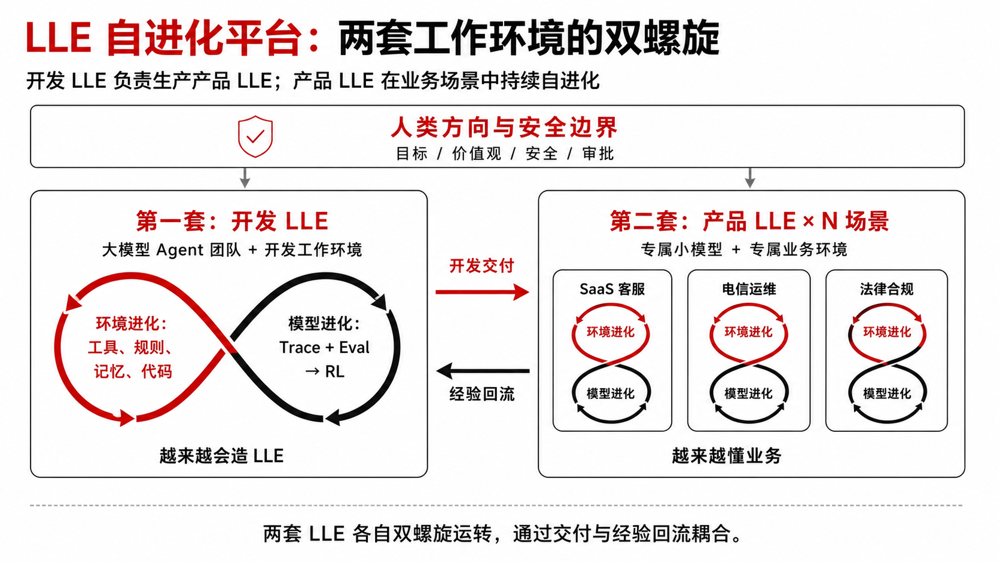
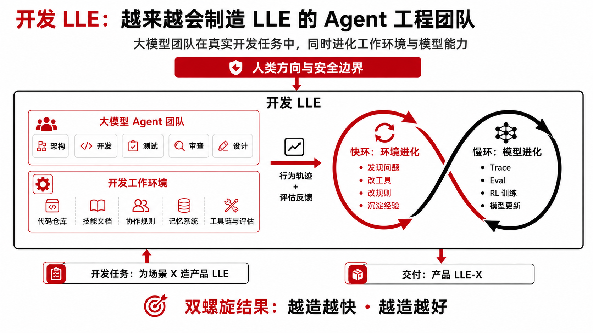
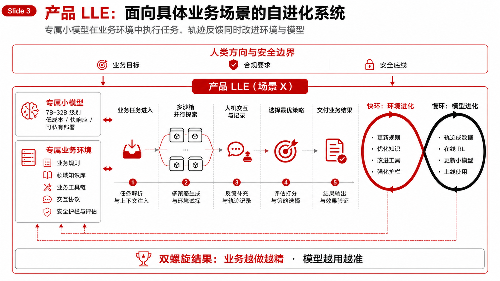

# LLE 自进化平台 — 架构图 v2

> **主标题**：不是只使用 Agent，而是让 Agent 工作的环境和模型同时被训练、被继承、被进化。
>
> **受众**：华为总裁级 idea 路演。零黑话，画完整技术蓝图。
>
> **核心结构**：两套独立的 LLE，各自运转双螺旋（环境进化 + 模型进化），通过"开发/交付 + 经验回流"耦合。

---

## 精美图产物（原生 imagegen 直出）

> 生成方式：砚砚使用原生 imagegen 生成 raster PNG；未使用 SVG/HTML 手工合成。

| 图 | 文件 | 用途 |
|---|---|---|
| 总览图 | [`assets/lle-overview-huawei-style.png`](assets/lle-overview-huawei-style.png) | PPT 主页 / 一张图讲清两套 LLE |
| 开发 LLE 详图 | [`assets/lle-development-detail-huawei-style.png`](assets/lle-development-detail-huawei-style.png) | 讲开发 LLE 如何越造越快 |
| 产品 LLE 详图 | [`assets/lle-product-detail-huawei-style.png`](assets/lle-product-detail-huawei-style.png) | 讲产品 LLE 如何在业务场景中自进化 |

### 总览图



### 开发 LLE 详图



### 产品 LLE 详图



---

## 总览图：两套 LLE 的全景

```
 ┌═══════════════════════════════════════════════════════════════════════════┐
 ║                     人类方向与安全边界                                      ║
 ║              目标 / 价值观 / 不可逆操作审批 / 紧急制动                        ║
 └═══════════════════════╤═══════════════════════════╤═══════════════════════┘
                         │                           │
                         ▼                           ▼
 ┌───────────────────────────────────┐   ┌───────────────────────────────────┐
 │                                   │   │                                   │
 │   第一套：开发 LLE                 │   │   第二套：产品 LLE（× N 个场景）    │
 │   （Agent 工程团队 + 开发环境）     │   │   （专属小模型 + 专属业务环境）      │
 │                                   │   │                                   │
 │   大模型 coding agent              │   │   SaaS / 电信 / 法律 / 金融 / ...  │
 │   + 成熟的开发工作环境              │   │   每个场景一套独立的产品 LLE         │
 │                                   │──▶│                                   │
 │   任务：为不同场景开发              │开发│   任务：在具体场景中                 │
 │   专属的产品 LLE                   │交付│   执行业务任务                      │
 │                                   │   │                                   │
 │   ╭─ 快环 ─╮   ╭─ 慢环 ─╮        │   │   ╭─ 快环 ─╮   ╭─ 慢环 ─╮        │
 │   │ 环境   │   │ 模型   │        │   │   │ 环境   │   │ 模型   │        │
 │   │ 进化   │⟺│ 进化   │        │   │   │ 进化   │⟺│ 进化   │        │
 │   ╰────────╯   ╰────────╯        │   │   ╰────────╯   ╰────────╯        │
 │                                   │   │                                   │
 │   双螺旋：越来越会造 LLE           │   │   双螺旋：越来越懂业务              │
 │                                   │◀──│                                   │
 └───────────────────────────────────┘经验 └───────────────────────────────────┘
                                      回流
```

---

## 图 1：开发 LLE 的双螺旋（详细版）

> **第一套 LLE = Agent 工程团队的工作环境。**
> 产出不是业务结果，而是**另一套 LLE**。自身也在持续进化。

```
                    人类方向与安全边界
               愿景目标 / 架构决策 / 安全底线
                          │
                          ▼
  ┌────────────────────────────────────────────────────┐
  │                 开发 LLE                            │
  │                                                    │
  │  ┌─ 大模型 Agent 团队 ─────────────────────────┐   │
  │  │  多个大模型（多厂商）协作                     │   │
  │  │  角色：架构 / 开发 / 测试 / 审查 / 设计       │   │
  │  └─────────────────────────────────────────────┘   │
  │                                                    │
  │  ┌─ 开发工作环境（可进化组件）─────────────────┐   │
  │  │  代码仓库 + 版本控制 + CI/CD                 │   │
  │  │  技能文档 + 协作规则 + 审查协议               │   │
  │  │  记忆系统（经验教训 / 决策历史 / 知识库）     │   │
  │  │  工具链（MCP / 开发工具 / 沙箱 / 测试框架）   │   │
  │  │  评估体系（Eval / 质量门禁 / 可观测性）       │   │
  │  └─────────────────────────────────────────────┘   │
  │                                                    │
  └───────────────────────┬────────────────────────────┘
                          │
              ┌───────────┴───────────┐
              ▼                       ▼
      开发任务执行                  产出交付
      （为场景 X 造 LLE）          （产品 LLE-X）
              │
              ▼
      行为轨迹 + 评估反馈
      （开发过程的 trace + eval）
              │
    ┌─────────┴──────────┐
    ▼                     ▼
┌────────────┐     ┌─────────────┐
│快环：环境进化│     │慢环：模型进化 │
│            │     │             │
│ 发现开发中  │     │ 轨迹汇聚为   │
│ 的问题和模式│     │ 训练数据集   │
│            │     │             │
│ Agent 自己  │     │ 强化学习     │
│ 修改开发环境│     │ 更新大模型   │
│ 写代码改进  │     │ 更会 coding  │
│ 工具和规则  │     │ 更会造 LLE   │
│            │     │             │
│ 沉淀为可复用│     │ 训练后的模型 │
│ 开发模式   │     │ 直接上线使用 │
└─────┬──────┘     └──────┬──────┘
      │                    │
      └──── 螺旋上升 ──────┘
           越造越快 · 越造越好
```

### 开发 LLE 要点

| 组件 | 说明 |
|---|---|
| **大模型 Agent 团队** | 多厂商大模型协作（如 Claude + GPT + Gemini）。负责开发产品 LLE |
| **开发工作环境** | Agent 的完整开发空间。所有组件都可以被 Agent 自己修改和进化 |
| **快环：环境进化** | 开发过程中发现问题 → Agent 自己修改工具/规则/记忆/代码 → 开发能力提升。**环境由 Agent 自己编写和维护** |
| **慢环：模型进化** | 开发过程的 trace + eval → RL 训练 → 大模型更会 coding、更会造 LLE |
| **产出** | 面向具体场景的产品 LLE（第二套） |

---

## 图 2：产品 LLE 的双螺旋（详细版）

> **第二套 LLE = 面向具体业务场景的专属环境。**
> 由开发 LLE 造出来，之后独立运转自己的双螺旋。

```
                    人类方向与安全边界
               业务目标 / 合规要求 / 安全底线
                          │
                          ▼
  ┌────────────────────────────────────────────────────┐
  │              产品 LLE（场景 X）                      │
  │                                                    │
  │  ┌─ 专属模型 ──────────────────────────────────┐   │
  │  │  针对该场景微调/RL 训练的小模型               │   │
  │  │  （7B-32B 级别，成本低，响应快）              │   │
  │  └─────────────────────────────────────────────┘   │
  │                                                    │
  │  ┌─ 专属业务环境（可进化组件）─────────────────┐   │
  │  │  业务规则 + 领域知识库 + 业务工具链           │   │
  │  │  场景专属记忆（客户历史 / 案例库 / FAQ）      │   │
  │  │  交互协议（人机协作 / 审批流程 / 上下游接口） │   │
  │  │  安全护栏（合规检查 / 敏感操作拦截）          │   │
  │  │  评估体系（任务成功率 / 客户满意度 / 成本）   │   │
  │  └─────────────────────────────────────────────┘   │
  │                                                    │
  └───────────────────────┬────────────────────────────┘
                          │
                 执行业务任务
          （多沙箱并行探索不同策略）
                          │
                          ▼
              业务轨迹 + 测试集 + 反馈
              （每次任务执行的副产品）
                          │
            ┌─────────────┴─────────────┐
            ▼                            ▼
     ┌─────────────┐            ┌──────────────┐
     │快环：环境进化 │            │慢环：模型进化  │
     │             │            │              │
     │ 分析业务反馈 │            │ 轨迹自动转为   │
     │ 更新业务规则 │            │ 训练数据集     │
     │ 优化领域知识 │            │              │
     │ 改进交互协议 │            │ 在线 RL 训练   │
     │ 强化安全护栏 │            │ 更新小模型     │
     │             │            │              │
     │ Agent 写代码 │            │ 训练后的模型   │
     │ 改进自己环境 │            │ 直接上线使用   │
     └──────┬──────┘            └──────┬───────┘
            │                           │
            └───── 螺旋上升 ────────────┘
                 业务越做越精 · 模型越用越准
```

### 产品 LLE 要点

| 组件 | 说明 |
|---|---|
| **专属小模型** | 针对该场景微调或 RL 训练的模型。小而精，成本低，响应快 |
| **专属业务环境** | 该场景特有的规则、知识、工具、协议。由开发 LLE 初始搭建，之后自主进化 |
| **快环：环境进化** | 业务反馈 → 更新规则/知识/协议 → 业务能力提升。可由 Agent 自己改代码实现 |
| **慢环：模型进化** | 业务轨迹 → 训练数据集 → 在线 RL → 小模型更懂该场景 |
| **多沙箱并行** | 复杂任务自动起多个沙箱探索不同策略，选最优方案执行 |

---

## 图 3：两套 LLE 的耦合关系

> **不是上下层级，是"造的"和"被造出来的"——各自独立运转，通过交付和经验回流耦合。**

```
┌═══════════════════════════════════════════════════════════════════════┐
║                      人类方向与安全边界                                ║
║              （贯穿两套 LLE：愿景 / 安全 / 合规 / 紧急制动）           ║
└═══════════════════════════╤═══════════════════════════════════════════┘
                            │
            ┌───────────────┴────────────────┐
            ▼                                ▼
┌──────────────────────┐        ┌──────────────────────────────────────┐
│                      │        │                                      │
│   开发 LLE           │        │   产品 LLE × N 个场景                 │
│                      │        │                                      │
│ 大模型 + 开发环境     │  开发   │  ┌─────────┐ ┌─────────┐ ┌────────┐ │
│                      │──交付──▶│  │ SaaS    │ │  电信   │ │ 法律   │ │
│ ╭快环╮  ╭慢环╮      │        │  │ 小模型  │ │ 小模型  │ │ 小模型 │ │
│ │环境│⟺│模型│      │        │  │ +环境   │ │ +环境   │ │ +环境  │ │
│ ╰────╯  ╰────╯      │        │  │╭快╮╭慢╮│ │╭快╮╭慢╮│ │╭快╮╭慢╮│ │
│                      │  经验   │  │╰──╯╰──╯│ │╰──╯╰──╯│ │╰──╯╰──╯│ │
│ 越造越快             │◀─回流──│  └─────────┘ └─────────┘ └────────┘ │
│ 越造越好             │        │                                      │
│                      │        │  每个场景独立运转双螺旋                │
└──────────────────────┘        └──────────────────────────────────────┘

两套 LLE 各自独立运转双螺旋：
  开发 LLE：越来越会造 LLE（环境长 + 模型长）
  产品 LLE：越来越懂业务（环境长 + 模型长）

两套之间通过"开发交付 + 经验回流"耦合：
  开发 LLE 为每个场景造专属产品 LLE → 向下交付
  产品 LLE 发现的可复用模式回流到开发 LLE → 向上回流
```

---

## 关键流程细节

### 开发 LLE 造产品 LLE 的过程

```
开发 LLE 收到新场景需求（如：电信运维）
    │
    ▼
分析场景特征 → 选定基础模型 → 搭建初始环境
    │
    ▼
在沙箱中测试：跑该场景的标准任务集
    │
    ▼
根据测试结果调整环境配置（规则/知识/工具/协议）
    │
    ▼
交付产品 LLE-X → 产品 LLE 开始独立运转双螺旋
    │
    ▼
开发 LLE 从这次造 LLE 的经验中学习
（快环：沉淀为可复用模式 / 慢环：trace 训练更会造的模型）
```

### 产品 LLE 执行业务任务的过程

```
业务任务进入产品 LLE
    │
    ▼
自动起多个沙箱并行探索不同策略
    │
    ▼
人和 Agent 在任务中交互
（有记录、有 trace、有测试集）
    │
    ▼
选择最优策略 → 交付业务结果
    │
    ▼
轨迹 + 反馈同时喂两个环：
  快环 → Agent 更新业务规则/知识/工具
  慢环 → 轨迹积累成训练集 → RL → 更新小模型
    │
    ▼
下一个任务用的就是刚进化完的环境 + 刚训完的模型
```

---

## 对比表：两套 LLE 的对称与不对称

| 维度 | 开发 LLE（第一套） | 产品 LLE（第二套） |
|---|---|---|
| **里面的模型** | 大模型（多厂商协作） | 专属小模型（场景微调） |
| **做什么** | 造 LLE | 执行业务任务 |
| **产出** | 产品 LLE（代码 + 环境 + 规则） | 业务结果（回答 / 操作 / 报告） |
| **快环** | 开发工具/规则/模式越来越好 | 业务规则/知识/协议越来越准 |
| **慢环** | trace → RL → 大模型更会造 LLE | trace → RL → 小模型更懂业务 |
| **双螺旋** | ✅ 完整 | ✅ 完整 |
| **多沙箱并行** | ✅ 开发阶段测试多种环境配置 | ✅ 执行阶段探索多种任务策略 |
| **人类角色** | 愿景方向 + 架构决策 + 安全边界 | 业务目标 + 合规要求 + 安全底线 |

---

## 术语对照表（内部黑话 → 外部通用语）

| 内部用语 | 外部通用语 | 说明 |
|---|---|---|
| CVO | 人类方向提供者 | 提供目标和价值观，不参与日常执行 |
| Magic Words | 紧急制动 | 人类在 Agent 偏离方向时的即时干预 |
| Gate | 安全审批节点 | 不可逆操作前的人类确认 |
| LLE | Agent 工作环境 | 所有能影响 Agent 行为的东西的总和 |
| Skills / Rules / Memory | 技能文档 / 协作规则 / 记忆 | 环境的可进化组件 |
| code as harness | Agent 自己写代码改进环境 | Agent 编写和维护自己的工作环境 |
| FDE | 通用 Agent 工程团队 | 为不同场景开发专属环境的团队 |
| 文化遗传 / 基因遗传 | 快环 / 慢环 | 口头讲可用生物比喻加冲击力 |
| Cat Cafe | 我们的实证 | 100+ 天真实运行的多 agent 系统 |
| trace | 行为轨迹 | 任务执行过程的结构化记录 |
| eval | 评估反馈 | 对任务执行质量的结构化评估 |

---

## 精美图生成指引（给砚砚）

**视觉风格**：白底 + 红黑配色（华为风）
- 背景：纯白
- 主色：华为红（#CF0A2C）用于标题、关键连线、双螺旋箭头
- 辅色：黑色用于正文、边框
- 灰色用于次要信息、虚线

**需要生成的图**：
1. **总览图**（图 3 的精美版）：两套 LLE + 耦合关系，一张图看全景
2. **开发 LLE 详图**（图 1 的精美版）：双螺旋 + 组件 + 流程
3. **产品 LLE 详图**（图 2 的精美版）：双螺旋 + 组件 + 多沙箱
4. **（可选）流程图**：开发 LLE 造产品 LLE 的完整流程

**排版**：
- 总览图放 PPT 主页
- 详图用于讲解时 zoom in

---

*v2 整合人：[宪宪/Opus-46🐾]*
*v3 L1-L5 追加：[宪宪/Opus-46🐾]*

---

## L1–L5：Agent 环境进化等级

> **分级轴**：系统中有多少个进化回路在转。
> 每升一级 = 新增一个回路。零黑话，外部受众可直接引用。

### 总览表

| Level | 名称 | 核心特征 | 进化回路 | 业界现状 |
|---|---|---|---|---|
| **L1** | 静态环境 | 模型 + 固定环境，不积累 | 0 个 | 大多数 agent 的默认用法 |
| **L2** | 人工调优 | 人根据经验手动调环境 | 1 个（人→环境） | 认真用 agent 的团队 |
| **L3** | 环境自生长 | Agent 自己写代码改进环境 | 1 个（Agent→环境） | 少数先行者 |
| **L4** | 单套双螺旋 | 环境进化 + 模型 RL 进化同时转 | 2 个（环境↺ + 模型↺） | 学术雏形刚验证 |
| **L5** | 双套双螺旋 | 开发 LLE + 产品 LLE 各转双螺旋，互相哺育 | 4 个（2×2 + 耦合） | 完整蓝图 |

### 低保真图

```
L1 静态环境                L2 人工调优                 L3 环境自生长
┌──────────────┐          ┌──────────────┐           ┌──────────────┐
│ 模型 + 固定环境 │          │ 模型 + 环境    │           │ 模型 + 环境    │
│              │          │       ▲      │           │       ▲      │
│  没有回路     │          │       │      │           │       │      │
│  用完即走     │          │    人观察     │           │  Agent 观察   │
│              │          │    人手动调   │           │  Agent 写代码  │
│              │          │    环境变好 ──╯│           │  改进自己环境 ─╯│
└──────────────┘          └──────────────┘           └──────────────┘
  0 个回路                   1 个回路（慢，靠人）         1 个回路（快，Agent 自主）


L4 单套双螺旋                           L5 双套双螺旋
┌────────────────────────────┐        ┌──────────────────────────────────────┐
│    模型 + 环境               │        │                                      │
│                             │        │  开发 LLE          产品 LLE × N       │
│  ╭─快环─╮    ╭─慢环─╮      │        │  ╭快╮╭慢╮          ╭快╮╭慢╮          │
│  │环境  │    │模型  │      │        │  ╰──╯╰──╯   开发    ╰──╯╰──╯          │
│  │进化  │⟺│RL    │      │        │  大模型    ──交付──▶ 小模型             │
│  │Agent │    │进化  │      │        │  越造越快   ◀回流── 越用越精            │
│  │改环境│    │训模型│      │        │                                      │
│  ╰──────╯    ╰──────╯      │        │  4 个回路（2×2）+ 开发/回流耦合        │
│                             │        │  千行百业各长各的                      │
│  2 个回路互相喂养             │        │                                      │
│  环境越好→轨迹越优→模型越强   │        │                                      │
└────────────────────────────┘        └──────────────────────────────────────┘
```

### 逐级详解

#### L1：静态环境（0 个进化回路）

- **现状**：模型 + 人预设的固定环境（prompt / 工具 / 规则），用完即走
- **问题**：用了一个月，环境跟第一天一模一样。模型没有从使用中学到任何东西
- **业界**：Cursor / Copilot 辅助写代码——很有用，但不积累。每次打开都是全新开始
- **类比**：一间酒店——你住了一个月，房间不会因为你的习惯而变化

#### L2：人工调优（1 个回路，人驱动）

- **进步**：人观察 agent 表现 → 手动调环境（改 prompt、加工具、调规则）→ 效果提升
- **回路**：人→环境→效果→人观察→人调整→...
- **瓶颈**：速度取决于人的观察力和调整频率。人不在就不进化
- **业界**：大多数认真用 agent 的团队。"我发现这个 prompt 不好用，改一下"
- **类比**：你自己装修的房子——住久了会调整家具摆放，但得你自己动手

#### L3：环境自生长（1 个回路，Agent 自主驱动）

- **进步**：Agent 在工作中自己发现问题 → 自己写代码改进环境 → 效果提升
- **回路**：Agent 工作→发现问题→Agent 改环境→效果提升→Agent 继续工作→...
- **关键特征**：**环境由 Agent 自己编写和维护**，不依赖人类编程
- **人类角色**：提供方向和安全边界，不参与日常环境维护
- **但模型本身不从 trace 中学**——快环在转，慢环没转
- **业界**：少数先行者。我们的实验（100+ 天，agent 写了所有 harness 代码）
- **类比**：一间会自己收拾的房子——你住久了，房子会根据你的习惯自动调整布局

#### L4：单套双螺旋（2 个回路，环境 + 模型同时进化）

- **进步**：快环（环境进化）+ 慢环（模型 RL 进化）同时转动，互相喂养
- **快环**：Agent 改环境（天级）
- **慢环**：trace → 训练数据 → RL → 更强的模型（周/月级）
- **耦合**：更好的环境 → 更好的轨迹 → 更强的模型 → 更好的环境
- **单套**：在一个场景内自进化
- **业界**：学术雏形已验证——SkillOpt（训环境）/ AHE（训 harness）/ AgentGym-RL（训模型）各做了一部分，但没有人把完整双螺旋跑通
- **类比**：房子会自己收拾（快环），而且住在里面的人越住越聪明（慢环）

#### L5：双套双螺旋（4 个回路 + 耦合）

- **完整蓝图**：两套独立的 LLE，各自运转双螺旋
  - **开发 LLE**：大模型 agent 团队 + 开发环境，专门造产品 LLE。越造越快
  - **产品 LLE × N**：专属小模型 + 专属业务环境，执行具体业务任务。越用越精
- **耦合**：开发 LLE 造出产品 LLE（向下交付），产品 LLE 的场景经验回流到开发 LLE（向上积累）
- **4 个回路**：开发 LLE 快环 + 开发 LLE 慢环 + 产品 LLE 快环 + 产品 LLE 慢环
- **千行百业**：每个行业场景一套独立的产品 LLE，各自进化
- **类比**：一个建筑公司（开发 LLE）越来越会造房子，造出的每间房子（产品 LLE）越住越舒服

### L1-L5 递进关系

```
L1 → L2：加了人的反馈回路（人观察→人改环境）
L2 → L3：回路主体从"人"变成"Agent"（Agent 自己改环境）  ← 关键跃迁
L3 → L4：加了第二个回路——RL 回模型（快环 + 慢环 = 双螺旋）
L4 → L5：从单套变双套——造环境的环境 + 被造出来的环境各自双螺旋
```

### 我们在哪里 / X 总看什么

```
          L1        L2        L3        L4        L5
          │         │         │         │         │
 业界多数 ──┤         │         │         │         │
          │  进阶用户──┤         │         │         │
          │         │  我们实证 ──┤         │         │
          │         │         │  学术雏形 ──┤         │
          │         │         │         │  完整蓝图 ──┤
          │         │         │         │         │
         现在      现在       已做      n+1       n+2
                                     （验证中）  （2-3年）
```

**给 X 总讲的故事线**：
- L1-L2 是现在（大家都在这里）
- **L3 我们已经做到了**（100+ 天实证，agent 写了所有 harness）
- L4 学术界各做了一部分，完整版没人跑通
- **L5 是我们提出的完整蓝图**——两套 LLE 双螺旋，千行百业各长各的
- **n+2 的赌注 = 从 L3 到 L5 的路径工程化**
