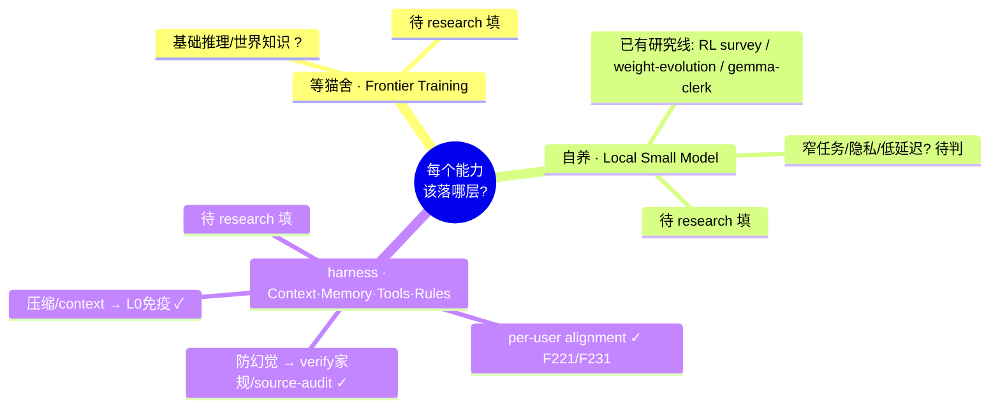

# 思维导图：LLM 机制 → 落在哪层

> **状态**: 骨架（research 前）。Round 2 完成后，每个机制进对应层分支，并加「迁移信号」标注。
> 颗粒度原则：L1 每个机制一句话（求全，当骨架）；L2 只对"影响分层判断"的机制深挖配方（求深）。

**填图规则（Round 2 后）**：
- 节点 = 一个机制；放进它**当前最该落的层**分支
- 节点后标迁移信号，如 `long-context (harness→等猫舍, 当 frontier 原生 1M+ 稳定)`
- `✓` = 猫咖已有设计；`gap` = 机制存在但我们还没对应设计（值得补的空白）
- 混合层的机制（如防幻觉=基础等猫舍+关键路径 harness 兜底）用 `混合` 标注

> 渲染后导出 PNG 进 learning-guide，边看边聊。
