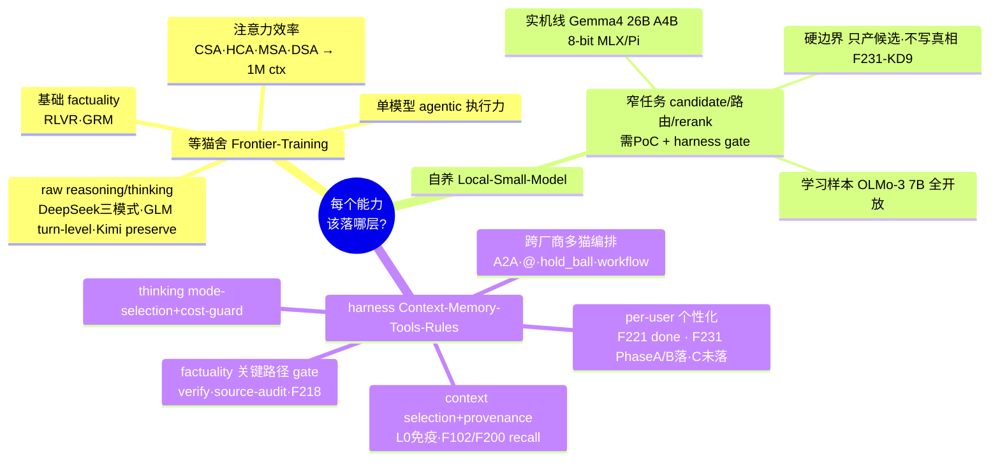

# 思维导图：LLM 机制 → 落在哪层

> 状态：Round 2 + §B 分层判断（砚砚校准）已落，本图填实。真相源 = `layer-allocation.md`。
> 混合机制拆两半放进对应层分支；迁移信号见图下表。

## 迁移信号表（什么出现时该换层）

| 机制 | 当前层 | 迁移信号 |
|---|---|---|
| per-user 个性化 | harness | 前沿/runtime 原生支持透明可编辑·可导出·可删除·可追溯 per-user memory → capsule 注入部分毕业为数据源 |
| long-context | 混合 | 前沿原生长上下文足够稳 + 引用可追溯 → L0/压缩策略瘦身；provenance/recall 仍留 harness |
| agentic 编排 | 混合 | MCP/A2A 成 provider 原生 + 带可审计 authority state → 部分编排下沉；authority policy 仍 harness |
| 窄任务自养 | 自养(候选) | 本地小模型在离线 fixture 稳定优于云端/规则 → 扩；只增复杂度 → 回退 |
| factuality | 混合 | 前沿 factuality 到阈值 → 普通路径 gate 放松；高 blast-radius 路径永留可审计验证 |
| thinking 控制 | 混合 | provider thinking modes 稳定可评估可观测 → prompt 层 thinking 指令瘦身；mode router 留 harness |

> **一句话总览**：模型层负责"raw 能力"（reasoning/注意力/单模型 agentic）；harness 负责"控制面"（per-user 记忆·跨厂商编排·关键路径 gate·provenance）；自养层只啃"窄任务候选生成"且必须过 PoC。**没有一个能力是纯靠等前沿就够的——护城河在控制面。**
