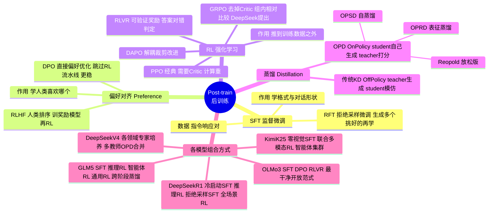
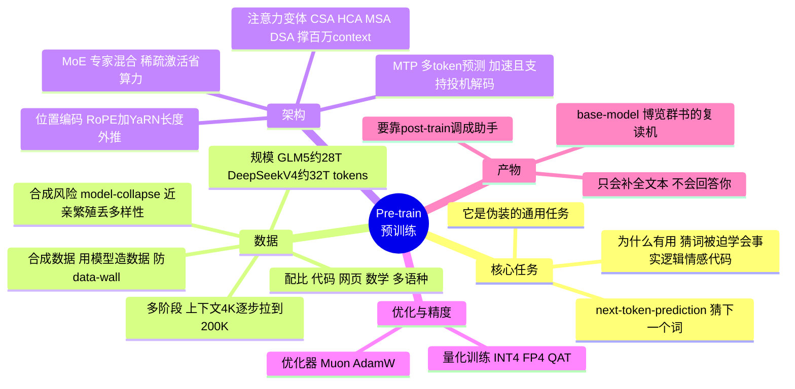

# LLM 训练思维导图（Mermaid，可渲染可编辑）

> 用 Mermaid mindmap 格式——GitHub 和支持的 markdown 预览器会自动渲染成放射状思维导图，源码本身也能直接改。
> 图1：完整 post-train（整合铲屎官提供的三张图）。图2：pre-train（仿同体系新做）。

## 图 1 · Post-train 后训练（完整版）

> **看图的关键**：左边四支（SFT / 对齐 / RL / 蒸馏）是**方法工具箱**；最右一支是**各家怎么用这些工具拼装**。一眼看出——每家都是「SFT 打底 → 对齐/RL 提升 → 蒸馏收口」同骨架，只是配方填空不同。

## 图 2 · Pre-train 预训练（仿同体系）

> **pre-train 的灵魂**：整张图最该记的是中心那句——**所有能力都从"猜下一个词"这一个任务里逼出来**。数据/架构/优化都是为了把这个任务做到极致。
