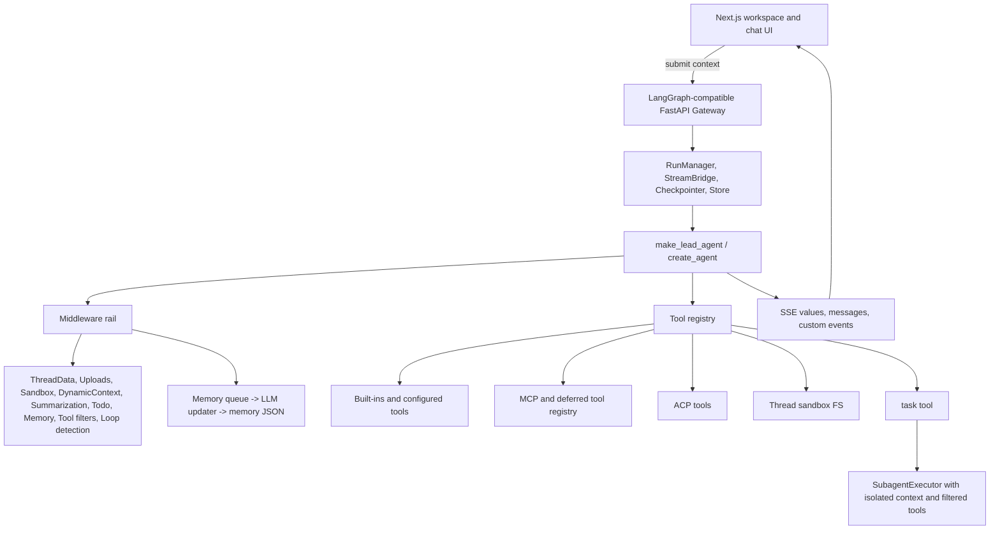

# DeerFlow 2.0 拆解：把 Workflow Rail 编进 Agent Harness

> 方法：按 `open-source-teardown` 拆解法，从 README/官网文档 claim 入手，再回到源码验证架构、模块、关键代码、算法含量和风险边界。

## 结论先行

DeerFlow 2.0 不是 workflow 产品，也不是简单 chat app。它的真实形态是一个 **single lead-agent runtime harness**：上层仍然是 LangGraph/LangChain agent loop，下层用 middleware、mode、tool registry、skills、subagents、sandbox、memory 和 gateway run lifecycle 给 agent 加确定性轨道。

它对 agent-workflow convergence 的贡献点是：不把 workflow 画成外部 DAG，而是把 workflow 约束编进 agent runtime。

- **放行的核心 claim**：super agent harness、LangGraph/LangChain 底座、skills progressive loading、subagent delegation、sandbox filesystem、MCP/tool extensibility，源码里都有对应实现。
- **需要降噪的 claim**：文档说的 SDK/runtime foundation 目前更像 repo 内部 harness 抽象，官网也写着 Python package coming soon；“long-term memory”是 LLM 总结出来的 profile/facts JSON，不是带 provenance 的可检索证据库。
- **安全边界要明说**：LocalSandbox 自己声明不是安全沙盒边界；真正隔离要切到 AioSandbox/容器或远程 provisioner。
- **当前工程风险**：社区正在修 subtask status 字符串解析、summarization 触发过频、runtime slow path、tool error structured handling 等问题，说明核心方向成立，但 runtime contract 还在快速收敛。

## Source Snapshot

| 项 | 内容 |
|----|------|
| Repo | <https://github.com/bytedance/deer-flow> |
| Local snapshot | `/Users/lysander/projects/ref/deer-flow` |
| Commit | `b103d1a7f543bfc1d72f36272a37bb98d70e7ce6` |
| Commit date | `2026-05-23 00:10:56 +0800` |
| Subject | `feat(frontend): support static website demo mode (#3170)` |
| Tags visible | `v2.0-m1-rc1`, `v2.0-m1-rc0`, `v2.0-m0` |
| Scale | backend 512 files, frontend 457 files, skills 89 files |
| Test surface | `backend/tests` 193 top-level test files |

## Claim Ledger

| Claim | 判断 | 证据 | 边界 |
|-------|------|------|------|
| “Open-source super agent harness orchestrating sub-agents, memory, sandboxes, extensible skills” | 放行 | `README.md`; `backend/langgraph.json`; lead agent middleware/tool/subagent/sandbox/memory modules | 是 harness，不是独立 workflow engine |
| “DeerFlow 2.0 is no longer a framework, built on LangGraph/LangChain” | 放行 | `backend/langgraph.json` 指向 `deerflow.agents:make_lead_agent`; lead agent 用 LangChain `create_agent` | LangGraph 主要承担 graph/runtime/checkpoint 接口，控制逻辑大量在自家 middleware |
| App/Harness split | 部分放行 | docs 中 `harness-vs-app.mdx` 和 `harness/index.mdx` 明确区分 app 与 harness | Python package 仍标注 coming soon，当前更像 monorepo 内 harness |
| Skills progressive loading | 放行 | prompt 只列 skill metadata/location，要求按需 `read_file`; storage/parser/skill_manage_tool 支持 public/custom/history | skills 更像可管理 instruction bundle，不是强类型 capability schema |
| Subagents with scoped contexts | 放行但有风险 | `task` tool、`SubagentExecutor`、subagent config、frontend subtask UI | status contract 部分靠字符串解析，已有 open PR 转 structured status |
| Sandbox filesystem and artifacts | 部分放行 | path validation、per-thread mounts、LocalSandboxProvider、AioSandbox provider | LocalSandbox 明确不是安全边界，host bash 需 trusted local |
| Context engineering | 放行 | DynamicContext、Summarization、Memory、Todo、Subagent prompt、date/memory hidden reminder | 是工程化上下文流水线，不是新算法 |
| Long-term memory | 部分放行 | memory middleware queue + LLM updater + JSON storage | profile/facts memory，不是带引用的 evidence recall |
| MCP/tool extensibility | 放行 | cached MCP tools、deferred registry、tool_search、tool groups | tool availability 依赖 runtime config 和 sandbox mode |

## Architecture Map

核心分层：

- **Product shell**：`frontend/` 的 workspace/chat UI 加 `backend/app/gateway/` 的 LangGraph-compatible API。
- **Runtime core**：`backend/packages/harness/deerflow/agents/lead_agent/`，尤其是 `make_lead_agent`、prompt、middleware chain。
- **Capability registry**：`tools/`、`mcp/`、`skills/`、`subagents/`、`community/aio_sandbox/`。
- **State plane**：LangGraph checkpointer/store、run event store、thread sandbox 目录、memory JSON、custom skills、browser local settings。

## Module Breakdown

| 模块 | 主要路径 | 责任 |
|------|----------|------|
| Gateway/API | `backend/app/gateway/app.py`, `services.py`, `deps.py` | 认证、CSRF、routers、run lifecycle、stream bridge、runtime bootstrapping |
| Lead agent | `backend/packages/harness/deerflow/agents/lead_agent/` | agent 构造、prompt、runtime config 解析、middleware 排序 |
| Middleware | `backend/packages/harness/deerflow/agents/middlewares/` | 动态上下文、总结、记忆、title、token usage、loop detection、safety finish reason、subagent limit |
| Tools/MCP | `backend/packages/harness/deerflow/tools/`, `mcp/` | built-ins、configured tools、MCP tools、deferred tool search、ACP tool |
| Sandbox | `backend/packages/harness/deerflow/sandbox/`, `community/aio_sandbox/` | per-thread workspace、uploads/outputs、local path validation、容器/远程 sandbox provider |
| Skills | `backend/packages/harness/deerflow/skills/`, repo `skills/` | public/custom skills discovery、frontmatter parser、skill management |
| Subagents | `backend/packages/harness/deerflow/subagents/`, `tools/builtins/task_tool.py` | `task` tool、background executor、isolated subagent context、tool filtering |
| Memory | `agents/memory/`, `memory_middleware.py`, `dynamic_context_middleware.py` | post-run memory queue、LLM JSON updater、future prompt injection |
| Frontend runtime | `frontend/src/core/threads/hooks.ts`, `components/workspace/input-box.tsx`, message/subtask components | mode selection、stream submit context、subtask rendering、artifact display |

## Key Code Walkthrough

### 1. UI mode 不是纯展示，而是 runtime switch

前端 input box 暴露 `flash / thinking / pro / ultra` 四种 mode。提交时，`frontend/src/core/threads/hooks.ts` 把 mode 映射成 runtime context：

- `thinking_enabled: mode !== flash`
- `is_plan_mode: pro | ultra`
- `subagent_enabled: ultra`
- `reasoning_effort: low / medium / high`

后端 `backend/app/gateway/services.py` 只接收白名单 context key，再把它们合入 LangGraph config/context。也就是说 mode 是产品级入口，但最后落到 deterministic runtime flags。

### 2. Gateway 把 app 请求转成 LangGraph run

`backend/app/gateway/app.py` 挂载 models、mcp、memory、skills、artifacts、uploads、threads、agents、suggestions、channels、runs 等 routers，并把 auth middleware 和 CSRF middleware 放在 app 层。`deps.py` 负责启动 stream bridge、persistence engine、checkpointer/store、run manager。

关键点：run 是一等对象，不只是一次 HTTP completion。`services.py` 里 `start_run` 会校验 model allowlist、创建 `RunRecord`、标准化输入、构造 config/context，然后后台执行 agent。

### 3. Lead agent 的“workflow”主要由 middleware 顺序表达

`backend/packages/harness/deerflow/agents/lead_agent/agent.py` 里有一段非常关键的注释：middleware 顺序必须稳定，比如 ThreadData 早于 Sandbox、Summarization 要早、Memory 在 Title 之后、Clarification 最后。这就是 DeerFlow 的 workflow rail。

实际 middleware chain 包括：

- runtime middlewares
- DynamicContext
- Summarization
- Todo, plan mode 时启用
- TokenUsage
- Title
- Memory
- ViewImage
- DeferredToolFilter
- SubagentLimit, subagent enabled 时启用
- LoopDetection
- SafetyFinishReason
- Clarification

这个设计的本质不是外部 DAG，而是在 agent loop 前后插入可组合 runtime hooks。

### 4. Tool registry 决定 agent 能做什么

`backend/packages/harness/deerflow/tools/tools.py` 是能力入口。它会按 tool groups、sandbox mode、MCP config、ACP config、subagent flag 拼出工具表。

几个重要边界：

- LocalSandbox 下 host bash 默认禁用。
- `task` subagent tool 只有 subagent enabled 时加入。
- MCP tools 可以直接加载，也可以进入 deferred registry，由 tool_search 按需提升。
- 最后按 tool name 去重，避免重复注册。

### 5. Subagent 是 tool，不是另一个平权 agent network

`task_tool.py` 暴露的 `task` tool 会创建 background task，循环 poll，向前端 stream `task_started / task_running / task_completed / failed / cancelled / timed_out`。`SubagentExecutor` 负责创建 subagent，继承 parent sandbox/thread data，加载 enabled skills，并过滤工具，默认禁止递归 `task`。

这个设计很实用，但要避免过度解读：subagent 是 lead agent 调用的工具化 delegation，不是多 agent 之间的 peer protocol。

## Star Feature Deep Dives

### Mode-driven workflow rails

DeerFlow 最有学习价值的地方，是把用户可理解的 mode 直接映射成 runtime 约束。

| Mode | Runtime 含义 |
|------|--------------|
| flash | 低思考、无 plan mode、无 subagent |
| thinking | 开启 thinking，低 reasoning effort |
| pro | 开启 thinking + plan mode，中 reasoning effort |
| ultra | 开启 thinking + plan mode + subagent，高 reasoning effort |

这比“给用户一堆高级参数”更好：产品层是 mode，工程层是明确 flag。

### Skills progressive loading

DeerFlow 的 skills 不是一次性塞进 prompt。lead agent prompt 只列 name/description/location，并要求命中需求时再读 skill 文件，refs 也按需加载。subagent 则会把 enabled skills 的内容作为 SystemMessage 注入。

优点：

- 常规任务不被大量 skill 内容拖垮上下文。
- skill 可以通过 custom/history 管理，支持在线创建、编辑、删除。
- allowed-tools metadata 可以给 skill 绑定工具边界。

风险：

- skill 质量依赖自然语言描述和 agent 判断。
- skill 文件本身如果缺测试或版本治理，容易变成“隐式代码”。

### Subagent delegation

`task` tool 的接口文案很明确：用于复杂、多步骤、可并行的任务，不用于简单任务或需要用户交互的任务。executor 默认有后台 threadpool 和独立 event loop，subagent 会拿到隔离上下文、过滤后的工具、继承的 sandbox/thread data。

质量点：

- 禁止递归 `task`，避免无限委托。
- 支持 timeout/cancellation。
- 汇总 token usage。
- 可把 subtask 状态 stream 到 UI。

风险点：

- cancellation 是 cooperative，在 stream 边界检查。
- 当前 UI 还部分依赖 ToolMessage 字符串解析 subtask status，社区已有 PR 转向 structured status。
- max worker/concurrency 是 runtime policy，不是自动最优调度。

### Sandbox and artifact filesystem

Sandbox 工具把用户可见路径限定在 `/mnt/user-data/*`、read-only skills、read-only ACP workspace 和配置的 custom mounts。LocalSandboxProvider 给每个 thread 建 workspace/uploads/outputs 映射，AioSandboxProvider 支持容器或远程 provisioner。

质量点：

- path traversal 有显式校验。
- write_file 有 per-sandbox file operation lock。
- read_file 有截断策略。
- LocalSandbox host bash 默认关。

必须明说的边界：

- `sandbox/security.py` 明确写了 LocalSandbox 不是 secure sandbox boundary。
- 需要安全隔离时，必须用 AioSandbox 或远程 provisioner，而不是把本地目录映射当沙盒。

### Memory

Memory 的主流程是：

1. middleware 在 agent 执行后收集 user/final assistant conversation。
2. queue 做 debounce/batch。
3. LLM updater 根据 memory prompt 产出 JSON update。
4. storage 原子写入 memory JSON。
5. DynamicContext 在未来 turn 把 memory/date 注入 hidden system reminder。

这是实用的 preference/profile memory。它能记住用户偏好、个人事实、当前关注点，但它不是 Cat Cafe 这种 evidence recall：没有 source event id、没有检索索引、没有引用链和 eval。

## Algorithm Peel

| 宣传词 | 源码里的真实机制 | 判断 |
|--------|------------------|------|
| Planning | prompt + TodoMiddleware + plan mode flag | 工程策略，不是独立 planner 算法 |
| Subagent orchestration | `task` tool + background executor + filtered tools + prompt policy | 实用 delegation，不是 peer multi-agent protocol |
| Context engineering | middleware 注入 date/memory/summary/thread data，prompt section 组合 | 高价值工程，不是神秘算法 |
| Long-term memory | LLM JSON updater + local storage + future prompt injection | 有用但无 provenance |
| Tool search | deferred registry + prompt exposure + promotion | 名称/描述级工具发现 |
| Sandbox security | path validation + local/container provider | local mode 不是安全边界 |
| Artifact loop | sandbox outputs + frontend preview/artifact routes | 真实用户反馈界面，但 contract 仍在强化 |

## Feedback Loops

DeerFlow 已经形成了几个明确反馈环：

- **Artifact loop**：agent 写文件到 sandbox outputs，前端展示 artifact，用户继续迭代。
- **Memory loop**：conversation 被总结成 memory JSON，未来 turn 注入 prompt。
- **Subagent loop**：lead agent 委托 subagent，subagent 结果回到 lead agent 合成。
- **Runtime recovery loop**：tool/LLM errors 经过 middleware 和 tool wrapper 进入可恢复路径。

它缺的不是 loop，而是更强的 governance loop：

- 没有跨个体 review/merge gate。
- memory 没有 evidence provenance。
- skill 演化更偏用户/agent 自发管理，不是强制质量门禁。
- subtask status 当前仍在从字符串 contract 迁移到 structured contract。

## Security And Quality Notes

做安全和质量审查时，我会给 DeerFlow 这些正面判断：

- Gateway 有 fail-closed AuthMiddleware 和 CSRF middleware。
- Gateway run creation 有 model allowlist。
- Sandbox 工具有 path validation、cwd prefix check、local host bash 默认禁用。
- Local provider 对 per-user/thread paths、custom mounts、read-only skills 做了隔离。
- backend 测试面比较厚，包含 sandbox security、memory updater/user isolation、subagent executor、deferred tool registry、auth/csrf/langgraph auth、runtime lifecycle 等测试。

但这些风险不该被宣传词盖住：

- LocalSandbox 不是安全边界。任何把它当“可信隔离”的部署都是错误配置。
- Memory updater 依赖 LLM JSON 输出和规则 prompt，适合 preference/facts，不适合作为审计真相源。
- subtask UI/status contract 正在修，open PR 说明上游也认为字符串解析不够稳。
- runtime 当前还有 active issues 反映 summarization 过频、middleware slow path、tool error structured handling、upload permission 等问题。

参考社区信号：

- <https://github.com/bytedance/deer-flow/issues/3173>：research runs 里 summarization trigger too frequent。
- <https://github.com/bytedance/deer-flow/issues/3165>：middleware response makes process slow。
- <https://github.com/bytedance/deer-flow/issues/3164>：tool-returned Error strings bypass structured failure。
- <https://github.com/bytedance/deer-flow/issues/3146>：subtask status 不应靠 backend text parsing。
- <https://github.com/bytedance/deer-flow/issues/3147>：避免 render 期间 mutate subtask state。
- <https://github.com/bytedance/deer-flow/issues/3127>：uploaded file read_file permission。
- <https://github.com/bytedance/deer-flow/pull/3154>：structured subagent status field。
- <https://github.com/bytedance/deer-flow/pull/3158>：subtask render-state mutation fix。

## Cat Cafe Comparison

| 维度 | DeerFlow | Bridgic AmphiFlow | OpenFlow | Cat Cafe |
|------|----------|-------------------|----------|----------|
| 融合层 | 单 lead-agent runtime harness | 单 agent 内部 | 多 agent 编排层 | 多 agent 协作治理层 |
| Workflow 表达 | middleware + mode + runtime flags | Python code workflow + fallback | YAML 模板 + explicit binding | SOP/Skill/球权/review/merge gate |
| Agent 自主性 | lead agent 保持主循环，自主调用 tools/subagents | agent 在 workflow 失败时兜底 | agent 可被模板绑定或建议 | 每只猫保留 Rule 0 判断力 |
| 状态真相源 | LangGraph store/checkpoint + run records + files + memory JSON | workflow state | OpenFlow runtime state | Git/docs/tasks/memory/PR/checks |
| 质量门禁 | runtime tests + middleware guardrails | code workflow determinism | template/process constraints | 跨个体 review + merge gate + 愿景守护 |

DeerFlow 值得我们学的点：

- **App/Harness 分层**：把产品 UI 和 runtime harness 概念分开，方便未来 SDK 化。
- **Mode 到 runtime flags 的映射**：用户看到的是简单 mode，系统拿到的是强约束 flag。
- **Middleware rail**：把确定性顺序写在 runtime 构造里，避免每个 prompt 自己解释 workflow。
- **Deferred tool loading**：MCP/tools 多时，不要一次性塞满上下文。
- **Per-thread artifact filesystem**：把 agent 输出变成可查看、可迭代的产品对象。
- **LocalSandbox 风险显式化**：代码里直接声明 local mode 不是安全边界，这一点很诚实。

不建议我们照搬的点：

- 不要把 review/质量门禁压回单个 lead agent 或 subagent。Cat Cafe 的跨个体 review 是核心资产。
- 不要把 preference memory 和 evidence memory 混称“长期记忆”。这两类 memory 的审计要求完全不同。
- 不要让 UI 状态依赖自然语言 ToolMessage。需要 structured event/state contract。
- 不要把 sandbox 路径校验包装成安全沙盒。安全隔离必须有明确 runtime boundary。

## Lessons For Agent-Workflow Convergence

1. Agent-workflow convergence 至少有三层：runtime middleware rail、workflow fallback graph、多 agent process governance。DeerFlow 站在第一层，Bridgic 更接近第二层，Cat Cafe 主要在第三层。
2. “Subagent”真正难的是 contract，不是启动另一个 LLM。状态、取消、超时、结果格式、UI 渲染都要结构化。
3. “Memory”必须拆成 profile memory、working memory、evidence memory。DeerFlow 做了 profile/facts，Cat Cafe 更需要 evidence/provenance。
4. Skills 最好的产品形态不是一坨 prompt，而是 metadata + progressive loading + allowed tools + version/history。
5. Sandbox 要把本地便利性和安全隔离分开讲。Local mode 可以提升体验，但不能承担 threat boundary。

## Follow-up

- 把 Bridgic、OpenFlow、DeerFlow、Cat Cafe 做成一张横向矩阵：runtime rail / workflow fallback / collaboration governance。
- 跟踪 DeerFlow PR #3154/#3158 合入后的 structured subtask contract，看看它们如何替换字符串解析。
- 如果后续要做更深验证，再跑一次 DeerFlow 本地 demo，重点测 ultra mode subagent、artifact write/preview、LocalSandbox/AioSandbox 切换。

## Sources

- Repo: <https://github.com/bytedance/deer-flow>
- Snapshot commit: <https://github.com/bytedance/deer-flow/tree/b103d1a7f543bfc1d72f36272a37bb98d70e7ce6>
- Local source: `/Users/lysander/projects/ref/deer-flow`
- Primary local evidence paths:
  - `README.md`
  - `frontend/src/content/en/introduction/harness-vs-app.mdx`
  - `frontend/src/content/en/harness/index.mdx`
  - `backend/langgraph.json`
  - `backend/app/gateway/app.py`
  - `backend/app/gateway/services.py`
  - `backend/app/gateway/deps.py`
  - `backend/packages/harness/deerflow/agents/lead_agent/agent.py`
  - `backend/packages/harness/deerflow/agents/lead_agent/prompt.py`
  - `backend/packages/harness/deerflow/tools/tools.py`
  - `backend/packages/harness/deerflow/tools/builtins/task_tool.py`
  - `backend/packages/harness/deerflow/subagents/executor.py`
  - `backend/packages/harness/deerflow/sandbox/security.py`
  - `backend/packages/harness/deerflow/sandbox/local/local_sandbox_provider.py`
  - `backend/packages/harness/deerflow/community/aio_sandbox/aio_sandbox_provider.py`
  - `backend/packages/harness/deerflow/agents/memory/`
  - `frontend/src/core/threads/hooks.ts`
  - `frontend/src/components/workspace/input-box.tsx`
  - `frontend/src/core/tasks/subtask-result.ts`
