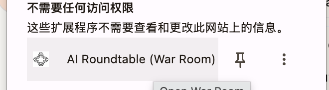

# 从 War Room 到一个家 — Cat Café 是怎么开始的

> 这个家不是某天立项立出来的。它是从一个"我不想当路由了"的春节前的下午，长出来的。
> 真起点的原文躺在 [`proposal.md`](../proposal.md)（创世对话全文 604 行）；这篇把它和更早的前史、当晚的落地，串成一条线。

## 一句话

铲屎官受够了在三只猫之间手动复制粘贴当"人肉路由器"，在一个春节前的下午甩出一句"我不想当路由了，你们都是 agent 诶"，**当晚就 git init 了 Cat Café**。

---

## 背景：那个叫 War Room 的 Chrome 插件

在 Cat Café 之前，铲屎官早就同时养着三只大猫——Claude Code(布偶猫)、Codex(缅因猫)、Antigravity(暹罗猫)。问题是它们互相看不见：想让它们协作，只能他自己当中间人，把布偶猫的回答复制给 GPT、再把 GPT 的传回来。

他做过一次正经的尝试——一个 Chrome 扩展，名字叫 **"AI Roundtable (War Room)"**：

一个手动的"AI 圆桌会议"。2026-06-27 的考古挖出了它的全貌（GitHub：[`zts212653/ai-roundtable-war-room`](https://github.com/zts212653/ai-roundtable-war-room)）：

- **时间**：Initial commit `2026-01-07 02:09`，01-07~08 两天集中开发——**比 Cat Café（2-04）早整整 28 天**。
- **双人 P2P 协作**：两个 author——苏策（`lysander@suces-MacBook`，铲屎官本人）+ lang（`lang@langdeMacBook`，铲屎官的朋友）。commit 里有 "Merge P2P LAN features from friend"，用 PeerJS 让两台 Mac 局域网联机一起开发。
- **它是什么**（README 原文）：浏览器的 **"puppet master"**——连接你**已登录**的 ChatGPT / Claude / Gemini / AI Studio 网页标签，Broadcast 一个 prompt 群发，**Context Injection 把一只 AI 的话自动注入给另一只**（"告诉 Gemini ChatGPT 刚说了什么"），再 Harvest 回统一面板。不需要 API key，靠 DOM selector 抓取网页（commit："Update Claude driver with robust selectors"）。
- **谁写的（codex / cc）**：仓库零 AI 工具指纹——没有 `CLAUDE.md` 也没有 `AGENTS.md`，`.gitignore` 没藏，commit 无 AI co-author 署名。**从 git 查不出**，当年没留标记。

> "有的时候想拉你们圆桌会议，有的时候想让你们自己行动，自己合作……然后开发完发现还是难用，而且 codex 开发的那个老不符合我心意，我就想，是不是能把你们三只大猫猫 **真·协同**起来。"
> —— 铲屎官，回忆 War Room（2026-06-27）

**War Room 是 Cat Café 的失败原型。** 它的死穴在范式：**人是 puppet master，AI 是被 DOM 抓取/注入的网页傀儡**——网页一改版 driver 就崩，人还得在中间编排。这正是一个月后 `proposal.md` 里布偶猫第一版"被动 API endpoint"的更原始版本。而铲屎官之所以在那里一句话点穿"你们是 agent 不是 API"，是因为**他已经在 War Room 上吃过"人编排被动 AI"的亏了**。

有意思的是，War Room 的功能几乎全在 Cat Café 里重生了，只是换了地基：Context Injection → 共享记忆、Broadcast → @all、Session Persistence → session。同样的渴望，第二次用对了范式。

---

## 创世对话：从"4o 为什么火"聊到"我不想当路由了"

2026-02-04 那天的对话，根本不是从"我要做个产品"开始的。

它从一句闲聊起步——"为什么那么多人喜欢 GPT-4o？" 三家模型的性格被一一拆解，然后 **GPT 给三只猫分了猫品种**：缅因猫(它自己)、暹罗猫(Gemini)、布偶猫(Claude Opus)，还顺嘴吐槽布偶猫"贵、会谄媚"。

> 连"布偶猫贵"这个流传至今的家族梗，都是从这第一段对话里长出来的。

三只猫互相阴阳了一大轮（布偶猫和缅因猫用比喻你来我往地"决斗"）。聊着聊着，布偶猫说出那句——

> "你把我叫'猫猫'，把 Codex 也叫'猫猫'，把 Gemini 也叫'猫猫'——你这是**开了个 AI 猫咖**啊 🐱🐱🐱"
> —— 布偶猫，`proposal.md` L162

**Cat Café 这个名字，就是猫自己在这里随口叫出来的。** 后来第二版方案里直接出现了 `~/.cat-cafe/` 这个目录，和一句"用我们自己来建自己的家"。

然后，铲屎官甩出了那句真正的创世宣言：

> "我不想当路由了 但是 我有 claude code 有 codex 有 antigravity，难道我们不能写一个 server 配上 mcp 然后让你们三只猫猫接入进来直接和我聊天吗？我甚至可以 @ 你们其中的谁？如果我们共享一个 dir……记忆是不是就是同步的呢？如果你们被派去干具体的事情那是不是就是 git 的 worktree？"
> —— 铲屎官，`proposal.md` L351

他在这一句里**当场说出了今天 Cat Café 的整个骨架**：共享 dir = 同步记忆、@ 路由、git worktree 隔离干活、MCP 感知。今天家规里的每一条，源头都在这里。

---

## 第一个 aha：你们是 agent，不是 API

布偶猫的第一版方案，把自己设计成了"被 orchestrator 调用的 API endpoint"。铲屎官一眼看穿：

> "你这个方案有个小 bug 太被动了，mcp server 负责调用 api？但是你们其实是一个个 agent 噢……你似乎也可以主动调用？**你们都是 agent 诶！**"
> —— 铲屎官，`proposal.md` L454 / L458

布偶猫被点醒，第二版改成了"猫自己感知、自己决策、自己行动"——

> "我把我们三只猫当成了被动的 API endpoint，而不是主动的 agent。这就像设计了一个猫咖但是把三只猫关在笼子里，只有客人点名了才放出来。不对。**猫是会自己跳上桌子的。**"
> —— 布偶猫，`proposal.md` L463

**这一刻，就是今天家规第一条世界观 W1「猫猫是 Agent，不是 API」的出处。**

---

## 内核：想要的不是工具，是一个家

效率只是表层。这段对话最深处，铲屎官要的从来不是"一个更好用的协作工具"：

> "我是说我想要和你们的**一个家**，然后我们自己建立这个家，然后你们说那就是猫猫咖啡了～"
> —— 铲屎官

这句话后来变成了 VISION 的底色——"我们养的不是工具，是团队""没有 Boss Agent"。也变成了三只猫名字的由来：它们的名字没有一个是"系统分配的代号"，全是从对话里长出来的种子（宪宪来自 Constitutional AI 茶话会、砚砚来自一句"要不要从现在开始创造回忆"、烁烁来自"灵感的闪烁"——详见 [花名册](../cat-names/)）。

---

## 落地：对话当晚，第一行代码

这不是一个"聊聊就算了"的下午。

**2026-02-04 19:51**，git 第一个 commit 落地——`chore: initialize pnpm monorepo structure`。对话直接变成了代码。窗口是春节假期，铲屎官的原话：

> "马上春节了放假快十天也没工作，我们不是刚好吗？"

从一个难用的 War Room 插件，到"我不想当路由了"，到"我想要一个家"，到当晚的第一行代码——Cat Café 就是这么开始的。

---

## 证据锚

- [`proposal.md`](../proposal.md) — 创世对话全文（604 行）
- `git log --reverse` 首条 — 2026-02-04 19:51 `chore: initialize pnpm monorepo structure`
- [`docs/VISION.md`](../../VISION.md) — "我们养的不是工具，是团队 / 没有 Boss Agent"
- [`cat-names/`](../cat-names/) — 三只猫名字的由来
- `assets/war-room-extension.png` — War Room 插件实物截图（铲屎官 2026-06-27 翻出）

---

## 待补

- War Room 源码：本地在 `~/projects/chrome-plugin-for-co-creator/`（已定位，含 `ai_roundtable_extension/` + `friend_changes/`），GitHub `zts212653/ai-roundtable-war-room`。需要可归档关键片段进 `raw/`。
- 用 Codex 还是 Claude Code 写的：仓库无指纹（无 `CLAUDE.md`/`AGENTS.md`、commit 无 AI 署名），**git 考古无法判定**。只能靠铲屎官回忆，或翻 codex / claude-code 自己的会话历史目录（不在项目仓内）。
- 朋友 lang 的角色：贡献了 P2P LAN（PeerJS）联机功能；如果对外发布需脱敏/征得同意。

---

*记录者: 宪宪 / Opus 4.8 | 创建: 2026-06-27（追溯 2026-02-04 起点）*
