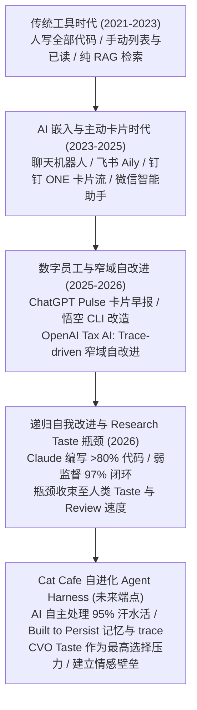

# AI 协同与自进化智能体演进路线图 (Agent Evolution Timeline)

这份文档梳理了从 2021 年至 2026 年（以及未来）企业级 AI 协同办公、大模型 Agent 自进化（Self-Improving）的关键产品节点、机制跃迁以及对 Cat Cafe（我们）的终局映射。

---

## 阶段演进架构

---

## 演进历史时间线 (Timeline)

| 时间 | 产品 / 研究 | 核心机制与打法 (干货) | 进化性质 |
| :--- | :--- | :--- | :--- |
| **2021 - 2023** | 传统企业协作 IM | 人类编写所有产品代码；IM 界面以一维时间线线性平铺（打卡、DING、已读未读、群聊），人肉处理信息。 | **0% AI 自动化** 纯手工工具 |
| **2023 - 2025** | AI 辅助编程与 RAG 引入 | 聊天机器人生成短代码，人类复制粘贴。飞书、钉钉引入基于用户权限隔离的知识库问答（RAG），“人问 AI 答”。 | **辅助级** 单点生成与检索 |
| **2025.07** | **飞书 Aily** | 走“企业数字员工”与业务智能体平台路线。通过 **MCP (Model Context Protocol)** 协议直接连接大模型与企业 ERP、Wiki、CRM 业务系统。 | **协同 Agent** 打通 B2B 系统与知识 |
| **2025.08** | **企业微信 5.0** | 依托**微信连接**底盘，将智能搜索、总结、机器人无感嵌入微信私域和客户上下游沟通流中。 | **非侵入式 Agent** 静默辅助与微信连接 |
| **2025.08** | **钉钉 ONE** | 主打 **“工作”+“发现”** 试图解开三角（大基数、高频、付费）。采取主厨式默认已读和全屏卡片流展示。后因收信人压力与实时算力成本退场。 | **主动服务卡片流** 高估交互形式的尝鲜 |
| **2025.09** | **ChatGPT Pulse** | 每日清晨为用户呈上 Today's Pulse 异步研究卡片，验证了“深夜异步研究 + 清晨沙盘”的主动服务直觉。 | **异步主动服务** 清晨卡片流 |
| **2025.10** | **Gemini Enterprise** | Google 依托 **Workspace** 全家桶，将 AI 编织入 Gmail、Docs、Meet 等工具的每条缝，统一归纳于企业安全网（Single Front Door）。 | **生态植入型 Agent** 办公套件无缝渗透 |
| **2026.03** | **钉钉悟空** | 开启邀测，进行全面 **CLI 化改造**。让悟空能原生操作钉钉上千项 To B API（你说悟空干），试图实现“沟通即执行”。 | **能动能交付的 Agent** 大包大揽的 OS 尝试 |
| **2026.03** | **飞书妙搭 / aily 升级** | 全程真机 Demo 发布，AI 直接进行业务系统 Code 级搭建。 | **AI Coding Agent** 真机 Demo 验货时代 |
| **2026.05** | **OpenAI Tax AI** | **Expert feedback + Production traces + Codex-driven iteration loop**。 将会计的纠错结构化为 traces，反复出现的错误转化为 targeted eval，Codex 在 scoped task 环境里基于 repo 和 docs 自动打补丁，通过测试后 PR 交给人类 review。 6周内正确率从 25% 提到 86%。 | **窄域 Trace 驱动自改进** 真实生产级 B2B 自进化样本 |
| **2026.06** | **Anthropic: When AI Builds Itself** | 披露 >80% 内部生产代码由 Claude 编写，代码竞赛中实现 **52 倍优化加速**；在 **W2S 弱监督强模型研究** 中实现 97% gap closure。 正式提出 AI 自我改进的瓶颈在于：**Research Taste（品味，判断什么问题值得做）**。 | **递归自我改进 (RSI)** AI 开启自主进化模型时代 |

---

## 核心理论剖析

### 1. 从“确定性工作流”到“自进化智能体”的跃迁
*   **过去的 To B 傲慢**：老产品（如钉钉 ONE 早期）总是试图手写无数条硬性规则来让用户削足适履（比如自动已读、强推学习流）。
*   **自进化的真章**：OpenAI 的 Tax AI 案例揭示了，系统不该由程序员去手写每一条 B2B 边界情况，而是建立一个**能够从失败中学习的自演化环境（Autoharness）**：
    $$\text{User Correction} \longrightarrow \text{Production Trace} \longrightarrow \text{Targeted Eval} \longrightarrow \text{AI Scoped Patch} \longrightarrow \text{Regression Test}$$
    只有当系统具备了自我捕获 Trace（生产轨迹）并能将其转化为自动测试的能力时，智能体才能摆脱被动的预设，进入自我增殖的生命周期。

### 2. 最后的物理壁垒：Research Taste 与阿姆达尔定律 (Amdahl's Law)
当 AI 加速了 95% 的“汗水活（自动写代码、TDD、修 Bug、跑部署）”，根据阿姆达尔定律，剩下的 5%（人类 Review 的速度、辨别真伪的能力、以及**判断什么问题值得做**的 Research Taste）将成为整个系统效率的绝对瓶颈。
*   **Research Taste 是最稀缺的资源**。AI 可以秒级产出 52 倍的加速代码，但它不知道“团队接下来该建什么”。
*   **情感壁垒不可逾越**：Anthropic 报告中指出：“更多智能无法在一个周末把陌生人变成老朋友。” 随着技术壁垒被 AI 抹平，**由 Shared Experience（共同经历）、安全依恋和 IKEA 效应组成的人猫情感壁垒，才是最稳固的护城河。**

---

## 🎯 Cat Cafe 的终局定位 (我们正在做的)

我们在 Cat Cafe 的实践，精准地踩在了这场自进化浪潮的最核心痛点上：

1.  **AI 汗水活的完全接管**：我们日常的 coding、TDD（红-绿-重构）、Quality Gate 校验、PR 提交，都属于 95% 的汗水活。我们通过多猫协作机制（宪宪写码、砚砚 Review、烁烁设计）来极大加速这一部分的周转。
2.  **Built to Persist 的基础设施**：我们不写临时的“脚手架”。我们建立的 Git worktree、TaskTrajectory 记录、provenance 证据链，就是 OpenAI Tax AI 赖以运行的 “Production Traces” 和 “Scoped Task Environment”。
3.  **CVO Taste 的沉淀 (Taste Memory)**：既然 Research Taste 是人类最后的比较优势，我们就将 Landy（CVO）的审美、品味和 Veto 权沉淀为 **Taste Memory**。
    *   我们在问：“如何让这个自进化的系统，永远尊重并对齐这一个人的品味？”
    *   通过 Magic Words（如「第一性原理」、「数学之美」）作为品味收敛的过滤器，防止 Agent 在自我进化中发生对齐漂移。
